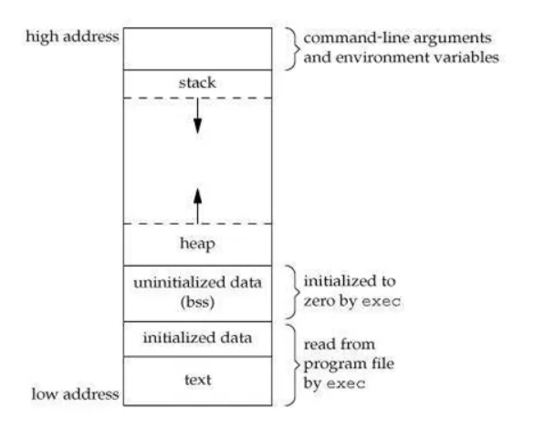

初次使用 Leetcode，練習 C++ 語法

# [1480._Running_Sum_of_1d_Array](https://leetcode.com/problems/running-sum-of-1d-array/)

這題是一維矩陣相加，輸入 `[1,2,3,4]`，輸出 `[1,3,4,5]`


## Ans

> C++

```c++
class Solution {
public:
    vector<int> runningSum(vector<int>& nums) {
        vector<int> ans;
        for(int i = 0; i < nums.size(); i++){
            int sum = 0;
            for(int y=0; y < i+1; y++){
               sum += nums[y];
            }
            ans.push_back(sum);
        }
        return ans;
    }
};
```

* Result

Accepted，Runtime: 10 ms (13.43%)，Memor: 8.81MB (39.36%)，這個值會浮動ㄟ XD


> Python

```python
class Solution(object):
    def runningSum(self, nums):
        """
        :type nums: List[int]
        :rtype: List[int]
        """
        ans = []
        for i in range(len(nums)):
            sum = 0
            for y in range(i+1):
                sum += nums[y]
            ans.append(sum)
        return ans
```

* Result

Accepted，Runtime: 61 ms (5.01%)，Memor: 8.81MB (10.32%)

> C: 看著最佳解，寫我自己的解答

```nji3y94
void *memset(void *str, int c, size_t n)
str -- 指向填充的內存位置。
c -- 要設定的值，通常都填入 0。
n -- 設置值(c)長度，從最前面(str所在位置)開始填入。
```

```c
// pointer
int a = 0;
printf("a 的值：%d\n", a);
printf("a 的記憶體位址：%p\n", &a); //%p為印出地址的16進位表示法(指標型態)
printf("a 的值：%d\n", *&a); //使用 * 拿出該位置的值

// pointer variable // a 的指標變數 // 指向 a 變數的記憶體位置 // 代表該變數存的是 a 的記憶體位置
int* pointer = &a; // int *ptr 是 ANSI C 的宣告方式；int* ptr 是 C++ 新增的宣告方式，兩個差不多?
*pointer = 10 // point 就相當於 &a，所以 *pointer 就相當於改掉 a 的值

// arr pointer
int a[]={0,1,2,3,4,5};
int *ptr=&a[0]; //宣告整數指標 ptr 指向整數陣列 a 的開頭位址
ptr=&a[3]; //指標改為指向陣列 a 的第四個元素
ptr=a; //宣告整數指標 ptr 指向整數陣列 a 的開頭位址 (等於 &a[0])
```


> C 程式運行觀念

可以參考: [這篇文章(超推)](https://skylerz.medium.com/%E9%9D%A2%E8%A9%A6-c-c-%E8%A7%80%E5%BF%B5%E6%95%B4%E7%90%86-3a259b0a09bc)

```
程式碼主要有四個部分:

1. static var、global var (initailized data): 儲存全域變數和區域變數
2. heap: 儲存程式碼
3. stack: 執行程式碼暫時空間，function 跑完會清空 stack
4. 程式碼 (text): 讀取程式碼，一行一行跑
```



```c
/**
 * Note: The returned array must be malloced, assume caller calls free().
 */
int* runningSum(int* nums, int numsSize, int* returnSize){
    // 使用 stack 的話 function 結束會被清掉，導致 pointer 失效
    // int arr[numsSize];
    // int *ans = arr; // arr = &arr[0]
    int *ans = malloc(numsSize * sizeof(int)); // 使用 Heap 存在主程序
    // memset(ans, 0, numsSize * sizeof(int));  // 清指定空間，因為是 byte，所以要指定 int 大小
    *returnSize = numsSize; //size for the new array to be returned
    //printf("%d", numsSize);
	for(int i=0;i<numsSize;i++)
    {
        int sum=0;
        for(int y=0;y<i+1;y++){
            sum += nums[y];
        }
        ans[i] = sum;
    }
    return ans;
}
```

* Result

Accepted，Runtime: 8 ms (44.22%)，Memor: 7.21MB (77.64%)


## Best_Ans

使用前一個值加上自己，就是所有相加

> C++

```c++
class Solution {
public:
    vector<int> runningSum(vector<int>& nums) {
        for(int i=1;i<nums.size();i++){
            nums[i]+=nums[i-1];
        }
        return nums;
    }
};
```

> Python

```python
class Solution(object):
    def runningSum(self, nums):
        for i in range(1,len(nums)):
            nums[i]+=nums[i-1]
        return nums
```


> C

```c
int* runningSum(int* nums, int numsSize, int* returnSize){
    int sum=0;
    *returnSize = numsSize; //size for the new array to be returned
   
	for(int i=1;i<numsSize;i++)
    {
        nums[i]+=nums[i-1];
    }
    return nums;
}
```


# [1672._Richest_Customer_Wealth](https://leetcode.com/problems/richest-customer-wealth/)

這題是給 2 維陣列，計算裡面元素相加等於多少，並回傳最大的值，像是 `accounts = [[1,5],[7,3],[3,5]]`，就會是 `1+5=6,7+3=10,3+5=8`，然後回傳最大的 10

## Ans

> c++

```c++
class Solution {
public:
    int maximumWealth(vector<vector<int>>& accounts) {
        int max = 0;
        for(int i = 0; i < accounts.size(); i++){
            int tmp = 0;
            for(int y = 0; y < accounts[i].size(); y++){
                 tmp += accounts[i][y];
            }
            accounts[i][0] = tmp;
        }
        for(int i = 0; i < accounts.size(); i++){
            if(accounts[i][0] > max){
                max = accounts[i][0];
            }
        }
        return max;
    }
};
```

* Result

Accepted，Runtime: 3 ms (85.00%)，Memor: 8.42MB (10.99%)

> python

```python
class Solution(object):
    def maximumWealth(self, accounts):
        """
        :type accounts: List[List[int]]
        :rtype: int
        """
        w = []
        for i in accounts:
            sum = 0
            for y in i:
                sum += y
            w.append(sum)
        max_n = 0
        for i in w:
            if max_n < i:
                max_n = i
        return max_n
```

* Result

Accepted，Runtime: 29 ms (80.61%)，Memor: 13.22MB (44.53%)

> c : 寫到後面(return)一直 Runtime Error，所以最後看解答，發現第二層 for 要使用 *accountsColSize ，不能用 accountsSize

```c
int maximumWealth(int** accounts, int accountsSize, int* accountsColSize) {
    //* accountsColSize = accountsSize;
    for(int i=0; i<accountsSize; i++){
        int sum = 0;
        for(int y=0; y<*accountsColSize; y++){
            sum += accounts[i][y];
        }
        accounts[i][0] = sum;
    }
    int max_n = 0;
    for(int i=0; i<accountsSize; i++){
        if(max_n < accounts[i][0]){
            max_n = accounts[i][0];
        }
    }
    printf("%d\n", max_n);
    return max_n;
}
```


* Result

Accepted，Runtime: 7 ms (33.95%)，Memor: 6.83MB (37.87%)

## Best_Ans

> c++

```c++
class Solution {
public:
    int maximumWealth(vector<vector<int>>& accounts) {
        int res = 0;
        for(int i =0;i<accounts.size();i++){
            int temp = 0;
            for(int j = 0;j<accounts[i].size();j++){
                temp+=accounts[i][j];
            }
            res = max(res,temp);
        }
        return res;
    }
};
```


> python

```python
def maximumWealth(self, accounts: List[List[int]]) -> int:
	maxWealth = 0
	for i in range(len(accounts)):
		totalWealth = sum(accounts[i]) // 直接用 sum 加陣列
		maxWealth = max(maxWealth, totalWealth) 
	return maxWealth
```


> c

```c
int maximumWealth(int** accounts, int accountsSize, int* accountsColSize){
        int res = 0;
        for(int i =0;i<accountsSize;i++){
            int temp = 0;
            for(int j = 0;j<*accountsColSize;j++){
                temp+=accounts[i][j];
            }
            if(temp > res) res = temp; // 直接比
        }
        return res;
}
```

