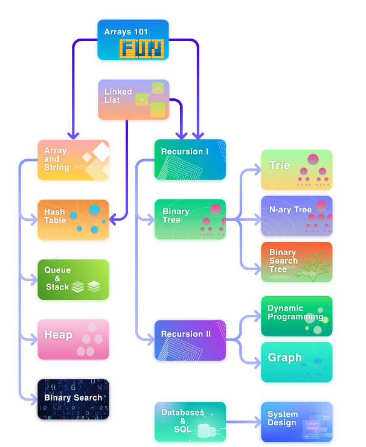

# BeginnerGuide

20231107 

題目 1480. Running Sum of 1d Array (使用 vector(c++)、Heap(c  malloc)，講解 C 程式碼運行概念、pointer，使用前面的數字加上自己(DP的概念才會是最佳解))

題目 1672. Richest Customer Wealth (簡單，不過可以在第一個 for 迴圈裡面就利用一個變數比較大小)

20231108 

題目 412. Fizz Buzz (int to str and int to char(c++), strdup(c), sprintf(c))

題目 1342. Number of Steps to Reduce a Number to Zero (簡單題目，num>>=1 == num=num/2)

20231109

題目 876. Middle of the Linked List (structure, class, single link list, 使用兩個走不同步的 LinkNode 才會是最佳解(一次 while 就可以搞定))

題目 383. Ransom Note (String erase (c++),String replace(python), strlen(c)，最佳解是使用紀錄每個字母的方式，透過比較兩個字母出現次數，查看能不能 construct)

## schedule

Array101 -> ArrayAndstring -> HashTable -> LinkedList -> Sorted -> Queue&Stack -> Heap -> RecursionI -> BinaryTree -> Trie -> N-aryTree -> BinarySearchTree -> RecursionII -> DynamicProgramming -> Graph

