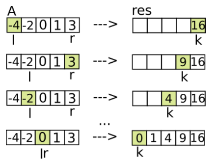

#  Max_Consecutive_Ones

練習簡單題目，輸出一個 array 最長連續的 1 ([1,1,0,1,1,1]) output: 3

## Ans

for 迴圈紀錄最常連續 1

> c++

```c++
class Solution {
public:
    int findMaxConsecutiveOnes(vector<int>& nums) {
        int count = 0, max = 0;
        for(int i = 0; i < nums.size(); i++){
            if(nums[i] == 1){
                count ++;
                if(count > max){
                    max = count;
                }
            }
            else count = 0;
        }
        return max;
    }
};
```

* result

Accepted，Runtime: 27 ms (66.61%)，Memory: 36.5 MB (63.39%)

> python

```python
class Solution(object):
    def findMaxConsecutiveOnes(self, nums):
        """
        :type nums: List[int]
        :rtype: int
        """
        max, count = 0, 0
        for i in nums:
            if i == 1:
                count += 1
                if count > max:
                    max = count
            else:
                count = 0
        return max
```

* result

Accepted，Runtime: 245 ms (97.22%)，Memory: 13.6MB (53.86%)

> c

```c
int findMaxConsecutiveOnes(int* nums, int numsSize) {
    int max = 0, count = 0;
    for(int i = 0; i < numsSize; i++){
        if(nums[i] == 1){
            count ++;
            if(count > max){
                max = count;
            }
        }
        else{
            count = 0;
        }
    }
    return max;
}
```

* result

Accepted，Runtime: 25 ms (93.97%)，Memory: 8.4 MB

## Best_Ans

過於簡單，我的答案跟 BA 差不多


# [1295._Find_Numbers_with_Even_Number_of_Digits](https://leetcode.com/problems/find-numbers-with-even-number-of-digits/)

列出數列中有幾個位數是偶數 EX: `[12,345,2,6,7896]`，Output: 2 (12和7896)

## Ans

> c++

使用迴圈判斷位數，然後對位數 % 2

```c++
class Solution {
public:
    int findNumbers(vector<int>& nums) {
        int count = 0;
        for(int i = 0; i < nums.size(); i++){
            int tmp = nums[i],  t = 0;
            while(tmp!=0){
                tmp /= 10;
                t ++;
            }
            if(!(t % 2))count++;
        }
        return count;
    }
};
```

* result

Accepted，Runtime: 7 ms (31.51%)，Memory: 10.3 MB

> python

```python
class Solution(object):
    def findNumbers(self, nums):
        """
        :type nums: List[int]
        :rtype: int
        """
        c = 0
        for i in nums:
            tmp, t = i, 0
            while tmp != 0:
                tmp /= 10
                t += 1
            if not t % 2:
                c += 1
        return c
```

* result

Accepted，Runtime: 29 ms (78.74%)，Memory: 13.3MB (50.00%)

> c

```c
int findNumbers(int* nums, int numsSize) {
    int c = 0;
    for(int i = 0; i < numsSize; i++){
        int tmp = nums[i], t = 0;
        while(tmp != 0){
            tmp /= 10;
            t ++;
        }
        if(!(t%2)) c++;
    }
    return c;
}
```

* result

Accepted，Runtime: 0 ms (100.00%)，Memory: 6.8MB

## Best_Ans

因為比較簡單，只給 C++，數字範圍有限可以直接使用 if else 判斷

> c++

````c++
class Solution {
public:
    int findNumbers(vector<int>& nums) {
        int n,count=0;
        for(int i=0;i<nums.size();i++)
        {
            n=nums[i];
            if(( 10<=n && n<=99) || (1000<=n && n<=9999 ) || ( n==100000 ))
            {
               count++;
            }
        }
        return count;
    }
};
````

酷酷解法

```c++
class Solution {
public:
    int findNumbers(vector<int>& nums) {
        int res=0;
        for(auto num:nums) {
            // (int)log10(num) 取出位數有多少個 - 1
            // &1 看尾數，尾數是 1 答案就是 1，尾數是 0 答案就是 0
            // 所以就會導致 雙數的 數字直接 變成 1 加上去
            res+=(int)log10(num)&1;
        }
        return res;
    }
};
```


# Squares_of_a_Sorted_Array

給一個數列(由小到大排序)，把數列全部平方，再把這個數列從小排到大，EX: `[-7,-3,2,3,11]` ，Output: [4,9,9,49,121]

## Ans

平方完直接使用內建 sort

> c++

```c++
class Solution {
public:
    vector<int> sortedSquares(vector<int>& nums) {
        for(int i = 0; i < nums.size(); i++){
            nums[i] = nums[i]*nums[i];
        }
        sort(nums.begin(), nums.end());
        // for(int i = 0; i < nums.size()-1; i++){
        //     for(int y = i+1; y < nums.size(); y++){
        //         if(nums[i] > nums[y]){
        //             nums[i] = nums[y] ^ nums[i];
        //             nums[y] = nums[y] ^ nums[i];
        //             nums[i] = nums[y] ^ nums[i];
        //         }
        //     }
        // }
        return nums;
    }
};
```

* result

Accepted，Runtime: 28 ms (41.7%)，Memory: 26.1MB (89.00%)

> python

```python
class Solution(object):
    def sortedSquares(self, nums):
        """
        :type nums: List[int]
        :rtype: List[int]
        """
        for i in range(len(nums)):
            nums[i] = nums[i] ** 2
        nums.sort()
        return nums
```

* result

Accepted，Runtime: 150 ms (55.95%)，Memory: 15.4MB (45.43%)

> c

```c
int* sortedSquares(int* nums, int numsSize, int* returnSize) {
    *returnSize = numsSize;
    for(int i = 0; i < numsSize; i++){
        nums[i] = nums[i] * nums[i];
    }
    for(int i = 0; i < numsSize-1; i++){
        for(int y = i+1; y < numsSize; y++){
            if(nums[i] > nums[y]){
                nums[i] = nums[y] ^ nums[i];
                nums[y] = nums[y] ^ nums[i];
                nums[i] = nums[y] ^ nums[i];
            }
        }
    }
    return nums;
}
```

* result

Accepted，Runtime: 1195 ms，Memory: 20.1MB (99.93%)

## Best_Ans

因為數列的性質，所以從左右兩端處裡比較快



> c++

```c++
class Solution {
public:
    vector<int> sortedSquares(vector<int>& A) {
        vector<int> res(A.size());
        int l = 0, r = A.size() - 1;
        for (int k = A.size() - 1; k >= 0; k--) {
            if (abs(A[r]) > abs(A[l])) res[k] = A[r] * A[r--];// A[r] * A[r]； r--
            else res[k] = A[l] * A[l++];
        }
        return res;
    }
};
```


> python

```python
def sortedSquares(self, A):
    answer = collections.deque()
    l, r = 0, len(A) - 1
    while l <= r:
        left, right = abs(A[l]), abs(A[r])
        if left > right:
            answer.appendleft(left * left)
            l += 1
        else:
            answer.appendleft(right * right)
            r -= 1
    return list(answer)
```


> c

```c
int* sortedSquares(int* A, int ASize, int* returnSize){
    int* arr = malloc(sizeof(int)*ASize);
    *returnSize = ASize;
    int end = ASize-1, start = 0, ptr = ASize-1;
    while ((start <= end) && (ptr>=0))
    {
        if (pow(A[end],2) >= pow(A[start],2))
            arr[ptr] = pow(A[end--],2);
        else
            arr[ptr] = pow(A[start++],2);
        
        ptr--;
    }
    return arr;
}
```


# [1089. Duplicate Zeros](https://leetcode.com/problems/duplicate-zeros/)

一個數列，裡面有0就新加入一個0然後保留右邊的數字，數列大小不變，所以超過數列的，就刪掉 EX `[1,0,2,3,0,4,5,0]` Output: [1,0,0,2,3,0,0,4]

## Ans

創建一個 arr，把 這個 arr 裡面前幾個給到 題目的 arr

> c++

```c++
class Solution {
public:
    void duplicateZeros(vector<int>& arr) {
        int count = 0, len = arr.size(), ct = 1;
        vector<int> pos;
        for(int i = 0; i < len;i++){
            if(arr[i] == 0) {
                pos.push_back(-1);
            }
            pos.push_back(count);
            count += 1;
        }
        for(int i = len-1; i > 0;i--){
            if(pos[i] == -1) arr[i] = 0;
            else arr[i] = arr[pos[i]];
        }
    }
};
```

* result

Accepted，Runtime: 8 ms (55.08%)，Memory: 10.36MB (17.98%)

> python

```python
class Solution(object):
    def duplicateZeros(self, arr):
        """
        :type arr: List[int]
        :rtype: None Do not return anything, modify arr in-place instead.
        """
        pos = []
        for i in range(len(arr)):
            if arr[i] == 0:
                pos.append(0)
            pos.append(arr[i])
        for i in range(len(arr)):
            arr[i] = pos[i]
```

* result

Accepted，Runtime: 37 ms (91.80%)，Memory: 13.92MB (10.18%)

> c

```c
void duplicateZeros(int* arr, int arrSize) {
    int a[arrSize*2];
    int c = 0;
    for(int i = 0; i < arrSize; i++){
        if(arr[i] == 0) {
            a[i+c] = 0;
            c ++; 
        }
        a[i+c] = arr[i];
    }
    for(int i = 0; i < arrSize; i++){
        arr[i] = a[i];
    }
}
```

* result

Accepted，Runtime: 12 ms (92.31%)，Memory: 13.89MB (27.60 %)

## Best_Ans

跳過，這題我這樣解算很不錯了
