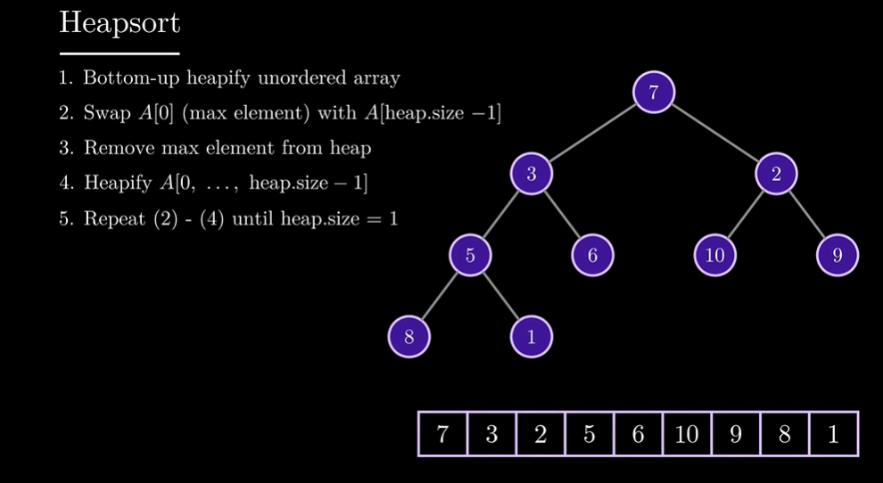

# Heap_Sort

完成 O(n * lgn) 的排序方法

EX:

```
Input: nums = [5,2,3,1]
Output: [1,2,3,5]
Explanation: After sorting the array, the positions of some numbers are not changed (for example, 2 and 3), while the positions of other numbers are changed (for example, 1 and 5).

Input: nums = [5,1,1,2,0,0]
Output: [0,0,1,1,2,5]
Explanation: Note that the values of nums are not necessairly unique.
```


這個排序不是前中後序，第一個元素是第一個 Node，後續元素接下去排列，最後一個元素就是最後一個 Node，所以要取得節點的 child，可以使用目前節點乘 2 加上 1 或 2 (`left=index*2+1`、`right=index*2+1`)

- 前序 (preorder): 中 -> 左 -> 右，7 3 5 8 6 1 2 10 9
- 中序 (inorder): 左 -> 中 -> 右，8 5 1 3 6 7 10 2 9
- 後序 (postorder): 左 -> 右 -> 中，8 1 5 6 3 10 9 2 7




## Ans

本來想要使用 merge sort，但後來發現 merge sort 寫起來沒這麼容易，所以還是使用 Heap sort (參考前面的文章用 python 寫的 Heap sort)

> c++

```c++
class Solution {
public:
    vector<int> sortArray(vector<int>& nums) {
        nums=heap_sort(nums);
        return nums;
    }
private:
    vector<int> heap_sort(vector<int>& nums){
        //  heapify original lst
        // 從倒數第二層開始處裡節點，直到最上層
        for(int i = nums.size() / 2 - 1; i >= 0; i--){
            max_heapify(nums, nums.size(), i);  // heapify form top to bottom, work with triangle.
        }
        // use heap to sort elements
        for(int i = nums.size() - 1; i > 0; i--){
            swap(nums[0], nums[i]);  // swap last element with first element
            // 每次都從最上面再次排序，讓第一個元素保持最大
            max_heapify(nums, i, 0);  // note that we reduce the heap size by 1 every iteration
        }
        return nums;
    }
    void max_heapify(vector<int>& nums, int heap_size, int index){ // index = upper node
        int left = index*2+1, right=index*2+2; // index's child
        int largest = index;
        if(left < heap_size && nums[left] > nums[largest]){
            largest = left;
        }
        if(right < heap_size && nums[right] > nums[largest]){
            largest = right;
        }
        if(largest != index){
            swap(nums[index], nums[largest]);
            max_heapify(nums, heap_size, largest);
        }
    }
};
```

* result

Accepted，Runtime: 129 ms (66.93 %)，Memory: 71.1 MB (62.51 %)


## Best_Ans

各種 sort 方法 (有很多方法會 TLE): [15種 sort](https://leetcode.com/explore/learn/card/sorting/694/comparison-based-sorts/4486/discuss/1401412/C++-Clean-Code-Solution-or-Fastest-or-All-(15+)-Sorting-Methods-or-Detailed)

下面使用 Outplace merge sort (O(n * lgn)；Inplace Merging、quicksort 會 TLE)

> c++

```c++
void outPlaceMerge(vector<int> &nums, int low, int mid, int high) {
	if (low >= high) return;
	int l = low, r = mid + 1, k = 0, size = high - low + 1;
	vector<int> sorted(size, 0);
	while (l <= mid and r <= high) // 比較兩邊哪個比較大，依序放入陣列
		sorted[k++] = nums[l] < nums[r] ? nums[l++] : nums[r++];
	while (l <= mid) // 右側的已排序完，左邊全部放入陣列
		sorted[k++] = nums[l++];
	while (r <= high)  // 左側的已排序完，右邊全部放入陣列
		sorted[k++] = nums[r++];
	for (k = 0; k < size; k++)  // 排序好的 arr 放入 原本的 nums 裡面
		nums[k + low] = sorted[k];
}

void mergeSort(vector<int> &nums, int low, int high) {
	if (low >= high) return;
	int mid = (high - low) / 2 + low;
    // 拆分成多個，用 low 和 mid 判斷拆分位置
	mergeSort(nums, low, mid);
	mergeSort(nums, mid + 1, high);
    // 拆分好了根據多個 low mid high 進行排序
	outPlaceMerge(nums, low, mid, high);
}
```


# Kth_Largest_Element_in_an_Array

給一個 array `nums`，和一個 int `k`，找出 `nums`，裡面第 k 大的元素。EX

```
Input: nums = [3,2,1,5,6,4], k = 2
Output: 5

Input: nums = [3,2,3,1,2,4,5,5,6], k = 4
Output: 4
```


## Ans

使用 heap sort 排序，從後面取 K 個

> c++

```c++
class Solution {
public:
    int findKthLargest(vector<int>& nums, int k) {
        int len = nums.size();
        for(int i = len/2-1; i >= 0; i--){
            max_heapify(nums, len, i);
        }
        for(int i = len-1; i > 0; i--){
            swap(nums[0], nums[i]);
            max_heapify(nums, i, 0);
        }
        return nums[len-k];
    }
private:
    void max_heapify(vector<int>& nums, int heap_size, int index){
        int left = index*2+1, right = index*2+2, largest = index;
        if(left < heap_size && nums[left] > nums[largest]){
            largest = left;
        }
        if(right < heap_size && nums[right] > nums[largest]){
            largest = right;
        }
        if(largest!=index){
            swap(nums[index], nums[largest]);
            max_heapify(nums, heap_size, largest);
        }
    }
};
```

* result

Accepted，Runtime: 130 ms (8.21 %)，Memory: 57.5 MB (98.39 %)


## Best_Ans

可以使用  `multiset` 或是 `priority_queue`

> c++

priority_queue

```c++
class Solution {
public:
    int findKthLargest(vector<int>& nums, int k) {
        priority_queue<int, vector<int>, greater<int>> pq; // less<int>、cmp
        // priority_queue<int> pq(nums.begin(), nums.end());
        for (int num : nums) {
            pq.push(num);
            if (pq.size() > k) {
                pq.pop();
            }
        }
        return pq.top();
    }
};
```


mutiset

```c++
class Solution {
public:
    int findKthLargest(vector<int>& nums, int k) {
        multiset<int, greater<int>> mset(nums.begin(), nums.end());
        for (int i = 0; i < k - 1; i++) {
            mset.erase(mset.begin());
        }
        return *mset.begin();
    }
};
```


# 

## Ans

> c++

```c++

```

* result

Accepted，Runtime: 20 ms (74.53%)，Memory: 13.89MB (86.99%)


## Best_Ans

> c++

```c++

```


# 

## Ans

> c++

```c++

```

* result

Accepted，Runtime: 20 ms (74.53%)，Memory: 13.89MB (86.99%)


## Best_Ans

> c++

```c++

```


# 

## Ans

> c++

```c++

```

* result

Accepted，Runtime: 20 ms (74.53%)，Memory: 13.89MB (86.99%)


## Best_Ans

> c++

```c++

```


# 

## Ans

> c++

```c++

```

* result

Accepted，Runtime: 20 ms (74.53%)，Memory: 13.89MB (86.99%)


## Best_Ans

> c++

```c++

```


# 

## Ans

> c++

```c++

```

* result

Accepted，Runtime: 20 ms (74.53%)，Memory: 13.89MB (86.99%)


## Best_Ans

> c++

```c++

```


# 

## Ans

> c++

```c++

```

* result

Accepted，Runtime: 20 ms (74.53%)，Memory: 13.89MB (86.99%)


## Best_Ans

> c++

```c++

```


# 

## Ans

> c++

```c++

```

* result

Accepted，Runtime: 20 ms (74.53%)，Memory: 13.89MB (86.99%)


## Best_Ans

> c++

```c++

```


