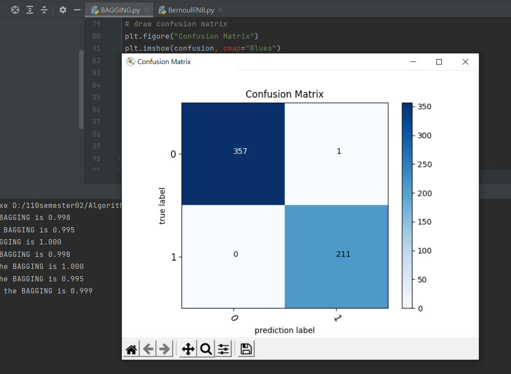
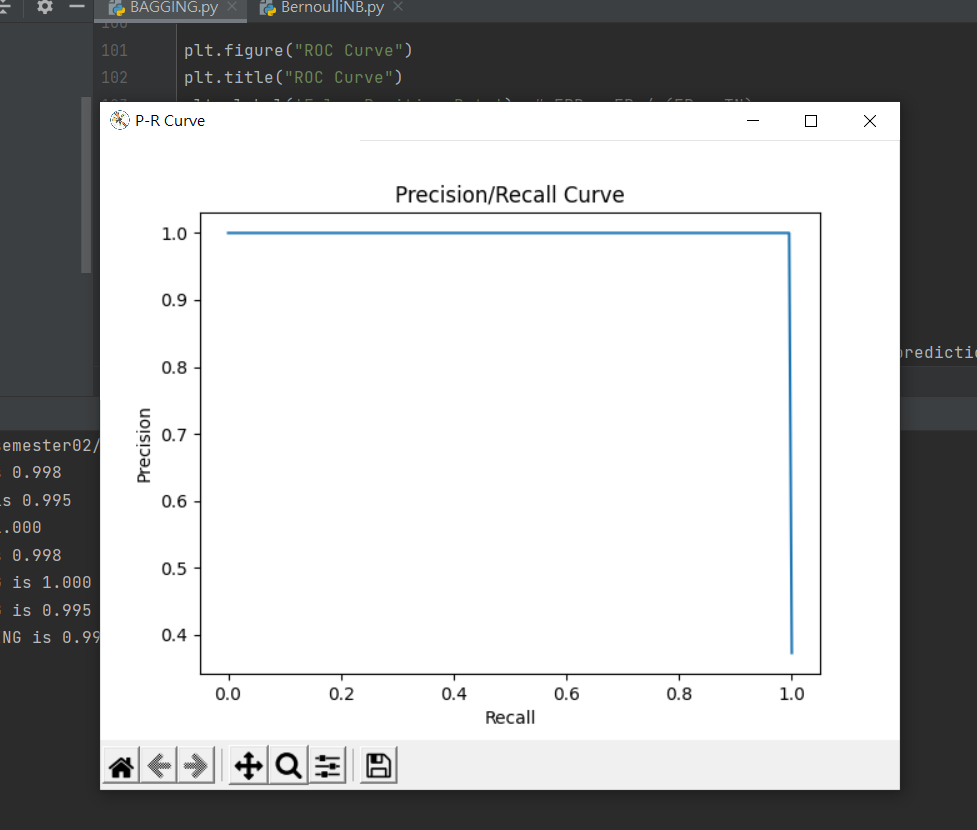
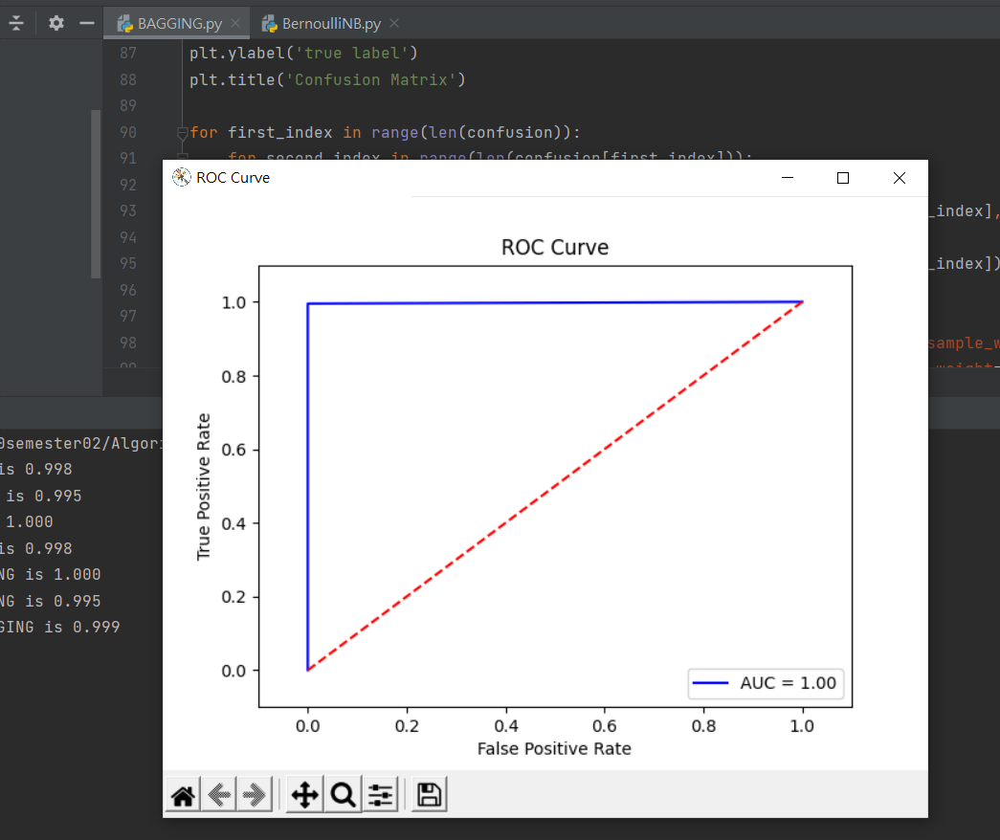

# Bagging

程式碼: [Bagging.py](Bagging.py)

程式執行結果:

1. Accuracy: 0.998
2. Precision: 0.995
3. Recall: 1.000 
4. F1 score: 0.998
5. Sensitivity: 1.000
6. Specificity: 0.995
7. ROC AUC: 0.999

## Confuses Matrix

## PR Curve

## ROC Curve

