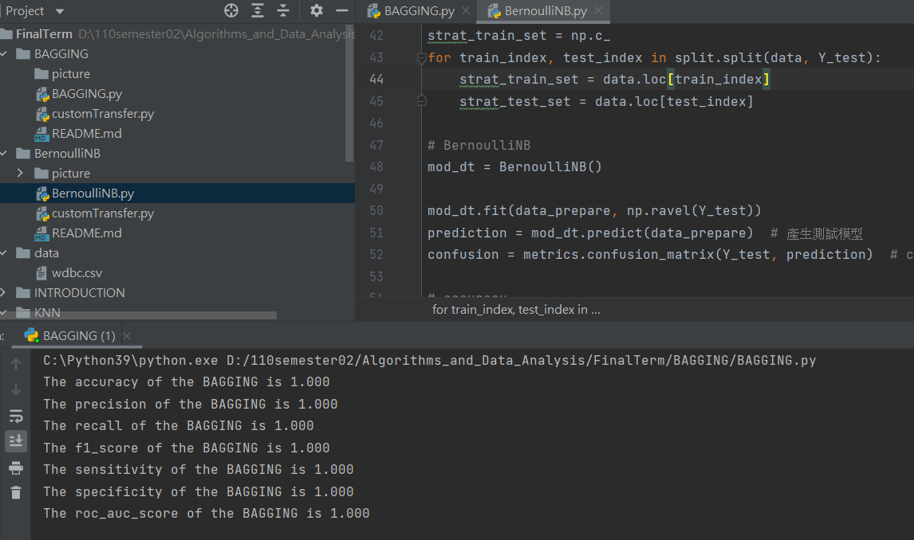
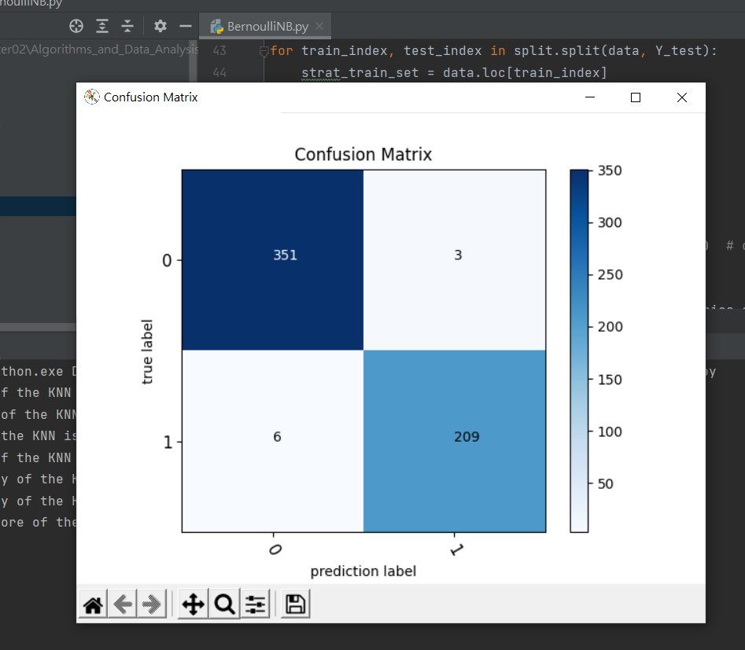
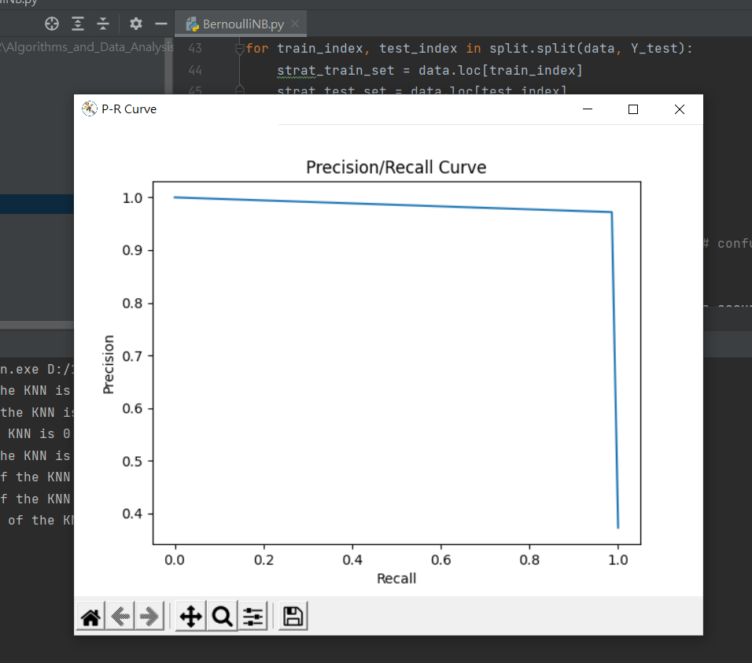
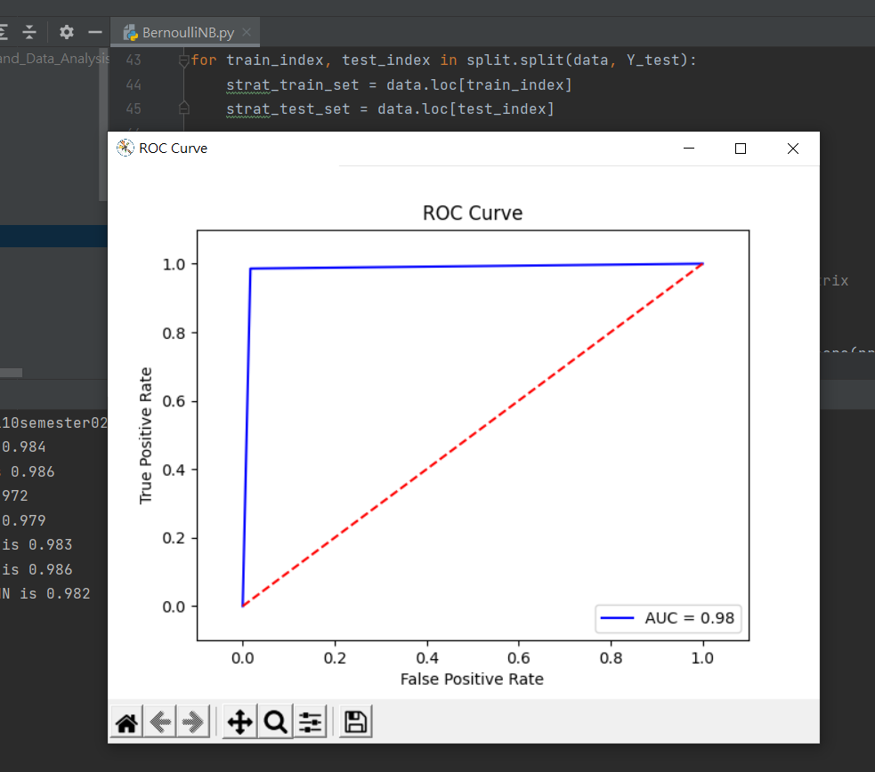

# BernoulliNB

程式碼: [BernoulliNB.py](BernoulliNB.py)

程式執行結果:

1. Accuracy: 0.984
2. Precision: 0.986
3. Recall: 0.972
4. F1 score: 0.979
5. Sensitivity: 0.983
6. Specificity: 0.986
7. ROC AUC: 0.982

## Confuses Matrix

## PR Curve

## ROC Curve

