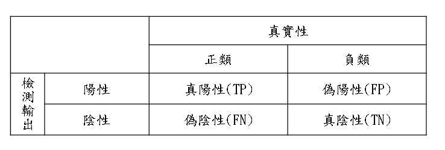

# Tuning Model

對模型進行一系列優化，這個基本上每個模型的做法大同小異

## LabelEncoder

使用`LabelEncoder()`，把原本惡性腫瘤和良性腫瘤的字母改成數字: `B -> 0, M -> 1`

```python
from sklearn.preprocessing import LabelEncoder
le = LabelEncoder()
for col in data[['Diagnosis']]:
    data[col] = le.fit_transform(data[col])
```


## Pipeline

使用`Pipeline`，對參數進行細微調整，並加入了三個新的Label讓準確度達到更高，裡面的`customTransfer.CombineAttributesAdder()`，是自訂義的class，傳回調整後的資料

```python
from sklearn.pipeline import Pipeline
from sklearn.preprocessing import StandardScaler
from sklearn.impute import SimpleImputer
num_pipeline = Pipeline([
    ('imputer', SimpleImputer(strategy="median")),
    ('attribs_adder', customTransfer.CombineAttributesAdder()),
    ('std_scaler', StandardScaler()),
])
```


使用`ColumnTransformer`，接收調整後的資料，並放入到`data_prepare`，用`OneHotEncoder()`對要預測得的參數進行調整

```python
from sklearn.compose import ColumnTransformer
from sklearn.preprocessing import OneHotEncoder

cat_attribs = ["Diagnosis"]
data_num = data.drop("Diagnosis", axis=1)
num_attribs = list(data_num)

full_pipeline = ColumnTransformer([
    ("num", num_pipeline, num_attribs),
    ("cat", OneHotEncoder(), cat_attribs),
])
data_prepare = full_pipeline.fit_transform(data)
```


## Cross Validation

對資料進行 cross-validation 訓練

```python
from sklearn.model_selection import StratifiedShuffleSplit
# 分成10組，訓練資料0.8，測試資料0.2
split = StratifiedShuffleSplit(n_splits=10, test_size=0.2, random_state=42)
strat_train_set = np.c_
data["label"] = pd.cut(data["X1"], bins=[0., 1.5, 3.0, 4.5, 6., np.inf], labels=[1, 2, 3, 4, 5])
for train_index, test_index in split.split(data, data["label"]):
    strat_train_set = data.loc[train_index]
    strat_test_set = data.loc[test_index]
```


完成之後就套用各種模型，進行模型指標分析!!


# 名詞介紹

## 混淆矩陣



* TN: 預測資料正確，實際資料也正確
* TP: 預測資料正確，實際資料不正確
* FN: 預測資料不正確，實際資料正確
* TP: 預測資料不正確，實際資料也不正確


## Accuracy

Accuracy = ( TP + TN ) / ( TP + TN + FP + FN )


## Precision

Precision = TP / (TP + FP)

對預測結果而言的，所有被預測為正的樣本中實際為正的樣本的概率。就是在預測為正樣本的結果中，我們有多少把握可以預測正確


## Recall

Recall = TP / (TP + FN)

對原樣本而言的，實際為正的樣本中被預測為正樣本的概率。含意類似於: 寧可錯殺一千，絕不放過一個


## F1 score

F1 score == ( Recall == Precision )

利用Precision和Recall的調和值 (2 * Precision * Recall / (Precision+Recall))來預測 Precision和Recall 之間的平衡點，Precision和Recall最接近時，F1會最大，F1、Precision、Recall這三者皆越大越好

Precision和Recall是既矛盾又統一的兩個指標， 為了提高Precision值，分類器需要儘量在“更有把握”時才把樣本預測為正樣本，但此時往往會因為過於保守而漏掉很多“沒有把握”的正樣本，導致Recall值降低。F1 Score就是為了這個問提而誕生的平衡點


## Sensitivity (TPR)

TPR = TP / (TP + FN)

在所有實際為陽性的樣本中，被正確地判斷為陽性之比率


## Specificity (FPR)

FPR = FP / (FP + TN)

在所有實際為陰性的樣本中，被錯誤地判斷為陽性之比率


## ROC 

ROC曲線用圖形來描述二分類模型的效能表現，是一個全面評估模型的指標，樣本不平衡的對AUC曲線影響較小(使用TPR、FPR)。

PR曲線越平滑，代表模型越好PR曲線越接近 (1, 1) 也越好。


## AUC

AUC = 1, 是完美分類器，絕大多數的預測場合，不存在完美分類器

0.5 < AUC < 1, 優於隨機猜測，這個模型妥善設定臨界值的話，能有預測價值。

AUC = 0.5 跟隨機猜測一樣 (丟銅板)，模型沒有預測價值

AUC < 0.5 比隨機預測還差，但只要反預測而行，就優於隨機猜測


## 參考網頁

[深度學習分類任務常用評估指標_華為雲開發者社群 - MdEditor (gushiciku.cn)](https://www.gushiciku.cn/pl/g1uC/zh-tw)

[API Reference — scikit-learn 1.1.1 documentation](https://scikit-learn.org/stable/modules/classes.html#module-sklearn.ensemble)