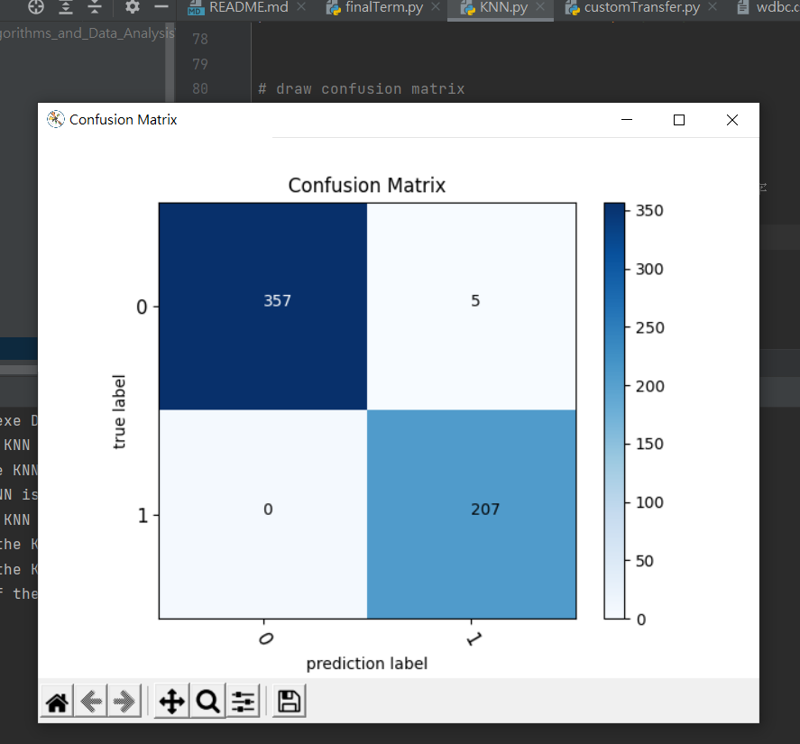
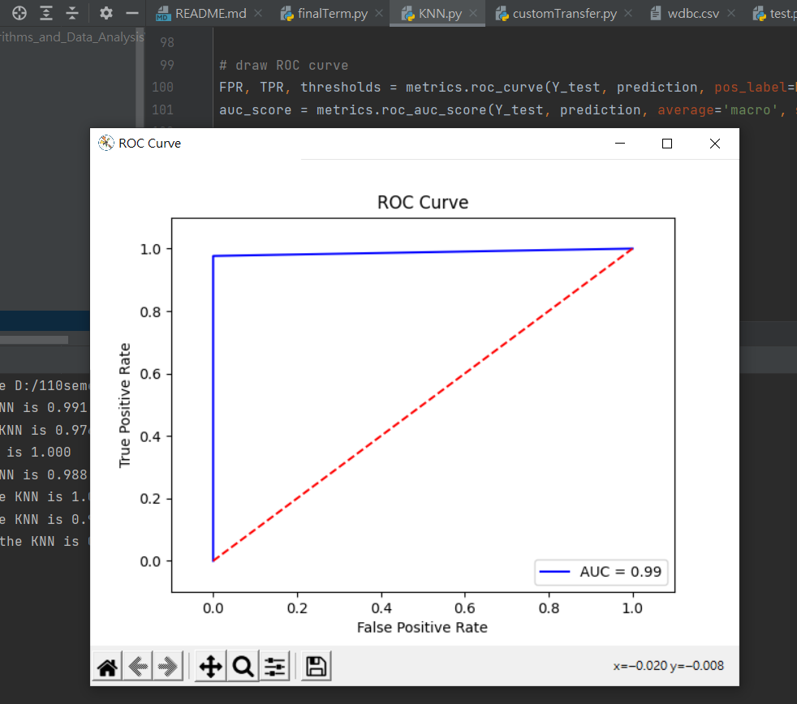

# KNN

程式碼: [KNN.py](KNN.py)

程式執行結果:

1. Accuracy: 0.991
2. Precision: 0.976
3. Recall: 1.000 
4. F1 score: 0.988 
5. Sensitivity: 1.000
6. Specificity: 0.976
7. ROC AUC: 0.993

## Confuses Matrix

## PR Curve

## ROC Curve

