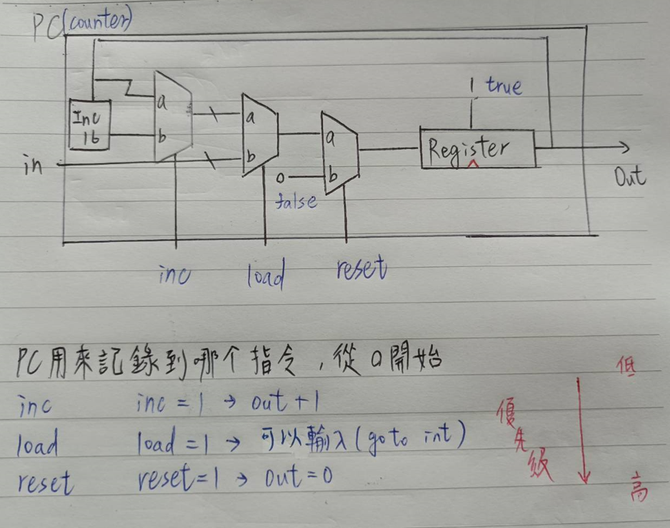
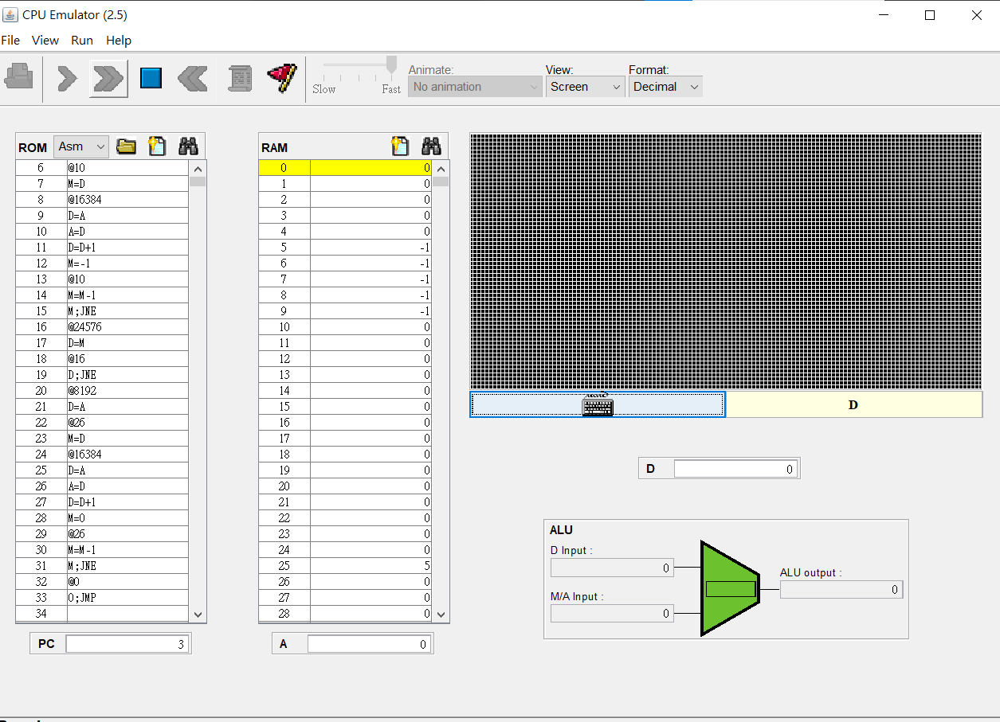
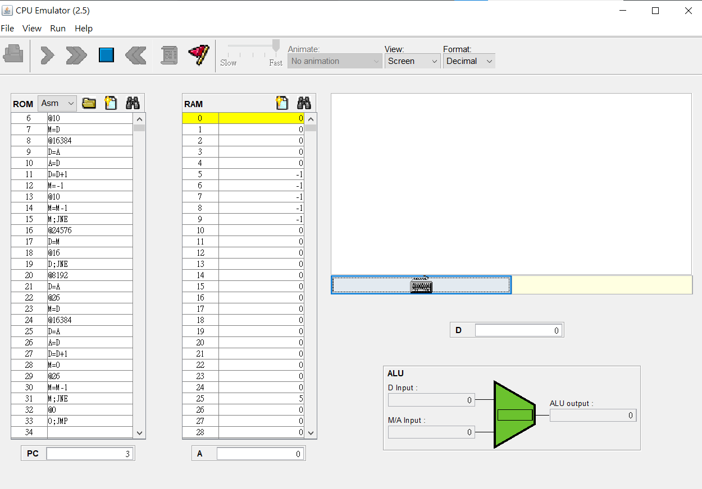
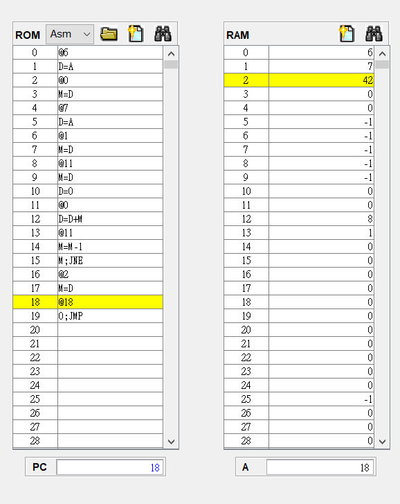
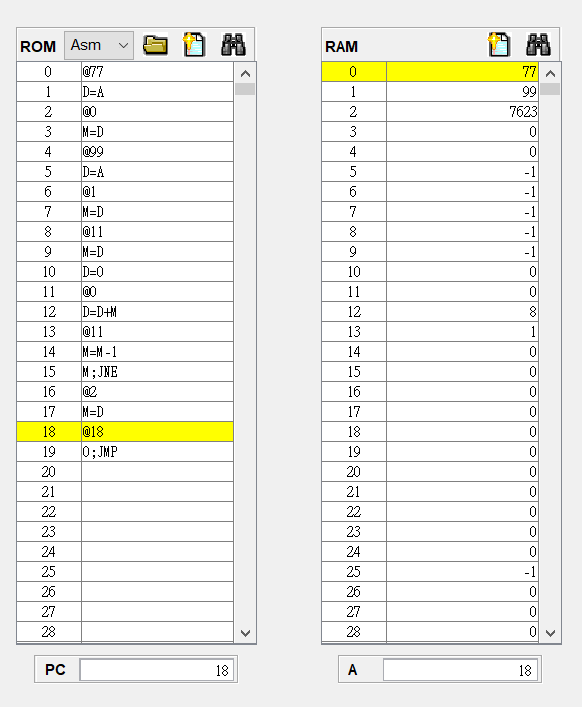
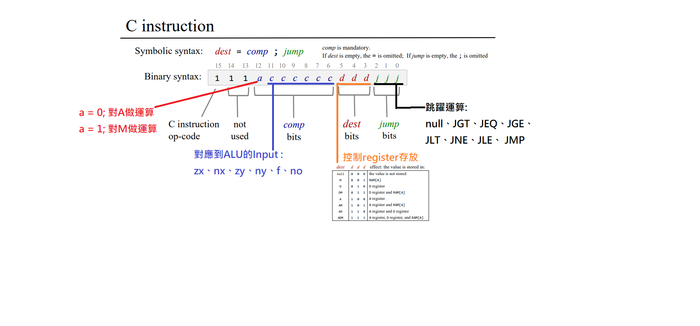
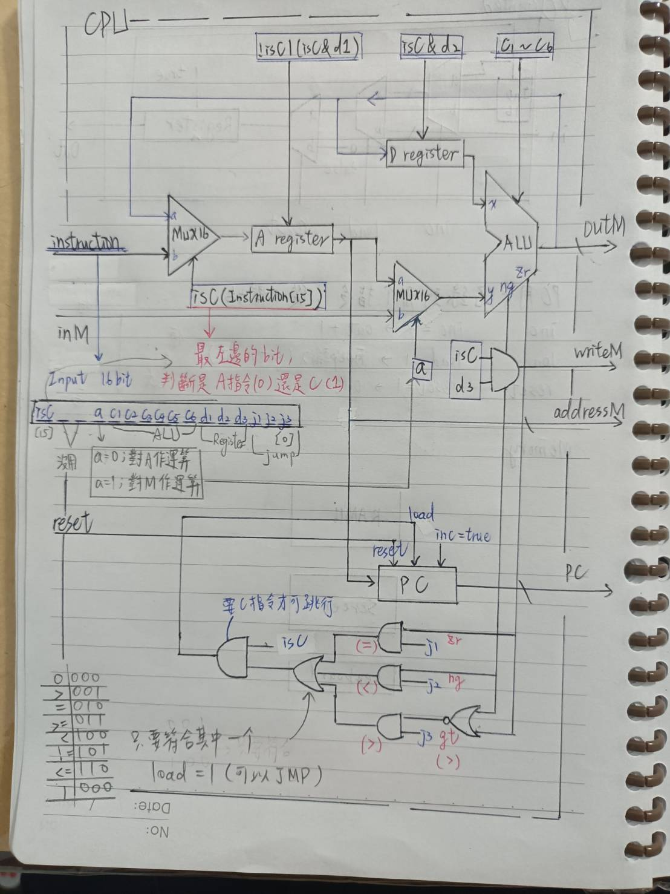
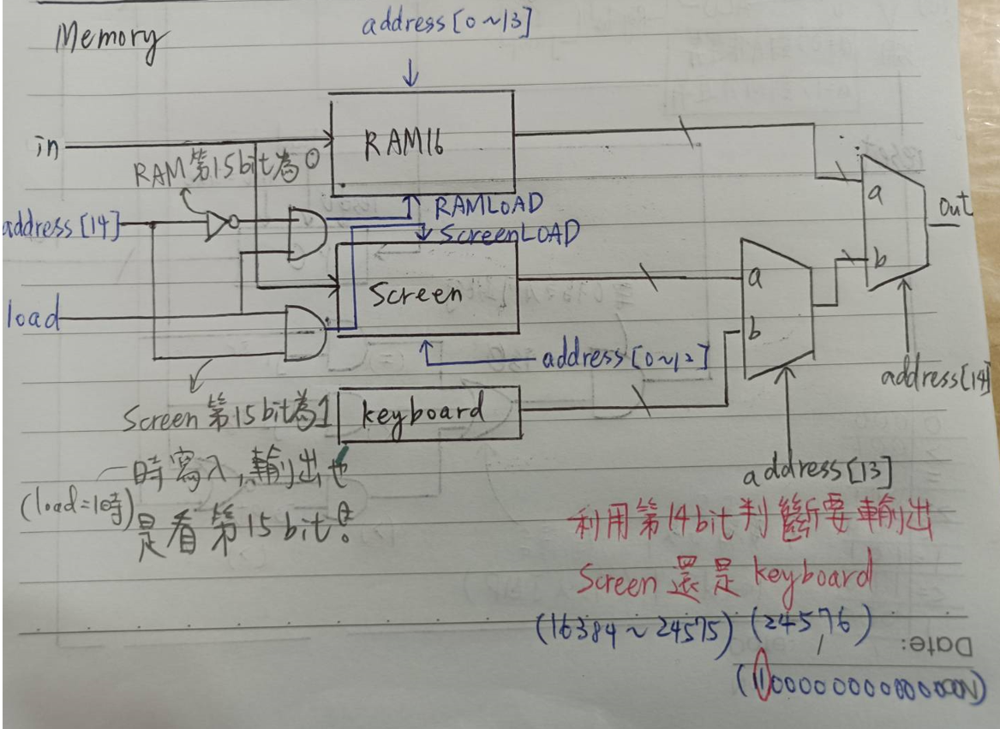
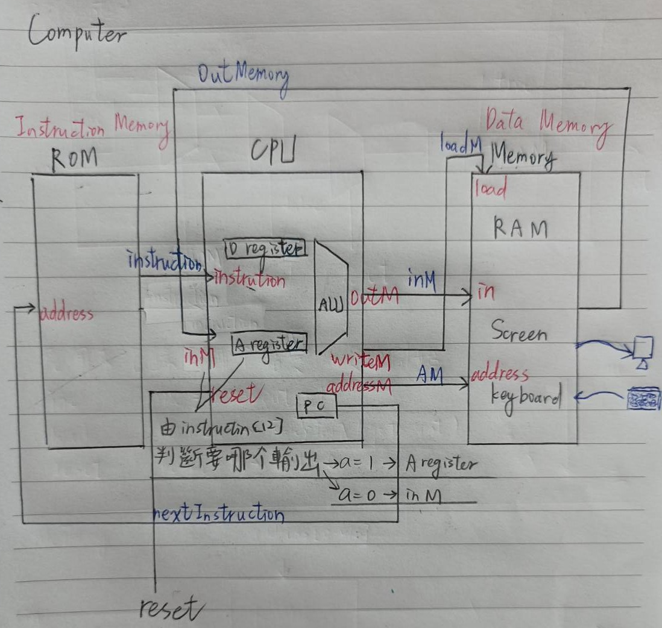

> 所有圖片都是手工繪製，下面是原創以及參考的分類

* 原創
  * [nand2tetris 第一章 1-6 題](https://github.com/stereomp3/co110a/tree/master/homework/week01) week01
  * [nand2tetris 第一章 後半](https://github.com/stereomp3/co110a/tree/master/homework/week02) week02
  * [nand2tetris 第二章 前四題](https://github.com/stereomp3/co110a/tree/master/homework/week03) week03
  * [nand2tetris 第三章 的 前三題](https://github.com/stereomp3/co110a/tree/master/homework/week05) week05
  * [nand2tetris 第三章 後半 ](https://github.com/stereomp3/co110a/tree/master/homework/week06)week06
  * [nand2tetris 第四章 全部](https://github.com/stereomp3/co110a/tree/master/homework/week07) week07
  * [nand2tetris 第五章 後半](https://github.com/stereomp3/co110a/tree/master/homework/week09) week09

* 參考[nand2tetris的第二章教學投影片](https://drive.google.com/file/d/1ie9s3GjM2TrvL7PrEZJ00gEwezgNLOBm/view)
  * [nand2tetris 第二章 的 ALU](https://github.com/stereomp3/co110a/tree/master/homework/week04) week04

* 參考 [nand2tetris教學投影片](https://drive.google.com/file/d/1nEptWuRpFF9zmqlKYq6s1UfDB_dd16vx/view) 以及 [老師的網站](https://gitlab.com/ccc110/co/-/blob/master/05/CPU.hdl)
  * [nand2tetris 第五章 CPU](https://github.com/stereomp3/co110a/tree/master/homework/week08) week08


<hr>


# 製作 || Not || And || Or || Xor || Mux || DMux || (week01)


## 1. Not

```js
// This file is part of www.nand2tetris.org
// and the book "The Elements of Computing Systems"
// by Nisan and Schocken, MIT Press.
// File name: projects/01/Not.hdl

/**
 * Not gate:
 * out = not in
 */

CHIP Not {
    IN in;
    OUT out;

    PARTS:
    // Put your code here:
    Nand(a = in, b = in, out = out);
}
```


## 2. And

```js
// This file is part of www.nand2tetris.org
// and the book "The Elements of Computing Systems"
// by Nisan and Schocken, MIT Press.
// File name: projects/01/And.hdl

/**
 * And gate: 
 * out = 1 if (a == 1 and b == 1)
 *       0 otherwise
 */

CHIP And {
    IN a, b;
    OUT out;

    PARTS:
    // Put your code here:
    Nand(a = a, b = b, out = nab);
    Not(in = nab, out = out);
}
```


## 3. Or

```js
// This file is part of www.nand2tetris.org
// and the book "The Elements of Computing Systems"
// by Nisan and Schocken, MIT Press.
// File name: projects/01/Or.hdl

 /**
 * Or gate:
 * out = 1 if (a == 1 or b == 1)
 *       0 otherwise
 */

CHIP Or {
    IN a, b;
    OUT out;

    PARTS:
    // Put your code here:
    Not(in = a, out = na);
    Not(in = b, out = nb);
    Nand(a = na, b = nb, out = out);
}
```


## 4. Xor

```js
// This file is part of www.nand2tetris.org
// and the book "The Elements of Computing Systems"
// by Nisan and Schocken, MIT Press.
// File name: projects/01/Xor.hdl

/**
 * Exclusive-or gate:
 * out = not (a == b)
 */

CHIP Xor {
    IN a, b;
    OUT out;

    PARTS:
    // Put your code here:
    Not(in = a, out = na);
	Not(in = b, out = nb);
	And(a = na, b = b, out = nab);
	And(a = a, b = nb, out = anb);
	Or(a = nab, b = anb, out = out);
}
```


## 5. Mux

```js
// This file is part of www.nand2tetris.org
// and the book "The Elements of Computing Systems"
// by Nisan and Schocken, MIT Press.
// File name: projects/01/Mux.hdl

/** 
 * Multiplexor:
 * out = a if sel == 0
 *       b otherwise
 */

CHIP Mux {
    IN a, b, sel;
    OUT out;

    PARTS:
    // Put your code here:
    Not(in = sel, out = nsel);
    And(a = a, b = nsel, out = asel);
    And(a = b, b = sel, out = bsel);
    Or(a = asel, b = bsel, out=out);
}
```

* sel = 0


* sel = 1


## 6. DMux

```js
// This file is part of www.nand2tetris.org
// and the book "The Elements of Computing Systems"
// by Nisan and Schocken, MIT Press.
// File name: projects/01/DMux.hdl

/**
 * Demultiplexor:
 * {a, b} = {in, 0} if sel == 0
 *          {0, in} if sel == 1
 */

CHIP DMux {
    IN in, sel;
    OUT a, b;

    PARTS:
    // Put your code here:
    Not(in = sel, out = nsel);
    And(a = in, b = nsel, out = a);
    And(a = in, b = sel, out = b);
}
```


<hr>


# 製作 || Not16 || And16 || Or16 || Mux16 || Or8Way || Mux4Way16 || Mux8Way16 ||DMux4Way || DMux8Way (week02)


## 1. Not16 


```js
|        in        |       out        |
| 0000000000000000 | 1111111111111111 |
| 1111111111111111 | 0000000000000000 |
| 1010101010101010 | 0101010101010101 |
| 0011110011000011 | 1100001100111100 |
| 0001001000110100 | 1110110111001011 |
// This file is part of www.nand2tetris.org
// and the book "The Elements of Computing Systems"
// by Nisan and Schocken, MIT Press.
// File name: projects/01/Not16.hdl

/**
 * 16-bit Not:
 * for i=0..15: out[i] = not in[i]
 */

CHIP Not16 {
    IN in[16];
    OUT out[16];

    PARTS:
    // Put your code here:
    Not(in=in[0],out=out[0]);
    Not(in=in[1],out=out[1]);
    Not(in=in[2],out=out[2]);
    Not(in=in[3],out=out[3]);
    Not(in=in[4],out=out[4]);
    Not(in=in[5],out=out[5]);
    Not(in=in[6],out=out[6]);
    Not(in=in[7],out=out[7]);
    Not(in=in[8],out=out[8]);
    Not(in=in[9],out=out[9]);
    Not(in=in[10],out=out[10]);
    Not(in=in[11],out=out[11]);
    Not(in=in[12],out=out[12]);
    Not(in=in[13],out=out[13]);
    Not(in=in[14],out=out[14]);
    Not(in=in[15],out=out[15]);
}
```

## 2. And16 


```js
|        a         |        b         |       out        |
| 0000000000000000 | 0000000000000000 | 0000000000000000 |
| 0000000000000000 | 1111111111111111 | 0000000000000000 |
| 1111111111111111 | 1111111111111111 | 1111111111111111 |
| 1010101010101010 | 0101010101010101 | 0000000000000000 |
| 0011110011000011 | 0000111111110000 | 0000110011000000 |
| 0001001000110100 | 1001100001110110 | 0001000000110100 |
// This file is part of www.nand2tetris.org
// and the book "The Elements of Computing Systems"
// by Nisan and Schocken, MIT Press.
// File name: projects/01/And16.hdl

/**
 * 16-bit bitwise And:
 * for i = 0..15: out[i] = (a[i] and b[i])
 */

CHIP And16 {
    IN a[16], b[16];
    OUT out[16];

    PARTS:
    // Put your code here:
    And(a=a[0],b=b[0],out=out[0]);
    And(a=a[1],b=b[1],out=out[1]);
    And(a=a[2],b=b[2],out=out[2]);
    And(a=a[3],b=b[3],out=out[3]);
    And(a=a[4],b=b[4],out=out[4]);
    And(a=a[5],b=b[5],out=out[5]);
    And(a=a[6],b=b[6],out=out[6]);
    And(a=a[7],b=b[7],out=out[7]);
    And(a=a[8],b=b[8],out=out[8]);
    And(a=a[9],b=b[9],out=out[9]);
    And(a=a[10],b=b[10],out=out[10]);
    And(a=a[11],b=b[11],out=out[11]);
    And(a=a[12],b=b[12],out=out[12]);
    And(a=a[13],b=b[13],out=out[13]);
    And(a=a[14],b=b[14],out=out[14]);
    And(a=a[15],b=b[15],out=out[15]);
}

```

## 3. Or16 


```js
|        a         |        b         |       out        |
| 0000000000000000 | 0000000000000000 | 0000000000000000 |
| 0000000000000000 | 1111111111111111 | 1111111111111111 |
| 1111111111111111 | 1111111111111111 | 1111111111111111 |
| 1010101010101010 | 0101010101010101 | 1111111111111111 |
| 0011110011000011 | 0000111111110000 | 0011111111110011 |
| 0001001000110100 | 1001100001110110 | 1001101001110110 |
// This file is part of www.nand2tetris.org
// and the book "The Elements of Computing Systems"
// by Nisan and Schocken, MIT Press.
// File name: projects/01/Or.hdl

 /**
 * Or gate:
 * out = 1 if (a == 1 or b == 1)
 *       0 otherwise
 */

CHIP Or16 {
    IN a[16], b[16];
    OUT out[16];

    PARTS:
    // Put your code here:
    Or(a=a[0],b=b[0],out=out[0]);
    Or(a=a[1],b=b[1],out=out[1]);
    Or(a=a[2],b=b[2],out=out[2]);
    Or(a=a[3],b=b[3],out=out[3]);
    Or(a=a[4],b=b[4],out=out[4]);
    Or(a=a[5],b=b[5],out=out[5]);
    Or(a=a[6],b=b[6],out=out[6]);
    Or(a=a[7],b=b[7],out=out[7]);
    Or(a=a[8],b=b[8],out=out[8]);
    Or(a=a[9],b=b[9],out=out[9]);
    Or(a=a[10],b=b[10],out=out[10]);
    Or(a=a[11],b=b[11],out=out[11]);
    Or(a=a[12],b=b[12],out=out[12]);
    Or(a=a[13],b=b[13],out=out[13]);
    Or(a=a[14],b=b[14],out=out[14]);
    Or(a=a[15],b=b[15],out=out[15]);
}

```

## 4. Mux16 


```js
|        a         |        b         | sel |       out        |
| 0000000000000000 | 0000000000000000 |  0  | 0000000000000000 |
| 0000000000000000 | 0000000000000000 |  1  | 0000000000000000 |
| 0000000000000000 | 0001001000110100 |  0  | 0000000000000000 |
| 0000000000000000 | 0001001000110100 |  1  | 0001001000110100 |
| 1001100001110110 | 0000000000000000 |  0  | 1001100001110110 |
| 1001100001110110 | 0000000000000000 |  1  | 0000000000000000 |
| 1010101010101010 | 0101010101010101 |  0  | 1010101010101010 |
| 1010101010101010 | 0101010101010101 |  1  | 0101010101010101 |
// This file is part of www.nand2tetris.org
// and the book "The Elements of Computing Systems"
// by Nisan and Schocken, MIT Press.
// File name: projects/01/Mux16.hdl

/**
 * 16-bit multiplexor: 
 * for i = 0..15 out[i] = a[i] if sel == 0 
 *                        b[i] if sel == 1
 */

CHIP Mux16 {
    IN a[16], b[16], sel;
    OUT out[16];

    PARTS:
    // Put your code here:
    Mux(a=a[0],b=b[0],sel=sel,out=out[0]);
    Mux(a=a[1],b=b[1],sel=sel,out=out[1]);
    Mux(a=a[2],b=b[2],sel=sel,out=out[2]);
    Mux(a=a[3],b=b[3],sel=sel,out=out[3]);
    Mux(a=a[4],b=b[4],sel=sel,out=out[4]);
    Mux(a=a[5],b=b[5],sel=sel,out=out[5]);
    Mux(a=a[6],b=b[6],sel=sel,out=out[6]);
    Mux(a=a[7],b=b[7],sel=sel,out=out[7]);
    Mux(a=a[8],b=b[8],sel=sel,out=out[8]);
    Mux(a=a[9],b=b[9],sel=sel,out=out[9]);
    Mux(a=a[10],b=b[10],sel=sel,out=out[10]);
    Mux(a=a[11],b=b[11],sel=sel,out=out[11]);
    Mux(a=a[12],b=b[12],sel=sel,out=out[12]);
    Mux(a=a[13],b=b[13],sel=sel,out=out[13]);
    Mux(a=a[14],b=b[14],sel=sel,out=out[14]);
    Mux(a=a[15],b=b[15],sel=sel,out=out[15]);
}
```

## 5. Or8Way 


```js
|     in     | out |
|  00000000  |  0  |
|  11111111  |  1  |
|  00010000  |  1  |
|  00000001  |  1  |
|  00100110  |  1  |
// This file is part of www.nand2tetris.org
// and the book "The Elements of Computing Systems"
// by Nisan and Schocken, MIT Press.
// File name: projects/01/Or8Way.hdl

/**
 * 8-way Or: 
 * out = (in[0] or in[1] or ... or in[7])
 */

CHIP Or8Way {
    IN in[8];
    OUT out;

    PARTS:
    // Put your code here:
     Or(a=in[0],b=in[1],out=Or01);
     Or(a=in[2],b=in[3],out=Or23);
     Or(a=in[4],b=in[5],out=Or45);
     Or(a=in[6],b=in[7],out=Or67);
     Or(a=Or01,b=Or23,out=Or0123);
     Or(a=Or45,b=Or67,out=Or4567);
     Or(a=Or0123,b=Or4567,out=out);
}

```

## 6. Mux4Way16


```js
|        a         |        b         |        c         |        d         | sel  |       out        |
| 0000000000000000 | 0000000000000000 | 0000000000000000 | 0000000000000000 |  00  | 0000000000000000 |
| 0000000000000000 | 0000000000000000 | 0000000000000000 | 0000000000000000 |  01  | 0000000000000000 |
| 0000000000000000 | 0000000000000000 | 0000000000000000 | 0000000000000000 |  10  | 0000000000000000 |
| 0000000000000000 | 0000000000000000 | 0000000000000000 | 0000000000000000 |  11  | 0000000000000000 |
| 0001001000110100 | 1001100001110110 | 1010101010101010 | 0101010101010101 |  00  | 0001001000110100 |
| 0001001000110100 | 1001100001110110 | 1010101010101010 | 0101010101010101 |  01  | 1001100001110110 |
| 0001001000110100 | 1001100001110110 | 1010101010101010 | 0101010101010101 |  10  | 1010101010101010 |
| 0001001000110100 | 1001100001110110 | 1010101010101010 | 0101010101010101 |  11  | 0101010101010101 |

// This file is part of www.nand2tetris.org
// and the book "The Elements of Computing Systems"
// by Nisan and Schocken, MIT Press.
// File name: projects/01/Mux4Way16.hdl

/**
 * 4-way 16-bit multiplexor:
 * out = a if sel == 00
 *       b if sel == 01
 *       c if sel == 10
 *       d if sel == 11
 */

CHIP Mux4Way16 {
    IN a[16], b[16], c[16], d[16], sel[2];
    OUT out[16];

    PARTS:
    // Put your code here:
    Mux16(a=a,b=b,sel=sel[0],out=Muxab);
    Mux16(a=c,b=d,sel=sel[0],out=Muxcd);
    Mux16(a=Muxab,b=Muxcd,sel=sel[1],out=out);
}

```

## 7. Mux8Way16 


```js
|        a         |        b         |        c         |        d         |        e         |        f         |        g         |        h         |  sel  |       out        |
| 0000000000000000 | 0000000000000000 | 0000000000000000 | 0000000000000000 | 0000000000000000 | 0000000000000000 | 0000000000000000 | 0000000000000000 |  000  | 0000000000000000 |
| 0000000000000000 | 0000000000000000 | 0000000000000000 | 0000000000000000 | 0000000000000000 | 0000000000000000 | 0000000000000000 | 0000000000000000 |  001  | 0000000000000000 |
| 0000000000000000 | 0000000000000000 | 0000000000000000 | 0000000000000000 | 0000000000000000 | 0000000000000000 | 0000000000000000 | 0000000000000000 |  010  | 0000000000000000 |
| 0000000000000000 | 0000000000000000 | 0000000000000000 | 0000000000000000 | 0000000000000000 | 0000000000000000 | 0000000000000000 | 0000000000000000 |  011  | 0000000000000000 |
| 0000000000000000 | 0000000000000000 | 0000000000000000 | 0000000000000000 | 0000000000000000 | 0000000000000000 | 0000000000000000 | 0000000000000000 |  100  | 0000000000000000 |
| 0000000000000000 | 0000000000000000 | 0000000000000000 | 0000000000000000 | 0000000000000000 | 0000000000000000 | 0000000000000000 | 0000000000000000 |  101  | 0000000000000000 |
| 0000000000000000 | 0000000000000000 | 0000000000000000 | 0000000000000000 | 0000000000000000 | 0000000000000000 | 0000000000000000 | 0000000000000000 |  110  | 0000000000000000 |
| 0000000000000000 | 0000000000000000 | 0000000000000000 | 0000000000000000 | 0000000000000000 | 0000000000000000 | 0000000000000000 | 0000000000000000 |  111  | 0000000000000000 |
| 0001001000110100 | 0010001101000101 | 0011010001010110 | 0100010101100111 | 0101011001111000 | 0110011110001001 | 0111100010011010 | 1000100110101011 |  000  | 0001001000110100 |
| 0001001000110100 | 0010001101000101 | 0011010001010110 | 0100010101100111 | 0101011001111000 | 0110011110001001 | 0111100010011010 | 1000100110101011 |  001  | 0010001101000101 |
| 0001001000110100 | 0010001101000101 | 0011010001010110 | 0100010101100111 | 0101011001111000 | 0110011110001001 | 0111100010011010 | 1000100110101011 |  010  | 0011010001010110 |
| 0001001000110100 | 0010001101000101 | 0011010001010110 | 0100010101100111 | 0101011001111000 | 0110011110001001 | 0111100010011010 | 1000100110101011 |  011  | 0100010101100111 |
| 0001001000110100 | 0010001101000101 | 0011010001010110 | 0100010101100111 | 0101011001111000 | 0110011110001001 | 0111100010011010 | 1000100110101011 |  100  | 0101011001111000 |
| 0001001000110100 | 0010001101000101 | 0011010001010110 | 0100010101100111 | 0101011001111000 | 0110011110001001 | 0111100010011010 | 1000100110101011 |  101  | 0110011110001001 |
| 0001001000110100 | 0010001101000101 | 0011010001010110 | 0100010101100111 | 0101011001111000 | 0110011110001001 | 0111100010011010 | 1000100110101011 |  110  | 0111100010011010 |
| 0001001000110100 | 0010001101000101 | 0011010001010110 | 0100010101100111 | 0101011001111000 | 0110011110001001 | 0111100010011010 | 1000100110101011 |  111  | 1000100110101011 |

// This file is part of www.nand2tetris.org
// and the book "The Elements of Computing Systems"
// by Nisan and Schocken, MIT Press.
// File name: projects/01/Mux8Way16.hdl

/**
 * 8-way 16-bit multiplexor:
 * out = a if sel == 000
 *       b if sel == 001
 *       etc.
 *       h if sel == 111
 */

CHIP Mux8Way16 {
    IN a[16], b[16], c[16], d[16],
       e[16], f[16], g[16], h[16],
       sel[3];
    OUT out[16];

    PARTS:
    // Put your code here:
    Mux4Way16(a=a,b=b,c=c,d=d,sel=sel[0..1],out=Mux4abcd);
    Mux4Way16(a=e,b=f,c=g,d=h,sel=sel[0..1],out=Mux4efgh);
    Mux16(a=Mux4abcd,b=Mux4efgh,sel=sel[2],out=out);
}

```

## 8. DMux4Way 


```js
| in  | sel  |  a  |  b  |  c  |  d  |
|  0  |  00  |  0  |  0  |  0  |  0  |
|  0  |  01  |  0  |  0  |  0  |  0  |
|  0  |  10  |  0  |  0  |  0  |  0  |
|  0  |  11  |  0  |  0  |  0  |  0  |
|  1  |  00  |  1  |  0  |  0  |  0  |
|  1  |  01  |  0  |  1  |  0  |  0  |
|  1  |  10  |  0  |  0  |  1  |  0  |
|  1  |  11  |  0  |  0  |  0  |  1  |
// This file is part of www.nand2tetris.org
// and the book "The Elements of Computing Systems"
// by Nisan and Schocken, MIT Press.
// File name: projects/01/DMux4Way.hdl

/**
 * 4-way demultiplexor:
 * {a, b, c, d} = {in, 0, 0, 0} if sel == 00
 *                {0, in, 0, 0} if sel == 01
 *                {0, 0, in, 0} if sel == 10
 *                {0, 0, 0, in} if sel == 11
 */

CHIP DMux4Way {
    IN in, sel[2];
    OUT a, b, c, d;

    PARTS:
    // Put your code here:
    DMux(in=in,sel=sel[1],a=Duxa,b=Duxb);
    DMux(in=Duxa,sel=sel[0],a=a,b=b);
    DMux(in=Duxb,sel=sel[0],a=c,b=d);
} 
```

## 9. DMux8Way


```js
| in  |  sel  |  a  |  b  |  c  |  d  |  e  |  f  |  g  |  h  |
|  0  |  000  |  0  |  0  |  0  |  0  |  0  |  0  |  0  |  0  |
|  0  |  001  |  0  |  0  |  0  |  0  |  0  |  0  |  0  |  0  |
|  0  |  010  |  0  |  0  |  0  |  0  |  0  |  0  |  0  |  0  |
|  0  |  011  |  0  |  0  |  0  |  0  |  0  |  0  |  0  |  0  |
|  0  |  100  |  0  |  0  |  0  |  0  |  0  |  0  |  0  |  0  |
|  0  |  101  |  0  |  0  |  0  |  0  |  0  |  0  |  0  |  0  |
|  0  |  110  |  0  |  0  |  0  |  0  |  0  |  0  |  0  |  0  |
|  0  |  111  |  0  |  0  |  0  |  0  |  0  |  0  |  0  |  0  |
|  1  |  000  |  1  |  0  |  0  |  0  |  0  |  0  |  0  |  0  |
|  1  |  001  |  0  |  1  |  0  |  0  |  0  |  0  |  0  |  0  |
|  1  |  010  |  0  |  0  |  1  |  0  |  0  |  0  |  0  |  0  |
|  1  |  011  |  0  |  0  |  0  |  1  |  0  |  0  |  0  |  0  |
|  1  |  100  |  0  |  0  |  0  |  0  |  1  |  0  |  0  |  0  |
|  1  |  101  |  0  |  0  |  0  |  0  |  0  |  1  |  0  |  0  |
|  1  |  110  |  0  |  0  |  0  |  0  |  0  |  0  |  1  |  0  |
|  1  |  111  |  0  |  0  |  0  |  0  |  0  |  0  |  0  |  1  |

// This file is part of www.nand2tetris.org
// and the book "The Elements of Computing Systems"
// by Nisan and Schocken, MIT Press.
// File name: projects/01/DMux8Way.hdl

/**
 * 8-way demultiplexor:
 * {a, b, c, d, e, f, g, h} = {in, 0, 0, 0, 0, 0, 0, 0} if sel == 000
 *                            {0, in, 0, 0, 0, 0, 0, 0} if sel == 001
 *                            etc.
 *                            {0, 0, 0, 0, 0, 0, 0, in} if sel == 111
 */

CHIP DMux8Way{
    IN in, sel[3];
    OUT a, b, c, d, e, f, g, h;

    PARTS:
    // Put your code here:
    DMux(in=in,sel=sel[2],a=aDMux,b=bDMux);
    DMux4Way(in=aDMux,sel=sel[0..1],a=a,b=b,c=c,d=d);
    DMux4Way(in=bDMux,sel=sel[0..1],a=e,b=f,c=g,d=h);
}
```

## 迪摩根定二定理證明


## 七段顯示器顯示(41%7=6:g)


<hr>


# 製作 || HalfAdder || FullAdder || Adder16 || Inc16 || (week03)


## 1. HalfAdder


```js
|   a   |   b   |  sum  | carry |
|   0   |   0   |   0   |   0   |
|   0   |   1   |   1   |   0   |
|   1   |   0   |   1   |   0   |
|   1   |   1   |   0   |   1   |

// This file is part of www.nand2tetris.org
// and the book "The Elements of Computing Systems"
// by Nisan and Schocken, MIT Press.
// File name: projects/02/HalfAdder.hdl

/**
 * Computes the sum of two bits.
 */

CHIP HalfAdder {
    IN a, b;    // 1-bit inputs
    OUT sum,    // Right bit of a + b 
        carry;  // Left bit of a + b

    PARTS:
    // Put you code here:
    And(a = a, b = b, out = carry);
    Xor(a = a, b = b, out = sum);
}
```


## 2. FullAdder

```js
|   a   |   b   |   c   |  sum  | carry |
|   0   |   0   |   0   |   0   |   0   |
|   0   |   0   |   1   |   1   |   0   |
|   0   |   1   |   0   |   1   |   0   |
|   0   |   1   |   1   |   0   |   1   |
|   1   |   0   |   0   |   1   |   0   |
|   1   |   0   |   1   |   0   |   1   |
|   1   |   1   |   0   |   0   |   1   |
|   1   |   1   |   1   |   1   |   1   |

// This file is part of www.nand2tetris.org
// and the book "The Elements of Computing Systems"
// by Nisan and Schocken, MIT Press.
// File name: projects/02/FullAdder.hdl

/**
 * Computes the sum of three bits.
 */

CHIP FullAdder {
    IN a, b, c;  // 1-bit inputs
    OUT sum,     // Right bit of a + b + c
        carry;   // Left bit of a + b + c

    PARTS:
    // Put you code here:
    Xor(a = a, b = b, out = aXorb);
    Xor(a = c, b = aXorb, out = sum);
    And(a = a, b = c, out = ac);
    And(a = b, b = c, out = bc);
    And(a = a, b = b, out = ab);
    Or(a = ac, b = bc, out = acOrbc);
    Or(a = ab, b = acOrbc, out = carry);
}
```


## 3. Adder16

```js
|        a         |        b         |       out        |
| 0000000000000000 | 0000000000000000 | 0000000000000000 |
| 0000000000000000 | 1111111111111111 | 1111111111111111 |
| 1111111111111111 | 1111111111111111 | 1111111111111110 |
| 1010101010101010 | 0101010101010101 | 1111111111111111 |
| 0011110011000011 | 0000111111110000 | 0100110010110011 |
| 0001001000110100 | 1001100001110110 | 1010101010101010 |

// This file is part of www.nand2tetris.org
// and the book "The Elements of Computing Systems"
// by Nisan and Schocken, MIT Press.
// File name: projects/02/Adder16.hdl

/**
 * Adds two 16-bit values.
 * The most significant carry bit is ignored.
 */

CHIP Add16 {
    IN a[16], b[16];
    OUT out[16];

    PARTS:
   // Put you code here:
   FullAdder(a = a[0], b = b[0], c = false, sum = out[0], carry = c1);
   //HalfAdder( a = a[0], b = b[0], sum = out[0], carry = c1);
   FullAdder( a = a[1], b = b[1], c = c1, sum = out[1], carry = c2);
   FullAdder( a = a[2], b = b[2], c = c2, sum = out[2], carry = c3);
   FullAdder( a = a[3], b = b[3], c = c3, sum = out[3], carry = c4);
   FullAdder( a = a[4], b = b[4], c = c4, sum = out[4], carry = c5);
   FullAdder( a = a[5], b = b[5], c = c5, sum = out[5], carry = c6);
   FullAdder( a = a[6], b = b[6], c = c6, sum = out[6], carry = c7);
   FullAdder( a = a[7], b = b[7], c = c7, sum = out[7], carry = c8);
   FullAdder( a = a[8], b = b[8], c = c8, sum = out[8], carry = c9);
   FullAdder( a = a[9], b = b[9], c = c9, sum = out[9], carry = c10);
   FullAdder( a = a[10], b=b[10], c = c10, sum = out[10], carry = c11);
   FullAdder( a = a[11], b=b[11], c = c11, sum = out[11], carry = c12);
   FullAdder( a = a[12], b=b[12], c = c12, sum = out[12], carry = c13);
   FullAdder( a = a[13], b=b[13], c = c13, sum = out[13], carry = c14);
   FullAdder( a = a[14], b=b[14], c = c14, sum = out[14], carry = c15);
   FullAdder( a = a[15], b=b[15], c = c15, sum = out[15], carry = c16);
}
```


## 4. Inc16 

```js
|        in        |       out        |
| 0000000000000000 | 0000000000000001 |
| 1111111111111111 | 0000000000000000 |
| 0000000000000101 | 0000000000000110 |

| 1111111111111011 | 1111111111111100 |
// This file is part of www.nand2tetris.org
// and the book "The Elements of Computing Systems"
// by Nisan and Schocken, MIT Press.
// File name: projects/02/Inc16.hdl

/**
 * 16-bit incrementer:
 * out = in + 1 (arithmetic addition)
 */

CHIP Inc16 {
    IN in[16];
    OUT out[16];

    PARTS:
   // Put you code here:
    Add16( a[0..15] = in[0..15], b[0] = true, b[1..15] = false, out[0..15] = out[0..15] );
}
```


<hr>


# 製作 || ALU || (week04)

```js
|        x         |        y         |zx |nx |zy |ny | f |no |       out        |zr |ng |
| 0000000000000000 | 1111111111111111 | 1 | 0 | 1 | 0 | 1 | 0 | 0000000000000000 | 1 | 0 |
| 0000000000000000 | 1111111111111111 | 1 | 1 | 1 | 1 | 1 | 1 | 0000000000000001 | 0 | 0 |
| 0000000000000000 | 1111111111111111 | 1 | 1 | 1 | 0 | 1 | 0 | 1111111111111111 | 0 | 1 |
| 0000000000000000 | 1111111111111111 | 0 | 0 | 1 | 1 | 0 | 0 | 0000000000000000 | 1 | 0 |
| 0000000000000000 | 1111111111111111 | 1 | 1 | 0 | 0 | 0 | 0 | 1111111111111111 | 0 | 1 |
| 0000000000000000 | 1111111111111111 | 0 | 0 | 1 | 1 | 0 | 1 | 1111111111111111 | 0 | 1 |
| 0000000000000000 | 1111111111111111 | 1 | 1 | 0 | 0 | 0 | 1 | 0000000000000000 | 1 | 0 |
| 0000000000000000 | 1111111111111111 | 0 | 0 | 1 | 1 | 1 | 1 | 0000000000000000 | 1 | 0 |
| 0000000000000000 | 1111111111111111 | 1 | 1 | 0 | 0 | 1 | 1 | 0000000000000001 | 0 | 0 |
| 0000000000000000 | 1111111111111111 | 0 | 1 | 1 | 1 | 1 | 1 | 0000000000000001 | 0 | 0 |
| 0000000000000000 | 1111111111111111 | 1 | 1 | 0 | 1 | 1 | 1 | 0000000000000000 | 1 | 0 |
| 0000000000000000 | 1111111111111111 | 0 | 0 | 1 | 1 | 1 | 0 | 1111111111111111 | 0 | 1 |
| 0000000000000000 | 1111111111111111 | 1 | 1 | 0 | 0 | 1 | 0 | 1111111111111110 | 0 | 1 |
| 0000000000000000 | 1111111111111111 | 0 | 0 | 0 | 0 | 1 | 0 | 1111111111111111 | 0 | 1 |
| 0000000000000000 | 1111111111111111 | 0 | 1 | 0 | 0 | 1 | 1 | 0000000000000001 | 0 | 0 |
| 0000000000000000 | 1111111111111111 | 0 | 0 | 0 | 1 | 1 | 1 | 1111111111111111 | 0 | 1 |
| 0000000000000000 | 1111111111111111 | 0 | 0 | 0 | 0 | 0 | 0 | 0000000000000000 | 1 | 0 |
| 0000000000000000 | 1111111111111111 | 0 | 1 | 0 | 1 | 0 | 1 | 1111111111111111 | 0 | 1 |
| 0000000000010001 | 0000000000000011 | 1 | 0 | 1 | 0 | 1 | 0 | 0000000000000000 | 1 | 0 |
| 0000000000010001 | 0000000000000011 | 1 | 1 | 1 | 1 | 1 | 1 | 0000000000000001 | 0 | 0 |
| 0000000000010001 | 0000000000000011 | 1 | 1 | 1 | 0 | 1 | 0 | 1111111111111111 | 0 | 1 |
| 0000000000010001 | 0000000000000011 | 0 | 0 | 1 | 1 | 0 | 0 | 0000000000010001 | 0 | 0 |
| 0000000000010001 | 0000000000000011 | 1 | 1 | 0 | 0 | 0 | 0 | 0000000000000011 | 0 | 0 |
| 0000000000010001 | 0000000000000011 | 0 | 0 | 1 | 1 | 0 | 1 | 1111111111101110 | 0 | 1 |
| 0000000000010001 | 0000000000000011 | 1 | 1 | 0 | 0 | 0 | 1 | 1111111111111100 | 0 | 1 |
| 0000000000010001 | 0000000000000011 | 0 | 0 | 1 | 1 | 1 | 1 | 1111111111101111 | 0 | 1 |
| 0000000000010001 | 0000000000000011 | 1 | 1 | 0 | 0 | 1 | 1 | 1111111111111101 | 0 | 1 |
| 0000000000010001 | 0000000000000011 | 0 | 1 | 1 | 1 | 1 | 1 | 0000000000010010 | 0 | 0 |
| 0000000000010001 | 0000000000000011 | 1 | 1 | 0 | 1 | 1 | 1 | 0000000000000100 | 0 | 0 |
| 0000000000010001 | 0000000000000011 | 0 | 0 | 1 | 1 | 1 | 0 | 0000000000010000 | 0 | 0 |
| 0000000000010001 | 0000000000000011 | 1 | 1 | 0 | 0 | 1 | 0 | 0000000000000010 | 0 | 0 |
| 0000000000010001 | 0000000000000011 | 0 | 0 | 0 | 0 | 1 | 0 | 0000000000010100 | 0 | 0 |
| 0000000000010001 | 0000000000000011 | 0 | 1 | 0 | 0 | 1 | 1 | 0000000000001110 | 0 | 0 |
| 0000000000010001 | 0000000000000011 | 0 | 0 | 0 | 1 | 1 | 1 | 1111111111110010 | 0 | 1 |
| 0000000000010001 | 0000000000000011 | 0 | 0 | 0 | 0 | 0 | 0 | 0000000000000001 | 0 | 0 |
| 0000000000010001 | 0000000000000011 | 0 | 1 | 0 | 1 | 0 | 1 | 0000000000010011 | 0 | 0 |

// This file is part of www.nand2tetris.org
// and the book "The Elements of Computing Systems"
// by Nisan and Schocken, MIT Press.
// File name: projects/02/ALU.hdl

/**
 * The ALU (Arithmetic Logic Unit).
 * Computes one of the following functions:
 * x+y, x-y, y-x, 0, 1, -1, x, y, -x, -y, !x, !y,
 * x+1, y+1, x-1, y-1, x&y, x|y on two 16-bit inputs, 
 * according to 6 input bits denoted zx,nx,zy,ny,f,no.
 * In addition, the ALU computes two 1-bit outputs:
 * if the ALU output == 0, zr is set to 1; otherwise zr is set to 0;
 * if the ALU output < 0, ng is set to 1; otherwise ng is set to 0.
 */

// Implementation: the ALU logic manipulates the x and y inputs
// and operates on the resulting values, as follows:
// if (zx == 1) set x = 0        // 16-bit constant
// if (nx == 1) set x = !x       // bitwise not
// if (zy == 1) set y = 0        // 16-bit constant
// if (ny == 1) set y = !y       // bitwise not
// if (f == 1)  set out = x + y  // integer 2's complement addition
// if (f == 0)  set out = x & y  // bitwise and
// if (no == 1) set out = !out   // bitwise not
// if (out == 0) set zr = 1
// if (out < 0) set ng = 1

CHIP ALU {
    IN  
        x[16], y[16],  // 16-bit inputs        
        zx, // zero the x input?
        nx, // negate the x input?
        zy, // zero the y input?
        ny, // negate the y input?
        f,  // compute out = x + y (if 1) or x & y (if 0)
        no; // negate the out output?

    OUT 
        out[16], // 16-bit output
        zr, // 1 if (out == 0), 0 otherwise
        ng; // 1 if (out < 0),  0 otherwise

    PARTS:
   // Put you code here:
   // zx
   Mux16(a = x, b = false, sel = zx, out = xzx);
   // nx
   Not16(in = xzx, out = Nxzx);
   Mux16(a = xzx, b = Nxzx, sel = nx, out = xzxnx);

   // zy
   Mux16(a = y, b = false, sel = zy, out = yzy);
   // ny 
   Not16(in = yzy, out = Nyzy);
   Mux16(a = yzy, b = Nyzy, sel = ny, out = yzyny);

   // f
   Add16(a = xzxnx, b = yzyny, out = Addxy);
   And16(a = xzxnx, b = yzyny, out = Andxy);
   Mux16(a = Andxy, b = Addxy, sel = f, out = xyf);

   // no // ng 
   Not16(in = xyf, out = Nxyf);
   Mux16(a = xyf, b = Nxyf, sel = no, out = out, out[0..7]=outP1,out[8..15]=outP2, out[15] = ng);
   
   // zr
   Or8Way(in = outP1, out = OrOut01);
   Or8Way(in = outP2, out = OrOut02);
   Or(a = OrOut01, b = OrOut02, out = Nzr);
   Not(in = Nzr, out = zr);

}
```


<hr>


# 製作 || Bit || Register || RAM8 || (week05)


## 1. Bit 


```js
// This file is part of www.nand2tetris.org
// and the book "The Elements of Computing Systems"
// by Nisan and Schocken, MIT Press.
// File name: projects/03/a/Bit.hdl

/**
 * 1-bit register:
 * If load[t] == 1 then out[t+1] = in[t]
 *                 else out does not change (out[t+1] = out[t])
 */

CHIP Bit {
    IN in, load;
    OUT out;

    PARTS:
    // Put your code here:
    Mux(a = self, b = in, sel = load, out = temp);
    DFF(in = temp, out = self, out = out );
}
```

## 2. Register


```js
// This file is part of www.nand2tetris.org
// and the book "The Elements of Computing Systems"
// by Nisan and Schocken, MIT Press.
// File name: projects/03/a/Register.hdl

/**
 * 16-bit register:
 * If load[t] == 1 then out[t+1] = in[t]
 * else out does not change
 */

CHIP Register {
    IN in[16], load;
    OUT out[16];

    PARTS:
    // Put your code here:
    Bit(in = in[0], load = load, out = out[0]);
    Bit(in = in[1], load = load, out = out[1]);
    Bit(in = in[2], load = load, out = out[2]);
    Bit(in = in[3], load = load, out = out[3]);
    Bit(in = in[4], load = load, out = out[4]);
    Bit(in = in[5], load = load, out = out[5]);
    Bit(in = in[6], load = load, out = out[6]);
    Bit(in = in[7], load = load, out = out[7]);
    Bit(in = in[8], load = load, out = out[8]);
    Bit(in = in[9], load = load, out = out[9]);
    Bit(in = in[10], load = load, out = out[10]);
    Bit(in = in[11], load = load, out = out[11]);
    Bit(in = in[12], load = load, out = out[12]);
    Bit(in = in[13], load = load, out = out[13]);
    Bit(in = in[14], load = load, out = out[14]);
    Bit(in = in[15], load = load, out = out[15]);
}
```

## 3. RAM8 


```js
// This file is part of www.nand2tetris.org
// and the book "The Elements of Computing Systems"
// by Nisan and Schocken, MIT Press.
// File name: projects/03/a/RAM8.hdl

/**
 * Memory of 8 registers, each 16 bit-wide. Out holds the value
 * stored at the memory location specified by address. If load==1, then 
 * the in value is loaded into the memory location specified by address 
 * (the loaded value will be emitted to out from the next time step onward).
 */

CHIP RAM8 {
    IN in[16], load, address[3];
    OUT out[16];

    PARTS:
    // Put your code here:
    DMux8Way(in = load, sel = address, a = r1, b = r2, c = r3, d = r4, e = r5, f = r6, g = r7, h = r8);
    Register(in = in, load = r1, out = ro1); 
    Register(in = in, load = r2, out = ro2);
    Register(in = in, load = r3, out = ro3);
    Register(in = in, load = r4, out = ro4); 
    Register(in = in, load = r5, out = ro5);
    Register(in = in, load = r6, out = ro6);
    Register(in = in, load = r7, out = ro7);
    Register(in = in, load = r8, out = ro8);
    Mux8Way16(a = ro1, b = ro2, c = ro3, d = ro4, e = ro5, f = ro6, g = ro7, h = ro8, sel = address, out = out);
    
}
```


<hr>


# 製作 || RAM64 || RAM512 || RAM4K || RAM16K || PC || (week06)


> RAM系列用8個組成他的下一個(RAM64*8=RAM512)，原理就是以下這張圖


## 1. RAM64 


```js
// This file is part of www.nand2tetris.org
// and the book "The Elements of Computing Systems"
// by Nisan and Schocken, MIT Press.
// File name: projects/03/a/RAM64.hdl

/**
 * Memory of 64 registers, each 16 bit-wide. Out holds the value
 * stored at the memory location specified by address. If load==1, then 
 * the in value is loaded into the memory location specified by address 
 * (the loaded value will be emitted to out from the next time step onward).
 */

CHIP RAM64 {
    IN in[16], load, address[6];
    OUT out[16];

    PARTS:
    // Put your code here:
    DMux8Way(in = load, sel = address[0..2], a = r1, b = r2, c = r3, d = r4, e = r5, f = r6, g = r7, h = r8);
    RAM8(in = in, load = r1, address = address[3..5], out = ro1); 
    RAM8(in = in, load = r2, address = address[3..5], out = ro2);
    RAM8(in = in, load = r3, address = address[3..5], out = ro3);
    RAM8(in = in, load = r4, address = address[3..5], out = ro4); 
    RAM8(in = in, load = r5, address = address[3..5], out = ro5);
    RAM8(in = in, load = r6, address = address[3..5], out = ro6);
    RAM8(in = in, load = r7, address = address[3..5], out = ro7);
    RAM8(in = in, load = r8, address = address[3..5], out = ro8);
    Mux8Way16(a = ro1, b = ro2, c = ro3, d = ro4, e = ro5, f = ro6, g = ro7, h = ro8, sel = address[0..2], out = out);
}
```

## 2. RAM512


```js
// This file is part of the materials accompanying the book 
// "The Elements of Computing Systems" by Nisan and Schocken, 
// MIT Press. Book site: www.idc.ac.il/tecs
// File name: projects/03/b/RAM512.hdl

/**
 * Memory of 512 registers, each 16 bit-wide. Out holds the value
 * stored at the memory location specified by address. If load==1, then 
 * the in value is loaded into the memory location specified by address 
 * (the loaded value will be emitted to out from the next time step onward).
 */

CHIP RAM512 {
    IN in[16], load, address[9];
    OUT out[16];

    PARTS:
    // Put your code here:
    DMux8Way(in = load, sel = address[0..2], a = r1, b = r2, c = r3, d = r4, e = r5, f = r6, g = r7, h = r8);
    RAM64(in = in, load = r1, address = address[3..8], out = ro1); 
    RAM64(in = in, load = r2, address = address[3..8], out = ro2);
    RAM64(in = in, load = r3, address = address[3..8], out = ro3);
    RAM64(in = in, load = r4, address = address[3..8], out = ro4); 
    RAM64(in = in, load = r5, address = address[3..8], out = ro5);
    RAM64(in = in, load = r6, address = address[3..8], out = ro6);
    RAM64(in = in, load = r7, address = address[3..8], out = ro7);
    RAM64(in = in, load = r8, address = address[3..8], out = ro8);
    Mux8Way16(a = ro1, b = ro2, c = ro3, d = ro4, e = ro5, f = ro6, g = ro7, h = ro8, sel = address[0..2], out = out);
}
```

## 3. RAM4K


```js
// This file is part of www.nand2tetris.org
// and the book "The Elements of Computing Systems"
// by Nisan and Schocken, MIT Press.
// File name: projects/03/b/RAM4K.hdl

/**
 * Memory of 4K registers, each 16 bit-wide. Out holds the value
 * stored at the memory location specified by address. If load==1, then 
 * the in value is loaded into the memory location specified by address 
 * (the loaded value will be emitted to out from the next time step onward).
 */

CHIP RAM4K {
    IN in[16], load, address[12];
    OUT out[16];

    PARTS:
    // Put your code here:
    DMux8Way(in = load, sel = address[0..2], a = r1, b = r2, c = r3, d = r4, e = r5, f = r6, g = r7, h = r8);
    RAM512(in = in, load = r1, address = address[3..11], out = ro1); 
    RAM512(in = in, load = r2, address = address[3..11], out = ro2);
    RAM512(in = in, load = r3, address = address[3..11], out = ro3);
    RAM512(in = in, load = r4, address = address[3..11], out = ro4); 
    RAM512(in = in, load = r5, address = address[3..11], out = ro5);
    RAM512(in = in, load = r6, address = address[3..11], out = ro6);
    RAM512(in = in, load = r7, address = address[3..11], out = ro7);
    RAM512(in = in, load = r8, address = address[3..11], out = ro8);
    Mux8Way16(a = ro1, b = ro2, c = ro3, d = ro4, e = ro5, f = ro6, g = ro7, h = ro8, sel = address[0..2], out = out);
}
```

## 4. RAM16K

```js
// This file is part of www.nand2tetris.org
// and the book "The Elements of Computing Systems"
// by Nisan and Schocken, MIT Press.
// File name: projects/03/b/RAM16K.hdl

/**
 * Memory of 16K registers, each 16 bit-wide. Out holds the value
 * stored at the memory location specified by address. If load==1, then 
 * the in value is loaded into the memory location specified by address 
 * (the loaded value will be emitted to out from the next time step onward).
 */

CHIP RAM16K {
    IN in[16], load, address[14];
    OUT out[16];

    PARTS:
    // Put your code here:
    DMux4Way(in = load, sel = address[0..1], a = r1, b = r2, c = r3, d = r4);
    RAM4K(in = in, load = r1, address = address[2..13], out = ro1); 
    RAM4K(in = in, load = r2, address = address[2..13], out = ro2);
    RAM4K(in = in, load = r3, address = address[2..13], out = ro3);
    RAM4K(in = in, load = r4, address = address[2..13], out = ro4); 
    Mux4Way16(a = ro1, b = ro2, c = ro3, d = ro4,  sel = address[0..1], out = out);
}
```

## 5. PC




```js
// This file is part of www.nand2tetris.org
// and the book "The Elements of Computing Systems"
// by Nisan and Schocken, MIT Press.
// File name: projects/03/a/PC.hdl

/**
 * A 16-bit counter with load and reset control bits.
 * if      (reset[t] == 1) out[t+1] = 0
 * else if (load[t] == 1)  out[t+1] = in[t]
 * else if (inc[t] == 1)   out[t+1] = out[t] + 1  (integer addition)
 * else                    out[t+1] = out[t]
 */

CHIP PC {
    IN in[16],load,inc,reset;
    OUT out[16];

    PARTS:
    // Put your code here:
    // inc
    Inc16(in = OB, out = OBA1);
    Mux16(a = OB, b = OBA1, sel = inc, out = OBI);
    // load
    Mux16(a = OBI, b = in, sel = load, out = OBIL);
    // reset
    Mux16(a = OBIL, b = false, sel = reset, out = OBILR);
    // register
    Register(in = OBILR, load = true, out = OB,out = out);
}
```


<hr>


# 組合語言 || (week07)




## fill

```js
// This file is part of www.nand2tetris.org
// and the book "The Elements of Computing Systems"
// by Nisan and Schocken, MIT Press.
// File name: projects/04/Fill.asm

// Runs an infinite loop that listens to the keyboard input.
// When a key is pressed (any key), the program blackens the screen,
// i.e. writes "black" in every pixel;
// the screen should remain fully black as long as the key is pressed. 
// When no key is pressed, the program clears the screen, i.e. writes
// "white" in every pixel;
// the screen should remain fully clear as long as no key is pressed.

// Put your code here.

// 偵測鍵盤位置有沒有輸入
0.  @24576  // keyboard
1.  D=M     // 把memory 24576的值取出
2.  @0
3.  D;JEQ   // 如果值為0就返回第一個

// 使用變數判斷迴圈到甚麼時候停
4.  @8192  // 24576-16384 = 8192(把所有螢幕做調整，值會慢慢減，減到0跳出迴圈)
5.  D=A    // 把值(8192)給 D
6.  @10    // 把值放到 M 10裡面(@10是跳回的地方(A=D)，順便做判斷)
7.  M=D

// 螢幕變白，開始迴圈
8.  @16384
9.  D=A    // 把值(16384)給 D
10. A=D    // 把值回傳給A (@D)
11. D=D+1  // 值會一直增加，所以迴圈時，位置也會一直上升
12. M=-1   // 把 M A 位置的值變 -1(黑色)

13. @10    
14. M=M-1  // M 10 遞減
15. M;JNE  // 如果 M == 0 就跳出迴圈，else 跳回10的地方做迴圈

// 螢幕變黑後，偵測keyboard是否放開(0)
16. @24576 
17. D=M    // 24576-16384 = 8192(把所有螢幕做調整，值會慢慢減，減到0跳出迴圈)
18. @16    // 把值(8192)給 D
19. D;JNE  // 如果 D == 0 就跳出迴圈，else 跳回16的地方做迴圈

// 使用變數判斷迴圈到甚麼時候停，這之後都跟上面(4. ~ 15.)的差不多
20. @8192  // 把數字存到M裡面
21. D=A    // 把值(16384)給 D
22. @26    // 把值放到 M 26裡面(@26是跳回的地方(A=D)，順便做判斷)
23. M=D

// 螢幕變白，
24. @16384 // 把值(16384)給 D
25. D=A    // 把值回傳給A (@D)
26. A=D    // 把值回傳給A (@D)
27. D=D+1  // 值會一直增加，所以迴圈時，位置也會一直上升
28. M=0   // 把 M A 位置的值變 0(白色)

29. @26
30. M=M-1  // M 10 遞減
31. M;JNE  // 如果 M == 0 就跳出迴圈，else 跳回25的地方做迴圈

// 結束一套，跳回原點
32. @0
33. 0;JMP
```





## mult

```js
// This file is part of www.nand2tetris.org
// and the book "The Elements of Computing Systems"
// by Nisan and Schocken, MIT Press.
// File name: projects/04/Mult.asm

// Multiplies R0 and R1 and stores the result in R2.
// (R0, R1, R2 refer to RAM[0], RAM[1], and RAM[2], respectively.)

// Put your code here.

// 填入第一個值
0.   @2     // 第一個值
1.   D=A    // 值放入D
2.   @0     
3.   M=D    // 把 D 填入 M 0

4.   @4     // 第二個值
5.   D=A    // 值放入D
6.   @1
7.   M=D    // 把 D 填入 M 1
8.   @11    // 把值放到 M 12裡面(@12是跳回的地方(D=D+M)，順便做判斷)
9.   M=D    // 這個當作過渡變數，遞減判斷迴圈

10.  D=0
11.  @0    
12.  D=D+M  // 把數字相加多次變成乘
13.  @11
14.  M=M-1  // 判定加的次數(第二個值)
15.  M;JNE  // 如果 M == 0 跳出迴圈

16.  @2     // 第三個數
17.  M=D    // 把最後相乘的數放到 M 2

// 卡迴圈
18.  @18
19.  0;JMP

```


<hr>


# 製作 CPU || (week08)


> CPU輸入(16bits)



> CPU結構




## 1. CPU


```js
// This file is part of www.nand2tetris.org
// and the book "The Elements of Computing Systems"
// by Nisan and Schocken, MIT Press.
// File name: projects/05/CPU.hdl

/**
 * The Hack CPU (Central Processing unit), consisting of an ALU,
 * two registers named A and D, and a program counter named PC.
 * The CPU is designed to fetch and execute instructions written in 
 * the Hack machine language. In particular, functions as follows:
 * Executes the inputted instruction according to the Hack machine 
 * language specification. The D and A in the language specification
 * refer to CPU-resident registers, while M refers to the external
 * memory location addressed by A, i.e. to Memory[A]. The inM input 
 * holds the value of this location. If the current instruction needs 
 * to write a value to M, the value is placed in outM, the address 
 * of the target location is placed in the addressM output, and the 
 * writeM control bit is asserted. (When writeM==0, any value may 
 * appear in outM). The outM and writeM outputs are combinational: 
 * they are affected instantaneously by the execution of the current 
 * instruction. The addressM and pc outputs are clocked: although they 
 * are affected by the execution of the current instruction, they commit 
 * to their new values only in the next time step. If reset==1 then the 
 * CPU jumps to address 0 (i.e. pc is set to 0 in next time step) rather 
 * than to the address resulting from executing the current instruction. 
 */

CHIP CPU {

    IN  inM[16],         // M value input  (M = contents of RAM[A])
        instruction[16], // Instruction for execution
        reset;           // Signals whether to re-start the current
                         // program (reset==1) or continue executing
                         // the current program (reset==0).

    OUT outM[16],        // M value output
        writeM,          // Write to M? 
        addressM[15],    // Address in data memory (of M)
        pc[15];          // address of next instruction

    PARTS:

    // 把INput 改成比較好看  // Decoder
    And16(a=true, b=instruction, out[15]=isC, // isC判斷是A指令(0)還是C指令(1)
         out[12]=a, out[11]=c1, out[10]=c2, out[9]=c3, out[8]=c4, out[7]=c5, out[6]=c6, 
         out[5]=d1, out[4]=d2, out[3]=d3, out[2]=j1, out[1]=j2, out[0]=j3);

    Mux16(a=instruction, b=back, sel=isC, out=if1);  // 判斷是否要讀進A Register 
    Mux16(a=Aout, b=inM, sel=a, out=if2);

    // A register
    Not(in=isC, out=isA);             // 判斷否是為A指令(0)
    And(a=isC, b=d1, out=AluToA);     // 如果是C指令(1)，是否需要儲存A資料
    Or(a=isA, b=AluToA, out=Aload);   // 滿足上面條件load = 1 (存入ARgister)
    ARegister(in=if1, load=Aload, out=Aout, out[0..14]=addressM);

    // D register
    And(a=isC, b=d2, out=Dload);   // C指令且 instruction[4] == 1
    DRegister(in=back, load=Dload, out=Dout);  // Dload = isC & d2
    
    // ALU
    ALU(x=Dout, y=if2, zx=c1, nx=c2, zy=c3, ny=c4, f=c5, no=c6, out=back, out=outM, zr=zr, ng=ng);

    // JUMP condition
    // gt 判斷 > 、 ng 判斷 <、 zr 判斷 ==
    Or(a=ng, b=zr, out=ngzr);
    Not(in=ngzr, out=gt);  // greater                 
    And(a=ng, b=j1, out=passL);       // passL --> 滿足小於
    And(a=zr, b=j2, out=passE);       // passE --> 滿足等於
    And(a=gt, b=j3, out=passG);       // passG --> 滿足大於
    Or(a=passL, b=passE, out=passLE);
    Or(a=passLE, b=passG, out=pass);   // 只要其中一個條件滿足就可以通過
    And(a=isC, b=pass, out=PCload);   // PCload(跳行的條件) = 是C指令以及滿足上面條件才可跳
    PC(in=Aout, load=PCload, inc=true, reset=reset, out[0..14]=pc);

    // output
    And(a=isC, b=d3, out=writeM);         // writeM = isC & d3
}
```


<hr>


# 製作 || Memory || Computer || (week09)


## 1. Memory


```js
// This file is part of www.nand2tetris.org
// and the book "The Elements of Computing Systems"
// by Nisan and Schocken, MIT Press.
// File name: projects/05/Memory.hdl

/**
 * The complete address space of the Hack computer's memory,
 * including RAM and memory-mapped I/O. 
 * The chip facilitates read and write operations, as follows:
 *     Read:  out(t) = Memory[address(t)](t)
 *     Write: if load(t-1) then Memory[address(t-1)](t) = in(t-1)
 * In words: the chip always outputs the value stored at the memory 
 * location specified by address. If load==1, the in value is loaded 
 * into the memory location specified by address. This value becomes 
 * available through the out output from the next time step onward.
 * Address space rules:
 * Only the upper 16K+8K+1 words of the Memory chip are used. 
 * Access to address>0x6000 is invalid. Access to any address in 
 * the range 0x4000-0x5FFF results in accessing the screen memory 
 * map. Access to address 0x6000 results in accessing the keyboard 
 * memory map. The behavior in these addresses is described in the 
 * Screen and Keyboard chip specifications given in the book.
 */

CHIP Memory {
    IN in[16], load, address[15];
    OUT out[16];

    PARTS:
    // Put your code here:

    // 2的14次方(16384)以下都歸RAM管理(0~13 bit)，第15個位元 == 0，所以用Not判定是不是要使用RAM
    Not(in = address[14], out = RAM16);

    // screen管理 2**14(16384) ~ 2**15(24575)，第15個位元 == 1
    And(a = address[14], b = load, out = screenLOAD);

    And(a = RAM16, b = load, out = RAMLOAD);

    RAM16K(in = in, address = address[0..13], load = RAMLOAD, out = R);
    Screen(in = in, address = address[0..12], load = screenLOAD, out = S);

    // 讀取24576(110000000000000)可以知道按鍵位置(ASCLL)
    Keyboard(out = kout);

    // 第14位元判斷是鍵盤輸出還是螢幕輸出
    Mux16(a = S, b = kout, sel = address[13], out = if1);
    // 第15位元判斷要輸出S還是R還是K
    Mux16(a = R, b = if1, sel = address[14], out = out);
}
```

## 2. Computer 


```js
// This file is part of www.nand2tetris.org
// and the book "The Elements of Computing Systems"
// by Nisan and Schocken, MIT Press.
// File name: projects/05/Computer.hdl

/**
 * The HACK computer, including CPU, ROM and RAM.
 * When reset is 0, the program stored in the computer's ROM executes.
 * When reset is 1, the execution of the program restarts. 
 * Thus, to start a program's execution, reset must be pushed "up" (1)
 * and "down" (0). From this point onward the user is at the mercy of 
 * the software. In particular, depending on the program's code, the 
 * screen may show some output and the user may be able to interact 
 * with the computer via the keyboard.
 */


CHIP Computer {
    IN reset;
    
    PARTS:
    
    // 從CPU讀取輸入(inM)  // 可以使用keyboard控制memorys
    Memory(in=inM, load=loadM, address=AM, out=outMemory);

    // inM 讀取 Memory的資料，writeM控制memory是否寫入(instruction[15], instruction[3])
    // CPU輸出(OutM)到memory裡面，然後再
    CPU(inM=outMemory, instruction=instruction, reset=reset, outM=inM, writeM=loadM, addressM=AM, pc=nextInstruction);

    // 使用nand2tetris內建ROM，接收收到的指令(nextInstruction，從CPU的CP輸入)
    ROM32K(address=nextInstruction, out=instruction);
}
```

> Computer測試

```js
// ComputerAdd
| time |reset|ARegister|DRegister|PC[]|RAM16K[0]|RAM16K[1]|RAM16K[2]|
| 0    |  0  |       0 |       0 |   0|       0 |       0 |       0 |
| 1    |  0  |       2 |       0 |   1|       0 |       0 |       0 |
| 2    |  0  |       2 |       2 |   2|       0 |       0 |       0 |
| 3    |  0  |       3 |       2 |   3|       0 |       0 |       0 |
| 4    |  0  |       3 |       5 |   4|       0 |       0 |       0 |
| 5    |  0  |       0 |       5 |   5|       0 |       0 |       0 |
| 6    |  0  |       0 |       5 |   6|       5 |       0 |       0 |
| 7    |  1  |       0 |       5 |   0|       0 |       0 |       0 |
| 8    |  0  |       2 |       5 |   1|       0 |       0 |       0 |
| 9    |  0  |       2 |       2 |   2|       0 |       0 |       0 |
| 10   |  0  |       3 |       2 |   3|       0 |       0 |       0 |
| 11   |  0  |       3 |       5 |   4|       0 |       0 |       0 |
| 12   |  0  |       0 |       5 |   5|       0 |       0 |       0 |
| 13   |  0  |       0 |       5 |   6|       5 |       0 |       0 |


//ComputerMax
| time |reset|ARegister|DRegister|PC[]|RAM16K[0]|RAM16K[1]|RAM16K[2]|
| 0    |  0  |       0 |       0 |   0|       3 |       5 |       0 |
| 1    |  0  |       0 |       0 |   1|       3 |       5 |       0 |
| 2    |  0  |       0 |       3 |   2|       3 |       5 |       0 |
| 3    |  0  |       1 |       3 |   3|       3 |       5 |       0 |
| 4    |  0  |       1 |      -2 |   4|       3 |       5 |       0 |
| 5    |  0  |      10 |      -2 |   5|       3 |       5 |       0 |
| 6    |  0  |      10 |      -2 |   6|       3 |       5 |       0 |
| 7    |  0  |       1 |      -2 |   7|       3 |       5 |       0 |
| 8    |  0  |       1 |       5 |   8|       3 |       5 |       0 |
| 9    |  0  |      12 |       5 |   9|       3 |       5 |       0 |
| 10   |  0  |      12 |       5 |  12|       3 |       5 |       0 |
| 11   |  0  |       2 |       5 |  13|       3 |       5 |       0 |
| 12   |  0  |       2 |       5 |  14|       3 |       5 |       5 |
| 13   |  0  |      14 |       5 |  15|       3 |       5 |       5 |
| 14   |  0  |      14 |       5 |  14|       3 |       5 |       5 |
| 15   |  1  |      14 |       5 |   0|       3 |       5 |       5 |
| 15   |  0  |      14 |       5 |   0|   23456 |   12345 |       5 |
| 16   |  0  |       0 |       5 |   1|   23456 |   12345 |       5 |
| 17   |  0  |       0 |   23456 |   2|   23456 |   12345 |       5 |
| 18   |  0  |       1 |   23456 |   3|   23456 |   12345 |       5 |
| 19   |  0  |       1 |   11111 |   4|   23456 |   12345 |       5 |
| 20   |  0  |      10 |   11111 |   5|   23456 |   12345 |       5 |
| 21   |  0  |      10 |   11111 |  10|   23456 |   12345 |       5 |
| 22   |  0  |       0 |   11111 |  11|   23456 |   12345 |       5 |
| 23   |  0  |       0 |   23456 |  12|   23456 |   12345 |       5 |
| 24   |  0  |       2 |   23456 |  13|   23456 |   12345 |       5 |
| 25   |  0  |       2 |   23456 |  14|   23456 |   12345 |   23456 |


//ComputerRect
| time |ARegister|DRegister|PC[]|RAM16K[0]|RAM16K[1]|RAM16K[2]|
| 0    |       0 |       0 |   0|       4 |       0 |       0 |
| 1    |       0 |       0 |   1|       4 |       0 |       0 |
| 2    |       0 |       4 |   2|       4 |       0 |       0 |
| 3    |      23 |       4 |   3|       4 |       0 |       0 |
| 4    |      23 |       4 |   4|       4 |       0 |       0 |
| 5    |      16 |       4 |   5|       4 |       0 |       0 |
| 6    |      16 |       4 |   6|       4 |       0 |       0 |
| 7    |   16384 |       4 |   7|       4 |       0 |       0 |
| 8    |   16384 |   16384 |   8|       4 |       0 |       0 |
| 9    |      17 |   16384 |   9|       4 |       0 |       0 |
| 10   |      17 |   16384 |  10|       4 |       0 |       0 |
| 11   |      17 |   16384 |  11|       4 |       0 |       0 |
| 12   |   16384 |   16384 |  12|       4 |       0 |       0 |
| 13   |   16384 |   16384 |  13|       4 |       0 |       0 |
| 14   |      17 |   16384 |  14|       4 |       0 |       0 |
| 15   |      17 |   16384 |  15|       4 |       0 |       0 |
| 16   |      32 |   16384 |  16|       4 |       0 |       0 |
| 17   |      32 |   16416 |  17|       4 |       0 |       0 |
| 18   |      17 |   16416 |  18|       4 |       0 |       0 |
| 19   |      17 |   16416 |  19|       4 |       0 |       0 |
| 20   |      16 |   16416 |  20|       4 |       0 |       0 |
| 21   |      16 |       3 |  21|       4 |       0 |       0 |
| 22   |      10 |       3 |  22|       4 |       0 |       0 |
| 23   |      10 |       3 |  10|       4 |       0 |       0 |
| 24   |      17 |       3 |  11|       4 |       0 |       0 |
| 25   |   16416 |       3 |  12|       4 |       0 |       0 |
| 26   |   16416 |       3 |  13|       4 |       0 |       0 |
| 27   |      17 |       3 |  14|       4 |       0 |       0 |
| 28   |      17 |   16416 |  15|       4 |       0 |       0 |
| 29   |      32 |   16416 |  16|       4 |       0 |       0 |
| 30   |      32 |   16448 |  17|       4 |       0 |       0 |
| 31   |      17 |   16448 |  18|       4 |       0 |       0 |
| 32   |      17 |   16448 |  19|       4 |       0 |       0 |
| 33   |      16 |   16448 |  20|       4 |       0 |       0 |
| 34   |      16 |       2 |  21|       4 |       0 |       0 |
| 35   |      10 |       2 |  22|       4 |       0 |       0 |
| 36   |      10 |       2 |  10|       4 |       0 |       0 |
| 37   |      17 |       2 |  11|       4 |       0 |       0 |
| 38   |   16448 |       2 |  12|       4 |       0 |       0 |
| 39   |   16448 |       2 |  13|       4 |       0 |       0 |
| 40   |      17 |       2 |  14|       4 |       0 |       0 |
| 41   |      17 |   16448 |  15|       4 |       0 |       0 |
| 42   |      32 |   16448 |  16|       4 |       0 |       0 |
| 43   |      32 |   16480 |  17|       4 |       0 |       0 |
| 44   |      17 |   16480 |  18|       4 |       0 |       0 |
| 45   |      17 |   16480 |  19|       4 |       0 |       0 |
| 46   |      16 |   16480 |  20|       4 |       0 |       0 |
| 47   |      16 |       1 |  21|       4 |       0 |       0 |
| 48   |      10 |       1 |  22|       4 |       0 |       0 |
| 49   |      10 |       1 |  10|       4 |       0 |       0 |
| 50   |      17 |       1 |  11|       4 |       0 |       0 |
| 51   |   16480 |       1 |  12|       4 |       0 |       0 |
| 52   |   16480 |       1 |  13|       4 |       0 |       0 |
| 53   |      17 |       1 |  14|       4 |       0 |       0 |
| 54   |      17 |   16480 |  15|       4 |       0 |       0 |
| 55   |      32 |   16480 |  16|       4 |       0 |       0 |
| 56   |      32 |   16512 |  17|       4 |       0 |       0 |
| 57   |      17 |   16512 |  18|       4 |       0 |       0 |
| 58   |      17 |   16512 |  19|       4 |       0 |       0 |
| 59   |      16 |   16512 |  20|       4 |       0 |       0 |
| 60   |      16 |       0 |  21|       4 |       0 |       0 |
| 61   |      10 |       0 |  22|       4 |       0 |       0 |
| 62   |      10 |       0 |  23|       4 |       0 |       0 |
| 63   |      23 |       0 |  24|       4 |       0 |       0 |
```


