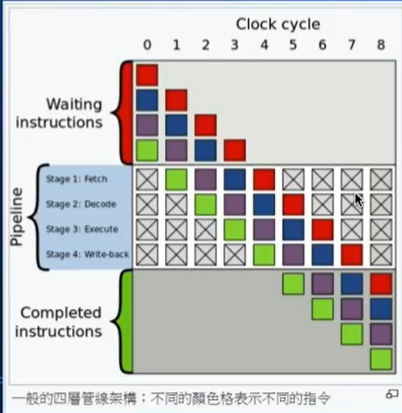

# 補充教材學習報告

參考資料: 

1. [如何設計電腦 -- 還有讓電腦變快的那些方法](https://www.slideshare.net/ccckmit/ss-85466673)
2. [除法運算](https://ithelp.ithome.com.tw/articles/10161144?sc=rss.iron) 
3. [電腦核心和執行序](https://jenifers001d.github.io/2020/08/04/%E9%9B%BB%E8%85%A6%E7%9F%A5%E8%AD%98/what-is-core-and-thread/)
4. [陳鍾誠教授的Gitlab](https://gitlab.com/ccc110/co/-/tree/master/x86/01-asm)
5. [x86的組合語言](https://gitlab.com/ccc110/co/-/blob/master/x86/x86%E7%9A%84%E7%B5%84%E5%90%88%E8%AA%9E%E8%A8%80.md)
6. [GNU Assembler Examples](https://cs.lmu.edu/~ray/notes/gasexamples/)
7. [Register & Assembly](https://ithelp.ithome.com.tw/articles/10227112)
8. [X86 架構](https://zh.wikibooks.org/zh-tw/X86_%E6%B1%87%E7%BC%96/X86_%E6%9E%B6%E6%9E%84)


>  nand2tertris電腦是由很多nand閘做出來的，要改進速度可以用以下方法


# nand2tertris電腦變快的方法

> nand2tertris電腦的記憶體是用暫存器做的，電腦會很貴。

> 電腦的記憶體大多是用DRAM做出來的，容量也比較大


1. 加入除法和乘法的電路

2. 加入浮點數的電路https://hackmd.io/@sysprog/c-floating-point

3. 把原本的鏈波進為加法器改成前瞻進位加法器

4. 其他加速技巧(現代電腦常用加速法)

   * 多層次快取

   * 平行(會被跳躍影響)

     1. 管線機制 (pipeline)
        * 用暫存器達到，讓每個部分可以同時做事

     2. 多核心 + Hyper-Threading
        * 每個核心都有自己的ALU(1core 1ALU)、快取、控制電路和暫存器，最後連接到MemorySystem

     3. 螢幕繪製交給顯卡(GPU)
        * GPU裡面有很多ALU(1core nALU)，在繪圖運算上比CPU快很多


> 下面會詳細說明上面的技術(除法和乘法的電路、浮點數的電路、其他加速技巧)

### 加入除法和乘法的電路

> 乘法可以用連加，但是這樣會比較慢，乘法使用&，會執行比較快
>
> 連加如果是 5*7 就要執行 7次，但用& 只要執行 log2取8 = 4次，數字大時執行次數明顯差很多
>
> 像是16位元的乘法 5 * 9999 要做 9999次，但用&就只要做16次，差了超多倍的速度

```
  5       0101
* 7       0111     
============================ & (0101與0111&) 
          0101
        0101
       0101
      0000
============================ + 上面相加
      0100011 = 35

我們HackCPU沒有移位，所以就用自己加自己，就可以移位
```


> 除法電路比乘法難一點..，把左移的變成右移

```

              0001    
             0001
            0000
           0000
          0000                              --> 相加，商 = 00000011 = 3 (商最終結果)
        ----------------------------------
  0010 |  00000111
       |   				
        ============================ & (0010與上面相乘)
          0000
           0000
            0000       # 上面全都是0
             0010      # 當數字1 遇到 上面的 1 ，開始相減，並記錄這個是商

         ============================ - 上面相加後與00000111相減
          00000011 = 3 (還可以除)
              0010
         ============================ - 上面相加後與00000011相減		
          00000001 = 1 (餘數最終結果)
```

>上面就是電路乘法和除法的邏輯，很簡單八


### 加入浮點數的電路

> 浮點數介紹

```
10.5 = 2^3 + 2^1 + 2^-1 = 1010.1 = 1.0101 * 2^3 (數字化成二進位後取變成類似科學符號的形式)
S(Significand): 這個值1代表為正數、0代表負數
e(exponent):  取2的n次方加上127，就是e的值(-127 < e < +128)， e從127開始加就是為了表示很小的數
m(mantissa): 紀錄小數點後的數字(由左到右) 
所以10.5的IEEE表示就是: 0 10000010 01010000000000000000000

|S|  e  |        m         |

|1|  8  |       23         | bit  單精度float

|1|  11 |       52         | bit  雙精度float

運算表示法 --> -1^S * 2^e * m (這邊e沒經過處裡，只是表示處裡過的最後結果)

d1 = -1^S1 * 2^e1 * m1
d2 = -1^S2 * 2^e2 * m2
```

* 浮點數的乘法(比較簡單)

  ```
  乘法:
  d1 * d2 = -1 ^ (S1+S2) * 2 ^ (e1+e2) + m1*m2
  
  |(S1+S2)|  (e1+e2)  |        m1*m2         | --> 得到的浮點數
  ```

* 浮點數的加法(比乘法麻煩)

  ```
  加法: 很麻煩，兩個數要一樣(位數)才能加
  
  d1: |S|  e  |        m1         |  
        |  3  | 
  
  d2: |S|  e  |        m2         |
        |  6  | 
        
  上面需要讓e相同，所以d1 要 * 2 ^ 3，相對 m 就會右移 3 位
  EX: 10.5 = 1.0101 * 2^3 = 0.010101 * 2^6
  從原本的  0 10000010 01010000000000000000000
  變成     0 10000013 00101010000000000000000
  
  可以看到，因為m右移了3位，導致前面的數值發生了改變，而這會造成浮點數運算的誤差!!
  
  d1 + d2 = -1 ^ (S) * 2 ^ (e) + m1+m2
  
  |S|  e  |        m1+m2         | --> 得到的浮點數
  ```

* 除法和減法和乘法加法類似


> 有了上面的乘法除法、浮點數運算電路後，可以讓速度變成原本的上千倍，甚至上萬倍!!


### 電腦架構

電腦大致分為兩種架構:

1. 哈佛架構: 指令記憶體分開，可以同時讀取和寫入
2. 逢紐曼架構: 指令和記憶體在一起


* 如果Data和program在同一個Memory是用逢紐曼架構
* Data和program不同地方是用哈佛架構
* A指令讓A register讀入(最前面一位元是0)，寫入A，C指令最前面一位元是1


現在的電腦兩個合體一起使用，就像下面的精簡文字圖


```
哈佛

           cpu
      I/O  Dmem  Imem

逢紐曼

           cpu
      I/O       Mem
			
現在電腦

           CPU
      I/O      Dm
                  Mem
```

> 接下來下面要講現代電腦常用的加速法


#### 多層快取

> 利用多層的快取，存取不同類型的資料，不同的緩存級別適用於不同的目的和限制，可以讓電腦節省電量，也可以提升速度。

>程式的區域性要寫得好，不然會讓cache一直miss，原本使用L1 cache變成使用DRAM，速度會差超多

> 快取也可以放在core裡面提升速度


### 平行

* 管線機制 (pipeline)

  * 使用暫存器做到把電路分成不同部分，讓每個部份都可以做自己要做的事情，不會一個處裡完下一個才接著動作，每一個區塊執行不同指令

  * 下面X的部分是管線泡泡，會降低多工的效能，一般管線都會有這個泡泡，如何讓每個部件同時執行數量達到最大，就是管線機制最需要學習的地方。

    

  * 如果分成4個管線，那效能最高就可以提升4倍!!


* 多核心 + Hyper-Threading
  * 上面的pipeline是在軟體上把程式分成不同的部分分開執行即便處理器只能執行一個執行緒，作業系統也可以通過快速的在不同執行緒之間進行切換，由於時間間隔很小，來給使用者造成一種多個執行緒同時執行的假象。Hyper-Threading則是在硬體放面讓每個核心可以分別獨立地執行程式或執行緒 (thread) 指令
  * 每個核心都有自己的ALU(1core 1ALU)、快取、控制電路和暫存器，最後連接到MemorySystem
  * Hyper-Threading: 1個core分成兩個核心，可以在其中一個輸出入時，另外一個用ALU做運算


* 螢幕繪製交給顯卡(GPU)
  * GPU裡面有很多ALU(1core nALU)，在繪圖運算上比CPU快很多


> 以上的平行機制都可能會被JMP指令給打斷，如果資料不在L1 快取，就會無法順暢進行

# x86組合語言

> 要先安裝msys codeblock，也可以安裝wsl

> wsl好處是直接可以和windows共用檔案，而且速度比virtual box 快很多

msys64可以使用linux上的東西


```
使用下面的指令裝git套件
pacman -S gcc git make
```


### 組合語言

```
git clone https://gitlab.com/ccc110/co.git

對裡面的程式碼進行測試

```


> 組合語言程式碼的hello world

```assembly
# ----------------------------------------------------------------------------------------
# Writes "Hello, World" to the console using only system calls. Runs on 64-bit Linux only.
# To assemble and run:
#
#     gcc -c hello.s && ld hello.o && ./a.out
#
# or
#
#     gcc -nostdlib hello.s && ./a.out
# ----------------------------------------------------------------------------------------

        .global _start

        .text
_start:
        # write(1, message, 13)
        mov     $1, %rax                # system call 1 is write
        mov     $1, %rdi                # file handle 1 is stdout
        mov     $message, %rsi          # address of string to output
        mov     $13, %rdx               # number of bytes
        syscall                         # invoke operating system to do the write

        # exit(0)
        mov     $60, %rax               # system call 60 is exit
        xor     %rdi, %rdi              # we want return code 0
        syscall                         # invoke operating system to exit
message:
        .ascii  "Hello, world\n"
```


```assembly
# helloMacros   
        
        .include "../myMacro.s"  # 呼叫巨集
        .global _start

        .text
_start:
        WRITES $1, $message, $13
        EXIT
message:
        .ascii  "Hello, world\n"
```

```assembly
# myMacro.s

.macro WRITES fd, msg, len    # 定義巨集WRITES，讓別人一行就可以呼叫(組合語言的模組化)
  mov     $1, %rax            # system call 1 is write
  mov     \fd, %rdi           # file handle 1 is stdout
  mov     \msg, %rsi          # address of string to output
  mov     \len, %rdx          # number of bytes
  syscall                     # 呼叫系統執行
.endm                         # 巨集結束點

.macro EXIT
  mov 	$60, %rax
  xor	%rdi, %rdi
  syscall
.endm

.macro PUTS msg
  mov   \msg, %rdi
  call  puts
.endm


.macro PRINTF fmt, p1
  # We need to call printf, but we are using eax, ebx, and ecx.  printf
  # may destroy eax and ecx so we will save these before the call and
  # restore them afterwards.

  push    %rax                    # caller-save register # 把暫存器的東西放到stack
  push    %rcx                    # caller-save register

  mov     \fmt, %rdi              # set 1st parameter (format)
  mov     \p1, %rsi               # set 2nd parameter (current_number)
  xor     %rax, %rax              # because printf is varargs

  # Stack is already aligned because we pushed three 8 byte registers
  call    printf                  # printf(format, current_number)

  pop     %rcx                    # restore caller-save register # 把stack最上面的放到暫存器
  pop     %rax                    # restore caller-save register
.endm
```

* 存變數到x86處理器裡面要照順序放
* 1.  rdi,  2. rsi  3. rdx, 4. rcx, 5. r8, 6. r9
  2.  如果上面暫存器都被填滿了，就把資料丟到stack裡面


- rax 特殊用途：存放運算結果，執行乘法及除法指令時，會自動使用
- rbx 特殊用途：基底定址法的基底暫存器
- rcx 特殊用途：做迴圈的計數器
- rdx 特殊用途：資料暫存器
- 通常上面4個是最容易被修改的


```assembly
# fib.s

# -----------------------------------------------------------------------------
# A 64-bit Linux application that writes the first 90 Fibonacci numbers.  It
# needs to be linked with a C library.
#
# Assemble and Link:
#     gcc fib.s
# -----------------------------------------------------------------------------

        .global main

        .text
main:
        push    %rbx                    # we have to save this since we use it

        mov     $90, %ecx               # ecx will countdown to 0 # 32bit
        xor     %rax, %rax              # rax will hold the current number
        xor     %rbx, %rbx              # rbx will hold the next number
        inc     %rbx                    # rbx is originally 1
print:
        # We need to call printf, but we are using eax, ebx, and ecx.  printf
        # may destroy eax and ecx so we will save these before the call and
        # restore them afterwards.

        push    %rax                    # caller-save register # 64bit
        push    %rcx                    # caller-save register

        mov     $format, %rdi           # set 1st parameter (format)
        mov     %rax, %rsi              # set 2nd parameter (current_number)
        xor     %rax, %rax              # because printf is varargs

        # Stack is already aligned because we pushed three 8 byte registers
        # 使用C語言函示庫
        call    printf                  # printf(format, current_number)

        pop     %rcx                    # restore caller-save register
        pop     %rax                    # restore caller-save register
		
		# fn-1 = fn-2
        mov     %rax, %rdx              # save the current number    # rdx = rax
        # fn = fn-1
        mov     %rbx, %rax              # next number is now current # rax = rbx
        # fn = ((fn-1)+(fn-2))
        add     %rdx, %rbx              # get the new next number  # rbx += rdx
        dec     %ecx                    # count down               # ecx--
        jnz     print                   # if not done counting, do some more # goto print

        pop     %rbx                    # restore rbx before returning
        ret
format:
        .asciz  "%20ld\n"
```


> 用C語言呼叫組合語言，通常用在一直用的函式，讓速度變快

```assembly
# maxofthree.s

# -----------------------------------------------------------------------------
# A 64-bit function that returns the maximum value of its three 64-bit integer
# arguments.  The function has signature:
#
#   int64_t maxofthree(int64_t x, int64_t y, int64_t z)
#
# Note that the parameters have already been passed in rdi, rsi, and rdx.  We
# just have to return the value in rax.
# -----------------------------------------------------------------------------

        .globl  maxofthree
        
        .text
maxofthree:  # 使用label讓C可以用
        mov     %rdi, %rax              # result (rax) initially holds x
        cmp     %rsi, %rax              # is x less than y?
        cmovl   %rsi, %rax              # if so, set result to y
        cmp     %rdx, %rax              # is max(x,y) less than z?
        cmovl   %rdx, %rax              # if so, set result to z
        ret
        
# rdi --> z, rax --> y, rsi --> x
```

```C
/*
 * callmaxofthree.c
 *
 * A small program that illustrates how to call the maxofthree function we wrote in
 * assembly language.
 */

#include <stdio.h>
#include <inttypes.h>

int64_t maxofthree(int64_t, int64_t, int64_t);

int main() {//(x,y,z)
    printf("%ld\n", maxofthree(1, -4, -7));
    printf("%ld\n", maxofthree(2, -6, 1));
    printf("%ld\n", maxofthree(2, 3, 1));
    printf("%ld\n", maxofthree(-2, 4, 3));
    printf("%ld\n", maxofthree(2, -6, 5));
    printf("%ld\n", maxofthree(2, 4, 6));
    return 0;
}
```


> 接收終端機指令 rdi接收argc， rsi接收argv[]，類似int main(int argc, char *argv[])


## C補充介紹

>  教學網站: https://gitlab.com/ccc110/co/-/tree/master/c

``` 
//執行C -o 是輸出檔命名
gcc ??.c -o ???
// 執行檔執行
./???

//C語言轉組合語言
    sgcc -S ??.c -o ??.s
--> riscv64-unknown-elf-gcc -S add.c -o add.s

// 一次編譯兩個檔案
gcc hello_main.c hello.c

// 讓C可以用include<???.h> 而不是 include"???.h"
gcc -i hello.c -i hello_main.c
```

### C pointer

```C
char *i = 1;  // 宣告 *i 是在記憶體 1 的位置
*i = 1  // 記憶體值修改，改成1 // 在位置1
i = 2  // 記憶體改在 1 的位置
*i = 1  // 記憶體值修改，改成1 // 在位置2
```


> C語言主要寫作業系統，或是跟linux配合

> C語言要限制長度，不然會被hacker溢位攻擊

```C
char name[20]
sscanf("name:john age:40 tel:082-313530", "%8s", name);
printf("%s\n", name);
```


> 參數傳遞不要都用指標，如果有很多參數都要修改回傳，那就把它做成結構


> assert用來偵錯，開發專案最好自己寫assert


### C 呼叫函數

```C
#include <stdio.h>

void hello() {
  printf("hello !\n");
}

void call(void (*f)()) {
  f();
}

int main() {
  call(hello);
}

```

> 設定可以傳入任意類型的函數

```c
void test(void *)
```


> ...是變動參數，可以放入多個，這個只能在define(聚集)裡面用

```C
#define test(cond, ...) /*...是變動參數，可以放入多個，這個只能在define裡面用*/\
  if (!(cond)) { \
     printf("Error: at FILE=%s LINE=%d\n", __FILE__, __LINE__); \
     printf("  Check:%s but ", #cond);\
     printf(__VA_ARGS__);/*代表...的值*/\
     printf("\n"); \
  }
```


> ...放在函式裡面要用valist呼叫，詳細上網查

```C
void test(...){
	valist ap;
	
}
```


> \#ifndef __XXX__ #define __XXX__ ... #endif
>
> * 引用防護，可以避免重複宣告
>
> \#pragma once
>
> * 引用防護，引用一次

> `#define SQUARE(x) (x*x)`  應該寫為  `#define SQUARE(x) (x*x)`


### C main傳參數

````C
#include <stdio.h>
		// 有幾個字   //傳入的值(存在陣列裡)   // 得到的是終端輸入
int main(int argc, char *argv[]){
	for(int i=0; i<argc; i++){
        put(argc[i])
		//printf("%s\t", argc[i])
	}
}

// input 
// a b c 1 2 3
// output
// a	b	c	1	2	3
````


### Debug

* gcc 總是加上 -Wall 

* 安裝msys2

* 安裝WSL --> 先設還原，不然可能windows會壞掉(這個可以先不裝)

  


