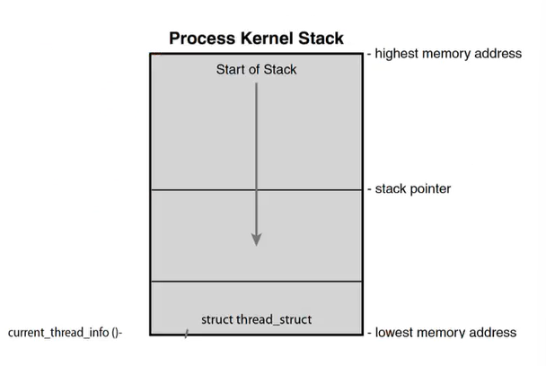

# Computer_System_Organization

> **Computer Organization**

Introduction: ==Computing== devices, ==memory== devices (e.g., DRAM), and ==I/O== devices (e.g., HDD, SDD, or network devices) are three main basic components.

電腦由三部分組成: Compute (CPU), Memory (DRAM, NVM), I/O (HDD,SSD)

Von-Neumann Architecture(馮諾伊曼架構):

* CPU ==fetches== an instruction from memory.
* Then, CPU ==decodes and executes== the instruction.
* CPU fetches next data (==Automatically Increment PC==).

CPU 無法 JUMP，只能持續進行

sequence of instructions

```
pc -> inst1 (Control Unit；pc)
   -> inst2
      inst3
      ...
```

CPU only does routine work


Challenges without Operating Systems:

* CPU will be solely occupied by one process. (==**Sol: Process Scheduler**==)
* CPU shall wait for I/O devices. (1 ns vs 100 us). (==**Sol: Page Fault Handler & Context Switch**==)
* CPU cannot understand ”file” in I/O devices. (==**Sol: Device Driver & File System**==)


> **Roles of Operating System (OS)**

Software: the collection of programs, data, and instructions

Goal: A software layer (middleware) stands between applications and computer’s hardware. The role of an OS is to ==coordinate== and ==manage hardware devices==. (e.g., CPU, memory, storage devices).

OS’s Roles:

* Transparency: User do not need to worry about ==hardware management or contentions.==
* Resource Allocator: ==Manage== CPU time, memory space and I/O resources.
* Control Program: ==Prevent errors== and improper use of computers.


Well-Known Components:

* Process Scheduler: Fairly allocate CPU resources to applications. 
* Memory Manager: Allocate memory, locate pages (pages 像是 virtual memory), reclaim memory (程序中斷，需要回收記憶體).
* Block I/O Layer: Manage I/O requests(Merge & Schedule I/O)；與底層裝置互動
* File System: Locate file contents, partition devices, control permission.；與使用者互動


> **What is Linux Kernel**

Linux Kernel: A process manager consists of a ==bunch of C and Assembly code==.

Is Linux Kernel a Process: ==No==, Not exactly.

* Each process shall have their own virtual address space.

  Physical Address Space，主要是使用只有 4 KB 的 Page Fame (實體 DRAM)，然後透過 Process 的 Virtual Address Space mapping 到 4 GB 的位置上(現在 64bit 不只 4GB)，所以現在編寫程式碼不需要在意 Physical Address Space。

  可以把 DRAM 上面的資料轉移到 Storage(HDD, SSD)，這種步驟叫做 Swap，通常在記憶體不足的時候使用，原本在 Virtual Address Space 的資料不動，底層透過呼叫 `pte_to_swap_entry()`，來達到轉移的效果

* Kernel runs as ==part of a user process.==(*Noting:* ==*A specific* *part*== of all processes virtual address space ==*points to the same physical address*==  *storing kernel code.*)

  

  以 4 KB 而言 kernel 佔 1 KB，在使用 systemcall 就需要使用 Kernel address

  當想要切換像是記憶體管理、scheduling時，很常會需要 context switch，導致效能很差，所以 Linux 會 share virtual address space，讓所以 Process 可以存取。如果 Linux Kernel a Process 那會讓系統變很慢

  

  CPU 在 User mode (mode is a bit；在一個 mode 就只能使用那個 mode 裡面的東西) 的時候，通常會是 0，但當遇到 Page Fault，會切換成 Kernel Mode，使用 Kernel 裡面的 Page Fault Handler 處理

  CPU 可以透過 一個 bit 決定要存取哪裡的記憶體，同樣的 Process，可以透過 CPU 存取 Kernel Mode 和 User Mode 的記憶體

  CPU 在作業系統很重要， intel 和 Mirosoft 對 Linux 貢獻蠻多的

* There are also some kernel processes working on monitoring system status. (Daemon；守護程式)

==**Noting: CPU switches to kernel mode to access OS code. But, CPU does not need to switch the context!**==

我們一般寫的程式碼都是存在 User Space，要呼叫特殊功能才會切換到 Kernel space

像是如果發生 Page Fault，就會切換到 Kernel space 呼叫 Page Fault Handler

CPU 切換到 Kernel Mode 很簡單，因為他是使用一個 bit 存狀態

> **How to Trigger/Request Kernel Services**

When Do CPUs Run Kernel: CPUs runs the kernel only when ==some special events are triggered==. Otherwise, it runs user programs or stays idle.

Special Events:

* Hardware interrupts (Alerting signal)
  * Timer interrupt (Process 使用太久)
  * I/O Interrupt (e.g., Keyboard, Hard Disks)
  
* Software-generated interrupts (==Traps or Exceptions==) 
  
  CPU only do routine work(User Process)，所以需要 interrupt CPU，然後執行 OS 系統。或是 Page Fault 的時候，需要提醒 CPU 切換到 Kernel mode，去執行 Page Fault Handler
  
  * Specific requests from user processes (==System Call, such as Read/Write==)
  
    system call 使用時機: 讀寫文件
  
    Process 在執行 system call 的時候，CPU 會切換到 Kernel mode，之後再回到 user mode。如果現在遇到 Timer Interrupt，就要執行 context switch，先到 Kernel mode，然後切換到 Process B，之後再回到 User Mode
  
  * Some errors (e.g., invalid memory access or ==page faults==)

我們有一個 process A 在 user mode，呼叫 systemcall 就會切到 Kernel mode，做完事情後就會回到 User Mode，如果要切換到另外，會呼叫 Timer Interrupt ，切換到 Kernel mode，Scheduler 會 Context switch 到 Process B，然後再回到 user mode，I/O interrupt 也需要切到 kernel mode  呼叫 I/O handler

> **Put it all together: A High-Level Overview**

我們不需要知道 實體位置，只需要透過 Library 就可以執行程序


* User Space: 
  * Applications (e.g., TensorFlow, Hadoop, Databases, Pytorch)
  * Libraries (e.g., C/C++ Library à Does Memory Allocation )

* Kernel Space:
  * Device Drivers (Contact with I/O devices)
  * Core Kernel
    * Process Management
    * Memory Management
    * I/O Management

> **Emerging I/O Technologies**

Throughput (一秒鐘可以完成多少事情)、latency (接收事件的延遲)

| year     | technologies                                 | device                                        |
| -------- | -------------------------------------------- | --------------------------------------------- |
| 2011     | High Throughput (no sql data；cannot log in) | NVMe M.2 SSD、NVMe U.2 SSD、NVMe PCLe SSD     |
| 2017     | Ultra-Low Latency (2 data base)              | Intel Optane SSD、Samsung Z-NAND SSD          |
| 2017~now | Storage-Class Memory (ML)                    | Intel Optane DC Persistent Memory、HPE NVDIMM |
| now      | Faster Data Buses                            | PCI EXPRESS                                   |

​          

> **System** **Trend – Rethinking OS**

SRAM 存在 CPU 裡面，DRAM 就是記憶體


* The device trend ==blurs the boundary== between memory and storage

* Storage response time catches up with ==context switch overhead (1~10 us).==

* The overhead of running ==file system== becomes critical (e.g., page cache).

* Huge memory demands increases deployment cost. (Right page size?)

  通常 page size 落在 4 kb or 8 kb，page size 通常不會有超過的大小，後面會介紹 (W5)


```
userspace-> [Applications] <-> [C Library]
  ↕ system calls ↕
Kernel space-> [Core kernel <-> Device drivers] <-> [Hardware]
```


```
Networking               <-> Device Drivers
                                 ↕
VFS(virtual file system) <-> Filesystems
       ↕                         ↕
______________________________________________
   memory mgmt                Process mgmt
______________________________________________
         Architecture specific code
```


# overview

> **Process** **&** **Interrupt**

Process

* What is a Process, Process Descriptor, Process State Diagram (Process’s Life Cycle)
* Multiprogramming and Multitasking, Context Switch

CPU Scheduling:

* Priority, Time Slice
* O(N) (Linux 2.4 ~ 2.6) 
* O(1) SCHED_Normal (Linux releases 2.6.0 thru 2.6.22 )
* Completely Fair Scheduler (CFS) (After Linux 2.6.22)
* Real-Time Scheduling

Interrupts:

* Software Interrupt: How system call works. Also, how to implement it.
* Hardware Interrupt: How interrupt handler (or interrupt service routine) works.

Advance Research Topics:

* (1) Rethink context switch 
* (2) Rethink process state diagram


> **Main Memory Management**

Physical Memory

* Physical Memory Allocation (Buddy System)
* Slab Layer

Virtual Memory

* Paging (Page Table Walk), Huge Page
* Page Fault Handler
* Page Replacement (LRU and others)
* Swapping 

Memory Hierarchy (Cache vs Memory vs Storage)

* Design concerns for each layer
* Non-Uniform Memory Access (NUMA)

Advance Research Topics: 

* (1) Main Memory Extensio
* (2) Rethink page size 
* (3) Rethink page fault handler


> **I/O Devices &** **I/O** **Systems**

How data stored in I/O devices:

* NAND-Flash-based Solid State Drive (SSD)
* Hard Disk Drive (HDD)
* Shingled Magnetic Drive (SMR)

Device Driver

* More about interrupts: Top-Halves vs Bottom-Halves
* How to write a device driver

Block I/O Layer

* What is BIO
* Merge and Coalesce I/O Operations
* I/O Scheduler

Advance Topic:

* NVMe Protocol
* Device Mapper


> **File** **System**

Virtual File System

File System

* Organization (Files & Directories)
* Interface (Functions)

Page Cache

* Cache Eviction (Linux Two-List Strategy)
* The Flusher Threads

Memory Mapping (mmap)

Advance Research Topic:

* In-Memory File System


> **Applications** **(Optional)**

Graph Systems

* How to run graph system on personal computer (GraphChi)
* How to process dynamic graph (GraphOne)

Deep Recommendation System

* General Recommendation System (Facebook DLRM)
* GNN-based Social Recommendation System (Jindong GraphRec)

Key-Value Database (For Storage)

* Log-Structured Merged (LSM) Database (Google)
* LSM on SSDs (WiscKey)
* Learned Index

Data Center (Cloud) Computing

* Data Deduplication
* In-memory File System
* Distributed File System (Ceph)

Virtualization Concepts


# **Process** **&** **Interrupts**

> **Task Lists & Process Descriptor**

下圖是 process 的 structure


Process: an ==active program== and related ==resources==, such as processor state, memory address space.

Task Lists: A list of ==process descriptors== (PCB) in a ==circular doubly linked lists.==

每一個 process 都只有它們唯一的 Pid

PCB (Process Control Block = Process Descriptor)

Process 複製以後，page table 會直接複製一個新的，雖然有些資訊會跟 parent 一樣，但是重複的地方資料並不共享


Process Descriptor (task_struct): Contains all information about a process.

* Process ID (pid): A ==unique process identification== value
* In Linux, XXX Descriptor ==means the data structure== for maintaining information for XXX. (IO Descriptor 、file Descriptor. All is process)
* Process Control Block (A ==general== name；PCB)  Process Descriptor (==Linux Implementation==, task_struct)


> **How Kernel accesses a Process Descriptor**



* A thread_info is stored at the ==bottom of the kernel stack.== (Easier to Access)

* Size of kernel stack: static 2 ~ 3 pages (4KB)
* ==Dereferences== the task member of ==thread_info== to ==get the pointer== of the task_struc
  * 可以透過 process 的 data structure 更改不同的 process


> **Process State**

一樣存在 Process 的 structure 裡面

The ==state field== of the process descriptor describes the current condition of the ==process== (In one of the ==five== states)

* Task_Running: ==Runnable==, either running or on a run-queue. (The only state for a process executing in user-space)
* Task_Interruptible: ==Sleeping== (i.e., blocked), waiting for some condition.
* Task_Uniterruptible: ==Sleeping, does not wake up== even receives a signal. (Kernel thread will manage it periodically)
* __Task_Stopped: Execution has stopped. (SIGCONT to resume；`kill -9 PID`)
* __Task_Traced: Processes traced by a Debugger.


> **Process State Diagram**


Process 運行如同上面的表格，中間某些事件觸發，都需要運作在 Kernel mode 下

* 圖片解釋
  * Ready: can run the process
  * scheduler dispatch: you can run 
  * interrupt: go to ready or waiting (use lot time or using cpu)
  * task Interruptible: 回到 ready
  * Uniterruptible:比較特殊，下禮拜再講


> **The Process Family Tree**

* The first process: All processes are ==descendants of the init process== (PID 1)
* How to accesses one’s parent or children: Use the parent or the children pointer provided by the process descriptor (i.e., task_struct), respectively.
* How to access other processes: By traversing through the task_list.
* process 都是從第一個開始，然後一直 fork()，創造出新的 process，PID 會越來越大，process structure 裡面會有 parent 的資訊 (pointer)


