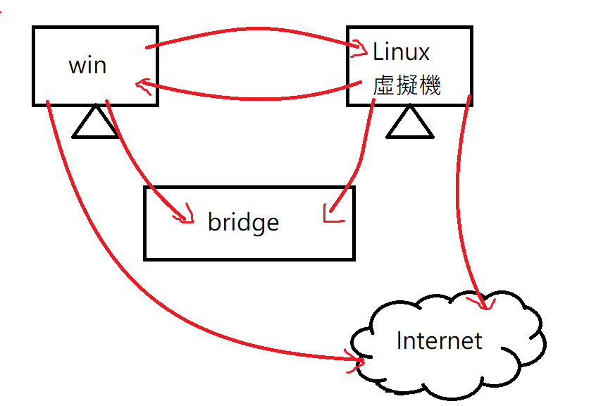
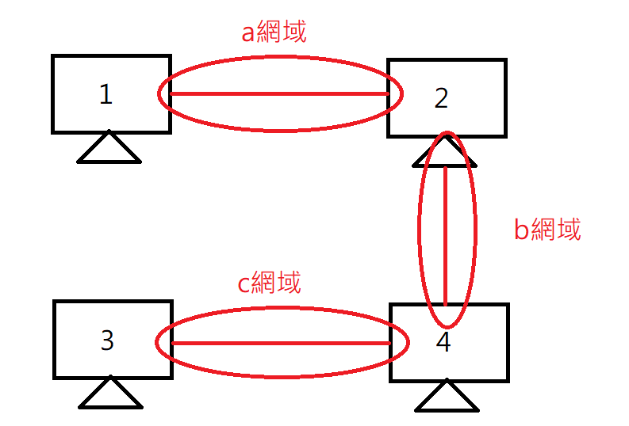
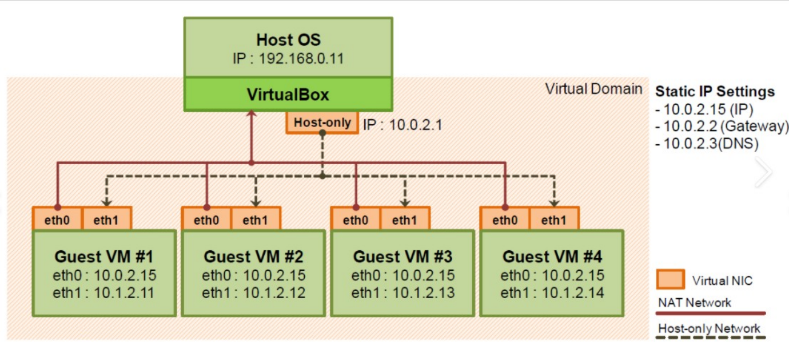

#### 遠端操作

把Remote Display裡面選項打開(Enable Server)，把預設Server Port替換，再把Allow Mutiple Connections打開，就可以進行遠端桌面操作

在開始打開mstsc，可以進行遠端桌面連結(可以圖形化的操作)，用本地連結(127.0.0.1:your port)

#### Network

> 預設的網路型態是NAT模式，以下是其他網路型態介紹

* NAT:

    * 在不同私有網路，就算同IP，也無法通訊(因為外面連不進去)
    * 私有網路就是使用NAT，連到外網
    * 虛擬機(Linux)可以連到物理機(win)，物理機連不到虛擬機(物理機在外面，虛擬機在內部私有網路)
    * 虛擬機透過虛擬網卡再連到虛擬NAT設備(類似Router)，在連到物理機

* Bridged Adapter: 

  * 讓自己的機器和虛擬機可以互連(IP位置經過網路遮罩後相同，可以互ping)

  * 可以直接連到網路上(虛擬機跟網際網路上任何節點地位相同)

  * 這種模式下Linux主機可以當作Server

  * 需要選擇真正連線到的網路(ethernet、 wifi ....)

    

* Internal Network: 虛擬機只能和虛擬機通訊，且一定要在相同區域網路下(IP要手動設定)，這個是封閉式網路，無法連上網

    

    

* Host-only Adapter: 會產生一張虛擬的網路卡，不過只能本地互連，虛擬機無法連到外網，

* NAT Network(Vmware 的NAT就是用這個): 只要在同一個網域內開虛擬機，虛擬機就可以互相通訊(NAT network)，NAT 的虛擬機無法互相通訊

> 推薦使用的虛擬機網路類型: NAT + Host-only Adapter

virtual box 裡面有4 張網路卡，需要只要在設定按下Enable Network Adapter

單用bridged mode有時候會不太穩定，所以使用下面的模式

第一張網路卡使用: NAT(讓虛擬機可以連上網路)

第二張網路卡使用: Host-only Adapter(讓Windows可以跟虛擬機進行通訊)

#### 指令

* 關機指令: `halt -p ` 、  `poweroff` 、`shutdown`，-p是代表poweroff

* 變成超級管理者: `su` (change to super user)
* 切換資料夾: `cd`

* shutdown: 默認情況為1分鐘後關機，+n表示 n 分鐘後關機，在這個過程中 shutdown -c 可以取消。 shutdown -h now 表示立即關機，shutdown -r 可以讓電腦重啟。
* `gedit a.txt` 可以編輯檔案內容，用圖形化介面，如果沒有檔案就創建
* `cat a.txt` 、`more a.txt` 、`less a.txt`可以查看檔案內容
* 查看網路信息: in linux `ifconfig` 、 in windows `ipconfig`

不同作業系統發出的指令不一樣

* Linux ping: 會一直持續，直到按下ctrl+c，封包是64bytes
* Windows ping: 會執行4次，封包是32bytes

可以clone一個虛擬機，選擇Generate new MAC addresses for all network adapters，看存儲空間夠不夠，不夠可以選Link clone

#### export env

export Virtual machine，可以將自己的環境給出去，讓其他人可以使用，點選Virtual Box的file/export application，再選指定的虛擬機，就可以打包成eva檔，別人就可以擁有一樣的虛擬機(匯出的虛擬機VM ware和 Virtual Box都可以用)

可以使用快照(SnapShot)，讓系統還原到存快照的時間點，當系統損毀或是發生問題，可以選擇快照還原

