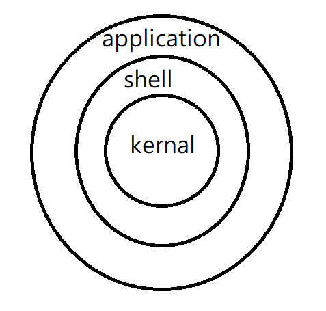

#### Linux 發行版本

centos: 主要架設伺服器，中小型公司使用，遇到問題自己解決、RedHat是一家公司研發的，通常都是大公司使用，如果出現錯誤可以請人來修、ubuntu: 用來做研究，另外還有Fedora、SuSE、Debian

Linux 作業系統的核心(kernal)都是一樣的，發行版本(distributions)不一樣是因為外面的shell和application不一樣，這也導致不同的LInux的部分指令有些不一樣



Linux看到副檔名是.x86_64 是可以給 64 bits 作業系統使用的，從cenos7之後，作業系統都是64位元的(Linux副檔名是參考用的，沒有實際功能)


> 查看 kernal 詳細資訊: 

* 切換資料夾: `cd /boot`
* 列出裡面的內容: `ls vmlinuz* -l` 
  * *代表任意字符重複0次獲0次以上
  * 這個指令可以找到 前面是vmlinuz ..... 的文件
  * -l 代表顯示內容詳細情況


> 查看 shell 詳細資訊

* 尋找shell的環境變數: `echo $SHELL`

  


使用Linux opensource的東西，必須要持續的公開，使用GPL(Generl Public License)，如果沒有加上Licence，有可能會被別人告


#### shell programming

下面介紹簡單的腳本程式開發

```
// &代表在背景執行，代表可以一邊操作終端，一邊使用gedit開的程式
gedit a.sh &    // 創建一個檔案，把指令輸入到裡面 -> echo "hello world"
bash a.sh       // 執行命上面的檔案
ls -l a.sh      // 查看檔案內容(權限、創造日期...)
chmod +x a.sh   // 給文件加上執行權限
./a.sh          // 執行檔案 (如果要使用a.sh呼叫，要把文件放到環境變數下面)

mv a.sh /home/user/bin  // 移動到環境變量下
a.sh
// 當在終端輸入指令時，會從環境變量開始找，再找shell的Linux隱藏指令(不會用檔案形式出現，找不到命令對應的執行檔)，都沒找到就會顯示 command no found
```


* `-rwxr--r--` : 使用`ls -l` 可以看到文件權限
  * 第一個字符: -代表是一個檔案，d代表是文件夾
  * 後面的可以分為3組: `rwx` 、`r--`、`r--`，分別是owner權限，owner group權限和其他人的權限
  * r代表可讀，w代表可修改，x代表可以執行


#### Linux 指令

* 查看Linux 版本: `uname -r`， 使用`uname -a` 可以查看到更多資訊

* 查看某個變數的值:
  * `echo $USWE`、`echo $PWD`
  * 可以自訂義一個變量 `a=6`  ， `echo $a` ，叫出的值
* 如果應用無法安裝，可以試試下面指令: `rm -rf /var/lib/dpkg/lock-frontend`
* 修改密碼(需要超級使用者權限):  `passwd username`
* 新增使用者(需要超級使用者權限): `useradd username`
* ssh登入: `ssh username@localhost`，之後輸入密碼就可以登入其他使用者


重制root密碼: https://autumncher.pixnet.net/blog/post/462809249-%E3%80%90centos7%E3%80%91%E5%A6%82%E4%BD%95%E9%87%8D%E7%BD%AEroot%E5%AF%86%E7%A2%BC-(how-to-recover-root-pas

1. 在進入開機選單畫面後，選項停留在第一個，然後按`"e"`，進入編輯模式
2. 進入編輯模式以後，在 linux 16 /boot/vmlinuz... 的結尾(可按End直接 到結尾)行，**空一格**，然後輸入`rd.break`。接著按 `Ctrl + X` 啟動系統，則會進入 switch root stage。
3. 重新掛載/sysroot讀寫 (remonut /sysroot to rw)      `mount -o remount,rw /sysroot/ `
4. 使/sysroot成為根目錄 (chroot to /sysroot)      `chroot /sysroot `
5. 修改 root 密碼 (change password of root): `passwd` 輸入完新密碼以後執行下面步驟
   * 方法一：多打兩行指令，重開機比較快(建議)： 載入 SELinux 策略     `load_policy -i` 在     `/etc/shadow` 中設定上下文類型     `chcon -t shadow_t /etc/shadow` ，輸入 `exit` 離開，等待重開機完成即可使用新密碼登入系統。
   * 方法二：少打兩行指令，重開機要等比較久(自動重建label) `touch /.autorelabel`，輸入 `exit` 離開，等待重開機完成即可使用新密碼登入系統。

