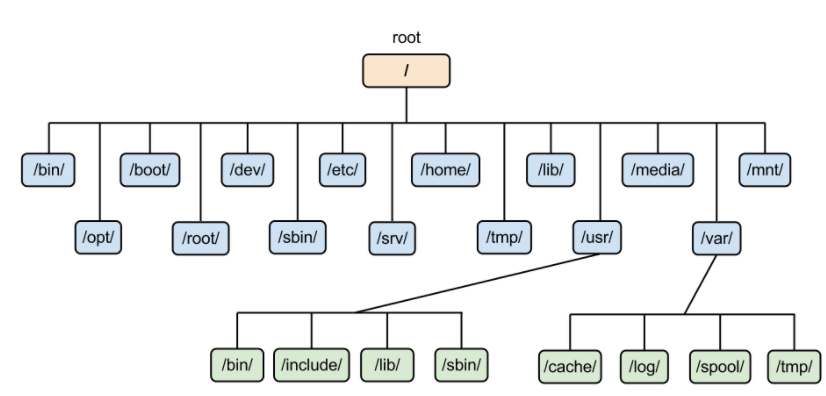

在工作場合中，通常是先知道Linux的IP是多少，用putty或是遠端登入Linux(在職場上使用xshell登入)

# file system

> windows下的file system有3種

|       | 優點                                                         | 缺點                                                         |
| ----- | ------------------------------------------------------------ | ------------------------------------------------------------ |
| FAT32 | 適用於Windows、Mac、Linux作業系統和遊戲機所有版本，以及幾乎所有具USB接口使用裝置。 | 單一存檔小於4G                                               |
| NTFS  | 適用於所有版本的Windows，在一般情況下Mac OS只能讀取檔案，而在一些Linux發行版系統中也只能讀取。 | 在Mac、Linux作業系統上使用只能讀取檔案，需另外下載軟體才能寫入檔案。 |
| exFAT | 基本上與所有版本的Windows和現代版本的Mac OS 兼容，在Linux上需要其他軟體輔助。 | 同樣作業系統的電腦裝置，穩定性仍不完善，可能會發生其中一OS能夠讀取而另一OS則無法讀取的情況。 |

在linux系統下的檔案系統有很多: ext2、ext3、ext4、xfs...

## 磁碟分割(hard disk partition)

分割有3種: primary、extanded、logic

最基本的可以把硬碟分成4分P(C、D、E、F)，如果想要進行管理，可以使用PPPE，E下面可以裝很多L，分成更多槽

linux進行磁碟分割時，至少會占用2個磁碟分割區(P+P、P+L)，一個是根目錄(/)，一個是swap

swap可以讓應用程式使用虛擬硬碟，讓應用程式可以使用大一點的記憶體(速度比較慢)，當應用程式寫入到虛擬記憶體時，虛擬記憶體會把資料給真正的記憶體，系統程式後面會提到(page、least、used、first)

linux可以為了某些原因，而把一些資料夾放到別的磁碟空間下面，Linux使用VFS(Virtual file system)，可以把新的東西放在舊的上面，讓使用者先看到新的，舊的會被隱藏

這種技術，讓使用者在操作上完全一樣，但是在底層的操作上是完全不一樣的

* /: 根目錄，所有的目錄、文件、設備都在/之下， /就是Linux文件系統的組織者，也是最上級的領導者
* /bin: **存放二進位文件**，在一般的系統當中，都可以在這個目錄下找到Linux常用的命令。系統所需要的那些命令位於此目錄。以後可以自己寫C，可以放到bin裡面，就可以多一個執行命令
* /sbin: 這個目錄是用來存放系統管理員的系統管理程序。大多是涉及系統管理命令的存放，是超級權限使用者root的可執行命令存放地，普通使用者無權執行這個目錄底下的命令
* /boot: Linux的內核及引導系統程序所需要的文件目錄，放文件的映象檔
* /dev: 在這個目錄中包含了所有Linux系統中使用的外部設備。但是這裡不是放的外部設備的驅動程式(驅動程式可以讓硬體和操作系統可以更好的配合)，Linux裡面的驅動程式很齊全，大多不用額外安裝
* **/etc**: 存放配置文件，每個軟體通常會有，像是個人偏好，設定之類的都會在這裡，管理員權限，系統變量設定...
* **/home**: 裡面放每個使用者的文件夾(存放使用者的主目錄)，root比較特別直接在根目錄底下
* /lib: 存放函式庫(C語言)
* /media: 存放光碟內容
* /mnt: 掛載第三方文件
* /opt: 安裝軟體
* /proc: 安裝虛擬文件
* /root: 權限最高的使用者，第一個創建的使用者，天然就存在的
* **/user**: 安裝某個軟體，只對某個使用者，就會把資料放到這個資料夾底下
  * /bin: 存放可執行文件
  * /lib: 存放函式庫
  * ........
* **/var**: 存放臨時文件，紀錄或變動型檔案，數據庫的文件會大量使用

## Linux系統載入

Linux開機先載入BIOS，檢查硬體設備後，再使用GRUB啟動軟體，最後將Linux 的核心載入，再執行systemD，啟動服務程式(linux第一支程式改成systemD了，不過很多embedded program使用的第一支程式還是init)

在系統啟動時，可以選擇runlevel，可以修改root密碼的地方就式runlevel1，下面是runlevel介紹

| 啟動模式   | 說明                                | 是否在系統設定 |
| ---------- | ----------------------------------- | -------------- |
| runlevel 0 | 系統關機                            | 不使用         |
| runlevel 1 | 單人模式                            | 救援時使用     |
| runlevel 2 | 多人模式，但不載入外部檔案系統(NFS) | 救援時使用     |
| runlevel 3 | 文字模式，完整多人使用              | 常用           |
| runlevel 4 | 未使用，保留                        | 不使用         |
| runlevel 5 | 圖形化介面(X-Window)，完整多人模式  | 常用           |
| runlevel 6 | 系統重新啟動                        | 不使用         |

## Linux 指令

* `ping -c 1 8.8.8.8`: ping 一次，ping可以用來測試有沒有連上網，或是路由器有沒有問題

* `ifconfig`: 查看IP、網路介面卡
  * enp0s3的IP通常是10.0.2...開頭的
  * enp0s8的IP通常是192.168.56.113
  * lo代表loop back，IP是127.0.0.1
  
* `ifconfig enp0s3 | grep netmask`

  * 查看enp0s3的IP，查看他有netmask的那個row
  * | 是把前面的指令的輸出變成下一個指令的輸入
  * grep可以讀取選取內容，後面加上的文字，會顯示有那個文字的那行在螢幕上

* `ifconfig enp0s3 | grep ether | awk '{print $2}'`

  * 先取得有網路介面卡的row，再把那個row的第二個column取出
  * awk代表一行一行的讀取，後面的'{print $2}'代表

* `ifconfig enp0s3 0`: 清除指定介面卡的設定，也會清除內路由器

* `ifconfig enp0s3 10.0.2.15 netmask 255.255.255.0 broadcast 10.0.2.255`: 設定網路訊息

* `route -n`: 查看內定路由器

  * window是使用 route print查看

* `ip route add default via 10.0.2.2`: 新增內定路由器

* **`ifconfig enp0s3 hw ether 00:00:00:00:00:01`**: 可以改變網路卡卡號，重開機就會變成原來的樣子

* `ifconfig | grep inet | grep -v inet6 | awk '{print $2}' `

  * grep -v 代表符合的不顯示，所以上面的指令最後會顯示所以有IPv4位置

* 關機指令

  * `poweroff `、 `shutdown -h now`、`half -p`

* 重啟指令

  * `reboot` 、`shutdown -r now`

* `history`: 
  * 可以查看之前打的指令
  * 使用 `! 102`，可以使用之前打的指令，數字代表匹配的數字
  * 使用`! hi`，會從後面匹配符合的文字指令
* `hostname`: 取得當前系統名稱
* `hostnamectl set-hostname changename`: 修改系統名稱
* `bash`: 使用完上面的指令，要讓shell重新整理，才會跑出新的名稱
* `pwd`: print working directory，顯示目前工作資料夾

​    

要上網需要有ip、 mask、 DNS和default router