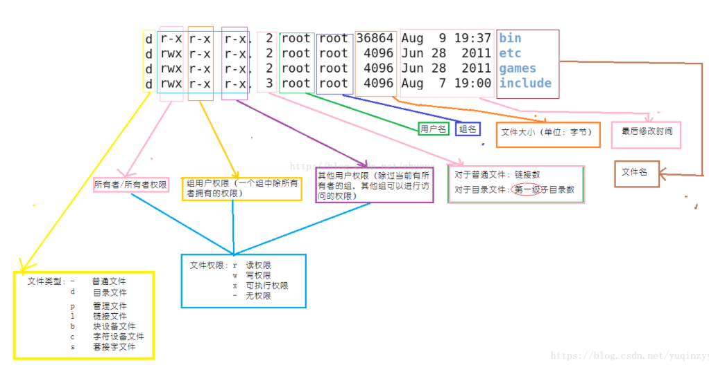

## specific file

* `rc.d`: 開機啟動流程

* `fstab`: 開機掛載設定檔

* `inittab`: 裡面可以選擇進入的runlevel，要使用圖形化介面(5)還是文字介面(3)

* `resolv.conf`:  存放domain name server的文件
* `etc/httpd/conf/httpd.conf`: 設定網頁配置的文件，可以更改一開始Listen的port(default: 80)，設定好之後，需要重製`systemctl restart httpd`
* `etc/passwd`、`etc/shadow`: 使用者兩個檔案，可以拿取到用戶名稱和加密過後德的密碼，用John the Ripper(JTR)，就有機會破解密碼

etc資料夾很重要，做Server一定要備份

可不可以上網有很多原因，DNS是其中一種

如果`ping 8.8.8.8`而`ping yahoo.com`不行那就代表DNS設定需要調整

* `cat /etc/resolv.conf`，查看這裡面的內容，可以在裡面加上 `nameserver 8.8.8.8`

## Command

### ls

對於目錄或文件，r代表可以看(ls)，如果多了x就可以進去了(cd)，多了w就可以刪除資料夾或文件(rm)

### man

進入man以後，可以使用`/text`，找出想要尋找的關鍵字，按下 N 可以下一個 n是上一個

### tree

`yum install tree`

`tree dir` : 可以將資料夾用樹的方式呈現，會比較好看

## Linux指令

* more /etc/passwd: 查看帳號，前面是系統帳號，後面是使用者帳號

  * `user: x:1000:1000:user:home/user:bin/bash`: x代表密碼，真正的密碼放在其他地方，後面的1000代表是群組ID，如果小於1000就代表是系統帳號，大於1000代表是一般使用者
  * 使用more是資料太多可以幫忙分頁，不過more只能往下翻，不能回頭，less可以上和下，比more更好用
* `awk -F: {print $1, $7} /etc/passwd` :  使用:作為column的分割符號，打印出第一行和第七行
* `ln a link` : 硬連結，對 a 產生連結(link自動生成)，呼叫a就等於呼叫link
* `ln -S a link` : 這個連結不會產生連接數量(ls -l)， 可以直接呼叫a  
* `netstat -tunlp | grep 80`
  * tcp、udp、nonresult 代表不解析，顯示IP不顯示協議、listen、process
* `touch .a` : 創建一個空文件，前面有加上.的文件代表，也可以更動檔案的時間
* `sudo kill -9 pidnumber`: 在安裝的時候很常會遇到被lock住，這時可以使用這個，刪除掉下面出現的pid。9代表相關的行程也會刪除
* `stat` : 後面加上文件或資料夾，可以顯示創建時間，修改時間，改變的時間
* `ls -l -d dir` : 查看資料夾本身的內容，不是看資料夾裡面的內容
* `cp -r /etc .` : 拷貝目錄到本地資料夾
* `cat -n filename | less` : 把檔案的行數標示出來，使用less做行數限制 
* `tail`、`head`: 可以查看文件內容的尾巴和頭，預設是看10行，可以加上 `-n num` 限制行數
* `mkdir`、`rmdir`: 創建資料夾和刪除資料夾，rmdir只能刪除空的資料夾

​    

​    

​    

