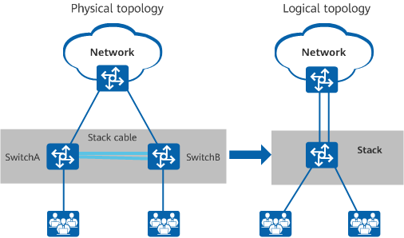

## 專有名詞介紹

1. 集縮比: 一台網路設備(switch)，拉線的比例，拉到user的線比上拉到core network線的比例，多拉幾條線，集縮比也會增加，可以給多個使用者使用(像是社區使用網路)，但是頻寬會降低

2. PT test: 滲透(Penetration)測試，幫忙公司做安全檢測，用各種方法入侵，如果入侵成功，就修復

   * 白帽: 資安公司幫忙找公司的資訊漏洞，可以讓公司相對安全
   * 黑帽: 就像是駭客，直接打入公司，向公司要錢之類的
   * 灰帽: 介於黑帽和白帽之間，兩邊偶爾都幹一下

3. 堆疊(stacking): 會有loop的問題，造成boardcast storm，可以使用STP(Spanning Tree Protocol; 生成樹協定)，把灰色部分變成樹狀結構，解決問題

   

   * high availabity(HA; 高可用性): 伺服器的可用性，讓伺服器的群組，如果其中一個斷掉了，其他的會補上
   * fault Tolerance(FT; 故障容許度): 跟HA很像，不過他是多個伺服器故障的時候，可以進行馬上修復


kali linux 使用ssh，使用`/etc/init.d/ssh start`


``` 
export PATH=$PATH:/home/user/mybin  ## 把後面的PATH新增到PATH裡面 ## a = a + 1

## 永久改變系統路徑，不會馬上加入
gedit .bashrc  ## 編輯資料夾，把上面的指令放到裡面的最下面 (export PATH=$PATH:/home/user/mybin)

source .bashrc  ## . .bashrc  ## 讓目前的系統路徑馬上生效
```


Linux萬物皆檔案，對於輸出入使用數字做描述

標準輸入: 0 `## stdin`

標準輸出: 1 `## stdout`

標準錯誤: 2 `## stderr`


## Linux指令

* `echo "rm -f /ect" > ls`: 可以改變指令執行結果
* `chmod +x ls`: 賦予可執行的權限
* `file usr/bin/mv`: 查看資料夾的權限和他是多少位元的資料
* `which`: 可以知道某個執行檔的位置，如果檔案沒有執行權限，就不會顯示東西
* `df -h`: 查看資料使用量，加上-h，可以顯示比較好看的單位
* `du /home/user -h`: 可以查看某個資料夾的使用情形
* `ls /aaa 2>error.txt`: 把前面的結果寫入到error.txt，如果不寫2就會寫在螢幕上(1)
* `ls /tmp /aaa 1>a.txt 2>&1`: 2>&1 錯誤的輸出放到跟1同樣的位置，這個結果會是錯誤輸出跟正確輸出後的結果都放在a.txt檔案裏面
* `echo $?`: 是否正確執行，非0代表執行錯誤
* `ls /tmp /aaa 1>dev/null 2>&1`: 對於輸出值不在意可以用這個，把2(錯誤並輸出到螢幕)、1(正確並輸出到螢幕)的輸出全部丟到垃圾桶，這個指令只判斷可以正常執行還是不可以