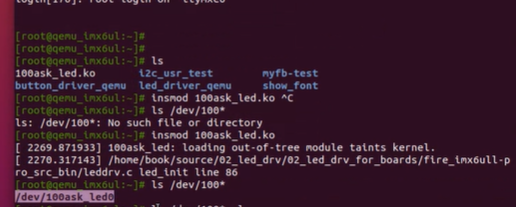

# process

程式在執行時，會把程式碼寫入記憶體，這時在運行的的程式也可以稱作行程。

將一顆CPU的可用時間切割為很小的單位，可以讓CPU執行多件工作，因為切換process的時間夠快，所以感覺很像多工

系統使用`fork()`，讓行程可以生成多個，最開始的行程稱作父行程，生出來的稱作子行程

早期系統最先執行的子行程是init， 不過現在已經被systemd取代了，因為init的起動速度較慢，是一個一個啟動，而systemd是使用parallel(相關的行程可以平行生成)，只需要幾個步驟就可以啟動。系統的第一個子行程的PID(process id)為1

Linux的bash在接收到外部命令(ELF 64-bit LSB executable)時，通常會`fork()`出一個子行程，然後使用`exec()`切換到自行程去執行命令。而[內部命令](https://www.ibm.com/docs/zh-tw/aix/7.1?topic=shell-list-bourne-built-in-commands)(POSIX shell script)像是`cd`，就不會使用`fork()`，而是會執行在`bash`行程裡面執行

`type -a [command]` : 可以知道 command 是外部命令還是內部命令

在指令後面加上` &`，就可以讓程式碼在背景執行，如果想要知道一個命令執行多久時間，可以在指令前面加上 `time`

`ctrl+c`可以中斷目前的process，而`ctrl+z`會把目前的process停止運行並放到背景執行

`ps -l`: 顯示行程所有訊息

行程會有優先度(PRI)，PRI越小優先度越較高CPU給他的時間戳會比較多

PRI，預設80，他會加上NI值，成為最後的PRI值

`cd proc pid`: 可以跳到執行行程的那個資料夾，這時再`cd fd`，可以看到裡面有0、1、2、255，0代表stdin、1代表stdout、2代表stderr。

## driver

1. 直接寫到作業程式裡面(驅動程式直接載入)

2. 要用再放入到作業系統(驅動程式模組化)，這會使kernel的程式碼變少

   下面示範把驅動程式載入到設備中(dev)

硬體製造商會需要用driver來控制硬體，這個難度會比網頁設計之類的還要難，不過薪水也高很多

## Linux 指令

* [`pstree`](https://blog.gtwang.org/linux/linux-pstree-command-tutorial/): 可以看到行程樹

* `top`: 可以查看系統的行程和工作，可以看到系統使用率，也可以使用`uptime`(顯示top最上面的一行)，查看使用者和使用時間

* `free -m`: 查看記憶體使用量，-m把單位變成比較好看的形式

* `ps`: process status，可以查看行程的資訊，ps會在bash裡面生成(`fork()`)一個child process 'ps'，然後使用`exec(ps)`，執行完ps以後，ps的process就會消失，切換回bash

* `ps -ef`: 通常使用ps指令會輸入的方式，也可以輸入`ps aux`，`-f`: 可以看到目前使用者的PID和PPID(parent process id)

* `ps aux | grep [c]ron`: 

  * 會顯示行程，這邊加上中誇號代表不顯示因為grep而顯示的行程，中誇號不管加在前面或後面都一樣。
  * 如果不加(`ps aux | grep cron`)，就會顯示多一個grep的行程
  * cron是跟 "時間有關的" 指令，大多用在scheduling(排程)，可以自動化程序

* `ps o comn,pid,ni`: 可以根據後面的東西顯示行程內容

* `ps -l`: 顯示行程所有訊息

* `sudo nice -n -3 sleep 100 & `: 把這個行程的NI變成-3，預設NI是0，這個值會影響PRI(PRI = PRI + NI)，PRI越小優先度越高

* `echo $$`: 顯示目前行程的id，通常在Server上會把重要的pid存在一個檔案

* `kill pid`: 可以殺掉pid，後面輸入數字，這個是很溫柔的殺掉

  * `kill -l`: 查看kill的參數
  * `kill -1 httpd_pid`: 不讓伺服器斷線，且可以更改配置檔案
  * `kill -9 pid`: 很暴力的殺掉不受控制的行程

* `pkill name`: 可以殺掉多個行程，後面是輸入行程的相關名稱，會刪除有包含name的行程

* `jobs`: 查看背景執行工作

* `fg 1`: 把背景執行的第一個工作丟到前景來

* `bg 1`: 讓背景執行的第一個工作繼續執行

* `sleep 60`: 讓程式停頓60秒，可以用`sleep 60 &`，讓這個程式在背景執行

* `sudo !!`: !!代表上一個指令

  