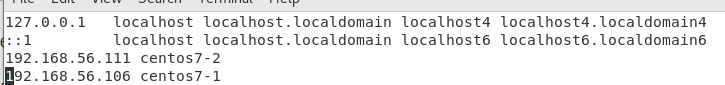

# 伺服器架設

## SSH server

開啟兩台虛擬機

enp0s3: 10.0 開頭的是NAT(連到網路上的)


> 固定IP

使用配置檔案做更改

也可以使用圖形化介面直接去IPv4改


> 更改前面用戶名 (讓登入比較客製化)

`hostnamectl set-hostname your_name`

打上 `bash` 可以將terminal 重新整理，讓hostname顯示

`vim /etc/hosts`



這樣就可以使用host name 下去 ping

`ping centos7-1`


```sh
--server
$ getenforce  # 如果是enforce就要設定下面選項
$ setenforce 0  # 暫時設定

$ systemctl status firewalld  # 防火牆要關閉
# $ systemctl disable firewalld
$ systemctl status sshd


--client
$ ssh-keygen # 產生公鑰和私鑰
$ ssh-copy-id root@server

$ ssh root@server  # 使用SSH直接登入


--lookup private and public key
$ cat /root/.ssh/id_rsa  # 私鑰存放位置
$ cat /root/.ssh/id_rsa.pub # 公鑰存放位置
```


```sh
$ touch a.txt
$ scp a.txt root@centos7-5:/root/  # 拷貝本地檔案到另外一台機器
```

