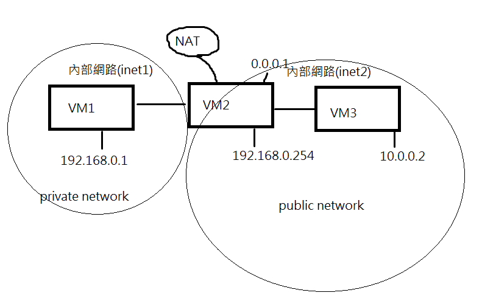

# NAT Server

NAT的作用是讓內網IP可以連到外網IP，可以透過NAT，架設出自己想要的各種網路

這個伺服器其實只需要一個指令就可以完成，但實際操作比較麻煩，需要三個虛擬機


VM1: 192.168.0.1，代表私有網路

VM2: 192.168.0.254，NAT Server

VM3: 10.0.0.2，代表外網(public IP)

裡面會有兩個內部網路(名稱自訂義)，可以讓他們互相溝通



在虛擬機裡面，只選擇network Adapter1，然後選擇internal network，名稱取一樣的，這樣就可以讓兩台虛擬機互聯

如果是中間的虛擬機，就要對有連結的internal network做設定，如果接兩個，就要有兩個internal network


如果是使用VMware，設定選擇LAN segment，一樣設定名稱


架構圖

```sh
$ VM1 (192.168.1.1)——-(192.168.1.254)VM 2 (10.1.1.1)=======(10.1.1.2) VM 3
```


> 手動設定IP位置

手動設定會容易跑掉，所以有時候要再執行一次指令

brd指的是broadcast廣播位置

VM1: 設定ens33的IP和設定內定路由器

```sh
$ ip addr add 192.168.1.1/24 brd + dev enp0s3
$ ip route add default via 192.168.1.254s
$ ip route show
```

VM2: 設定ens33的IP和設定內定路由器

```sh
$ ip addr add 192.168.1.254/24 brd + dev enp0s3
$ ip addr add 10.0.0.1/24 brd + dev enp0s8

$ ip route show
```

VM3: 設定ens33的IP和設定內定路由器

```sh
$ ip addr add 10.0.0.2/24 brd + dev enp0s3
$ ip route add default via 10.0.0.1
$ ip route show
```


如果設錯了，可以使用下面的指令，還原特定網路介面

```sh
$ ifconfig enp0s3 0
```


設定完成以後，可以ping特定介面卡，看看有沒有成功


> 設定NAT。設定在VM2上，讓VM1可以ping到VM3

-t 代表 table、-A 代表 append、-s 代表 source、-j 代表 jump

MASQUERADE 代表把內部網路連到外部網路，做把內部網路做轉換(VM1的IP設定成10.0.0.1)

```sh
$ iptables -t nat -A POSTROUTING -s 192.168.1.0/24 -o enp0s8 -j MASQUERADE
```


> 把VM2變成Router

```sh
$ echo 1 > /proc/sys/net/ipv4/ip_forward
```


當VM1送封包道VM3

在VM1查看封包，會看到192.168.1.1 -> 10.0.0.2

但在VM3查看封包，會看到10.0.0.1 -> 10.0.0.2

可以使用Wireshark或是tcpdump查看封包

> tcpdump，可以讀取封包資訊

-U 代表直接讀取緩存區內容、-n代表不解析，直接顯示IP位置、-i代表接收定介面卡的資訊

```sh
$ tcpdump -U -n -i enp0s3
```


-- 課本12-3

常見錯誤: [裡面等號要空白]

## shell

> test.sh: 字串比對，會依序顯示 a.txt\n yes\n b.txt\n no \n c.txt\n yes

```sh
#!/bin/bash

for fname in "a.txt" "b.txt" "c.txt"
do
  echo $fname
  if [ "$fname" = "a.txt" ] || [ "$fname" = "c.txt"]
    echo "yes!"
  else
    echo "no!"
  fi
done
```


使用完test指令後，使用`echo $?`，可以查看test是true還是false，如果是true，顯示0; false，顯示1


> test.sh: 可以讀取輸入的參數

$num: 代表參數位置

$#: 代表參數總數

```sh
#!/bin/bash

echo '$0= '$0
echo '$1= '$1
echo '$2= '$2

echo '$#= '$#
```


```sh
$ ./test.sh 1 2 3 4 aa bb
$ $0= ./test.sh
$ $1= 1
$ $2= 2
$ $#= 6
```


如果想要把條件寫在一行，就可以使用下面的方式

```sh
$ if [ 5 -gt 3 ]; then echo 1; else echo 0; fi
```

```sh
$ for i in `seq 5`; do echo $i; done
```


> show.sh: 顯示出當前目錄下，副檔名是sh的所有檔案

```sh
`ls *.sh`   # 代表先執行 ls *.sh
```

Linux裡面使用for迴圈常用這種寫法，裡面放一個命令，for去讀取內容，然後作解析

```sh
#!/bin/bash

for fname in `ls *.sh`
do
  echo $fname
done
```


```sh
$ mkdir test
$ cd test
$ touch {a..d}.jpg
```

> rename.sh: 寫一個檔案，把四個檔案改成a.gif、b.gif...d.gif

```sh
#!/bin/bash

for fname in `ls *.jpg`
do
  mv $fname `echo $fname | tr "jpg" "gif"`
done

```


