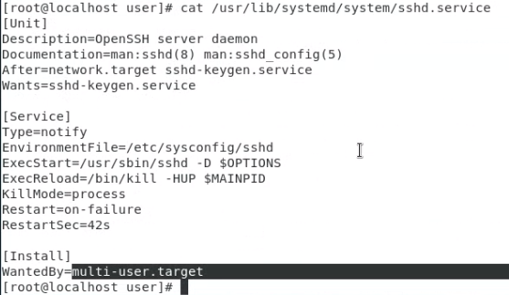

課本第十四章

# 系統服務與排程

> 服務分類

Linux 的 server 有兩種

1. stand alone server(.service): 背景執行的Server，只要有客戶進來系統，就可以馬上提供服務，但今天啟動的服務沒甚麼人在用，很容易消耗電腦資源
2. xinet server(.socket): 像是代理者，小小的程式碼在standby，客戶來的時候會叫醒伺服器，客戶離開再關閉伺服器，消耗資源少，但是回應速度比較慢。


系統排程有在前面講過(crontab  `* * * * *` `MIN HOUR DOM MON DOW CMD` )

Linux的服務名稱通常會以d(daemon)結尾，在背景運行(守護進程)

httpd(80)、named(53)、telnetd(23)、sshd(22)、https(443)


我們可以使用systemctl來控制systemd裡面的服務，Linux大部分都會有一個配置檔，讓伺服器或服務去讀取

```sh
$ systemctl | grep sshd  # 查看是否有ssh服務
```


systemd是由兩個東西所構成的Unit、Target

## Unit

Unit: 以描述型的東西為主，主要功能(`Description`)，如何操作(`Documentation`)，在什麼執行完後才會執行(`After`)，什麼執行成功才可以執行(`Wants`)，如下面的文件內容



在Service中

`ExecStart` 對應到 `systemctl start sshd`，後面的Options在環境配置檔(`EnviromentFile`)中描述

`ExecReload` 對應到`systemctl reload sshd`，`-HUP`，代表是刪除訊號( `1) SIGNUP`，可以由`kill -l` 看到)，讓服務重新讀取配置檔

intall

`WantedBy=muti-user.target`一定要在多人模式中才能啟動


## target

Target: 代表的是一個階段標的，訂定在某個階段時需要啟動什麼Unit服務，舊的 init 服務管理擁有 7 個階段，systemd 的 Target 取代 init 的 runlevel，提供更強大的階段標的設定。


### init_runlevel

| 啟動模式   | 說明                                | 是否在系統設定 |
| ---------- | ----------------------------------- | -------------- |
| runlevel 0 | 系統關機                            | 不使用         |
| runlevel 1 | 單人模式                            | 救援時使用     |
| runlevel 2 | 多人模式，但不載入外部檔案系統(NFS) | 救援時使用     |
| runlevel 3 | 文字模式，完整多人使用              | 常用           |
| runlevel 4 | 未使用，保留                        | 不使用         |
| runlevel 5 | 圖形化介面(X-Window)，完整多人模式  | 常用           |
| runlevel 6 | 系統重新啟動                        | 不使用         |


### systemd_Target 

| 序號 | target 名稱       | 說明                                                         |
| ---- | ----------------- | ------------------------------------------------------------ |
| 1    | sysinit.target    | 初階啟動模式，主要工作是確保檔案系統的完整啟用               |
| 2    | basic.target      | 基礎模式，是multi-user.target依賴的模式，再系統啟動後自動進入的模式 |
| 3    | multi-user.target | 文字多人模式，同init的runlevel 3                             |
| 4    | graphical.target  | 圖形介面，同init的runlevel 5                                 |
| 5    | default.target    | 系統預設的模式，為符號連結，大多都連結到multi-user或graphical |


> 從圖形化模式切換到文字模式，再切回來

```sh
$ systemctl isolate multi-user.target
$ systenctl isolate graphical.target
```


## systemctl常用服務

systemd配置檔案預設目錄在: `/usr/lib/systemd` 或是`/etc/systemd/system`

| 服務名稱              | 說明                   |
| --------------------- | ---------------------- |
| atd.service           | 一次性的工作排程服務   |
| crond.service         | 週期性的工作排程服務   |
| NetworkManager.target | 動態網路連線設定管理器 |
| network.target        | 固定式網路管理服務     |
| sysinit.target        | 系統啟動               |
| quotacheck.service    | 磁碟配額檢查服務       |
| syslog.service        | 系統日誌管理服務       |
| sendmail.service      | 電子郵件伺服器服務     |
| smartd.service        | 硬碟健康狀態回報服務   |
| sshd.service          | 加密的遠端登入服務     |
| httpd.service         | 網頁伺服器服務         |
| cups.socket           | 列印伺服器服務         |


## 架設伺服器練習

[Linux 建立自訂 Systemd 服務教學與範例 - G. T. Wang (gtwang.org)](https://blog.gtwang.org/linux/linux-create-systemd-service-unit-for-python-echo-server-tutorial-examples/)

要先安裝python3 `yum install python3`

在 `/opt` 下建立 echo_server.py

> echo_server.py: 別人送什麼東西過來，就回傳什麼回去的伺服器

如果使用python而不是python3，就要把`env python3` 改成 `env python`

```python
#!/usr/bin/env python3
import socket

# 建立 socket  (使用IPv4，使用TCP)
serv = socket.socket(socket.AF_INET, socket.SOCK_STREAM)

# 綁定所有網路介面的 9000 連接埠
# 0.0.0.0 可以從任意介面進來
serv.bind(('0.0.0.0', 9000))

# 開始接受 client 連線
serv.listen()

while True:
    # 接受 client 連線
    conn, addr = serv.accept()
    print('Client from', addr)

    while True:
        # 接收資料
        data = conn.recv(1024)
        # 若無資料則離開
        if not data: break
        # 傳送資料
        conn.send(data)

    conn.close()
    print('Client disconnected')
```


> 架設伺服器，並測試

```sh
$ vim echo_server.py
$ chmod +x echo_server.py
$ python echo_server.py
```


> client connect

```sh
$ nc localhost 9000
```


> 建立設定檔，建立在`/etc/systemd/system/echo_server.service`

```sh
[Unit]
Description=Echo Server

[Service]
Type=simple
ExecStart=/opt/echo_server.py
Restart=always

[Install]
WantedBy=multi-user.target
```

> 設定權限(必須要是root)

```sh
$ chmod 644 /etc/systemd/system/echo_server.service
# 重新載入 Systemd 設定檔
$ systemctl daemon-reload
# 啟動自訂的 echo 伺服器
$ systemctl start echo_server
# 查看 echo 伺服器狀態
$ systemctl status echo_server
```


> 詳細服務設定檔

```sh
[Unit]
# 服務名稱
Description=Your Server

# 服務相關文件
# Documentation=https://example.com
# Documentation=man:nginx(8)

# 設定服務啟動的先後相依姓，例如在網路啟動之後：
# After=network.target

[Service]
# 行程類型
Type=simple

# 啟動服務指令
ExecStart=/opt/your_command

# 服務行程 PID（通常配合 forking 的服務使用）
# PIDFile=/run/your_server.pid

# 啟動服務前，執行的指令
# ExecStartPre=/opt/your_command

# 啟動服務後，執行的指令
# ExecStartPost=/opt/your_command

# 停止服務指令
# ExecStop=/opt/your_command

# 停止服務後，執行的指令
# ExecStopPost=/opt/your_command

# 重新載入服務指令
# ExecReload=/opt/your_command

# 服務終止時自動重新啟動
Restart=always

# 重新啟動時間格時間（預設為 100ms）
# RestartSec=3s

# 啟動服務逾時秒數
# TimeoutStartSec=3s

# 停止服務逾時秒數
# TimeoutStopSec=3s

# 執行時的工作目錄
# WorkingDirectory=/opt/your_folder

# 執行服務的使用者（名稱或 ID 皆可）
# User=myuser

# 執行服務的群組（名稱或 ID 皆可）
# User=mygroup

# 環境變數設定
# Environment="VAR1=word1 word2" VAR2=word3 "VAR3=$word 5 6"

# 服務輸出訊息導向設定
# StandardOutput=syslog

# 服務錯誤訊息導向設定
# StandardError=syslog

# 設定服務在 Syslog 中的名稱
# SyslogIdentifier=your-server

[Install]
WantedBy=multi-user.target
```


## Install_Talnet

這邊是使用xinet (.socket) 的示範，參考: https://blog.csdn.net/l_liangkk/article/details/105401435

> 檢查是否安裝telnet和xinetd

```sh
$ rpm -qa|grep telnet
$ rpm -qa|grep xinetd
```


> 安裝客戶端和伺服器端telnet和安裝xinetd服務

```sh
$ yum install -y telnet*
$ yum install -y xinetd
```


創建config檔案

```sh
$ vim /etc/xinetd.d/telnet
```


```sh
service telnet
{
  flage = REUSE
  socket_type = stream
  wait = no
  user = root
  server =/usr/sbin/in.telnetd
  log_on_failure += USERID
  disable = no
}
```

socket_type = stream 代表是TCP service

disable = no 代表要啟動服務


```sh
$ systemctl restart xinetd
# 執行監控程式碼，有客戶端連進來，就會讓telnet運行
$ ps -ef | grep xinetd
# 沒有客戶端，telnet不會執行
$ ps -ef | grep telnet  
```


## Linux指令

* pstree: 可以看出process的父子關係，systemd是第一個process，在早期第一支程式是init，他會被取代是因為init會讓後面要啟動process的一個一個跑，但systemd可以讓沒有相依性的process一次執行，讓開機變快
* `man 8 ssh`: man可以標示不同數字，預設是第一個，8是代表system administration commands，如果要寫程式碼，可以使用`man 2`，查看如何寫指令。`man 5`，可以查看設定配置
* `service httpd start`: centos7以前的伺服器服務啟動，現在都使用`systemctl`來做啟動