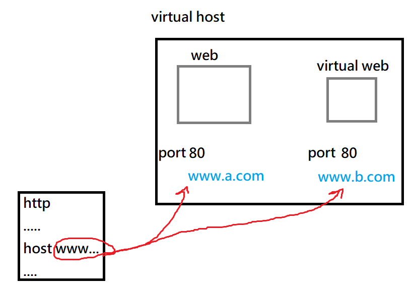
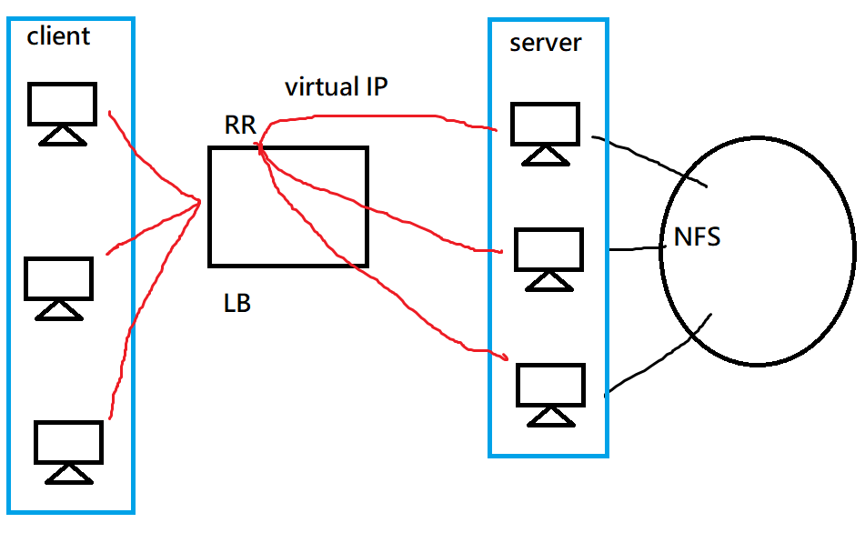
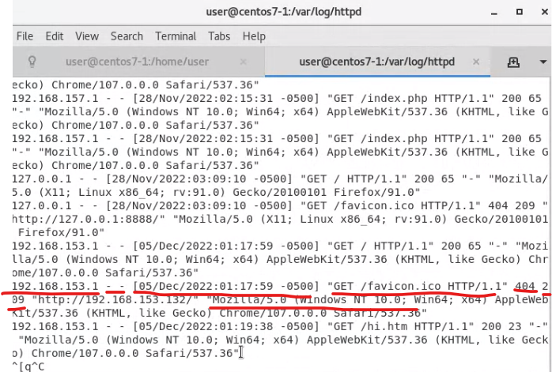

課本第15章

# ApacheSetup


在設定安全機制或是防火牆的時候，要先關閉伺服器

```sh
# 查看security linux有沒有設定，如果是premission就要使用下面的指令disable security linux
$ getenforce  

# 暫時關閉
$ setenforce 0

# 永久關閉
$ vim /etc/selinux/config   # 設定: SELINUX = disabled
```


```sh
# 查看防火牆有沒有開
$ systemctl status firewalld
```


## 重要Apache目錄

* `/etc/httpd`: 主要安裝目錄
  * conf.d是主要配置檔，cond也是配置檔，用兩個配置檔比較不會太亂
  * logs是記錄檔(連結)，對應到`/var/log/httpd`，裡面會有紀錄內容

* `/var/log/httpd`: 裡面會有網頁紀錄內容
* `/var/www/html`: 家目錄位置，可以html放在裡面
* `/etc/httpd/conf/httpd.conf`: apache 的主設定檔，所有和伺服器運作有關的設定值都放在這個文字檔中


centos7的環境和ubundu是不一樣的，如果是在ubundu，家目錄會在`/usr/local/apache2/htdocs/`下面


在`/etc/httpd/conf.d`裡面可以在網站中再架一個虛擬網站，就是下面的virtual host


## virtual host

想要看程式碼可以看15周的: [virtual host](./15-.md#virtual-host)

虛擬主機技術: 可以在同一個主機上，架設多個虛擬網站，網站共享IP，共享port，MAC也一樣

跟傳統的判斷三個條件(MAC、IP、port)傳送封包不一樣，這個技術會用到應用層的位置(application layer addr)，稱作virtual host，會存在http裡面的host 位置，讓傳送封包時，可以不會不知道要傳到哪一個網站上。




附載均衡器 (load balancer; LB): 在一個網路裡面放很多台虛擬機，讓LB去接收使用者資訊，後根據IP跟TCP去轉發給後面的主機去處理，利用虛擬位置(virtual IP)連到不同的主機，會使用RR(round robin)演算法

LB就是一種cluster的架構，不過現在都是使用雲端docker的容器去處理



常見的附載均衡器軟體: hapwxy、nginx、LVS


## httpd.conf

`/etc/httpd/conf/httpd.conf`

httpd的配置通常是使用 `name+space+value`

> 設定的根目錄

`ServerRoot "etc/"`


> 設定pid的位置，設定完後可以使用: ``cat /run/httpd.pid` 查看httpd目前跑的process ID`

這邊的run是直接在root創建

`PidFile "/run/httpd.pid"`


> 設定Listen

`Listen 80  # Web port 位置`


> 當收到客戶端要求後，如果在60秒未能正常提供回應資料時，則產生逾時訊息回應予客戶端。

`Timeout 60`


> 伺服器行程的限制: 如果沒有設定，就會使用預設

```sh
<IfModule prefork.c>
StartServer 8
MinSpareServer 5
MaxSpareServers 20
ServerLimit 256
MaxClients 256
MaxRequestsPerchild 4000
</IfModule>
```


StartServer: 控制開啟的行程數

MinSpareServer: 最小行程數

MaxSpareServers: 最大行程數

ServerLimit: 最多clinet 上限

MaxClients: 最多clinet 上限

MaxRequestsPerchild: 最多發送的請求


> 設定初始網站位置，預設是index.html

```sh
<IfModule dir module>
DirectoryIndex index.html index.php index.htm
</IfModule>
```


> 設定存放位置

```sh
DocumentRoot "/var/www/html"
```


> 設定配置檔案，讓一般使用者可以有自己的網頁(/etc/httpd/conf.d/userdir.conf)

```sh
<IfModule mod_userdir.c>
    #
    # UserDir is disabled by default since it can confirm the presence
    # of a username on the system (depending on home directory
    # permissions).
    #
    # UserDir disabled

    #
    # To enable requests to /~user/ to serve the user's public_html
    # directory, remove the "UserDir disabled" line above, and uncomment
    # the following line instead:
    #
    UserDir public_html
</IfModule>

```

建立的文件要和上面的名稱一樣 !!

```sh
$ mkdir /home/user/public_html
$ cd /home/user/public_html
$ echo "hi" > hi.htm
$ chmod 755 /home/user  # 讓使用者可以讀取，但不能寫入
```


使用者網站位置: `ip/~user/hi.htm`


## 網站位置連接

網頁不一定要放在網站下，可以放在隨機硬體位置


1. 使用符號連結，讓網站可以使用mydata裡面的目錄

```sh
$ cd /var/www/html
$ ln -s /home/user/web/mydata mydata
```


2. 使用Aliases做連結，在`/etc/httpd/conf/httpd.conf`下加上Alias，並加上權限

```sh
Alias /mydata2 /home/user/web/mydata2
<Directory /home/user/web/mydata2>
  Require all granted
</Directory>
```


# Linux指令

* `rpm -qa | grep httpd`: 查看有沒有安裝httpd

* `tail -f /var/log/httpd/access_log`  : f: follow 追蹤檔案，可以找到資料的後幾筆，可以用在察看訪問者訪問網站的 IP位置($1)、是否是跳轉進來的($2)、訪問時間($3)、協定($4)、錯誤代碼($5)、資源大小、客戶端使用瀏覽器...

  

* `cat /var/log/httpd/access_log | awk '{print $1}' | sort | uniq | wc -l`: 查看有多少IP訪問這個網站