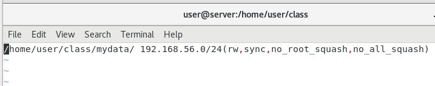

# 伺服器架設

## NFS

NFS(Network Firewall System)

用在 Unix-like(例如Minix、Linux、QNX等) system 中進行檔案分享，一個server可以擁有很多客戶端


server export、client mount 

有點像是windows上的遠端磁碟機，client在指定資料夾的操作，都會對應到server指定資料夾的操作，當然server操作也會對應到client


查看Linux環境

`cat /etc/redhat-release`


-- server

```sh
$ sudo yum install nfs-utils

$ sudo systemctl enable rpcbind
$ sudo systemctl enable nfs

$ sudo systemctl start rpcbind
$ sudo systemctl start nfs

# 關閉防火牆，就不用打下面指令  systemctl status firewalld 
# systemctl disable firewalld
#$ sudo firewall-cmd --zone=public --permanent --add-service={rpc-bind,mountd,nfs}
#success
#$ sudo firewall-cmd --reload
#success

$ mkdir /mydata -p  # 參數p代表資料夾如果不存在就建立，存在就不建立，防呆的
$ chmod 755 /mydata

$ sudo vim /etc/exports  # 修改檔案設定，分享檔案

/*
/mydata/     192.168.0.0/24(rw,sync,no_root_squash,no_all_squash)

*/
```

/data: 共享目錄位置。
192.168.0.0/24: 客戶端 IP 範圍，* 代表所有，即沒有限制。
rw: 權限設置，可讀可寫。
sync: 同步共享目錄。
no_root_squash: 可以使用 root 授權。
no_all_squash: 可以使用普通用戶授權。



可讀可寫，同步，權限不被壓縮


重新設定配置後，需要重新啟動，配置才會生效

````sh
$ sudo systemctl restart nfs
$ showmount -e localhost
````


-- client

```sh
$ sudo yum install nfs-utils

$ sudo systemctl enable rpcbind
$ sudo systemctl start rpcbind

$ showmount -e 192.168.56.106  # 測試NFS Server

$ mkdir test
$ sudo mount -t nfs 192.168.56.106:/home/user/class/mydata ./test  # -t代表使用甚麼類型進行掛載，這裡使用nfs，192.168.56.106(Server IP)
```


query all，查詢本地端已安裝的軟體

`rpm -qa | grep rpcbind`


# 檔案壓縮

檔案壓縮後會變成tar包，使用`.tar`表示

Linux代表打包後壓縮的格式: `.tar.gz(.tgz)、.tar.bz2`

Linux副檔名基本上都是記憶用，真正檔案格式可以使用 `file` 指令去查看

`file /usr/bin/ls`

`stat` 可以看檔案的詳細資訊，可以看到 Block、Inode；Access time; modify time; change time....，這個是資安一個重要資訊指令 


`find / -atime -1` : 查找一天內被動過(Access、copy)的資料

`touch {a..d}`: 創建 a、b、c、d 四個檔案

`tree`: 這個指令可以看到檔案的樹狀結構


> **tar** 是壓縮檔案最常用的命令，主要用於將多個文件或目錄合併為一個文件，以便備份和壓縮。 

`tar cvf test.tar`: 打包檔案，命名為test.tar

c-create、v-verbal顯示檔案、f-指定名稱

`tar cvf test.tar.gz`

z-壓縮

`tar xvf test.tar`: 解包

| 選項   | 描述                                                       |
| ------ | ---------------------------------------------------------- |
| -t     | 顯示歸檔文件(多個文件)中的內容                             |
| -x     | 釋放歸檔文件                                               |
| -u     | 更新歸檔文件                                               |
| **-c** | 創建一個新的歸檔文件(可以將多個文件放一起)                 |
| -v     | 顯示歸檔和釋放的過程信息                                   |
| **-f** | 用戶指定歸檔文件的文件名(指定壓縮包名稱)，否則使用默認名稱 |
| -j     | 由tar生成歸檔，然後由bzip2壓縮                             |
| -z     | 由tar生成歸檔，然後由gzip壓縮                              |

tar 使用總結: `-jcvf` 用於壓縮 bz2 格式文件， `-zcvf` 用於壓縮 gz 格式文件， -xvf 用於解壓縮文件

* `tar -jcvf test.tar.bz2 file test.txt`， 在bz2前面加上.tar是代表這個是使用tar命令創建(可加可不加)
* `tar -zcvf test.tar.gz file test.txt`
* `tar -xvf test.tar.gz `可以解壓上面兩種


> zip: window文件壓縮，通常是Linux file 要傳送到 window會用到

* zip: 將文件壓縮為zip格式
  * `zip test.zip filelist`，可以放一堆文件表(filellist)，如果要壓縮文件夾要加 -r
* unzip: 將zip格式文件解壓
  * `unzip test.zip`


檔案壓縮還有很多格式，xz、.bz....


etc 要常常備份，重要的文件(伺服器配置、IP、router、DNS setting、system setting...)都在裡面

重要etc文件

```sh
$ cat /etc/resolv.conf  # 存放 Dns Server
$ cat /etc/hostname  # 存放主機名稱
$ cat /etc/sysconfig/network-scripts/  # 存放網路介面(enp03...)，可以進行手動網路配置
```


```sh
$ tar -cvfz etc-`date +"%Y-%m-%d"`.tar.gz /etc  # 備份資料夾，並使用日期命名
$ tar -cvfz etc-$(date +"%Y-%m-%d").tar.gz /etc  # ` `=$( )
```


`man`: 可以找到指令使用方法

## 設定系統時間

```sh
$ timedatectl set-timezone Asia/Taipei
$ date +"%Y/%m/%d %H:%M:%S"

$ ntpdate clock.stdime.gov.tw # network time protocol，跟ntp伺服器做同步
$ hwclock -w # 跟硬體時間進行同步
```


架設伺服器，時間同步很重要


## 排程

可以告訴linux在什麼時間做什麼事情

`crontab`: 定期任務，設定工作排程，可以把這個用在備份，讓檔案可以定期備份

`MIN HOUR DOM MON DOW CMD`

每一分鐘做一次: `*/1 * * * *`

每一個小時的第一分鐘做一次: `1 * * * *`

`*` 表示忽略

8:1、10:1、11:1、12:1做一次: `1 8, 10-12 * * *`


以下是一些最基本的 `crontab` 設定範例。

```sh
# 每天早上 8 點 30 分執行
30 08 * * * /home/gtwang/script.sh --your --parameter

# 每週日下午 6 點 30 分執行
30 18 * * 0 /home/gtwang/script.sh --your --parameter

# 每週日下午 6 點 30 分執行
30 18 * * Sun /home/gtwang/script.sh --your --parameter

# 每年 6 月 10 日早上 8 點 30 分執行
30 08 10 06 * /home/gtwang/script.sh --your --parameter

# 每月 1 日、15 日、29 日晚上 9 點 30 分各執行一次
30 21 1,15,29 * * /home/gtwang/script.sh --your --parameter

# 每隔 10 分鐘執行一次
*/10 * * * * /home/gtwang/script.sh --your --parameter

# 從早上 9 點到下午 6 點，凡遇到整點就執行
00 09-18 * * * /home/gtwang/script.sh --your --parameter
```


寫執行命令時，必須要寫完整路徑，不行寫相對路徑

```sh
# 每小時以 user 帳號權限執行一次
0 * * * * user /home/gtwang/script.sh --your --parameter
```


## reference

[CentOS 7 下 yum 安装和配置 NFS - Zhanming's blog (qizhanming.com)](https://qizhanming.com/blog/2018/08/08/how-to-install-nfs-on-centos-7)

[GNU / Linux 各種壓縮與解壓縮指令 (drx.tw)](http://note.drx.tw/2008/04/command.html)

[Linux 設定 crontab 例行性工作排程教學與範例 - G. T. Wang (gtwang.org)](https://blog.gtwang.org/linux/linux-crontab-cron-job-tutorial-and-examples/)