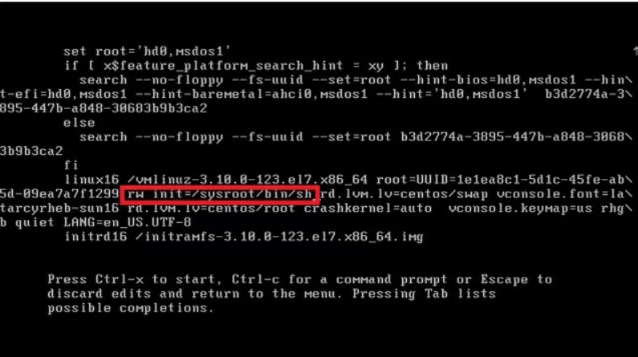

# 磁碟配額設定

如果要自訂義磁碟分配(/home(5G)、/boot(500M)、/swap(分配記憶體的2被)、/(剩下的))，需要在安裝的時候告訴系統

homework ， put home directory to patition

!!! 這裡要看課本 !!!

quota: 磁碟配額。用來限制使用者的磁碟空間用量

要使用超級使用者才可以進行磁碟操作


```sh
$ reboot  # 重新啟動  # 按下e


# 找到quite加上 1 ，按下f10，進入單人模式，要輸入root密碼
$ vim /etc/fstab
# usrquota,grpquota   加入到default後面，根據user和group進行分類
# $  mount -o remount /  # 掛載到根目錄
# $  mount -a
$ reboot
```


修改時間，跟者課本設定參數

```sh
# 再次進入單人模式
cat /etc/mtab | grep usrquota  # 檢查quota是否出現，沒有出現(/dev/sda  noquota)，就代表失敗了

xfs_quota -xc 'report -h' /home 
```


soft限制: 超過了還是可以丟東西，但會提醒你快超過使用量了

hard限制: 就是實在的天花板，不可以超過


```sh
xfs_quota -xc "free -h" /home  # 查詢使用者資料使用量
xfs_quota -xc "quota -h user" /home # 查詢單個使用者資料使用量
xfs_quota -xc "limit bsoft=10m bhard=12m user" /home  # 針對user，設定soft上限跟hard上限
su - user # 切換到user
dd if=/dev/zero of=test bs=1M count=13  # dev/zero是零裝置，會給出很多的0，使用dd指令，讀取資料放到test，讀取1MB，讀取13次，所以會有13MB
ll -h # 查看硬體使用量
```

dd: 產生特定大小的指令，下禮拜會提到


這裡顯示超標，因為剛剛設定hard的上限是12MB


patition 一般有兩個，root和swap，(var、home是最常加入新patition的位置)

限制使用者空間

需要有額外的home磁碟分割區域，才能進行這個實驗


-- 課本第十章

# 套件管理

redhat/fedora/centos體系的套件管理指令是: yum和rpm

## rpm

rpm已經預先編譯好了，所以可以直接安裝，省下很多時間，他也會把對應資料丟到因該去的資料夾(像是etc)，安裝時要注意檔案名稱(會顯示名稱、版本、適用平台)!


```sh
$ rpm -qa  # query all，取得目前安裝的套件
$ rpm -qa | grep httpd  # 查看安裝的伺服器
$ rpm -qi httpd  # query information 查看詳細資訊，後面加上名稱
$ rpm -ql httpd  # query list 條列套件的所有檔案，可以看到檔案的存放所有資料夾，後面加上名稱
$ rpm -ql httpd | grep etc  # 查詢配置檔
$ rpm -ql httpd | grep bin  # 查詢執行檔
$ rpm -qf /etc/httpd/conf/httpd.conf  # 反查檔案，當不小心搞爛某個套件，可以重新安裝一次套件 

$ rpm -ivh rpm檔案名稱  # i: 安裝, v: 詳細資訊, h進度條
$ rpm -e lynx # 刪除套件
```


## yum

因為套件有許多相依性(A 要 B才能跑，B 要 C才能跑)，所以要使用yum，可以一次把相關的套件全部載下來


```sh
$ yum --nodeps  # 忽略安裝前的相依性檢查，直接安裝
$ yum --force  # 強制安裝，忽視錯誤，覆蓋原有資訊
$ yum -Uvh  # U: 更新, v: 詳細資訊, h進度條
```


```sh
$ yum install packageName  # 安裝套件
$ yum update packageName  # 更新套件
$ yum remove packageName  # 刪除套件
$ yum search packageName  # 尋找套件
$ yum list   #列出YUM Server上所有套件資訊
```


```sh
$ wget https://src.fedoraproject.org/lookaside/extras/htop/htop-2.2.0.tar.gz/sha512/ec1335bf0e3e0387e5e50acbc508d0effad19c4bc1ac312419dc97b82901f4819600d6f87a91668f39d429536d17304d4b14634426a06bec2ecd09df24adc62e/htop-2.2.0.tar.gz  # compile tool

$ yum groupinstall "Development Tools"  # include compile tool
$ yum install ncurses-devel  # install libarary
$ tar xvfz htop-2.2.0.tar.gz # 解壓縮

$ cd htop-2.2.0  # 進入資料夾
$ ./configure
$ make  # compile file
$ make install  # 把執行檔放到執行檔的位置，配置檔放到配置檔的位置。
$ htop  # 如果成功就可以執行，按下q可以離開
```


`$?`: 查看前一個指令有沒有執行正確(如果正確會是0，反之不正確)，在shell的判斷常常會用到


```sh
$ wget https://rpmfind.net/linux/epel/7/x86_64/Packages/j/joe-4.6-4.el7.x86_64.rpm  # 直接從網路上下載檔案，不需要打開瀏覽器
```


> 單人模式另一種進法

重啟按下e進入編輯模式



把ro改成rw init=/sysroot/bin/sh，完成後按下 ctrl+x，就可以進入單人模式