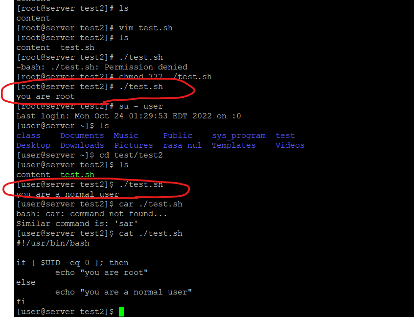

-- 課本第十一之三

# 好用的指令

split、ping、traceroute、hostname、mail

## split

創建一個3M的檔案，然後分成三份

```sh
$ dd if=/dev/zero of=3M count=3 bs=1M
```

切割檔案

```sh
$ split -b 1m 3M  
```

還原檔案

```sh
$ cat xaa xbb xcc > file3M
```


## ping

這個功能比windows上的ping還要強的多，下面簡單介紹幾個ping的功能

```sh
$ ping 8.8.8.8    
$ ping -c 3 8.8.8.8  # ping 3 次  -c = count
$ ping -c 10 -i 0.2 8.8.8.8  # default is ICMP request 1 second，這裡設定0.2秒，一秒鐘送出5個封包
$ ping -I eth0 8.8.8.8 # 設定傳輸介面卡，也eth0是網路介面卡，wlan0是WiFi介面卡
$ ping -s 255 8.8.8.8  # 設定封包大小
...
```


## traceroute

網路主機路徑的追蹤工具，可以列出ICMP封包從傳送端到目地端經過的傳送點，根據TTL(time to live)，判斷傳送點

每過一個路由器，生存時間就會-1，直到等於0都還沒走到目的地地址則代表 TTL 已經到期，接著就會傳送錯誤訊息給原本發送的電腦，TTL的值越大越好，代表經過的路由器越少，也代表越快

不同作業系統的TTL預設是不一樣的

````sh
$ traceroute 8.8.8.8
````


## hostname

通常是設定讓ssh好登入，可以輸入hostname而不是輸入ip

查看hostname

```sh
$ hostname
```

改變hostname

```sh
$ hostnamectl set-hostname centos7
```


## mail

可以發送簡易的郵件，很容易被認為是垃圾郵件

-s 是設定主題(subject)， 寫信的內容放入檔案裏面

```sh
$ echo "hello world" > content
$ mail -s "test" s110910541@student.nqu.edu.tw < content
```


-- 課本第十二章

# shell script

介紹簡單的Shell 腳本設計

## alias

通常用在取別名，可以使用短的指令達到長指令的效果，也可以設定參數的預設參數，像是ls本來是沒有顏色的，但是`alias ls='ls --color-auto'`，讓我們使用ls的時候有顏色。

**alias 只有在當前的terminal生效!!**

**假如今天不想使用alias之後的結果，可以在指令前面加上 `\` **

ex: `\ls`

通常alias的用法如下

```sh
$ alias  # 查看目前的alias指令
$ alias myls = 'ls -l -h --color=auto'
$ myls
$ unalias myls  # 刪除指令
```


如果要讓alias永久生效，可以使用下面的作法

```sh
$ vim .bashrc
#### 設定到.bashrc最下面一行參數
$ alias myls = 'ls -l -h --color=auto'

## 使用下面的方法讓參數生效，source代表執行腳本
$ source .bashrc  # 或是 . .bashrc 

```


## echo

把東西顯示到螢幕上，**雙引號會顯示變數，單引號會全部顯示**

```sh
$ echo hello world  # hello world
$ a=5   # set local variable a
$ echo "hi a=${a}"   # hi a=5
$ echo 'hi a=${a}'   # hi a=${a}
```


```sh
$ echo -e "hello\tword"  # 使用-e，可以在字串中加入特殊字元
```


## var

顯示系統使用的環境變數(USER、HOME、PWD、IFS、PATH、UID、SHELL...)，這種系統環境變數通常會在腳本裡面會用到，可以得知相關訊息

```sh
$ env
$ echo $USER  # 查看系統環境變數
$ echo $IFS  # 查看系統預設分割符
$ echo $UID  # 查看自己的UID，root是0 !!!，通常用在判斷是否為超級使用者(UID==0)
$ echo $HISTFILE       # 查看歷史資料存放資料夾
$ echo $HISTFILESIZE   # 查看最大存儲指令數量
$ echo $RANDOM  # 隨機產生亂數 0~32767
```


> 之前輸入的指令會放入.bash_history裡面

```sh
$ cat .bash_history
$ history  # 查看歷史指令
$ !33  # 執行history指令第33個
$ !echo  # 指令打一半，會存歷史紀錄最新的查找，找到對應的指令執行
$ !!  # 執行history最後一筆指令
```


> 產生固定的5位的字串

```sh
$ echo $RANDOM | md5sum | cut -c 1-5
```


> 變數處裡

```sh
$ a=5
$ b=10
$ c=$a+$b   # a和b都是字串
$ echo $c  # 5+10
# 有兩種方法可以相加
# 1
$ c=`expr $a + $b`
$ echo $c  # 15
# 2
$ c=$(expr $a + $b)
$ echo $c  # 15
# 3
$ c=$(($a + $b))
$ echo $c  # 15

# 使用乘法需要加上反斜槓
$ c=$(($a \* $b))
$ echo $c  # 50

# 除法預設是整數除法
$ c=$(($a / $b))
$ echo $c  # 0
```


## read

read 用來度取螢幕輸入或是讀取文件內容，也可以加上提示，可以跟人做互動。

> 設定變數nol，-p代表前面會顯示提示字串

```sh
$ read -p "input a number" nol
```


## 比較運算

> 測試文件

| 選項      | 功能                      |
| --------- | ------------------------- |
| -d [file] | 測試檔案是否為目錄        |
| -e [file] | 測試檔案是否存在          |
| -s [file] | 測試檔案大小是否為0       |
| -r [file] | 測試檔案是否可讀取        |
| -w [file] | 測試檔案是否可寫入        |
| -x [file] | 測試檔案是否可執行        |
| -L [file] | 測試檔案使否為連結 (link) |


> 測試檔案

[ con ] && 代表前面條件(con)為True，就執行&&後面的，反之執行||後面的

```sh
$ mkdir test
$ touch test2
# -d test is true # result is echo "1"
$ [ -d test ] && echo "1" || echo "0"  
# -d test2 is false # result is echo "0"  
$ [ -d test2 ] && echo "1" || echo "0" 


# 下面這兩個相等
$ [ 2 -gt 3 ] && echo "1" || echo "0" 
$ test 2 -gt 3 && echo "1" || echo "0" 
```


> 比較字串

| 選項                 | 功能                               |
| -------------------- | ---------------------------------- |
| -n [string]          | 測試字串長度是否大於0 (至少一個字) |
| -z [string]          | 測試字串長度是否為0 (空字串)       |
| [string] = [string]  | 測試等號左右邊字串是否相等         |
| [string] != [string] | 測試等號左右邊字串是否不相等       |


> 測試檔案

測試字串長度對 ***變數*** 必須加上雙引號，不然會判斷錯誤

```sh
$ [ -n $a ] && echo "1" || echo "0"  # wrong
$ [ -n "$a" ] && echo "1" || echo "0"  # correct
```


直接比較可以不用加雙引號

```sh
$ [ $a = $b ] && echo "1" || echo "0" 
```


常見錯誤: [裡面等號要空白]

```sh
$ a="ABC"
$ b="Abc"
$ [ $a = $b ] && echo 1 || echo 0  # 0  correct
$ [ $a=$b ] && echo 1 || echo 0  # 1  wrong
$ b="ABC"
$ [ $a = $b ] && echo 1 || echo 0  # 1  correct
```


> 數字比較符

| 選項      | 說明                               |
| --------- | ---------------------------------- |
| n1 -eq n2 | 測試n1與n2相同否(也可以寫 n1 = n2) |
| n1 -ne n2 | 測試n1與n2的值是否相異             |
| n1 -ge n2 | 測試n1是否大於或等於n2             |
| n1 -gt n2 | 測試n1是否大於n2                   |
| n1 -le n2 | 測試n1是否小於或等於n2             |
| n1 -lt n2 | 測試n1是否小於n2                   |


> 測試檔案

```sh
$ [ $a -eq 5 ] && echo "1" || echo "0" 
```


## shell

> 追蹤腳本

```sh
$ bash -x test.sh
```


> 判斷是否為超級使用者，這裡的空格要注意，如果多一個或是少一個都會出問題 。

`#!/usr/bin/bash`  是宣告直譯器，通常寫在第一行 

`eq` 是數字型的比較

```sh
#!/usr/bin/bash     

if [ $UID -eq 0 ]; then  
	echo "you are root"
else
	echo "you are a normal user"
fi
```




> 讀取輸入，並輸出

```sh
#!/usr/bin/bash     

read -p "please input your name: " name
read -p "please input your age: " age
echo "your name is ${name}, age is ${age}."
```


## linux 指令

* 合併檔案: `cat 1.txt 2.txt 3.txt > 4.txt`
* 顯示檔案詳細資訊，並列出比較好看的資料大小: `ls -lh`
* 執行腳本: `source`
* 執行原本的參數，不用alias: `\指令`
* 回前一個資料夾: `cd -`  也等於 `cd $OLDPWD`
* 追蹤腳本: `bash -x test.sh`
* 執行上一個打的命令: `!!`
* 判斷前一個指令有沒有成功(成功: 0，失敗: 非0): `$?`