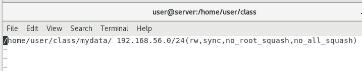

- [x] Week01: SSH
- [x] Week02: NFS
- [x] Week03: SAMBA
- [x] Week05: ngrok
- [x] Week07: pptpd(VPN)
- [x] Week10: NAT
- [x] Week11: network and NetworkManager
- [x] Week12: TCP/IP server
- [x] Week12: talnet
- [x] Week13: LAMP(Linux Apache MySQL PHP)
- [x] Week14: Apache user
- [x] Week15: virtual host
- [x] Week15: FTP


# basic

## network and NetworkManager

(week11)

```sh
$ systemctl stop NetworkManager
$ systemctl start network 
```

add new file (or add to the file end)

`vim /etc/sysconfig/network-scripts/ifcfg-enp0s3` 

```sh
DEVICE="enp0s3" 
NAME="enp0s3"
HARDWARE="08:00:27:4a:b0:ac" 
ONBOOT=yes
BOOTPROTO=static
IPADDR=10.0.2.100
NETMASK=255.255.255.0
GATWAY=10.0.2.2
```


## SSH

(week01)

> no password login

```sh
$ hostnamectl set-hostname your_name
$ vim /etc/hosts
$ ping centos7-1
```


server

```sh
$ getenforce  # 如果是enforce就要設定下面選項
$ setenforce 0  # 暫時設定
$ systemctl disable firewalld
```

client

```sh
$ ssh-keygen # 產生公鑰和私鑰
$ ssh-copy-id root@server
$ ssh root@server  # 使用SSH直接登入
```


> SCP copy file

```sh
$ touch a.txt
$ scp a.txt root@server:/root/  # 拷貝本地檔案到另外一台機器
```


## FTP

(week15)

```sh
$ yum install vsftpd
$ systemctl start vsftpd
```

set anonymous login

```sh
$ chmod 777 /var/ftp/pub
$ vim /etc/vsftpd/vsftpd.conf
```

open permissions

```sh
anonymous_enable=YES
anon_upload_enable=YES
anon_mkdir_write_enable=YES
```

add permissions

```sh
anon_other_write_enable=YES
anon_world_readable_only=NO
anon_root=/var/ftp  
```

restart ftp

```sh
$ systemctl restart vsftpd
```


client


## SAMBA

(week03)

```sh
$ yum install samba samba-client samba-common -y
```

set password

```sh
$ smbpasswd -a user
```

> for all 

```sh
$ cd /
$ mkdir ForAll
$ chown nobody ./ForAll/  # 設定權限為nobody(設定沒有擁有者)
$ chmod 777 ./ForAll/  
$ vim /etc/samba/smb.conf
```

set config

```sh
[ForAll]
        comment = for all 
        path = /ForAll 
        read only = no  
        guest ok = yes  
        browseable = yes  
```


> for certain user

```sh
$ groupadd manager   # 創建manager 群組
$ gpasswd -a user manager   # 把user 加入 manager 群組
$ mkdir /ForUser
$ chmod 775 /ForUser    # 讓不是群組裡的人無法寫入
$ chown root:manager /ForUser
$ vim /etc/samba/smb.conf
```

set config

```sh
[ForUser]
        comment = for user 
        path = /ForUser 
        public = yes
        writeable = yes
        write list = @manager
        browseable = yes
```


restart

```sh
$ testparm  # 測試設定的參數有沒有問題
$ systemctl start smb
```


client

use window+R login and enter `\\Linuxr IP`

`net use * /delet`


## NFS 

(week02)

server

```sh
$ yum install nfs-utils
$ systemctl start rpcbind
$ systemctl start nfs
$ mkdir /home/user/mydata -p  # 參數p代表資料夾如果不存在就建立，存在就不建立，防呆的
$ chmod 755 /home/user/mydata
$ vim /etc/exports  # 修改檔案設定，分享檔案
```

`/home/user/mydata/ 192.168.56.0/24(rw,sync,no_root_squash,no_all_squash)`




```sh
$ sudo systemctl restart nfs
$ showmount -e localhost
```


client

```sh
$ yum install nfs-utils
$ systemctl enable rpcbind
$ systemctl start rpcbind

$ showmount -e 192.168.56.125  # 測試NFS Server

$ mkdir /home/user/test
$ mount -t nfs 192.168.56.125:/home/user/mydata /home/user/test  # -t代表使用甚麼類型進行掛載，這裡使用nfs，192.168.56.125(Server IP)
```


## talnet

(week12)

```sh
$ yum install -y telnet*
$ yum install -y xinetd
$ vim /etc/xinetd.d/telnet
```

set config

```sh
service telnet
{
  flage = REUSE
  socket_type = stream
  wait = no
  user = root
  server =/usr/sbin/in.telnetd
  log_on_failure += USERID
  disable = no
}
```


```sh
systemctl restart xinetd
ps -ef | grep xinetd  # 執行監控程式碼，有客戶端連進來，就會讓telnet運行
ps -ef | grep telnet  # 沒有客戶端，telnet不會執行
```


client 

login with putty


## TCP/IP server

(week12)

server

```
$ vim echo_server.py
```

`yum install python3`

```python
#!/usr/bin/env python3
import socket

serv = socket.socket(socket.AF_INET, socket.SOCK_STREAM)
serv.bind(('0.0.0.0', 9000))
serv.listen()

while True:
    conn, addr = serv.accept()
    print('Client from', addr)

    while True:
        data = conn.recv(1024)
        if not data: break
        conn.send(data)

    conn.close()
    print('Client disconnected')
```


```sh
$ chmod +x echo_server.py
$ vim /etc/systemd/system/echo_server.service
```

edit systemctl config

```sh
[Unit]
Description=Echo Server

[Service]
Type=simple
ExecStart=/opt/echo_server.py
Restart=always

[Install]
WantedBy=multi-user.target
```

set permission

```sh
$ chmod 644 /etc/systemd/system/echo_server.service
$ systemctl daemon-reload  # 重新載入 Systemd 設定檔
$ systemctl start echo_server  # 啟動自訂的 echo 伺服器
```


client connect

```sh
$ nc server 9000
```


## LAMP

(week13、week14、week15)

server

> http

```sh
$ yum install httpd
$ systemctl start httpd.service
```

> sql

```sh
$ yum install mariadb-server mariadb
$ systemctl start mariadb
# [Disallow root] and [Remove test] set N, and others enter(pass)
$ mysql_secure_installation  # set root passwd
$ mysql -u root -p  # open sql
```

db create

```sql
create database testdb;  
use testdb;  
create table addrbook(name varchar(50) not null, phone char(10));
insert into addrbook(name, phone) values ("aaa", "0912123456");
insert into addrbook(name, phone) values ("bbb", "0912123567");
select name,phone from addrbook;
```

> PHP

```sh
$ yum install php php-mysql php-fpm
$ systemctl restart httpd.service
$ vim /var/www/html/info.php
```

info.php

```php
<?php phpinfo(); ?>
```

test: http://192.168.56.125/info.php


> connect SQL, PHP and httpd

```
$ vim /var/www/html/Link.php
```

Link.php

```php
<?php
$servername="127.0.0.1";
$username="root";    
$password="centos";
$dbname="testdb";

$conn = new mysqli($servername, $username, $password, $dbname);

if($conn->connect_error){
    die("connection failed: " . $conn->connect_error);
}
else{
    echo "connect OK!" . "<br>";
}

$sql="select name,phone from addrbook";
$result=$conn->query($sql);

if($result->num_rows>0){
    while($row=$result->fetch_assoc()){
        echo "name: " . $row["name"] . "\tphone: " . $row["phone"] . "<br>";
    }
} else {
    echo "0 record";
}
?>
```


## Apache user

```
vim /etc/httpd/conf.d/userdir.conf
```

remove the annotation of userdir.conf

```sh
<IfModule mod_userdir.c>
    #
    # UserDir is disabled by default since it can confirm the presence
    # of a username on the system (depending on home directory
    # permissions).
    #
    # UserDir disabled

    #
    # To enable requests to /~user/ to serve the user's public_html
    # directory, remove the "UserDir disabled" line above, and uncomment
    # the following line instead:
    #
    UserDir public_html
</IfModule>
```

add file

```sh
$ systemctl restart httpd
$ mkdir /home/user/public_html
$ cd /home/user/public_html
$ echo "hi" > hi.htm
$ chmod 755 /home/user  # 讓使用者可以讀取，但不能寫入
```

test: http://192.168.56.125/~user/hi.htm


> link dir

use symbol link

```sh
$ cd /var/www/html
$ ln -s /home/user/web/mydata2 mydata
```

use Aliase

```sh
$ vim /etc/httpd/conf/httpd.conf
```

set config

```sh
Alias /mydata2 /home/user/web/mydata2
<Directory /home/user/web/mydata2>
  Require all granted
</Directory>
```

```sh
$ systemctl restart httpd
```


## virtual host

```sh
$ cd /var/www
$ mkdir a.com
$ mkdir b.com
$ echo "www.a.com" > ./a.com/index.html
$ echo "www.b.com" > ./b.com/index.html
$ cd /etc/httpd/conf.d
$ vim a.com.conf   
```

```sh
<VirtualHost *:80>
    ServerName a.com
    ServerAlias www.a.com
    ServerAdmin webmaster@a.com
    DocumentRoot /var/www/a.com

    <Directory /var/www/a.com>
        Options -Indexes +FollowSymLinks
        AllowOverride All
    </Directory>

    ErrorLog /var/log/httpd/a.com-error.log 
    CustomLog /var/log/httpd/a.com-access.log combined
</VirtualHost>
```

```sh
$ vim b.com.conf
```

```sh
<VirtualHost *:80>
    ServerName b.com
    ServerAlias www.b.com
    ServerAdmin webmaster@b.com
    DocumentRoot /var/www/b.com

    <Directory /var/www/b.com>
        Options -Indexes +FollowSymLinks
        AllowOverride All
    </Directory>

    ErrorLog /var/log/httpd/b.com-error.log 
    CustomLog /var/log/httpd/b.com-access.log combined
</VirtualHost>
```

```sh
$ systemctl restart httpd
```


client

windows: modify file: C:\Windows\System32\drivers\etc\hosts

```
192.168.56.125    www.a.com
192.168.56.125    www.b.com
```

and brows: http://192.168.56.125/www.a.com、http://192.168.56.125/www.b.com


> add secure file

```sh
$ vim /etc/httpd/conf.d/a.com.conf
```

```sh
<VirtualHost *:80>
    ServerName a.com
    ServerAlias www.a.com
    ServerAdmin webmaster@a.com
    DocumentRoot /var/www/a.com

    <Directory /var/www/a.com>
        Options Indexes FollowSymLinks
        AllowOverride All
    </Directory>
    
	<Directory /var/www/a.com/secure>
		AllowOverride AuthConfig
	</Directory>
	
    ErrorLog /var/log/httpd/a.com-error.log
    CustomLog /var/log/httpd/a.com-access.log combined
</VirtualHost>
```

add .htpasswd

```sh
$ cd /var/www/a.com
$ mkdir secure; cd secure
$ htpasswd -c .htpasswd user
$ vim .htaccess  # 創造.htaccess資料
```

set  .htaccess

```sh
AuthType Basic
AuthName "Private File Area"
AuthUserFile /var/www/a.com/secure/.htpasswd
Require valid-user
```


## ngrok

```sh
$ yum install epel-release  # 安裝第三方軟體資料庫
$ yum install snapd
$ systemctl enable --now snapd.socket
$ snap install ngrok  # 安裝ngrok
$ wget https://bin.equinox.io/c/bNyj1mQVY4c/ngrok-v3-stable-linux-amd64.tgz --no-check-certificate
$ tar xvfz ngrok-v3-stable-linux-amd64.tgz
$ ./ngrok config add-authtoken 2Fc3eFFyuuBla5103xkmrD9Zdu4_6JWnRE5ZgPx5Gi6ehP3V6
$ ./ngrok http 80
```

use forward to connect


# advance

## VPN

(week07)

```sh
$ yum install epel-release -y
$ yum clean all -y
$ yum update -y
$ yum install -y ppp pptpd  # ppp是撥接的程式，主要是要裝後面的pptpd
$ vim /etc/pptpd.conf
```

edit remote virtual interface

```sh
#localip 192.168.0.1
#remoteip 192.168.0.234-238,192.168.0.245
localip 192.168.0.1
remoteip 192.168.0.100-200
```


set account、servername、password and which IP can access

```sh
$ vim /etc/ppp/chap-secrets
```

```
# Secrets for authentication using CHAP
# client server secret IP addresses
test pptpd 123456 *    
```


add ifconfig ppp0 mtu 1472

```sh
$ vim /etc/ppp/ip-up
```

```
/etc/ppp/ip-up. ipv6to4 ${LOGDEVICE}
[ -x /etc/ppp/ip-up.local ] && /etc/ppp/ip-up.local “$@”
ifconfig ppp0 mtu 1472
```


change computer to router mode

```sh
$ vim /etc/sysctl.conf
```
add to the end of file

```
net.ipv4.ip_forward = 1
```

parameter enabled

```sh
$ sysctl -p
```


client

use windows VPN


## NAT

(week10)

!! set vm to internal network(name must be same) !!

VM1: 192.168.0.1，private network

VM2: 192.168.0.254，NAT Server

VM3: 10.0.0.2，public IP


VM1: set ens33' IP and set default router

```sh
$ ip addr add 192.168.1.1/24 brd + dev enp0s3
$ ip route add default via 192.168.1.254
$ ip route show
```

VM2: set ens33' IP and set default router

```sh
$ ip addr add 192.168.1.254/24 brd + dev enp0s3
$ ip addr add 10.0.0.1/24 brd + dev enp0s8

$ ip route show
```

VM3: set ens33' IP and set default router

```sh
$ ip addr add 10.0.0.2/24 brd + dev enp0s3
$ ip route add default via 10.0.0.1
$ ip route show
```


if config is wrong, belowing comand can reset the certain network interface

```sh
$ ifconfig enp0s3 0
```


let VM2 become a router 

```sh
$ iptables -t nat -A POSTROUTING -s 192.168.1.0/24 -o enp0s8 -j MASQUERADE
$ echo 1 > /proc/sys/net/ipv4/ip_forward
```


VM1、VM2、VM3 test command

```sh
$ tcpdump -U -n -i enp0s3
```


