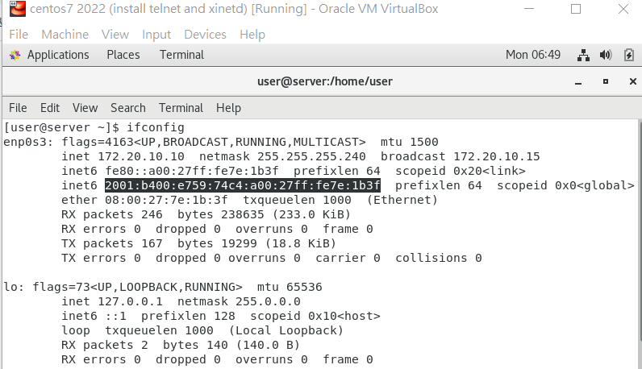

# server_concept

cluster: 集群

這學期主要會講伺服器的聚集、server farm，平行處理並提升效能，並可以增加伺服器穩定性

筆記參考: 

https://github.com/NubletZ/myNotes#linux%E7%B3%BB%E7%B5%B1%E8%87%AA%E5%8B%95%E5%8C%96%E9%81%8B%E7%B6%AD-automatic-operation-and-maintenance-for-linux-system

https://github.com/FUYUHSUAN/note/tree/master/110-2%E8%87%AA%E5%8B%95%E5%8C%96%E9%81%8


使用ansible自動化開發

kubernetes、prometheus、monitor

[SRE 、DevOps](https://medium.com/kkstream/好文翻譯-你在找的是-sre-還是-devops-2ded43c2852)

SRE: Site Reliability Engineering 

DevOpv: Develop、Operation


backup server: 使用watch dog監控伺服器主頁，透過比對內容檢查伺服器裡面有沒有被竄改，如果有，那就進行還原

```sh
www server ---> backup server
                          | watch dog 
if hacker doctor the web ---> page ---> main page is wrong ---> watch dog recover
```


DB server: 伺服器加速資料庫存取

```sh
client ---> www --->  DB (on hardware)
       <---     <---
                                                      if no data
client ---> www --->  DB (on RAM; use redis or memcache) ---> DB (on hardware)
       <---     <---                                     <---
```


jumpServer: 跳板伺服器，規定存取限制，監控存取內容

```sh
data    data    data    data    data
  |       |       |       |       |
--------------jumpServer------------- <--- client
```


# IPv6_network

設定虛擬機的network，bridge mode，並設定支援IPv6的網路卡

網路介面卡設定


如果網路介面卡沒有可以選擇的

去網路共用中心設定 wifi (要使用的網路介面)然後選擇安裝，找到虛擬機的設定並加入下面的位置

C:\Program Files\Oracle\VirtualBox\drivers\network\netlwf


關閉防火牆

```sh
$ systemctl stop firewalld
# systemctl disable firewalld
$ setenforce 0
```

開啟伺服器

```sh
$ systemctl start httpd
# systemctl enable firewalld
```

連200開頭的ipv6網址



連接IPv6需要加上 http://[IPv6 addr]

只要手機有支援IPv6，就可以直接連到網路，沒有像是私有網路的問題

IPv6的位置超級長，所以可以使用: https://dynv6.com/，把address轉成domain name