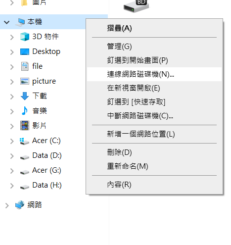

# WebDAV

如果網路空間很大，就可以把網路當作磁碟機，當作自己的雲端硬碟，可以建立備份

在local可以使用http，在雲端上在使用https架設

這個可以取代samba，如果使用https架設，安全性比較高，而且使用上也比較直觀


下面的方式是使用http建立，**如果是用https，那下面就會報錯!!**

安裝第三方資料庫，並進行更新，然後查看httpd有沒有支援dav

```sh
$ yum install epel-release
# $ yum update
$ httpd -M | grep dav
```

`httpd -M | grep dav` 要出現下面的圖片才有支援webDAV


建立網路磁碟資料夾，並把擁有者和使用者權限切成apache

```sh
$ mkdir /var/www/html/webdav
$ chown -R apache:apache /var/www/html
$ chmod -R 755 /var/www/html
```


新建並編輯webdav設定檔

```sh
$ vim /etc/httpd/conf.d/webdav.conf
```


使用webLock，放在port 80，並建立捷徑到root(alias)，[Directory](https://github.com/stereomp3/note/blob/main/linux/111semester01/15-.md#Access-Control)可以設定加密或是其他資料夾功能

```
DavLockDB /var/www/html/DavLock  
<VirtualHost *:80>
    ServerAdmin webmaster@localhost
    DocumentRoot /var/www/html/webdav/
    ErrorLog /var/log/httpd/error.log
    CustomLog /var/log/httpd/access.log combined
    Alias /webdav /var/www/html/webdav
    <Directory /var/www/html/webdav>
        DAV On
        #AuthType Basic
        #AuthName "webdav"
        #AuthUserFile /etc/httpd/.htpasswd
        #Require valid-user
        </Directory>
</VirtualHost>
```


重啟服務

```sh
$ systemctl restart httpd
```

使用windows的網路磁碟機，就可以把linux當作網路硬碟使用了!




## 破解gpedit.msc

https://adersaytech.com/kb-article/enable-gpedit-on-home-edition.html

創建.bat檔案，然後以系統管理員身份執行

```
@echo off
pushd "%~dp0"
dir /b %SystemRoot%\servicing\Packages\Microsoft-Windows-GroupPolicy-ClientExtensions-Package~3*.mum >List.txt
dir /b %SystemRoot%\servicing\Packages\Microsoft-Windows-GroupPolicy-ClientTools-Package~3*.mum >>List.txt
for /f %%i in ('findstr /i . List.txt 2^>nul') do dism /online /norestart /add-package:"%SystemRoot%\servicing\Packages\%%i"
pause
```

最後win+R 輸入gpedit.msc就可以開了


# sed

Linux三劍客  `awk`、`grep`、`sed`

`sed`(stream editor)很常見，在寫腳本的時候很長會用到


```sh
$ cat <<EOF >settings.conf  # 把下面的內容放到settings.conf，直到打EOF
> name: Alan
> age: 18
> EOF
```


利用sed生成文件

> gen.sh: 創建一個生成文件(a.conf)的shell

```sh
echo "generate a.conf"

cat <<EOF >a.conf
name: Alan
age: 18
EOF
```

執行文件

```sh
$ bash gen.sh
```


> test.sh: 互動的用法，可以記錄使用者資訊然後再打印出來

`read -p "q" v `: 可以在螢幕上顯示`q`，並把使用者輸入紀錄到v

```
read -p "what's your name" name
read -p "what's your age" age

cat <<EOF >temp.sh
echo "hi " $name
echo "your age is: " $age
EOF
```


> 讓使用者輸入y才繼續的腳本

`[Yy]* )`: 一開始開頭輸入Y或是y就可以繼續

`* )`: 等於 c 的default，輸入其他的就直接離開

```sh
read -p "Do you want to continue? (Y/y for Yes, any other key for No)" answer
    case $anwer in
        [Yy]* ) echo "Program continues..."; break;;
        * ) echo "Program exits."; exit;;
    esac
```


常常使用sed做取代的功能

s: substitute(取代)、g: globally(全部)

`sed 's///g'`: 全部取代，如果不加g就是取代一個，中間不一定要使用/，也可以用其他符號，只要是三個就好了

```sh
$ cat setting.conf
name: Alan
age: 18
$ sed 's/Alan/Tom/' setting.conf  # 且顯示修改檔案內容，沒有改到原始檔案
$ sed -i 's/Alan/Tom/' setting.conf  # 修改原始檔案，且顯示修改檔案內容
```


## 正規表達式

`[0-9]+(\.[0-9]*)?`: 可以出來 3.72、32、245.7191

- `[0-9]+`: 0到9選擇一個數，選擇1次以上

- `(\.[0-9]*)? `: (. + 0到9選擇一個數，選擇0次以上)，可以選擇不執行(執行1次或是0次)

- 在正規表達式.有特殊涵意(代表所有字元)，要用.字符需要在前面加\

- `[a-zA-Z]`: 代表所有字母

- `^...`: 以...為開頭

- `...$`: 以...為結尾

- `^$`: 空白行(space line；縮進)

  d: delet(刪除)，代表匹配的就刪掉

  ```
  $ cat <<EOF >b.txt
  > aa
  > 
  > 
  > abb
  > EOF
  $ sed '/^$/d' b.txt
  aa
  abb
  ```

  字串抓取

  ```sh
  $ echo "1234abc" | grep ".*"   # 1234abc紅色ㄋ
  1234abc
  $ echo "1234abc" | grep "3.*"  # 34abc紅色
  1234abc
  ```

  特殊符號處裡，加上\

  ```sh
  $ cat bb
  abc d e123
  aaa
  $ sed 's#abc\ d#a\ bcd#' bb     # 使用#隔開，比較好區分
  a bcd e123
  aaa
  ```

  去除空白，`[ \t]`代表匹派其中任何一個字，這邊匹配空白和tab

  ```sh
  $ cat cc
    aa
  aa
      bb
  bb
  	cc
  cc
  $ sed 's#^[ \t]*##' cc
  aa
  aa
  bb
  bb
  cc
  cc
  $ sed '#^[ \t]*#d' cc
  ```

  `&`: 代表匹配到的所有文字，`.*`代表所有文字

  ```sh
  $ echo "1234" | sed 's/.*/(&)/'
  (1234)
  $ echo "1234" | sed 's/.*/#&/'  # 可以把shell內容加上註解
  #1234
  ```

  
