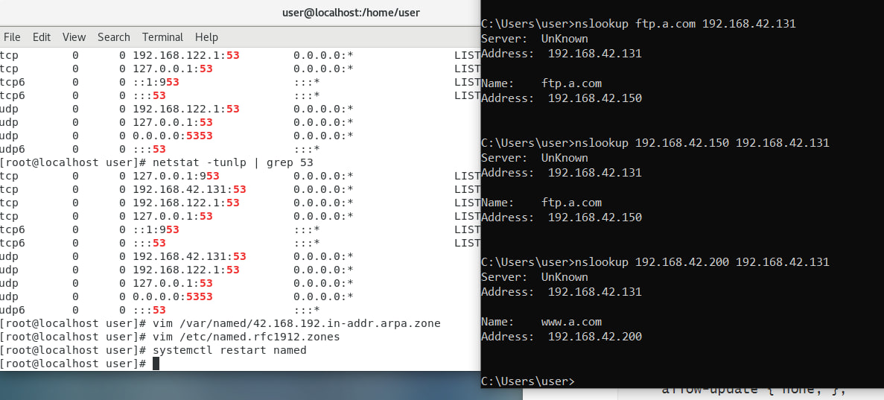

# DNS_server

> voice chatGPT: 可以在google chrome的擴充套件中使用，可以讓網站版的ChatGPT可以使用語音輸入，可以練習 oral speaking


第十七章-名稱伺服器架設


要連線會先到`/etc/hosts`尋找Domain Name對應到的IP，如果沒有找到就會去`DNS caches`，再沒找到最後就會去`DNS server`(使用UTP連線)

設立DNS Server要使用到bind，世界上有13台DNS Server在記錄


FQTN: domain name + dot (`www.a.com.`; 最後一個點是root，後面可以接很多像是`uk`、`tw`、`gov`...) 

```
    DNS server   -0   a.com.tw  
0 ----- 0 ------ -0   a.com.gov
                 -0   a.com.uk
```


DNS server其實就是一個資料庫，裡面存domain name對應IP的資訊

一個名稱對應一個IP位置，就是A紀錄

如果是對應IPv6，就是AAAA紀錄

| 紀錄類型 | 意義                      | 值                             |
| -------- | ------------------------- | ------------------------------ |
| SQA      | 權限開始(權限有效期間)    | 網域的參數                     |
| NS       | DNS 伺服器                | 此網域的DNS伺服器名稱          |
| MX       | 郵件交換器                | 此網域的郵件伺服器名稱和優先度 |
| A        | 位置                      | 電腦的IP位置                   |
| PTR      | 指標(查詢給你domain name) | 電腦的名稱                     |
| CNAME    | 標準名稱(取別名)          | 電腦的別名                     |


> use dnn on windows

在windows上問DNS server

```sh
# csie.nqu.edu.tw 系的level，nqu.edu.tw(10.10.10.3) 學校的level(比較高)
nslookup csie.nqu.edu.tw 10.10.10.3  # 問金門大學的DNS server，顯示內網看到的位置
# 因為我們不在他的管轄範圍，所以會顯示未經授權的回答，他只能從歷史紀錄中判斷回答
nslookup csie.nqu.edu.tw 8.8.8.8  # 問google的DNS，顯示外網看到的位置
```


> Linux名稱查詢工具

dig: 查詢IP，比較簡單的工具 

```sh
$ cat /etc/resolv.conf  # DNS server lookup
$ dig www.nqu.edu.tw    # 會使用預設的DNS server查詢
$ dig @8.8.8.8 www.nqu.edu.tw
$ dig www.nqu.edu.tw ns  # 查看管理這個網域的DNS server是誰
```


host: 查IP位置，會出現條列式回應

```sh
$ host cise.nqu.edu.tw  # 會出來內網IP和外網路IP或是其他有綁定domain的所有IP
$ host cise.nqu.edu.tw 8.8.8.8
```


man: 查詢工具，看到裡面參數是使用 [] 包住的，可以省略


```sh
$ netstat -tunlp | grep 53  # 查看53號port(DNS S)有沒有被使用
```


```sh
$ kill -9 [53port PID]
$ yum install bind bind-chroot bind-utils
$ vim /etc/named.conf  # 修改配置檔，讓DNS server不只本地可以查詢
```

修改下面三個選項

```
listen-on port 53 { any; };        # { 127.0.0.1; } --> { any; }
listen-on-v6 port 53 { any; };     # { ::1; } --> { any; }
allow-query     { any; };          # { localhost; } --> { any; }
```


一開始的設定就是DNS server完全沒有管任何東西，只是把請求forward給另外一個DNS server並做查詢


```sh
$ systemctl restart named
$ systemctl status named
```

在使用window連接之前，記得把[防火牆關掉](https://github.com/stereomp3/note/blob/main/linux/110semester02/03.md#Linux%E6%8C%87%E4%BB%A4)


# 管理DnsServer

https://github.com/FUYUHSUAN/note/blob/master/110-%E4%BC%BA%E6%9C%8D%E5%99%A8%E6%9E%B6%E8%A8%AD/W12/note.md

## 正向解析

在`/var/named`下新增一個網域

```sh
$ vim /var/named/a.com.zone
```


```
$TTL 600 ;10 minutes

@ IN SOA	@ s110910541@student.nqu.edu.tw (
		2021031803 ;serial
		10800      ;refresh
		900        ;retry
		604800     ;expire
		86400      ;minimum
		)
@		NS    dns1.a.com.
dns.com.	A     192.168.42.131
dns1		A     192.168.42.131
www		A     192.168.42.150
eshop		CNAME www
ftp		A     192.168.42.150
abc		A     192.168.42.120
```

`$TTL 600`: cache的存活時間

`@`: 代表管理的這個zone，這代表a.com

`serial`: 給定序號，通常使用日期表示，後面加上版本(01、02、03....)

```sh
$ vim /etc/named.rfc1912.zones
```

在最後加上

```
zone "a.com" IN {
	type master;
	file "a.com.zone";
	allow-update { none; };
};
```

檢查參數並重啟

```sh
$ named-checkconf
$ systemctl restart named
```


## 反向解析

IP 查詢 domain name

編輯配置檔案

```sh
$ vim /var/named/42.168.192.in-addr.arpa.zone
```


```
@ IN SOA	@ s110910541@student.nqu.edu.tw (
		2021031803 ;serial
		10800      ;refresh
		900        ;retry
		604800     ;expire
		86400      ;minimum
		)

42.168.192.in-addr.arpa.    IN  NS dns1.a.com.
42.168.192.in-addr.arpa.    IN  NS dns2.a.com.

200.42.168.192.in-addr.arpa.  IN PTR www.a.com.
150.42.168.192.in-addr.arpa.  IN PTR ftp.a.com.
```


```
vim /etc/named.rfc1912.zones
```

在最後加上

```
zone "42.168.192.in-addr.arpa" IN {
	type master;
	file "42.168.192.in-addr.arpa.zone";
	allow-update { none; };
};
```


檢查參數並重啟

```sh
$ named-checkconf
$ systemctl restart named
```





更新時間:`ntpdate watch.stdtime.gov.tw`