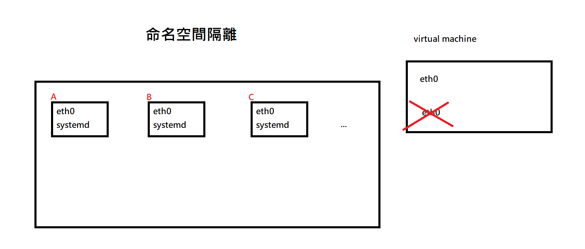
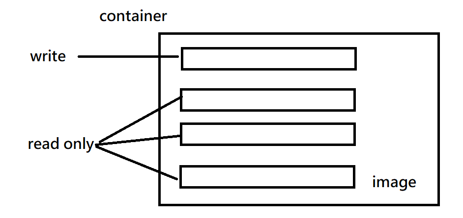

# docker

> docker introduction

docker最主要的技術有兩個: 隔離和Cgroup

傳統虛擬化(virtual box、vmware、KVM...)的技術和容器(docker)的技術比對，VM的Hypervisor很吃資源，因為這個是在模擬硬體，但安全性會比較高


這兩個主要差別是在container使用的是使用隔離技術(命名空間隔離)，讓container比virtual machines更輕量



docker可以讓虛擬機跑很多台，資源站的比較少，讓機器運作速度較快，在雲端上很常被使用，可以快速讓開發的應用程式上線運作(使用container)

在不同docker虛擬機中，使用Cgroup(Linux control groups)控制資源管理的部分，分配每個命名空間的CPU


> docker install

https://docs.docker.com/engine/install/centos/

if install before, please uninstall old versions

```sh
$ sudo yum remove docker \
                  docker-client \
                  docker-client-latest \
                  docker-common \
                  docker-latest \
                  docker-latest-logrotate \
                  docker-logrotate \
                  docker-engine
```


```sh
$ sudo yum install -y yum-utils
$ sudo yum-config-manager \
    --add-repo \
    https://download.docker.com/linux/centos/docker-ce.repo
$ sudo yum install docker-ce docker-ce-cli containerd.io docker-buildx-plugin docker-compose-plugin
$ sudo systemctl start docker
```


> image and container

image和container的區別有點像是program和process的差別，program是死的，但它放入RAM裡面，就會變成process

image: 像是program，紀錄鏡像，一個image可以創造出多個container

container: 像是process，把image載入到RAM中就變container

每個image和container都有ID，系統顯示出來的只有前面的一小部分，其實ID有很長一段


在dockerhub上有需多image檔，可以讓我們直接使用環境


aufs(advanced multi-layered unification filesystem)

一個檔案系統的更動採用分層疊架的方式

更動檔案系統後，這個變動就成為一層每一層

只記錄與上一層的差異

所以docker如果沒有創造出新的鏡像(image)，重新開機就會把所有的紀錄都遺失



在可以write的部分，也是一層一層堆上去，新的資訊會疊在最上面


容器有以下幾點需要注意

* 一個容器只做一件事情就好，這樣容器比較好做擴張和維護

* 容器一定要一個程式碼一直執行，不然容器執行完就停掉了


> docker simple command

用來查看系統中有沒有任何的鏡像檔案

```sh
$ docker images
```

https://hub.docker.com/_/centos/tags

下載鏡像要注意它是給多少位元的PC，和x86 (amd64)或是arm架構，如果下載錯了，docker會跑不起來

```sh
$ docker pull centos:centos7.9.2009
```

docker鏡像名稱取名有一定格式，完整名稱由三個部分組成 `[存儲位置IP](官方可省略)/[擁有者](官方可省略)/[docker名稱:tag]`，上面的因為是官方的，所以只有`docker名稱:tag`


運行docker，這邊使用的是簡單的指令，也沒有跑bash，所以跑完它就關閉了

```sh
$ docker run centos:centos7.9.2009 echo "hello"
```


查看docker process

```sh
$ docker ps     # 查看目前執行的行程(查看容器狀態)
$ docker ps -a  # 查看有執行過的行程
```


docker刪除容器或鏡像或是行程

```sh
$ docker rm [name]
$ docker rm [ID]  # ID 可以只打前面幾個就好
```


```sh
$ docker pull busybox  # 只有寫容器名稱，就會抓下來最新的 latest
$ docker run -it busybox sh  # -it=iterative terminal (背景執行)  sh=shell
$ docker run -it --name b1 busybox sh   # 給容器b1的名字，docker ps可以看到
```

use other terminal

產生新的鏡像，保存舊鏡像做的更動

```sh
$ docker commit b1 busybox:0.1  # 把目前b1的container產生新鏡像，名稱為busybox:0.1
$ docker run -it --name b2 busybox:0.1 sh  # 跑新鏡像
```


刪除所有執行過的container

```sh
$ docker rm -f `docker ps -a -q`  # 顯示所有ID，然後刪掉所有docker container
```


docker可以執行本地端沒有的套件，可以直接讓我們直接使用複雜的環境，下面使用python環境作範例

```sh
$ docker pull python:3.9.16-slim
$ mkdir test-python3; cd test-python3
$ vim test.py
```

`-v`是把外面的Linux映射到docker裡面，這裡把`/root/test-python3`映射到docker的`/tmp`，這樣就可以到docker的tmp執行Linux裡面的python檔案

```sh
$ docker run -it -v /home/user/class/test_python:/tmp python:3.9.16-slim bash
```


```sh
$ docker run -it --name web centos:7.9.2009 bash
$ yum install httpd
```

use other terminal

```sh
$ docker commit web centos:0.01
```


# else

`/proc/sys/net/ipv4/ip_forward`

把這個檔案寫1就會有路由的功能，寫0就關閉

```sh
$ sudo echo 1 > /proc/sys/net/ipv4/ip_forward
```

如果使用user下這個指令，會出現permission deny

只要指令當中有`>`，就會出現permission deny，這時候要使用

```sh
$ sudo sh -c "echo 1 > /proc/sys/net/ipv4/ip_forward"
```

