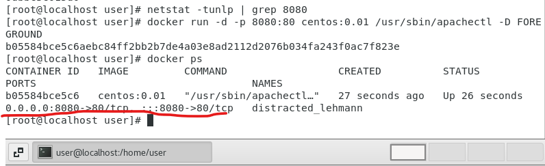

# docker

```sh
$ systemctl start docker
```


執行上禮拜安裝好的有httpd image的docker

```sh
$ docker run -it 
```

`-d`是讓容器在背景執行，這邊下的是跑httpd伺服器，讓伺服器在前景執行

```sh
$ docker run -d  centos:0.01 /usr/sbin/apachectl -D FOREGROUND
```


> test local port

先測試本地的port有沒有人用

```sh
$ netstat -tunlp | grep 8080
```

使用port binding讓docker和我們的host進行綁定，把docker裡面port 80的httpd綁到我們指定的port

```sh
$ docker run -d -p 8080:80 centos:0.01 /usr/sbin/apachectl -D FOREGROUND 
```


使用docker ps查看有沒有成功連線到本機，下圖可以看到`8080->80`，代表綁定成功，可以在`http://192.168.42.131:8080` (IP:port)中看到網頁伺服器

```sh
$ docker ps 
```




> build web in container

新增網頁

1. 進到容器裡面，然後進行編輯

    ```sh
    $ docker exec -it [name or container ID] bash
    # docker exec -it b05 bash
    $ cd /var/www/html
    $ echo "hi 123" > hi.htm
    ```

2. 把資料夾連結到docker(推薦)，資料和網站是分離的

   ```sh
   $ docker run -d -p 8000:80 -v /home/user/class/webs/myweb:/var/www/html --name myweb centos:0.01 /usr/sbin/apachectl -DFOREGROUND  
   ```

   

> web load balancing

我們可以使用這個方法(法2)，讓本地端架設很多個網站，這樣就可以達到附載均衡

```sh
$ docker run -d -p 8001:80 -v /home/user/class/webs/web1:/var/www/html --name web1 centos:0.01 /usr/sbin/apachectl -DFOREGROUND
$ docker run -d -p 8002:80 -v /home/user/class/webs/web2:/var/www/html --name web2 centos:0.01 /usr/sbin/apachectl -DFOREGROUND
....
```


擴容(scale up)，建立多個伺服器，讓單個伺服器負擔不會太重

> create_docker_httpd.sh: 創造5個容器，開啟5個httpd網頁伺服器，使用的頁面都同一個，如果要用多個網頁的話，可以把`i`變量放到`-v`後面的路徑上

```sh
#!/usr/bin/bash

for i in {1..5}
do 
    portno=`expr 8000 + $i`
    docker run -d -p $portno:80 -v /home/user/class/webs/web2:/var/www/html centos:0.01 /usr/sbin/apachectl -DFOREGROUND
done
```


```sh
$ chmod +x create_docker_httpd.sh
```


> virtual IP

LB(load balancer): 附載均衡器，有虛擬IP，外面的人連線到這個IP後，自動選擇後面的伺服器進行連線

參考網頁: [ref1](https://github.com/FUYUHSUAN/note/blob/master/110-2%E8%87%AA%E5%8B%95%E5%8C%96%E9%81%8B%E7%B6%AD/2022_03_16/note.md#haproxy)、[ref2](https://www.ltsplus.com/linux/rhel-centos-load-balancer-haproxy)

```sh
$ yum install haproxy openssl-devel
```


```sh
$ cd /etc/
```


`vim /etc/haproxy/haproxy.cfg`

添加下面的選項到文件最後面

frontend: 綁定host port

backend: 後面的連結伺服器

```sh
defaults
  mode http
  timeout client 10s
  timeout connect 5s
  timeout server 10s
  timeout http-request 10s

frontend myfrontend
  bind 0.0.0.0:8080
  default_backend myservers

backend myservers
  balance roundrobin
  server server1 192.168.42.131:8001
  server server2 192.168.42.131:8002
  server server3 192.168.42.131:8003
  server server4 192.168.42.131:8004
  server server5 192.168.42.131:8005
```


啟動附載均衡器

```sh
$ systemctl start haproxy
```


查看是否有執行在port 8080

```sh
$ netstat -tunlp | grep 8080
```


# docker_backup

打包鏡像檔案

```sh
$ docker save centos:0.01 > centos_web.tar
```

匯入鏡像檔案

```sh
$ docker load centos:0.01 < centos_web.tar
```


上傳鏡像到 [docker hub](https://hub.docker.com/)，完整名稱由三個部分組成 `[存儲位置IP](官方可省略)/[擁有者](官方可省略)/[docker名稱:tag]`，我們傳到官方，所以不用寫存儲位置IP

```sh
$ docker tag [ImageID] chungyen/centos:0.01
$ docker login  # 登入docker
$ docker push chungyen/centos:0.01  # 推鏡像
$ docker rmi centos:0.01            # 刪除本地鏡像
$ docker pull chungyen/centos:0.01  # 拉鏡像
```


# else


複製資料夾

```sh
$ cp -R [dir] [name]
```

創建多個資料夾

```sh
$ mkdir web{1..5}
```


刪除所有執行過的container

```sh
$ docker rm -f `docker ps -a -q`  # 顯示所有ID，然後刪掉所有docker container
```


```sh
$ rpm -qa | grep httpd
```

