# Docker_file

自動建立image檔案，檔案名稱必須為 `Dockerfile`，Dockerfile就很像是在寫腳本

如果要裝httpd在docker image裡面，就要先執行image然後安裝httpd最後再commit出來，步驟比較麻煩，但是如果使用Dockerfile，就可以使用下面的步驟產出有httpd的image

create index.html

```sh
echo hi > index.html
```


create Dockerfile

```sh
vim Dockerfile
```


```dockerfile
FROM centos:centos7.9.2009
RUN yum -y install httpd  # 自動確認
EXPOSE 80  # 跑在 80 port
ADD index.html /var/www/html  # 把本地端的index.html到docker裡面的/var/www/html
```


建立好Dockerfile後，可以使用

```sh
docker build -t centos:httpd .  # .代表Dockerfile
```


> docker httpd structure

最後鏡像的架構會向下圖

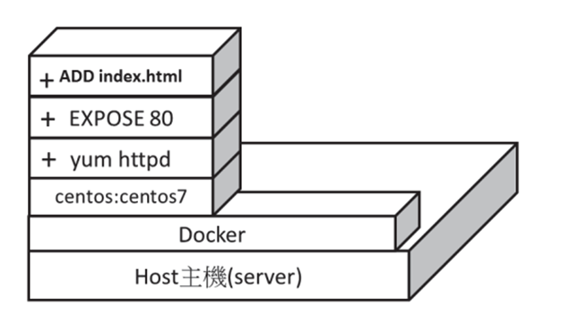


```
docker run -d -p 8888:80 centos:httpd /usr/sbin/apachectl -DFOREGROUND
docker ps  # 查看有沒有在跑
```


# Docker_compose

[docker compose](https://www.runoob.com/docker/docker-compose.html): 可以同時管理多個docker，使用docker compose可以自訂一虛擬機裡面的互連


K8S: 可以管理多台電腦裡面的docker

docker compose install: https://vocus.cc/article/5fbc6e73fd897800016cc9f6

```
su
curl -L "https://github.com/docker/compose/releases/download/1.27.4/docker-compose-$(uname -s)-$(uname -m)" -o /usr/local/bin/docker-compose
chmod +x /usr/local/bin/docker-compose
docker-compose --version
# ln -s /usr/local/bin/docker-compose /usr/bin/docker-compose  # 上面執行失敗，就執行這個
```


```
vim docker-compose.yml
```
寫yml檔案縮排一定要特別留意

```
version: '3'
services:
  web: 
    image: "centos:httpd"
    ports: 
      - "8899:80"
    command: "/usr/sbin/apachectl -DFOREGROUND"
```


```sh
docker-compose up -d  # -d: run in background
docker-compose ps  # 查看有沒有跑起來
docker-compose down  # 關閉所有docker-compose，一定要在有docker-compose.yml資料夾下執行
```


# jumpServer

junpServer可以是一台也可以是多台(load balance)，使用者登入到jumpServer，然後再連線到後面的資料。

在機房裡面有成千上萬台機器，如果要連線到其中某一台，又每一台都要使用帳號密碼連線，那這樣會很難做記憶，jumpServer就可以幫忙做這件事。

jumpServer可以幫忙紀錄所有事情(accounting)，像是某某工程師在幾點幾分動了甚麼資料然後毀屍滅跡...

jumpServer還可以限制指令，讓使用者不能輸入危險的指令，像是: `rm * .`

在安裝jumpServer的時候，CPU和RAM給多一點，不然會安裝很慢，因為jumpServer會錄影，所以通常伺服器上面建議要準備1~2TB的硬碟


> check up http port

確認80 port是否關閉

```
netstat -tunlp | grep 80
```

安裝jumpServer: https://github.com/wojiushixiaobai/Dockerfile

```sh
$ git clone --depth=1 https://github.com/wojiushixiaobai/Dockerfile.git
$ cd Dockerfile
$ cp config_example.conf .env
$ docker-compose -f docker-compose-network.yml -f docker-compose-redis.yml -f docker-compose-mariadb.yml -f docker-compose-init-db.yml up -d
$ docker exec -i jms_core bash -c './jms upgrade_db'
$ docker-compose -f docker-compose-network.yml -f docker-compose-redis.yml -f docker-compose-mariadb.yml -f docker-compose.yml up -d
```

出現下面的提示就是OK了

```
Recreating jms_core ... done
Creating jms_magnus ... done
Creating jms_lion   ... done
Creating jms_celery ... done
Creating jms_web    ... done
Creating jms_koko   ... done
```


跑好後到網頁輸入自己的IP位置(ex. `http://192.168.42.131/`)，他會自己轉入到jumpServer的登入頁面，預設的帳號和密碼都是`admin`，輸入後他會要你改密碼

jumpServer會有三種權限: Administrator、Auditor(稽核者)、normal user


我們要先創建使用者，然後再創建資產，之後再創建資產的普通用戶和系統用戶的SSH登入方式，最後新增應用權限


> 創建使用者

下面創建normal user, tom, passwd: centos

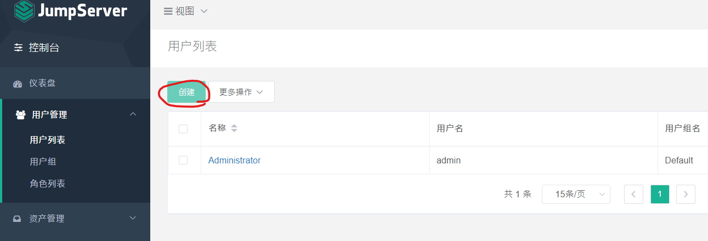

MFA是多重認證

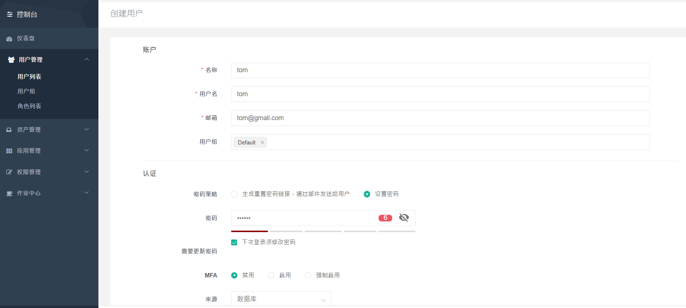

提交選單

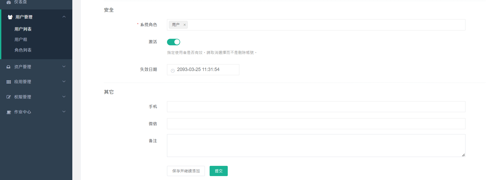


> 創建資產

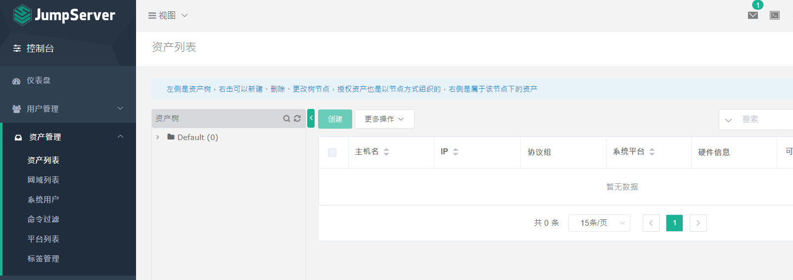


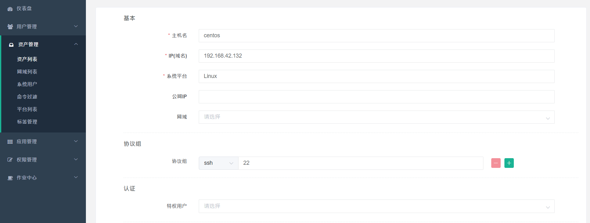

提交

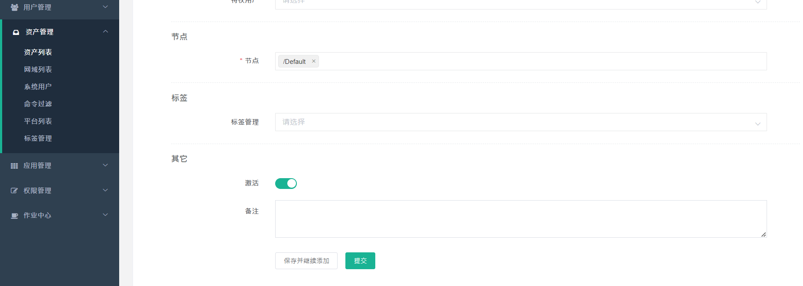

> 創建資產的普通用戶和系統用戶的SSH登入方式

注意，這邊的使用者和帳號密碼必須要要連接的虛擬機一樣!!

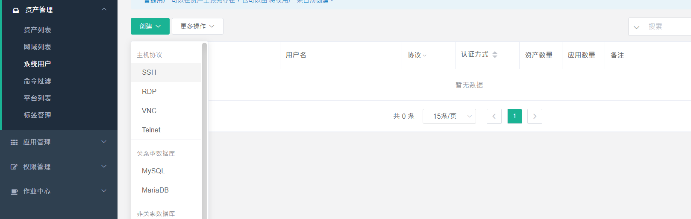

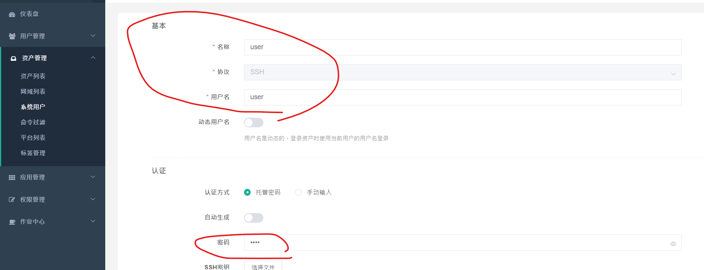

然後提交


> 創建root

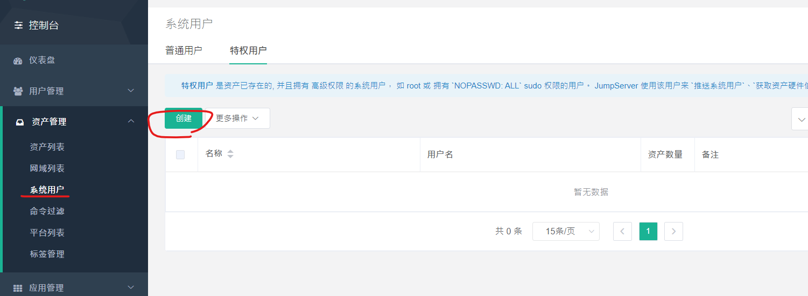

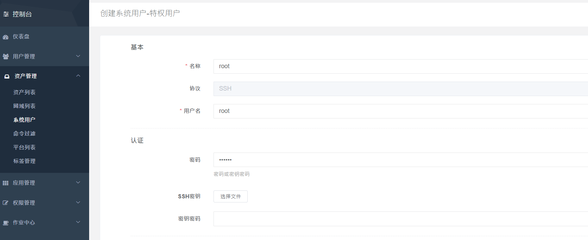

然後提交


> 新增資產授權

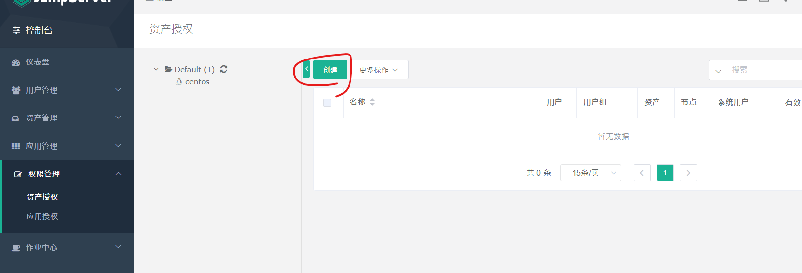

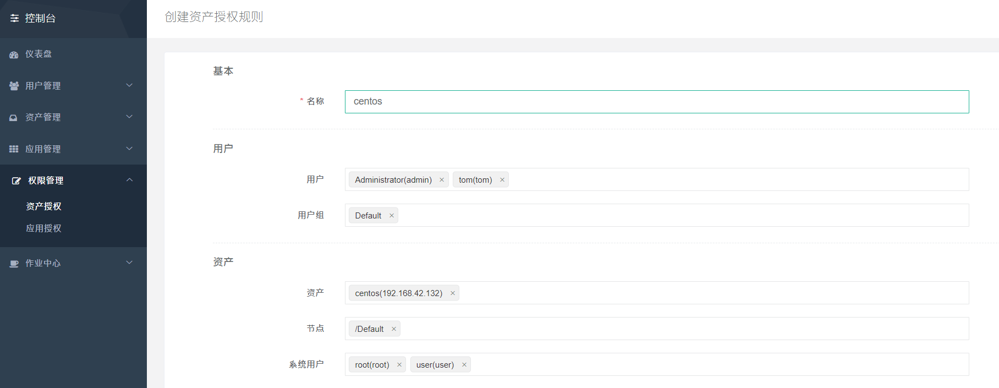


> check up asset

最後可以查看資產有沒有運行

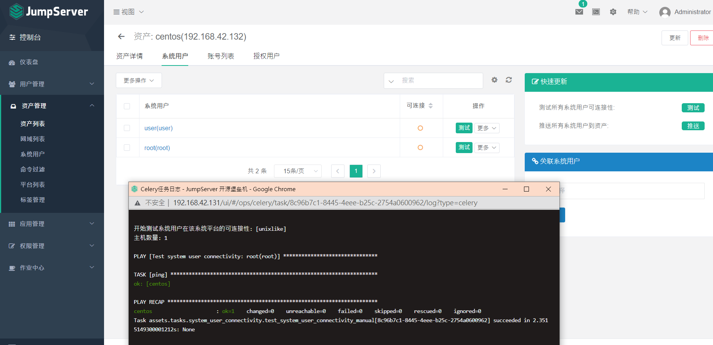

連接成功下面就會打勾

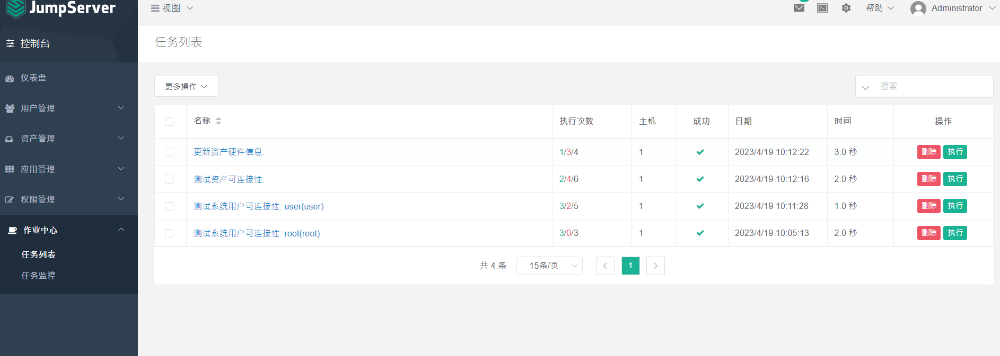

如果最後要關閉伺服器就使用下面的指令

```
docker-compose down
```


