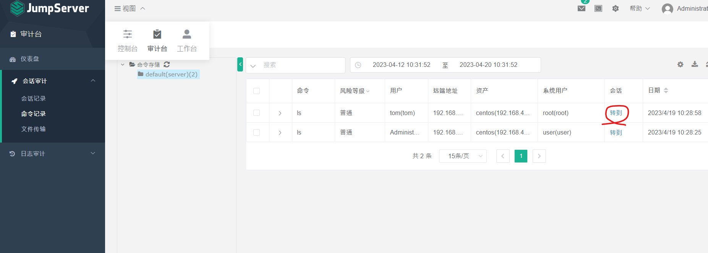

# jumpServer

安裝jumpServer在centos-1，裡面會有一個adminstrctor帳號，我們可以創建一個帳號，叫做tom，然後創建一個Asset，最後把Tom與centos-2做關聯，就可以使用centos-1的tom登入到centos-2裡面

安裝好jumpServer，就只需要下這個指令就可以開啟了(要先到jumpServer的Dockerfile下面)

```sh
$ docker-compose -f docker-compose-network.yml -f docker-compose-redis.yml -f docker-compose-mariadb.yml -f docker-compose.yml up -d
```


> check up web connection

使用自己的IP登入網站

帳號: admin,密碼: 自己設定(預設admin)

使用Web進行登入，測試自己的連線可不可以成功(注意，被連線的SSH要開啟)


> check up user operation video

進入Audit

在Session audit/command 可以看到使用者打得所有指令跟操作影片回放



跳到裡面後可以查看影片


> command filter

可以加入命令過濾的功能


創建完要禁用命令的對象後，新增要禁的命令

