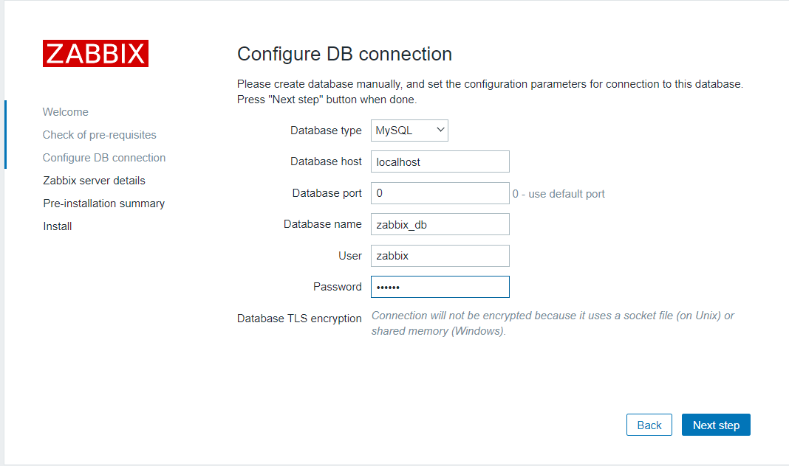
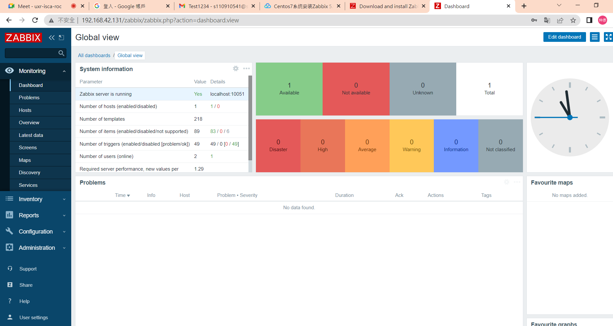
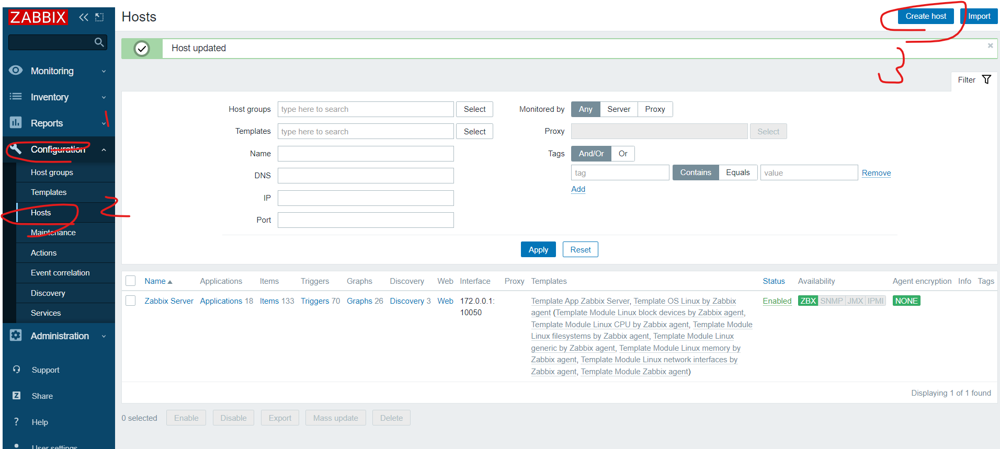
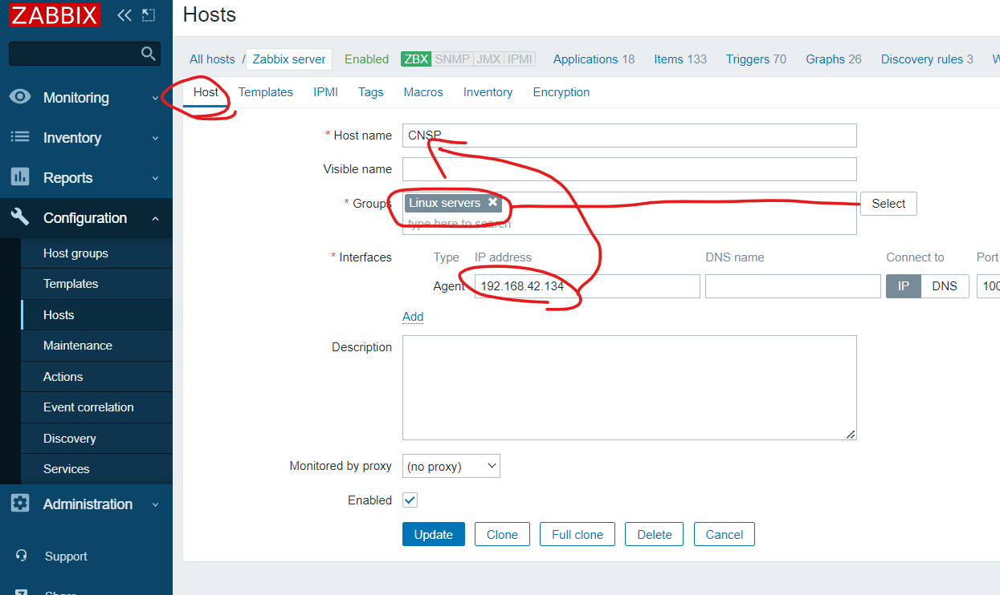
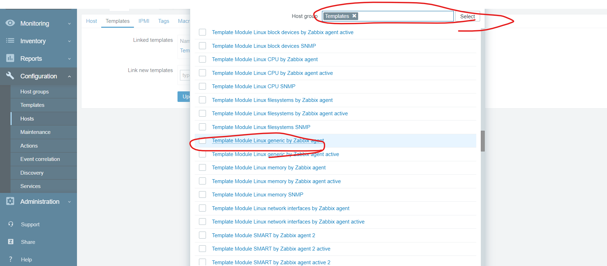
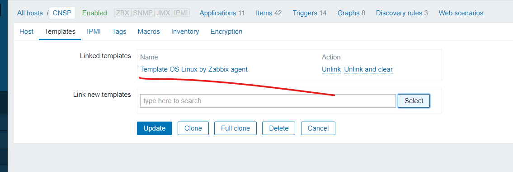
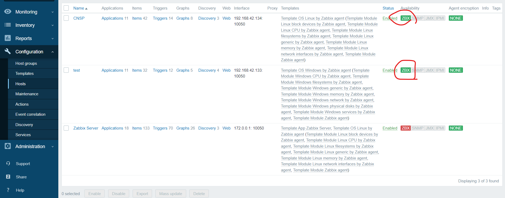

# monitor

監控

自動化控制所有虛擬機在職場上作用非常大，下列是常會用到的套件: 

nagios, zabbix, prometheus

這些軟體通常會有伺服器端(監控伺服器)和客戶端(被監控的電腦)

* 被監控的機器不需要安裝客戶端，只需要透過外在測試和觀察，就可以監控

* 安裝客戶端虛擬機定時監控磁碟使用、CPU loading，有兩種客戶端和伺服器端的傳遞方式
  * passive: 客戶端先存資料在本地端，server定時拿取資料
  * active: 客戶端自動把資料給server


有時候會有proxy，很多機器先給proxy，然後server再去跟proxy要資料


當有事情發生了(CPU不足、磁碟過載...)，用自動化的方式傳送email或是Line到負責人那裏


## 架設伺服器端

email

如果沒有做以下設定，很容易當作垃圾信

申請密碼: [google application](https://accounts.google.com/signin/v2/challenge/pwd?TL=AG7eRGBC90AI0avzia3tk3BKNikl43pIRdQVlP-Wn17b8K4UNqG0NXT--mSG-CSc&cid=1&continue=https%3A%2F%2Fmyaccount.google.com%2Fapppasswords%3Fpli%3D1&flowName=GlifWebSignIn&ifkv=AQMjQ7Rb6G-SW9arLFVrVsozSYlLWL0mA7La0tPANx3AnR3SPT1o0KsTHKQ_fDElSi_bMeqQmFnVfw&rart=ANgoxcdxUvXg2fG67GbUbGGp5rBP4QL2tEtdWLC-P4Vp5YuaaFQFJtcivZ1phHGDrB_VoDqKtxEzTDyCBa6_FdgvtK-8EgDiSQ&sarp=1&scc=1&service=accountsettings&flowEntry=ServiceLogin)，選擇應用，然後點其他，打上隨便一個內容後按下生成就會拿到密碼

```
vim /etc/mail.rc
```

> 使用G移動到最下面，然後在末尾加上下列文字

```sh
set smtp-use-starttls
set ssl-verify=ignore
set nss-config-dir=/etc/pki/nssdb/
set from=[your email]
set smtp=smtp://smtp.gmail.com:587
set smtp-auth-user=[your email]
set smtp-auth-password=[google application passwd]
set smtp-auth=login
```

e.g.

```sh
set smtp-use-starttls
set ssl-verify=ignore
set nss-config-dir=/etc/pki/nssdb/
set from=ericjjkkhandsome@gmail.com
set smtp=smtp://smtp.gmail.com:587
set smtp-auth-user=ericjjkkhandsome@gmail.com
set smtp-auth-password=fnneeoycydyaqlsh
set smtp-auth=login
```


```sh
$ echo "hello world" | mail -v -s "Test1234" [測試信箱]
$ echo "hello world" | mail -v -s "Test1234" s110910541@student.nqu.edu.tw
```


# Zabbix

使用zabbix做監控系統，我們會使用到三台虛擬機

https://cloud.tencent.com/developer/article/1943154


```sh
$ sudo yum install mariadb-server mariadb -y
```

> set up db

db

> 設定root密碼，除了設定root外，其他選項Disallow root和Remove test選n，其他都Enter跳過

```sh
$ mysql_secure_installation 
```

登入db

```sh
$ mysql -u root -p
$ create database zabbix_db character set utf8 collate utf8_bin;
$ create user zabbix@localhost identified by 'centos';  # 設定密碼為centos
$ grant all privileges on zabbix_db.* to zabbix@localhost;  # 讓zabbix使用zabbix_db全部權限
$ quit;
```


> install zabbix

到[zabbix官網](https://www.zabbix.com/)下載[5.0LTS centos7的版本](https://www.zabbix.com/download?zabbix=5.0&os_distribution=centos&os_version=7&components=server_frontend_agent&db=mysql&ws=apache)，官網的指令如下

```sh
$ rpm -Uvh https://repo.zabbix.com/zabbix/5.0/rhel/7/x86_64/zabbix-release-5.0-1.el7.noarch.rpm
$ yum clean all
$ yum install zabbix-server-mysql zabbix-agent -y
$ yum install centos-release-scl -y
$ vim /etc/yum.repos.d/zabbix.repo
```

> 把enable改成1

```
[zabbix-frontend]
...
enabled=1
...
```

安裝前端軟體

```sh
$ yum install zabbix-web-mysql-scl zabbix-apache-conf-scl -y
```

導入zabbix數據，並輸入剛剛設定的密碼`centos`

```sh
$ zcat /usr/share/doc/zabbix-server-mysql*/create.sql.gz | mysql -uzabbix -p zabbix_db
```

修改帳號密碼

```sh
$ vim /etc/zabbix/zabbix_server.conf
```

> 新增DBPassword和修改DBName

```
DBName=zabbix_db
DBUser=zabbix
DBPassword=centos
```


修改時區

```sh
$ vim /etc/opt/rh/rh-php72/php-fpm.d/zabbix.conf
```

> 設定時區必須要把前面的分號拿掉!

```
php_value[date.timezone] = Asia/Taipei
```

重啟zabbix

```sh
$ systemctl restart zabbix-server zabbix-agent httpd rh-php72-php-fpm
$ systemctl enable zabbix-server zabbix-agent httpd rh-php72-php-fpm
```


> set up zabbix website

開啟http://192.168.42.131/zabbix/setup.php (http://[ip]/zabbix)，就可以看到zabbix的主頁面了

在確認所有功能都OK，就填入必要資訊



後面的步驟，直接使用默認的就OK了，按下next step直到結束


登入使用默認帳號: Admin, 密碼: zabbix，成功就可以進到下面的介面




## 架設客戶端

https://computingforgeeks.com/install-and-configure-zabbix-agent-on-centos/

> install zabbix client

安裝zabbix到兩台client上

```sh
$ sudo yum install https://repo.zabbix.com/zabbix/5.0/rhel/7/x86_64/zabbix-release-$ 5.0-1.el7.noarch.rpm -y
$ sudo yum install vim zabbix-agent zabbix-sender -y
$ sudo vim /etc/zabbix/zabbix_agentd.conf
```

> 下面三個選項作修改

```
Server=[伺服器IP]
ServerActive=[伺服器IP]
Hostname=[自己主機叫做什麼就改成什麼]
```

e.g

```
Server=192.168.42.131
ServerActive=192.168.42.131
Hostname=test
```


```sh
$ sudo systemctl start zabbix-agent
$ sudo systemctl enable zabbix-agent
$ sudo systemctl status zabbix-agent
```

查看有沒有運作

```sh
$ netstat -tunlp | grep zabbix
```


## 設定伺服器端的客戶端連線

伺服器端設定要連線的client端






然後點選update


> use template

選取要使用的模板模板，加入到設定裡面



完成後會看到下圖




> test client

最後兩台都設立完畢就會看到下圖!




在server端上安裝手動測試client端的套件

```sh
$ yum install zabbix_get -y 
$ zabbix_get -s 192.168.42.133 -p 10050 -k "system.hostname"  # 詢問client hostname
```

