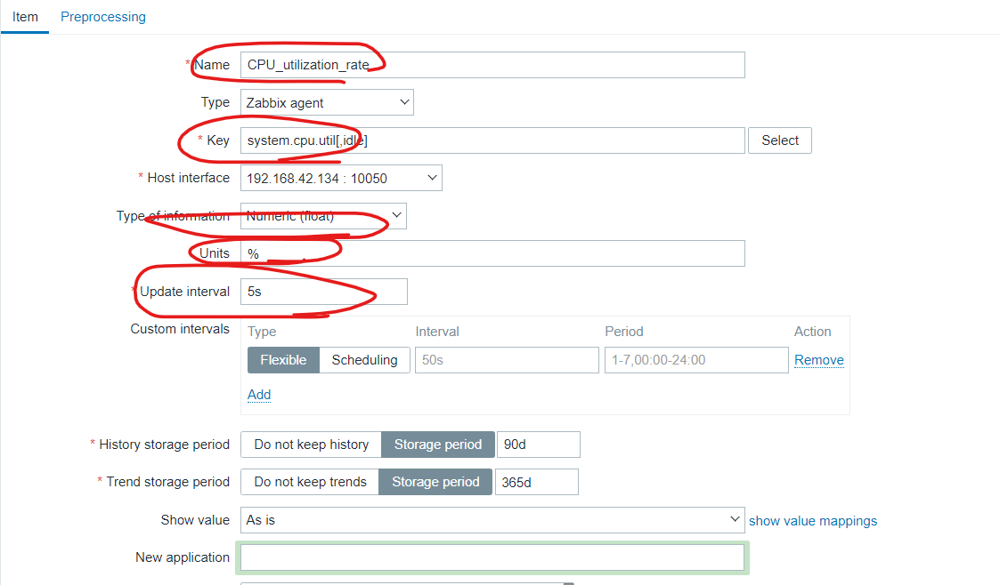
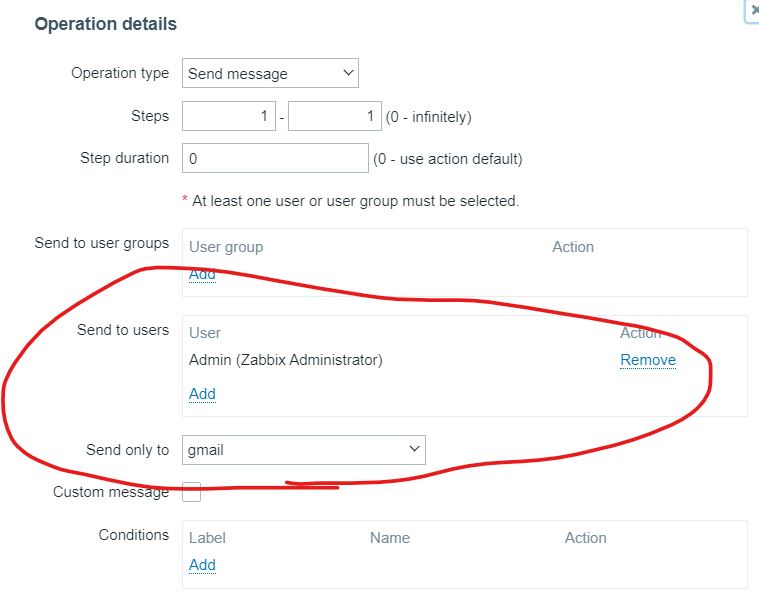
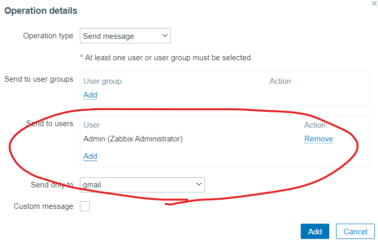

# zabbix

打開zabbix

```sh
$ sudo systemctl start mariadb
$ sudo systemctl start zabbix-agent
```

連上網路: https:[ip]zabbix(e.g. http://192.168.42.131/zabbix)


Applications大項: CPU處裡、使用者處理時間、系統處理時間

item是細項: 真正的數據

trigger: 有問題出現時(use condition)，提醒使用者(use mail)


這邊使用了template讓我們可以擁有很多監控項，下面介紹自己手動配置監控item

ref: https://www.yuque.com/fenghuo-tbnd9/ffmkvs/pspogt


> custom item

創造物件


> setup monitor options

手動查看監控項，每個監控項都有對應的key

```sh
$ zabbix-get -s 192.168.42.133 -p 10050 -k system.cpu.util[,idle]
```

記得要在idle time之前把CPU裡面的idle time刪掉，不然會重複



update interval 是回報速度，太頻繁傳送Server會太忙，圖上是1m但是會很久，所以其實是設定5s

下面選擇5s的就會看到剛剛創建的了


> setting param for item

接下來設定一下參數讓他比較好看


使用javaScript讓值可以正常顯示


測試值是否可以正常顯示


> create trigger

添加trigger


裡面Expression的部分可以使用ADD設定條件，他會自動會幫你產生


測試，讓電腦一直做hash運算

```sh
$ cat /dev/urandom | md5sum
```

也可以使用top做測試

```sh
$ top
```


> lookup warning with graph

過一陣子，就可以從 monitor/dashboard裡面看到 cpu_uitilization_rate..... waring的警告


也可以使用圖形查看變化量


當CPU使用率下降後，設定的警告也會跟著消失


> send email

接下來就使用email寄信看看吧，email上禮拜有設定過了，直接測試

```sh
$ echo "hello world" | mail -v -s "Test1234" s110910541@student.nqu.edu.tw
```

從2.4開始做: https://www.yuque.com/fenghuo-tbnd9/ffmkvs/mempmphi0ozeckdf#JqvfB

```sh
$ vim /usr/lib/zabbix/alertscripts/mailx.sh
```

$1變數一: 寄給誰  $2變數二: 標題   $3變數三: 寄給誰

```
#!/usr/bin/bash
#send mail
messages=`echo $3 | tr '\r\n' '\n'`
subject=`echo $2  | tr '\r\n' '\n'`
echo "${messages}"| mail -s "${subject}" $1 2>&1
```

```sh
$ chmod +x /usr/lib/zabbix/alertscripts/mailx.sh
```


here

e.g. 

```
/usr/lib/zabbix/alertscripts/mailx.sh s110910541@student.nqu.edu.tw Test "hello world"
```


賦予權限讓腳本可以給zabbix執行

```sh
$ chown -R zabbix.zabbix /usr/lib/zabbix/
```


> setup media types

設定Media types，裡面設定要傳送email的對象和參數設定


設定三個參數` {ALERT.SENDTO} `、` {ALERT.SUBJECT} `、`{ALERT.MESSAGE}`，對應到前面mailx.sh的參數


成功就會在下面看到gmail


測試有沒有成功可以按下右側的Test，成功寄出就會顯示Media type test succcessful


> set up event

設定發生問題時，要做什麼事情，點進去剛剛設定好的gmail

設定gmail的message template


> set up notification

設定問題發生了由誰通知

選擇adminstration/Users，選擇裡面的Media，給Admin新增通知


點完add後要按下update


觸發事件要有動作，所以要去configuration/Actions 新增動作

設定警告大於warning才觸發動作


設定Operations，讓信件送給Admin，最後按下add


設定細項: 






> test for all operation

設定完成一樣使用下面指令做測試

```sh
$ cat /dev/urandom | md5sum
```

可以看到gmail送出了


CPU 過載和回復都會發送gmail到信箱裡面

