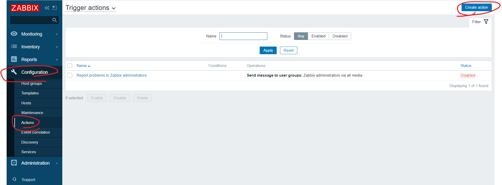
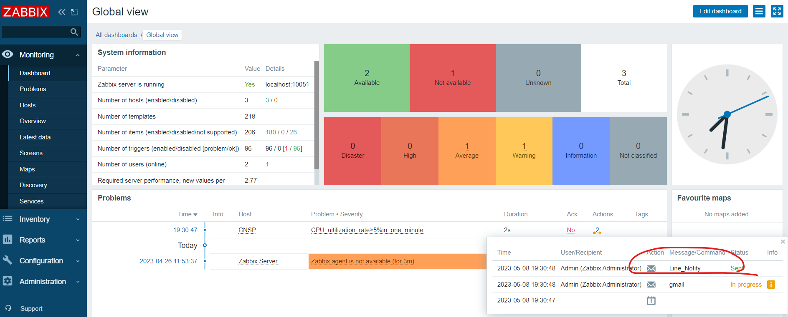
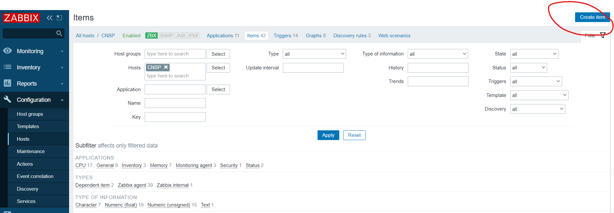

# Zabbix

## Line

email回應沒有這麼及時，所以觸發事件回應這禮拜使用Line來做通知

https://dotblogs.com.tw/xerion30476/2019/08/28/153643


> set up line config

登入Line: https://notify-bot.line.me/zh_TW/

登入帳號後，下拉選項，選取「個人頁面」→「發行權杖」→「透過1對1聊天接收LINE Notify的通知」


> set up zabbix alert script

name: Zabbix Server端

`hkRUvnDXxImW4XZwgv1gPxtxMbxtCDqsXrnbvdaqWN2`

`hkRUvnDXxImW4XZwgv1gPxtxMbxtCDqsXrnbvdaqWN2`


```sh
$ sudo vim /usr/lib/zabbix/alertscripts/line_notify.sh
```


```sh
#!/bin/bash
# LINE Notify Token - Media > "Send to".
TOKEN="hkRUvnDXxImW4XZwgv1gPxtxMbxtCDqsXrnbvdaqWN2"

# {ALERT.SUBJECT}
# subject="$1"

# {ALERT.MESSAGE}
message="$1"

curl https://notify-api.line.me/api/notify -H "Authorization: Bearer ${TOKEN}" -F "message=${message}"
```

設定權限

```sh
$ sudo chmod 755 /usr/lib/zabbix/alertscripts/line_notify.sh
$ sudo chown zabbix:zabbix /usr/lib/zabbix/alertscripts/line_notify.sh
```


> test with cmd

測試 (需要把Line Notify邀請到群組裡面)

```sh
$ /usr/lib/zabbix/alertscripts/line_notify.sh "send from 110910541's centos7"
```


> create media types

設定Media types，裡面設定要傳送Line的對象和參數設定


設定一個參數`{ALERT.MESSAGE}`


測試


> set up notification

設定發生問題時，要做什麼事情，點進去剛剛設定好的Line_Notify

設定Line_Notify的message template


設定問題發生了由誰通知

user -> admin -> media


名稱隨便設定，這邊設定Line


點完add後要按下update


> create action

新增action




設定動作

Line Notify

設定警告大於warning才觸發動作


>  set up operations


設定細項: 


設定完成一樣使用下面指令做測試

```sh
$ cat /dev/urandom | md5sum
```


> test for all operation

過一陣子，就可以從 monitor/dashboard裡面看到 cpu_uitilization_rate..... waring的警告，並看到Line送件成功





## custom_parameter

有時候zabbix沒有支援一些功能，我們可以自訂義系統變數，讓我們可以設定要監測甚麼


使用腳本查看`httpd`伺服器有沒有運作，利用`curl`做測試

add monitor item

```sh
$ vim /etc/zabbix/zabbix_agentd.conf
```

> look up httpd server with cmd 

```sh
$ UserParameter=test_param,curl 127.0.0.1> /dev/null 2>&1; if [ "$?" -eq "0" ]; then echo "1"; else echo "0"; fi
```

`UserParameter=[key], [shell]`


1丟到null，2丟到1的位置 (正確輸出(1)和錯誤輸出(2)都丟掉)

```sh
$ curl 127.0.0.1> /dev/null 2>&1
```

判斷前一個指令是否執行正確 (`$? == 0`)，如果有httpd就傳1 (前一個指令正確)，沒有就傳0 (前一個指令錯誤)

```
if [ "$?" -eq "0" ]; then echo "1"; else echo "0"; fi
```


```sh
$ sudo systemctl restart zabbix-agent
$ zabbix_get -s 192.168.42.133 -p 10050 -k "test_param"
```

> set up zabbix agent conf

如果出現 error: `BX_NOTSUPPORTED: Unsupported item key.`，需要在客戶端加上參數

```sh
$ vim /etc/zabbix/zabbix_agentd.conf
```

跟伺服器加在一樣的地方

```
UserParameter=test_param,curl 127.0.0.1> /dev/null 2>&1; if [ "$?" -eq "0" ]; then echo "1"; else echo "0"; fi
```


```sh
$ sudo systemctl restart zabbix-agent
```


> custom item





下面選擇5s的就會看到剛剛創建的了


圖片顯示

> test for item function


## 加分題

連線超過3台以上，發出警告

> edit zabbix agent config

```sh
$ vim /etc/zabbix/zabbix_agentd.conf
```


```sh
$ UserParameter=connections,netstat -an | grep "ESTABLISHED" | wc -l
```


```sh
$ sudo systemctl restart zabbix-agent
```

連線會比原本多一，因為伺服器連線過去也算一個連線

```sh
$ zabbix_get -s 192.168.42.133 -p 10050 -k connections
```


下面選擇5s的就會看到剛剛創建的了


添加trigger


裡面Expression的部分可以使用ADD設定條件，他會自動會幫你產生


Add 內容


然後就可以測試有沒有成功，使用putty或是ssh指令與目標設備連線

因為上面有已經有使用Line提醒設備了，所以就可以直接達到下面的效果


