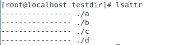
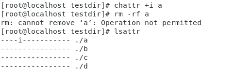
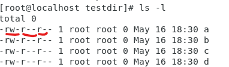
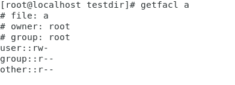
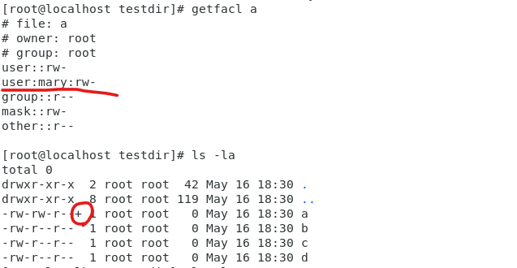
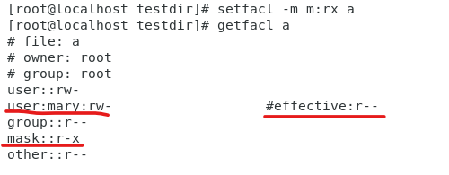

## charttr

linux高級檔案管理: https://blog.gtwang.org/linux/how-to-make-file-immutable-on-linux-chattr-command/

一般設定檔案權限，可以被root打破

這種高級屬性，可以預防root刪掉不可以刪掉的檔案


```sh
$ mkdir testdir; cd testdir
$ touch {a..d}
$ ls -l  # 查看屬性
$ cd ..
$ chmod u-w testdir/  # 拿掉創造者的w權限，讓他無法刪除資料夾，但是root一樣可以刪掉
```


```
$ lsattr
```



上圖代表所有資料夾都沒有檔案高級屬性


```sh
$ chattr +i a  # a文件加上 i lock，讓root不能修改新增刪除
$ chattr -i a  # 拿掉 i lock
```




```sh
$ chattr +a a  # a 文件加上 a lock，讓root只能追加文字，適合伺服器的log檔
$ echo "123" >> a  # 可以追加文字，但無法使用vim編輯
$ chattr -a a  # 拿掉 i lock
```

如果要針對目錄需要加上 `-R`，目錄裡面所有文件就會有 chattr lock了

```sh
$ chattr +i -R testdir
```


## ACL

access control list: https://ithelp.ithome.com.tw/articles/10221185


正常檔案權限只能有三種(owner, group, others 對應 read, write, execute)，無法針對單一使用者做檔案權限的控制




```sh
$ dmesg | grep -i acl  # -i不分大小寫  # 查詢系統支不支援ACL功能
```


```sh
id mary  # 直接顯示有沒有這個使用者

# 在腳本裡面的寫法
id mary > /dev/null 2>&1
echo $?  # 回傳0代表有這個使用者
```


```sh
$ useradd tom
$ useradd mary
```


查看ACL權限

```sh
$ getfacl a   # get file acl
```



修改ACL權限

```sh
$ setfacl -m u:mary:rw a  # -m代表修改權限，user: mary，添加可讀可寫權限
```



高級權限可以在 `ls -l` 裡面看到，會多一個+ㄎ


如果要針對群組設定，可以使用 g設定

````sh
$ setfacl -m g:test:wx a
````

也可以設定Mask，讓其他人無法設定超過Mask的權限

```sh
$ setfacl -m m:rx a
$ setfacl -m u:mary:rw a   # 最後只能拿到r
```




# Ansible

基於SSH做管理和維護，可以對一群電腦進行控制

設立三台機器，且每台主機名稱都設定完成

> no passwd login

[無密碼登入](https://github.com/stereomp3/note/blob/main/linux/111semester01/1-.md#SSH-server)

```sh
$ hostnamectl set-hostname centos7-1
$ bash
```


設定ssh key (可以直接enter跳過選項)

```sh
$ ssh-keygen
```


```sh
$ vim /etc/hosts
```

[](https://github.com/stereomp3/note/blob/main/linux/111semester01/picture/etc_host.png)

這樣就可以使用host name 直接連線到SSH

```sh
$ ssh-copy-id root@centos7-2
$ ssh-copy-id root@centos7-3
```

ssh連線

```sh
$ ssh root@centos7-2
```


```sh
$ systemctl start sshd  # client, [centos7-2, centos7-3]
$ yum install ansible   # server, [centos7-1]
```


> set up ansible hosts

```sh
$ vim /etc/ansible/hosts
```

伺服器通常是以功能或是作業系統去分類，這邊只有開兩台虛擬機，所以就簡單分兩類

```
[server1]
192.168.42.136  # centos7-2
[server2]
192.168.42.135  # centos7-3

[servers]
192.168.42.136
192.168.42.135
```


ansible 測試

````sh
$ ansible server1 -m ping  # -m代表module，這裡使用ping module
$ ansible servers -m ping
````


> ansible test

ansible操作有兩種模式:

ad hoc: 簡單測試不同模組，上面就是使用這樣的方式

```sh
$ ansible servers -m shell -a "chdir=/var/log cmd'ls -l | grep log'"
```


playbook: 寫成腳本執行，真正使用的方式，通常使用YAML編寫

```
cmd: ls -l | grep log
chdir:/var/log
```


查看ansible支援模組有沒有sql

```sh
$ ansible-doc -l | grep -i mysql
$ ansible-doc ping  # 詳細說明ping模組
$ ansible-doc -s ping  # 簡單說明ping模組  -s == summary
```

遠端指令 command，command是default模組，所以也可以直接使用

```sh
$ ansible servers -m command -a "ifconfig"  # -a代表參數
$ ansible servers -a "ifconfig ens33" 
```


並不是所有指令command都可以支援，如果使用像是 `|`、`>`...，在指令裡面，就會發生錯誤

command只能用在簡單的操作上面

所以要使用shell模組解決這個問題

```sh
$ ansible servers -m shell -a "ifconfig | grep -A 3 enp0s3"
$ ansible-doc -s shell  # 查看shell指令可以加入什麼參數
$ ansible servers -m shell -a "chdir=/tmp pwd"  # 使用參數改變目前資料夾位置  tmp
```

