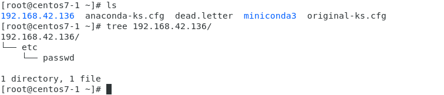
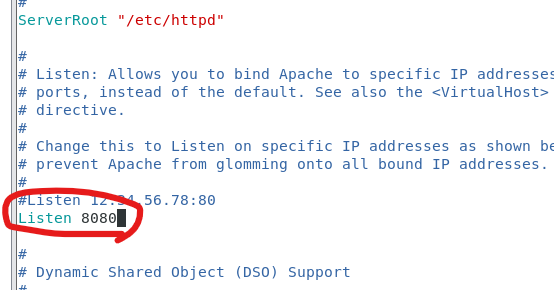

# Ansible

測試ansible (ping module)

!!注意!! 重新啟動虛擬機如果是使用dhcp IP位置可能會不見，建議使用固定IP

也可以設定配置檔案，改成目前IP`vim /etc/ansible/hosts`、`vim /etc/hosts`

```sh
$ ansible servers -m ping
```


```sh
$ ansible servers --list-hosts
```


> command module


查看目標開機多久

```sh
$ ansible servers -m command -a "uptime" 
```


查看使用者是否存在

```sh
$ ansible servers -m command -a "id user" 
```


> shell module


使用管道，抓取匹配的字後5行 (查看前5行 (-B 5))

```sh
$ ansible servers -m shell -a "ifconfig | grep -A 5 enps33" 
```


切換資料夾到tmp下，然後丟hi到a.txt

```sh
$ ansible-doc -s shell  # 查看shell指令可以加入什麼參數
$ ansible servers -m shell -a "chdir=/tmp cmd='echo hi>a.txt'" 
$ ansible servers -m shell -a "echo hi > /tmp/a.txt"  # 跟上面是一樣的效果
```


create後面的檔案存在，後面的指令就不會被執行

```sh
$ ansible servers -m shell -a "chdir=/tmp create=/etc/passwd cmd='echo hi'"  # 不執行ls
$ ansible servers -m shell -a "chdir=/tmp create=/etc/passwd@@ cmd='echo hi'" # 執行ls
```


> script module


建立腳本，並把腳本丟到指定主機上執行，並回傳

```sh
$ vim a.sh
```

```
echo "Hello world!"
```

```sh
$ ansible servers -m script -a "./a.sh"
```


查詢IP的腳本

```sh
$ vim get_ip.sh
```

```sh
result=`ifconfig | grep -A 5 ens33 | grep inet | grep -v inet6 | awk '{print $2}'`
echo $result
```

```sh
$ ansible servers -m script -a "./get_ip.sh"
```


> yum module


為server1安裝最新版本的httpd，如果安裝了就保持不變

```sh
$ ansible server1 -m yum -a "name=httpd state=absent" # 解除安裝
$ ansible server1 -m yum -a "name=httpd state=latest"  # state 裡面的文字可以使用ansible-doc查看
```

查看server1有沒有安裝成功httpd

```sh
$ ansible servers -m shell -a "rpm -qa | grep httpd"
```


安裝多個軟體，並查看有沒有安裝成功

```sh
$ ansible server1 -m yum -a "name=httpd,vsftp state=latest" 
$ ansible servers -m shell -a "rpm -qa | grep httpd; rpm -qa | grep vsftp"
```


> copy module


從本地複製檔案到遠端

```sh
$ echo "hello world" > /root/1.txt
```

backup: 如果目標有同名檔案，會先備份然後再傳送

可以設定檔案權限、owner和group

```sh
$ ansible server1 -m copy -a "src=/root/1.txt dest=/tmp/hi.txt backup=yes mode=664 owner=user group=user"
```
查看是否有成功複製到目標機器
```sh
$ ansible server1 -m shell -a "cat /tmp/hi.txt"
```


> fetch module


從遠端複製檔案到本地

```sh
$ ansible server1 -m fetch -a "src=/etc/passwd dest=/root"
```

ansible會把/etc/passwd建立在root下面，root下面會有server1的IP資料夾，結構會長像是下面這樣




> file module


file可以設定檔案的權限，刪除檔案，創建連結...

創建檔案並查看權限

```sh
$ ansible server1 -m shell -a "touch /tmp/test.txt"
$ ansible server1 -m shell -a "ls -l /tmp/test.txt"
```

修改檔案權限

```sh
$ ansible server1 -m file -a "path=/tmp/test.txt owner=user group=user mode=666"
```

重新查看檔案權限

```sh
$ ansible server1 -m shell -a "ls -l /tmp/test.txt"
```


刪除檔案

```sh
$ ansible server1 -m file -a "path=/tmp/test.txt state=absent"
```


創建資料夾並查看權限

```sh
# ansible server1 -m file -a "path=/tmp/testdir state=directory" # 可以使用file創建資料夾
$ ansible server1 -m command -a "mkdir -p /tmp/testdir"
$ ansible server1 -m command -a "ls -ld /tmp/testdir"
```

修改資料夾權限

```sh
$ ansible server1 -m file -a "path=/tmp/testdir mode=700"
```

刪除資料夾

```sh
$ ansible server1 -m file -a "path=/tmp/testdir state=absent"
```


建立軟連結並查看軟連結權限

```sh
$ ansible server1 -m file -a "src=/tmp/test.txt name=/root/1.txt state=link"
$ ansible server1 -m command -a "ls -l /root/1.txt"
```


> service module


使用service開啟httpd server

```sh
$ ansible server1 -m service -a "name=httpd state=started"
```

測試有沒有成功

```sh
$ curl 192.168.42.136
```

把html丟到http伺服器上，並抓取內容

```sh
echo "hi" > /root/hi.htm
$ ansible server1 -m copy -a "src=/root/hi.htm dest=/var/www/html/hi.htm"
curl 192.168.42.136/hi.htm
```


把httpd的80port改成8080

```sh
$ ansible server1 -m fetch -a "src=/etc/httpd/conf/httpd.conf dest=/root"
$ vim /root/192.168.42.136/etc/httpd/conf/httpd.conf  # IP位置會根據目標做改變
```


修改

```
Listen 8080
```



```sh
$ ansible server1 -m copy -a "src=/root/192.168.42.136/etc/httpd/conf/httpd.conf dest=/etc/httpd/conf/httpd.conf"
```


```sh
$ ansible server1 -m service -a "name=httpd state=restarted"
```


```sh
$ curl 192.168.42.136:8080/hi.htm
```


> group module


使用group創建群組

```sh
$ ansible server1 -m group -a "name=testgroup"
```

刪除群組

```sh
$ ansible server1 -m group -a 'name=testgroup state=absent'
```

測試群組有沒有存在

```sh
$ ansible server1 -m command -a 'getent group testgroup'
```


> user module


創建使用者 `name: 使用者名稱，group: 使用者所屬group，uid: user id，comment: 註解，home: 家目錄`

```sh
$ ansible server1 -m user -a 'name=testuser group=testgroup uid=1100 comment='peter' home=/home/testuser'
```

測試

```sh
$ ansible server1 -m command -a "id testuser"
# $ ansible server1 -m command -a 'getent passwd user'
```

刪除使用者

```sh
$ ansible server1 -m user -a 'name=testuser state=absent'
```


# link_command

指令串接`&&`、`||`、`;`

`前面; 後面`

`rpm -qa | grep httpd; rpm -qa | grep vsftp`

`&&`: 前面失敗後面不會執行，前面成功後面才執行

`||` : 前面成功後面執行，前面失敗後面執行

`; `  : 前面後面都會執行