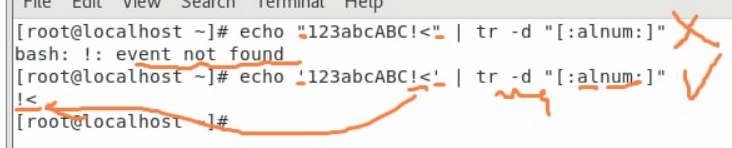

## ngrok

ngrok是在internet上的一個伺服器，可以裝在虛擬機上面，設定好了之後會跟ngrok server連線，可以讓外面世界可以傳送封包丟到自己的Linux


```sh
$ rpm -qa | grep httpd  # 查看伺服器有沒有安裝
$ yum install -y httpd  # 如果每有安裝，就安裝一下
$ systemctl status httpd  # 查看httpd是否開啟
$ systemctl start httpd  # 如果沒有開啟，就開一下
$ netstat -tunlp | grep 80  # tunlp 不解析，查看port
$ lsof -i:80  # 查看行程
```


```sh
vim /etc/httpd/conf/httpd.conf  # 是httpd的配製檔案，可以調整Port位置和設定
```


01

```sh
$ sudo yum install epel-release  # 安裝第三方軟體資料庫
$ sudo yum install snapd
$ sudo systemctl enable --now snapd.socket
$ sudo ln -s /var/lib/snapd/snap /snap  # 設定開機啟用
$ sudo snap install ngrok  # 安裝ngrok
```

02

```sh
wget https://bin.equinox.io/c/bNyj1mQVY4c/ngrok-v3-stable-linux-amd64.tgz --no-check-certificate
tar xvfz ngrok-v3-stable-linux-amd64.tgz
```


add ngrok config

```
./ngrok config add-authtoken 2Fc3eFFyuuBla5103xkmrD9Zdu4_6JWnRE5ZgPx5Gi6ehP3V6
```

```sh
./ngrok help
./ngrok http 80  # set http port
```

```sh
cd /var/www/html  # 這個是網路的家，可以加上檔案
```


使用forward的網址進行連線


-- 課本第十一章


# 好用的指令

du、df、dd、wc、tr

## du

查看磁碟的狀態，目錄空間使用量

`du [OPTION]... [FILE]...`

du: 查看當前目錄下的檔案磁碟空間使用量

| 參數          | 作用                                                         |
| ------------- | ------------------------------------------------------------ |
| -s  (summary) | 顯示目錄的總用量，不顯示子目錄                               |
| -h            | 轉成MB或是GB，可以讓我們一眼就知道，這個參數在很多地方都用的到(ls) |
| --max-depth=N | 限制只顯示至第N層子目錄，例如要列出/var下的第一層子目錄空間用量 |


`du -sh /home`: 查看home資料夾的磁碟使用量


## df

可以查看目前已經掛載的磁碟分割區(只要打上df就OK)

但是上面數字會很醜，所以通常都會使用 `df -h`

磁碟分割區一定會分出來的部分如下:

* `/dev/mapper/centos-root`: /  (根目錄)

* `tmpfs`: swap


`df -h`: 通常是管理者會用的指令，可以查看root磁碟使用量，如果root滿了，會導致無法進行讀寫。

`df -h | grep /* | awk '{print $5}' | tr "%" " "`

| 特殊符號 | 含意                                                   |
| -------- | ------------------------------------------------------ |
| \        | 跳脫字符，將特殊符號的特殊意義去除                     |
| *        | 代表重複0~無窮個字符的字符(.*代表任意字符重複0~無限次) |
| .        | 代表一定有任一字符的字符                               |
| s$       | 搜尋行末為s開始的那一行                                |
| ^s       | 搜尋行首為s開始的那一行                                |


`free -m`: 查看記憶體使用量，會顯示Mem和Swap，後面也可以加上-h


## dd

dd是複製檔案的指令，在早期UNIX通常是使用dd來將磁碟的檔案複製到另一個磁碟裡面，現在通常用來創造特定大小的檔案做測試使用

```sh
dd if=/dev/zero of=file3m bs=1M count=3 # dev/zero是零裝置，會給出很多的0，使用dd指令，讀取資料放到file3m，讀取1MB，讀取3次，所以會有3MB
```

這個在上禮拜有提過


## wc

統計檔案行數與字數(word count)，通常用來做統計用的

`wc [OPTION]... [FILE]...`

output without options: `line word character filename`

| 參數 | 作用                                     |
| ---- | ---------------------------------------- |
| -l   | 只顯示行數 (line)                        |
| -c   | 只顯示字元數  (character, include space) |
| -w   | 只顯示英文字節  (word)                   |


## tr

取代或是刪除(-d)字元

`tr [set or string] [replace set or string]`

| 集合      | 作用                           |
| --------- | ------------------------------ |
| [:alnum:] | 代表所有大小寫字母語數字的集合 |
| [:alpha:] | 代表所有大小寫字母的集合       |
| [:blank:] | 代表所有空白                   |
| [:digit:] | 代表所有數字的集合             |
| [:lower:] | 代表所有小寫字母的集合         |
| [:upper:] | 代表所有大寫字母的集合         |

取代

* `echo "ABCDd123@" | tr [:upper:] [:lower:]`:  output -> `abcdd123@`
* `echo "ABCDd123@" | tr "A" "F"`:  output -> `FBCDd123@`
* `echo "ABCDd123@" | tr [:alnum:] "#"`:  output -> `########@`
* `echo "ABCDd123@" | tr [:alpha:] "#"`:  output -> `#####123@`


刪除

* 在做刪除的時候，雙引號有可能會出錯，所以盡量還是使用單引號

  


* `echo 'ABCDd123@' | tr -d [:digit:]`:  output -> `ABCDd@`

* `echo '123abcABC!<' | tr -d "a-zA-B1-2"`:  output -> `3C!<`

  刪除 a~z、A~B、1~2 字符

* `echo '0931-123-456' | tr -d "-" | cut -c 1-4`: output -> 0931

   去掉-後，使用cut擷取前4個字元


## error

Another app is currently holding the yum lock; waiting for it to exit...

solution01:

```sh
$ rm -rf /var/run/yum.pid
```

solution02:

```sh
$ ps aux | grep yum
$ kill -9 pid
```


## reference

[ngrok 的設定，來架一個臨時伺服器！ - Askie's Coding Life](https://askie.today/ngrok-localhost-server-settings/)

[鳥哥的 Linux 私房菜 -- 第 9 堂課：正規表示法與 shell script 初探 (vbird.org)](http://old.linux.vbird.org/linux_basic_train/unit09.php)