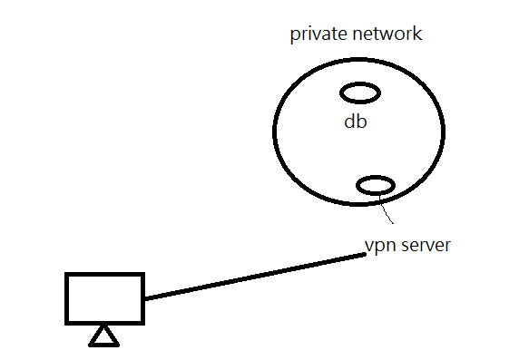
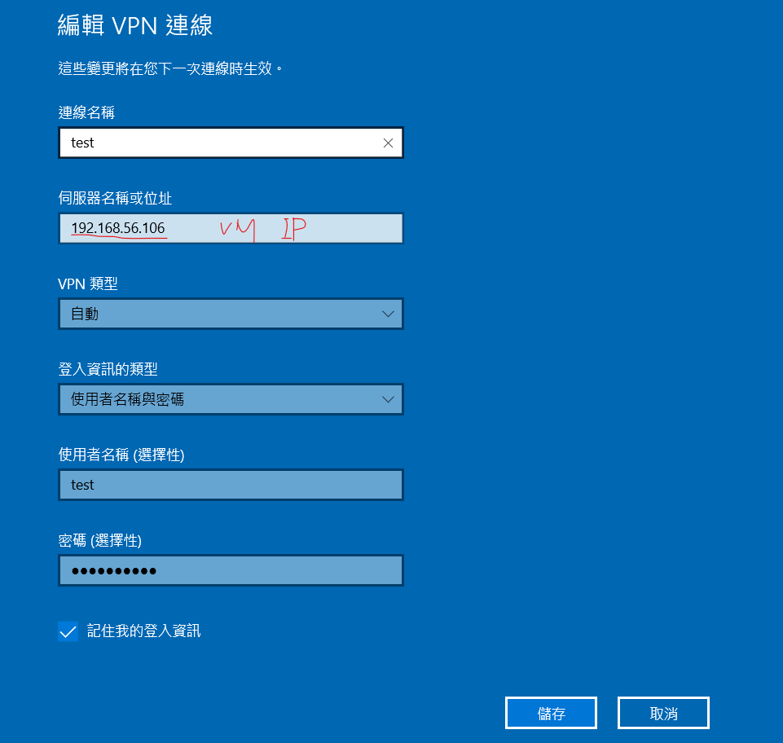
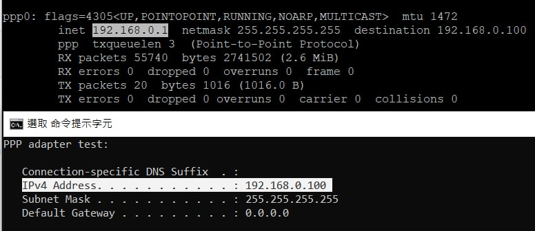
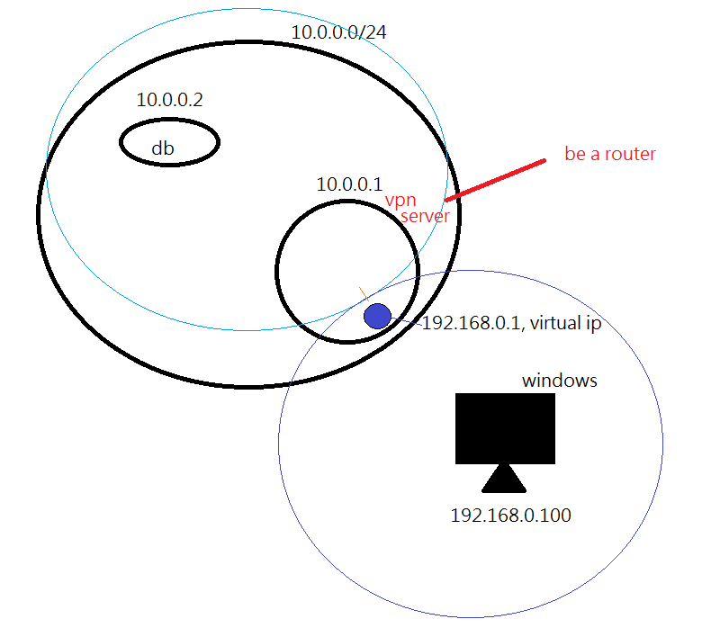

## pptpd

屬於VPN(virtual private network)服務的Server，VPN server有很多種(l2tpd、pptpd...)，這個只是其中的一種，pptp只能在兩個連接端點建立一個channel


VNP Server可以讓我們在家裡也可以連到公司的私有網路，如下圖



如果在大陸被鎖，可以在外面架設VPN Server，就可以瀏覽FB、IG...

Server

-- install

```sh
$ yum install -y ppp pptpd  # ppp是撥接的程式，主要是要裝後面的pptpd
```

ppp會有虛擬介面(Virtual interface)，在Vpn Server裡面


-- setup

```sh
$ vim /etc/pptpd.conf
```

```sh
#localip 192.168.0.1
#remoteip 192.168.0.234-238,192.168.0.245
localip 192.168.0.1
remoteip 192.168.0.100-200
```

remote ip 設定為可以給6個: 0.234、0.235、0.236、0.237、0.238、0.245

格式很彈性，可以自己定義


這個可以有也可以沒有，連到內部網路，不需要，但如果要從VPN server跳出去使用其他Network，才要設定這個DNS server的參數

```sh
$ vim /etc/ppp/options.pptpd
```

```sh
#ms-dns 10.0.0.1
#ms-dns 10.0.0.2
ms-dns 8.8.8.8
ms-dns 9.9.9.9
```


設定帳號跟密碼

```sh
$ vim /etc/ppp/chap-secrets
```

```
# Secrets for authentication using CHAP
# client server secret IP addresses
test pptpd 123456 *    
```

帳號(test)、伺服器名稱(pptpd)、密碼(123456)、可以從哪個IP進來(*代表都可以)


```sh
$ vim /etc/ppp/ip-up
```

```
/etc/ppp/ip-up. ipv6to4 ${LOGDEVICE}
[ -x /etc/ppp/ip-up.local ] && /etc/ppp/ip-up.local “$@”
ifconfig ppp0 mtu 1472
```

加入 ifconfig ppp0 mtu 1472


把電腦變成路由器模式(啟動防火牆轉發功能)，不然他會發訊息給其他電腦

```sh
$ vi /etc/sysctl.conf
```

```
net.ipv4.ip_forward = 1
```

加入到最下面


參數啟用(啟用上面的電腦變成路由器)

```sh
$ sysctl -p
```


要關閉防火牆，getenforce也要關

```sh
$ systemctl restart pptpd
```


連線到之後就可以使用Windows進行連接，



在同一台機器上做會無限循環，無法連到外網


下圖下面是Windows ipconfig，上面是Linux ifconfig




透過windows連線到10.0.0.1(target vpn)，然後建立192.168.0.1虛擬網路，電腦就會當作router運作，讓外部電腦可以存取內部網路(10.0.0.0/24)。

這個VPN Server會這個Mac不能使用，因為太陽春了




## L2TP VPN

比較難一點的VPN，可以在兩個連接端點建立多個channel，加分題


-- install

```sh
$ sudo yum install epel-release
$ wget https://dl.fedoraproject.org/pub/epel/epel-release-latest-7.noarch.rpm sudo rpm -Uvh epel-release-latest-7*.rpm
```


-- update package

```sh
$ yum install strongswan xl2tpd
```


-- setup

啟動防火牆轉發功能

```sh
$ vim /etc/sysctl.conf
```

```
net.ipv4.ip_forward = 1
```

加入到最下面

參數啟用

```sh
$ sysctl -p
```


設定PSK公鑰認證

```sh
$ vim /etc/strongswan/ipsec.secrets
```

```
: PSK "123456"
```

加入到最下面


設定I2tp.conf        192.168.56.106

```sh
$ vim /etc/xl2tpd/xl2tpd.conf
```

```
[global]
listen-addr = 192.168.56.106  # VPN主機IP

[lns default]
# VPN分配起始IP-VPN分配結束IP
ip range = 192.168.0.100-192.168.0.200
# VPN使用出口閘道
local ip = 192.168.0.1        
require chap = yes
refuse pap = yes
require authentication = yes
name = l2tpd
ppp debug = yes
pppoptfile = /etc/ppp/options.xl2tpd
length bit = yes
```

主要要改的只有有注解的部分


如果上面有設定pam驗證，就要設定這個

```sh
$ vim /etc/sysctl.conf
```

```
#%PAM-1.0
auth    required        pam_nologin.so
auth    required        pam_unix.so
account required        pam_unix.so
session required        pam_unix.so
```


設定PPP連線

```sh
$ vim /etc/ppp/options.xl2tpd
```

````
connect-delay 5000
login
````

在 `connect-delay 5000` 底下加上 `login`


設定連線的帳號密碼

```sh
$ vim /etc/ppp/chap-secrets
```


-- 啟動

```sh
$ strongswan start
```


設定開機自動啟用(可加可不加)

```sh
# systemctl strongswan.service start
# systemctl enable strongswan.service
# systemctl xl2tpd.service start
# systemctl enable xl2tpd.service
```


-- 課本第十一之二

# 好用的指令

ssh、scp、seq、sort、uniq、cut

## ssh

可以不登入就執行操作，會執行hostname後面的指令

```sh
$ ssh root@hostname ifconfig
$ ssh tom@192.168.5.6 cat /etc/hosts
```


## scp

跨主機複製檔案，利用SSH在不同主機上進行檔案的複製

```sh
# 複製檔案到目標位置
$ scp ./test.txt root@hostname:/tmp

# 拷貝test資料夾到目的端的tmp資料夾底下
$ scp -r test root@hostname:/tmp
```


## seq

產生數列

```sh
$ sep 1 10  # 1\n2\n3\n4\n5\n6\n7\n8\n9\n10
$ sep 1 2 10 # 1\n3\n5\n7\n9
$ sep 10 -2 1 # 10\n9\n8\n7\n6\n5\n4\n3\n2\n1

# -W 代表所有結果同寬度
$ sep -w 10 -1 1 # 10\n09\n08\n07\n06\n05\n04\n03\n02\n01 

# -s 代表改變文字中間的連接符號，預設為\n
$ sep -s '+' 1 5 # 1+2+3+4+5
```


可以搭配bc做使用，bc可以對標準輸出的內容進行運算

```sh
$ sep -s '+' 1 5 | bc # 15
```


seq通常是用在for迴圈，跟python的range()有點像

`` 代表先執行裡面的內容 !

> test.sh

```sh
for i in `seq 1 5`
do 
  echo $i
done

result=`seq -s + 1 2 99|bc`
echo $result
```

```
output: 1\n2\n3\n4\n5\n2500
```


```sh
for i in seq 1 5  # =  for i in "seq 1 5" 
do 
  echo $i
done
```

```
output: seq\n1\n5
```


> createFile.sh: 產生文件名到99，參數盡量使用${}誇號起來

```sh
#!/usr/bin/bash

mkdir -p test
cd test

for i in `seq -w 1 2 99`
do 
  touch test${i}
done
```


## sort

sort可以對文字檔案內的每一列進行排序(a-z A-Z)，如果文件的第一個字符是一樣的，會比較第二個，以此類推...

```sh
$ sort a.txt
```


## uniq

可以把相鄰且重複的多行合併成一行，需要搭配sort使用，才會把重複的刪除

```sh
$ sort a.txt | uniq
```


網頁統計分析常常會用到這個指令


> a.log

```sh
111.222.333.123 HOME - [01/Feb/1998:01:08:39 -0800] "GET /bannerad/ad.htm HTTP/1.0" 200 198 "http://www.referrer.com/bannerad/ba_intro.htm" "Mozilla/4.01 (Macintosh; I; PPC)"
111.222.333.123 HOME - [01/Feb/1998:01:08:46 -0800] "GET /bannerad/ad.htm HTTP/1.0" 200 28083 "http://www.referrer.com/bannerad/ba_intro.htm" "Mozilla/4.01 (Macintosh; I; PPC)"
111.222.333.123 AWAY - [01/Feb/1998:01:08:53 -0800] "GET /bannerad/ad7.gif HTTP/1.0" 200 9332 "http://www.referrer.com/bannerad/ba_ad.htm" "Mozilla/4.01 (Macintosh; I; PPC)"
111.222.333.123 AWAY - [01/Feb/1998:01:09:14 -0800] "GET /bannerad/click.htm HTTP/1.0" 200 207 "http://www.referrer.com/bannerad/menu.htm" "Mozilla/4.01 (Macintosh; I; PPC)"
```

讀取網頁伺服器的log檔案，查看IP存取網頁多少次

```sh
$ awk '{print $1}' a.log | grep 111.222.333.123 | wc -l
```


取第一個位置，分類然後把重複的去掉，最後看有幾行，代表有多少個IP存取網站

```sh
$ awk '{print $1}' a.log | sort | uniq | wc -l
```


## cut

擷取字串當中的子字串，可以用在大數據處理，處裡CSV檔案很有用

> test.txt  : csv檔的格式

```sh
tom, 22, 31000
jack, 21, 29500
eric, 18, 42000
```


```sh
# -d代表使用後面的符號作分割， -f代表取第n個 col，這邊取第二個col
$ cut -d "," -f 2 test.txt  

# awk功能更強，可以根據col做print, -F代表使用後面的符號作分割
$ awk -F, '{print $2 $1 $3}' test.txt  
```


cut通常會用在下面的情況，取一個片段

```sh
$ echo 123456789 > a.txt
$ cut -c 2-8 a.txt
```


-n代表依照數值大小排序，使用col 2(-k)進行排序，從小到大，如果在後面加上 -r，就會由大到小排序，

```sh
$ cut -d ',' -f 1,3 test.txt | tr "," " " | sort -n -k 2  
```


在(-t)代表Sort的時候跟他說哪個是分割符

```sh
$ cut -d ',' -f 1,3 test.txt | sort -g -k 2 -t "," 
```


> calculateSalary

```sh
for i in `seq 1 5`
do 
  echo $i
done

result=`seq -s + 1 2 99|bc`
echo $result
```

```sh
awk -F, '{print $3}' test.txt | tr "\n" "+" | bc
```

```sh
result=0
for i in `awk -F, '{print $3}' $1`
do 
  ((result = result + i))
done
echo "${result}"
```


## error

`no package pptpd availble`

```sh
$ yum install epel-release -y  # third part data base
$ yum install pptpd 
```


## Reference

[如何使用CentOS 7实例配置PPTP VPN服务端到客户端的连接 (aliyun.com)](https://help.aliyun.com/document_detail/41345.html)

[亞索數位筆記【 Linux 】架設L2TP VPN(CentOS 7.5) (aiso.idv.tw)](https://blog.aiso.idv.tw/【-linux-】架設l2tp-vpncentos-7-5/)