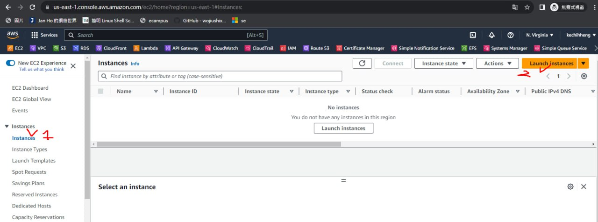
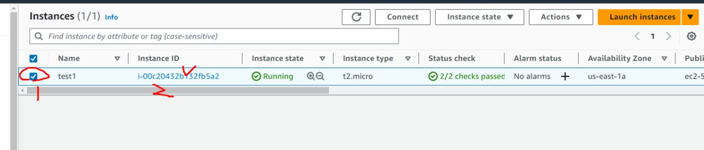

# 課程簡介

這門課主要是講雲端技術，把之前的本地端技術，放入雲端上 (aws；一個很大的雲端系統)，雲端用多少就會花多少錢，所以必須合理分配使用資源


> 為甚麼要學AWS?

因為AWS的雲端市佔率是最高的，比較符合社會需求，而且AWS很多樣化，所以觀念、架構都和其他雲端平台大同小異


> 雲端資源簡述

一個雲端最基本需要有以下資源

運算資源(虛擬機；可以根據工作性質分配算力)、網路資源、儲存資源


下面使用redis存取暫存資料，會使用記憶體德方式存，所以雲端這時候就會只分配記憶體給目標機器


如果自己想要做人工智慧，也可以利用AWS，創造專門為AI的機器，讓他可以用多少花多少錢。


> 課程內容

這學期也會教下面幾項

* EC2 ，能夠計算資源，根據不同需求創造虛擬機，能夠Auto Scaling(自動擴展)，讓機器可以監控CPU附載量，決定是否要生成新的機器負擔伺服器。

* S3 storage，可以儲存靜態網站，會把http網站轉換為https

* VPC 網路，並不是所有機器都連到public網域，像是資料庫，就會放在私有網域裡面，讓本地才可以存取到(左邊的圈圈是 gateway，讓我們可以連到外網，外往也可以連到指定電腦)

  

* server less (無伺服器架構)，有些人不想了解作業系統、記憶體、硬體...，所以就有這種應用出來，只需要知道自己需要的事物就好了，其他的會自己更新。


# AWS註冊

[AWS official signup website](https://portal.aws.amazon.com/billing/signup?refid=em_127222&redirect_url=https%3A%2F%2Faws.amazon.com%2Fregistration-confirmation&language=zh_tw#/start/email)

註冊的帳號具有最高權限，所以我們後面不太會使用這個帳號，我們後續會使用子帳號繼續設定功能

```
mail:chungyen
name:stereomp3
ps:HD
```

註冊需要有VISA或信用卡，不然無法註冊


檢查Elastic Compute Cloud (EC2) Dashboard，在用完伺服器後必須歸0，不然會扣到錢錢


# 建立EC2

可以創建虛擬機，利用instance可以選擇需要的作業系統，並配置



這堂課會比較常使用Amazon Linux的鏡像(AMI)，他比較接近centos，而且是免費的，選擇AMI 2023的鏡像


> Select resources

選擇電腦硬體資源: `t2.micro`，這個是免費的，資源很少，但我們會先使用這個。

t指的是類型，後面的數字指的是第幾代，.後面指的是強度，資源用越多，錢就花越多


> setting Key pair

Key pair 是遠端登入需要的private key，才可以連線到那台機器上(無密碼登入)，這邊需要選擇create new key pair，然後輸入名稱。選擇pem可以讓linux連線ppk可以讓windows連線，這個key很重要，需要保存起來，不能讓其他人知道


一開始會有預設的網路(Default)，在Default裡面會有子網路，我們會把運算資源建立在裡面，利用IGW(Internet Gateway連線到外網)


> setting VPC and Network

在Networksetting，需要把Auto-assign public IP設定為 enable


> setting security group

security group主要定義甚麼樣的資料可以進入虛擬機，預設是什麼東西都無法進入，只能連出去，我們這裡讓ssh和http可以連線(如果要讓所有都可以連線，可以選擇ALL TCP)，在AWS裡面`0.0.0.0/0`代表來自任何地方


使用sg-test會報錯誤，不能使用-符號，所以可以改成sg_test


再來是儲存，使用預設就OK，如果要高效能可以用IO的，但是要付費


在advance detail裡面，可以編輯User data，讓電腦開機就執行腳本

最後可以在Summary裡面選擇Number of instances，可以決定要開幾台虛擬機，我們使用的這個版本一共可以使用750小時(是每台都算)


> 最終結果

如果成功開啟，他的狀態會是Running


需要注意的虛擬機狀態有三個: Private IP、Public IP、State


按下右上的按鈕就可以執行虛擬機的Terminal


> testing ICMP

會發現無法 `ping 8.8.8.8`

所以需要點選test1，然後進去



利用EC2 instance Connect連進去虛擬機


> 新增 security group ICMP 功能

可以利用windows ping public IP，會發現無法ping到，因為需要把security group的ICMP port打開，才能ping到

可以進入instance/Security/Security groyp


> 關閉 EC2

最後關閉虛擬機


到dashboard查看Elastic IPs和Instance(runing)數量是否為0，如果是0就不會在扣錢了


