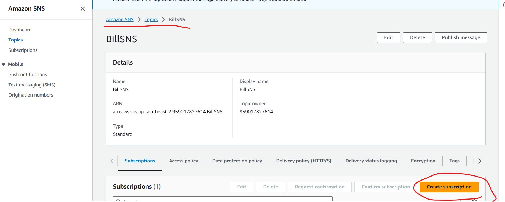
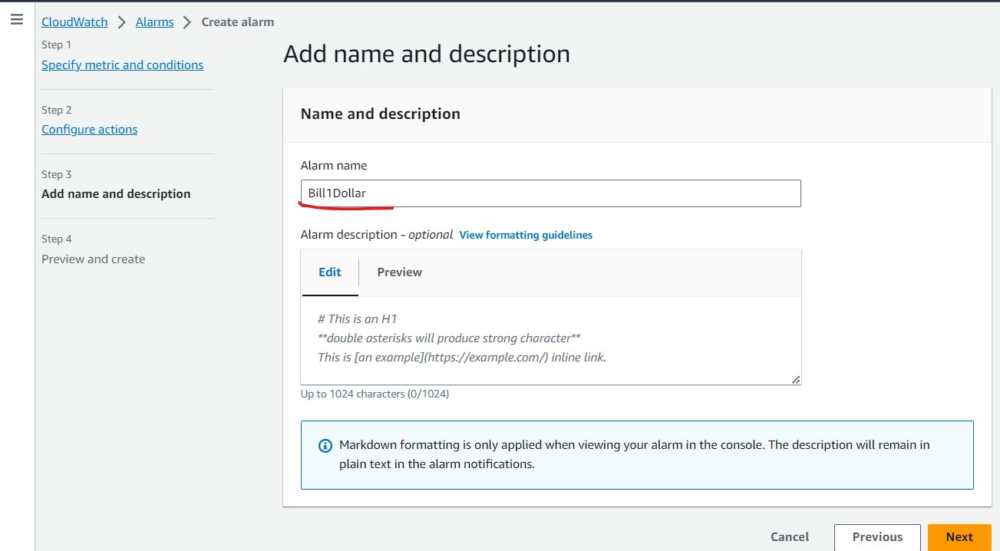

監控帳單可以運用SNS(Simple Notification Service)系統，建立在Publisher和Subscriber架構上(非同步系統 Pub/Sub)，讓系統使用超過限定金額(CloudWatch Alarms)，就使用mail通知使用者


Topic

FIFO很嚴謹，有順序性和即時性，但需要付費

Standard一般規格


Name BillSNS

optional BillSNS


Create Subscription



如何和Subscriber進行通訊

我們使用email進行通訊，寫入email信箱


到email接受訂閱


傳送email到信箱


輸入標題以及內文


目標郵件收到信件


接下來是CloudWatch，利用裡面的Alarm，配合SNS，就可以監控帳單


上面需要選擇N. Virginia，如果Billing沒出現，地區重選，就需要重做上面的步驟(建立SNS)


Create Alarm and Select metric


設定按照原本的設，錢設定超過一元美金就通知


把警告送到指定的SNS主題


接下來就可以next下一步


Add name and description，可以寫內容，給一個名字，不太重要



顯示Insufficient data表示需要一點時間量測data (6Hr)


每個應用所適用的地區可能會不一樣，如果這個應用全球通用，他上面就會顯示global。


雲端最重要的三點:運算服務(EC2)、儲存、網路

建立虛擬機，使用instance>Launch Instance；軟體映像檔(AMI)選擇Amazon Linux；硬體(Instance type)選擇t2.micro；雲端連線(key pair)選擇RSA、 .PEM (for linux)；編輯網路設定(Network setting)，VPC選擇default，Subnet隨便選一個，把Auto-assign public IP 變成Enable，Create security group，輸入名稱和輸入規則，最後其他都預設，就可以輸出一個機器了。


可以搜尋VPC，就能夠查詢網路設定，一般會看到default網路，和多個子網路(subnet)，這些網路會對應到雲端計算中心的Zone(一個地區為了增強資料可靠度，會設立很多Zone，讓資產分布在很多網路上)，不同的subnet可以對應到不同的Zone。

IGW(internet Gateway)，讓私有雲端能夠連線到Internet上，VPC 的 Default 已經全部都連線完畢，所以如果自己建立VPC，就需要額外設定才能讓運端連上網路


ACL 針對 VPC

Security group 針對VM


可以手動建置Security Group的規則，進入到Network & Security > Security Group，就可以選擇輸入輸出規則，這裡我們針對輸入規則進行條整


使用Linux連線到AWS

使用WinSCP把PEM檔案(Key)給到Linux機器，並改權限

```sh
chmod 400 testkey.pem # 擁有者只有讀的權利
ssh -i testkey.pem ec2-user@3.236.187.57  # ssh Linux連線
exit # 退出
```


在本地創建檔案並丟到目標主機

```sh
echo "test" >> test.txt
scp -i testkey.pem test.txt ec2-user@3.236.187.57:/tmp  # 拷貝檔案到雲端上
```


連線到EC2，看看有沒有把檔案丟進去

```sh
ssh -i testkey.pem ec2-user@3.236.187.57
cat /tmp/test.txt  # 查看裡面的檔案
```


