# 雲端架構

Available Zone(AZ；可用服務地區) ，Virtual Private Cloud (VPC；虛擬網路)


針對虛擬機(SG，有狀態，出去檢查，進來不檢查)、針對網路(NACL，無狀態，進去出來都要檢查)

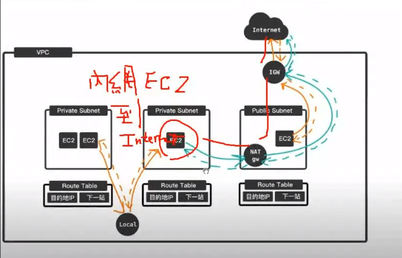

在私有網路裡面只能從EC2到NAT GW再連線到外面，外面無法存取


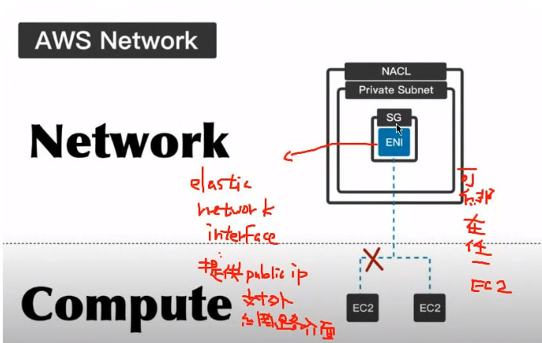

ENI創造EC2會自動生成虛擬介面，也可以手動創建出來，可以創立 Public IP 提供對外的網路


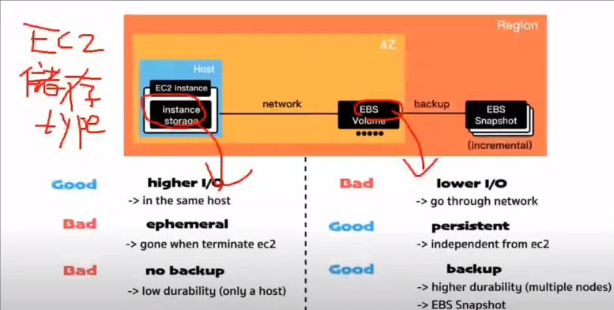

instance storage 創立存取都在機器上，速度很快，但是沒有備份，關機資料就會直接銷毀。通常會用在實驗上

而 EBS 會存取資料，但是速度就會比較慢


ELB(Elastic Load Balance) 可以進行分散處理，就像是之前提過的附載均衡的概念

ASG(Auto Scaling Group)，讓EC2可以自動擴展或是內縮，讓EC2在流量暴增時，建立多一點機器，在沒人使用的時候讓一些機器停止


# VPC

今天主要加入VPC環境


VPC架構，建立的VPC網路位置如下

testvpc-private :  192.168.0.0/24

testvpc-public : 192.168.1.0/24

testvpc :192.168.0.0/16


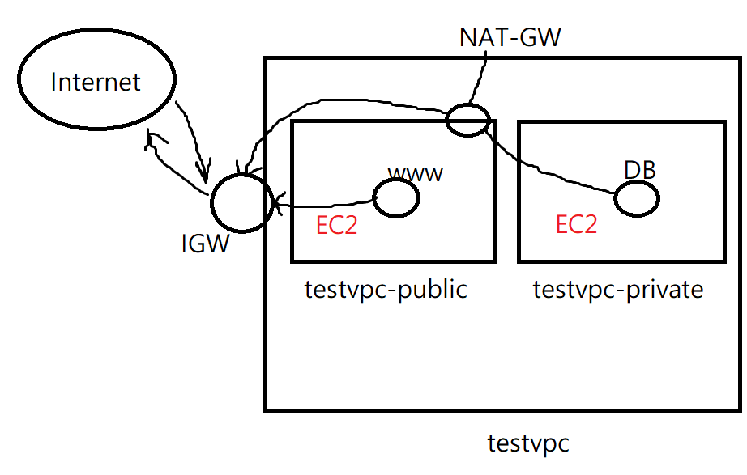


先做沒有IPV6的版本，建立VPC


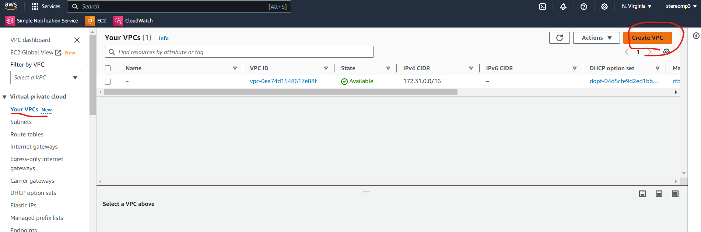


輸入名稱(testvpc)，和IPV4的位置(192.168.0.0/16)

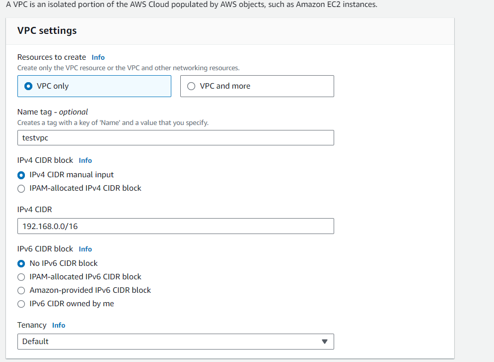


create subnet

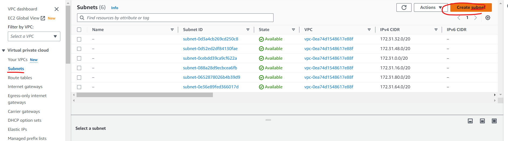

選擇剛剛建立的testVPC

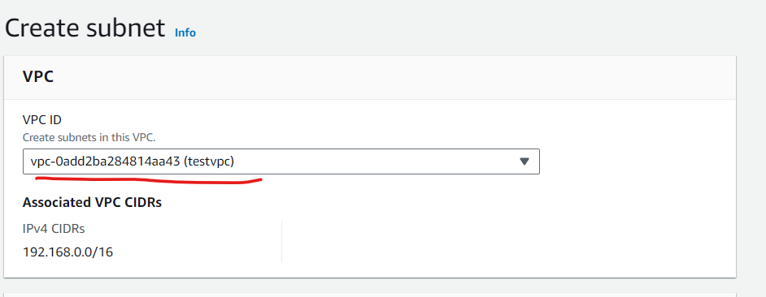

Subnet name設定成 testvpc-public(192.168.1.0/24)，私有網路放在不同區域(Zone)分散風險

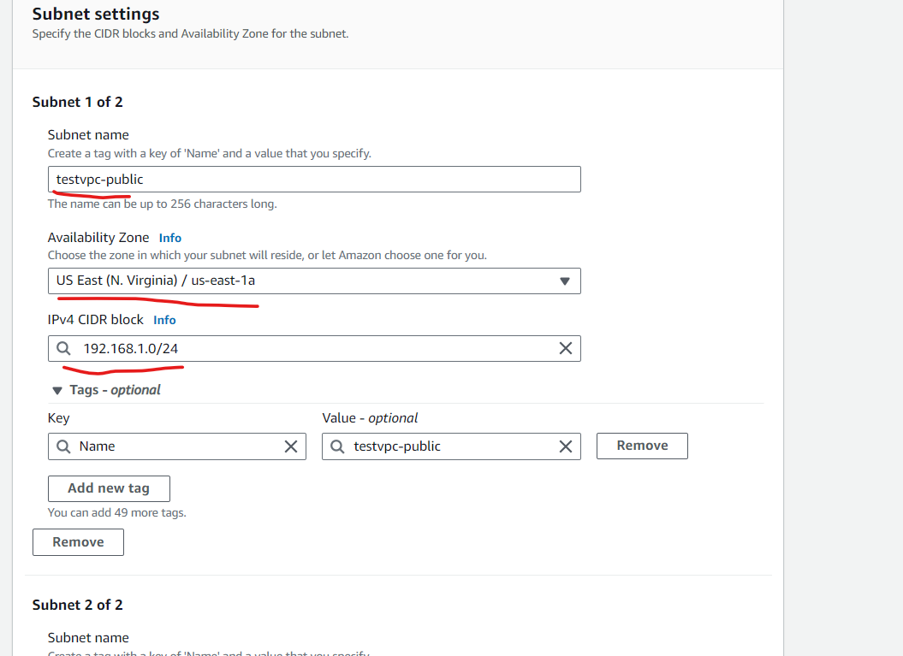

接下來按下Add new subnet，並做重複步驟，建立testvpc-private


除了系統預設網路(IGW)，如果要自己設定新機器，必須手動加上IGW，首先必須建立新的Internet gateways

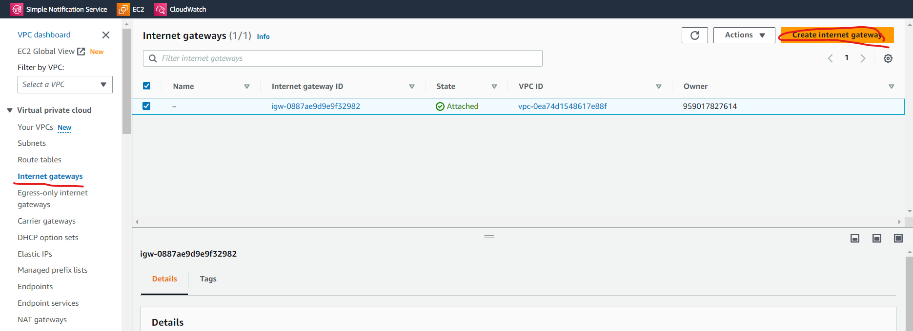

設定名稱 myvpc-igw

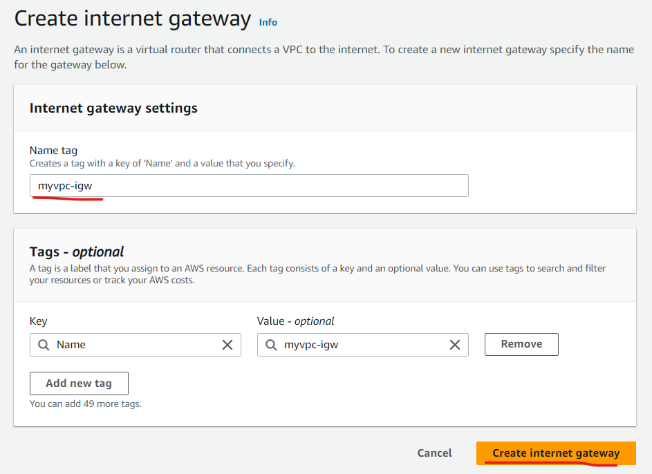


建立完成後，VPC ID會是空的，所以必須點擊右上的Attach to a VPC

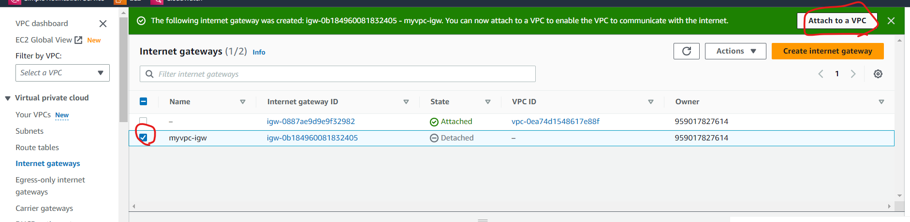


一樣選擇剛剛的 VPC

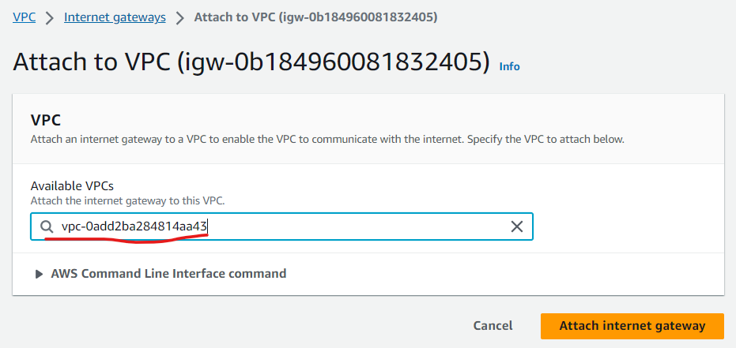


編輯路由表，讓機器可以連線到外部網路，首先先改他的名稱 testvpc-rt

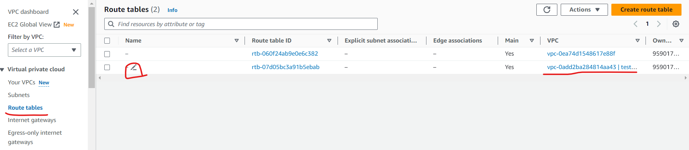


設定網路讓他可以在內部進行通訊，增加一筆路由，讓網路可以連線出去

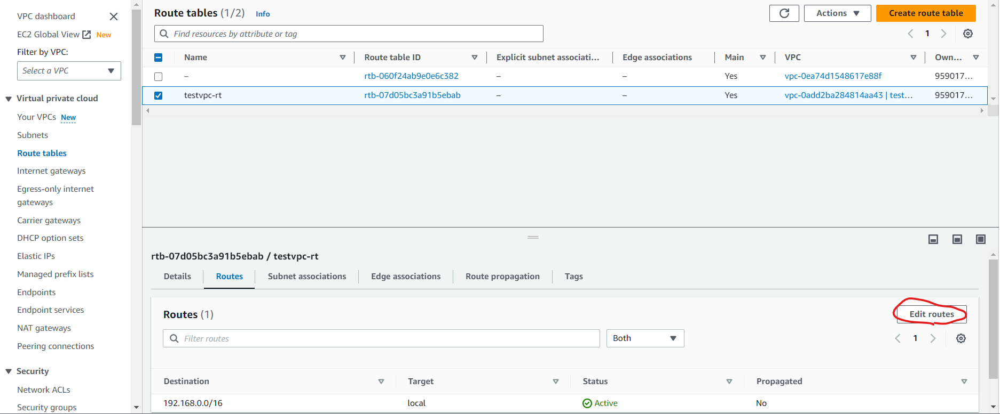


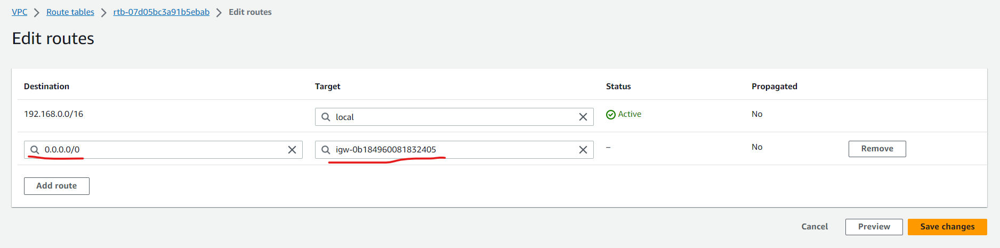


接下來設定Subnet association，編輯第二個Subnet(選擇第一個跟第二個沒差)，選擇public

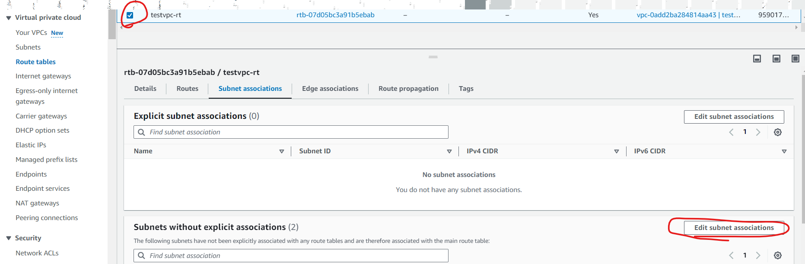


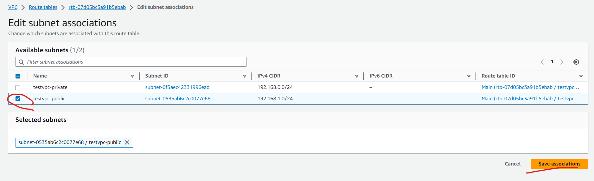


建立EC2機器

使用instance>Launch Instance建立一台EC2虛擬機，取名為testvpc-test1；軟體映像檔(AMI)選擇Amazon Linux；硬體(Instance type)選擇t2.micro；雲端連線(key pair)選擇上禮拜的testkey；編輯網路設定(Network setting)，VPC選擇testvpc，Subnet選擇testvpc-public，把Auto-assign public IP 變成Enable，Create security group，輸入名稱(sg_testvpc_ssh_http)和輸入規則，最後把Advanced details最後的user data 放入腳本內容(創建網頁，存在首頁)，讓開機就可以啟動下面的指令

```sh
#!/bin/bash
yum update -y
yum install -y httpd.x86_64
systemctl start httpd.service
systemctl enable httpd.service
echo “Hello World from $(hostname -f)” > /var/www/html/index.html
```


在public IP 旁邊開啟新分頁，記得把https改成http，網頁就可以啟動，並顯示下面的樣子


```
sudo echo "hi" > hi.htm 
# 如果出現permission deny可以使用下面的作法
sudo bash -c 'echo "hi"' > hi.htm

sudo echo 'apple ' > apple.htm
```


```
scp -i ./testkey.pem apple.htm ec2-user@3.235.43.74:/tmp
scp -i ./testkey.pem apple.png ec2-user@3.235.43.74:/tmp
# 資料夾複製過去要加上r
scp -i ./testkey.pem -r apple.files ec2-user@3.235.43.74:/tmp
```


```
ssh -i "testkey.pem" ec2-user@3.235.43.74
sudo mv /tmp/apple.htm /var/www/html
sudo mv /tmp/apple.png /var/www/html
```


最後把虛擬機關掉，可以使用stop，這樣虛擬機就會存著，不過下次開機，IP會換(如果想要IP不變，需要使用Elastic IP Address)
