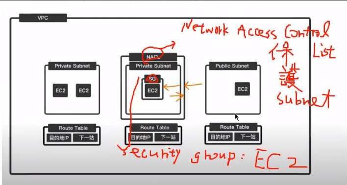

# 雲端架構介紹

Available Zone(AZ；可用服務地區) ，Virtual Private Cloud (VPC；虛擬網路)

針對虛擬機(SG，有狀態，出去檢查，進來不檢查)、針對網路(NACL，無狀態，進去出來都要檢查)




> VPC & subnet & IGW & EC2 & NAT GW

在私有網路裡面只能從EC2到 NAT GW(gateway) 再連線到外面，外面無法存取到 private EC2，通常 private 會放入重要資料 (像是資料庫)，讓一般人不能隨意存取，而 public 會放網站，讓用戶操作資料庫，在[本周](#VPC_subnet&IGW)與[第 4 周](04.md#)實作


> elastic network interface

ENI 創造 EC2 會自動生成虛擬介面，也可以手動創建出來，可以創立 Public IP 提供對外的網路，通常商業化就會使用這個功能，讓 IP 固定並申請一個 domain name。在[第 N 周實作]()


> EBS

* instance storage: 創立存取都在機器上，速度很快，但是沒有備份，關機資料就會直接銷毀。通常會用在實驗上
* EBS(Elastic Block Store): 會存取資料進行備份，而且關機不會將資料損毀，但是速度就會比較慢


> ELB & ASG

* ELB(Elastic Load Balance): 可以進行分散處理，就像是之前提過的附載均衡的概念

* ASG(Auto Scaling Group): 讓EC2可以自動擴展或是內縮，讓EC2在流量暴增時，建立多一點機器，在沒人使用的時候讓一些機器停止

以上內容後續都會逐步進行實作


# VPC&subnet&IGW&EC2&NAT_GW

我們最終要達到下圖的模式，也就是上面雲端架構介紹的 VPC subnet & IGW 架構簡化版，需要建立一個 VPC、兩個 subnet、一個 IGW、一個 NAT GW、兩台 EC2 (一個是網站、一個是資料庫)。

今天主要加入 VPC 環境、兩個 subnet、一個 IGW，並建立 testvpc-public 的 EC2 (網站)。


```python
VPC架構，建立的VPC網路位置如下
testvpc-private :  192.168.0.0/24
testvpc-public : 192.168.1.0/24
testvpc :192.168.0.0/16

我們做的是沒有IPV6的版本
```


## VPC

> create VPC


> setting VPC name and IPv4 CIDR

輸入名稱(testvpc)，和IPV4的位置(192.168.0.0/16)


## Subnet

> create subnet


選擇剛剛建立的testVPC


> set region and IPv4 CIDR

Subnet name設定成 testvpc-public(192.168.1.0/24)，私有網路放在不同區域(Zone)分散風險


接下來按下Add new subnet，並做重複步驟，建立testvpc-private


## IGW

除了系統預設網路(IGW)，如果要自己設定新機器，必須手動加上IGW，首先必須建立新的Internet gateways


> setting name

設定名稱 myvpc-igw


> Attach to a VPC

建立完成後，VPC ID會是空的，所以必須點擊右上的Attach to a VPC


一樣選擇剛剛的 VPC


## RT

編輯路由表，讓機器可以連線到外部網路，首先先改他的名稱 testvpc-rt


> Edit routes

設定網路讓他可以在內部進行通訊，增加一筆路由，讓網路可以連線出去


> Subnet association

接下來設定Subnet association，編輯第二個Subnet(選擇第一個跟第二個沒差)，選擇public


## EC2

> create EC2

使用instance>Launch Instance建立一台EC2虛擬機，取名為testvpc-test1；軟體映像檔(AMI)選擇Amazon Linux；硬體(Instance type)選擇t2.micro；雲端連線(key pair)選擇上禮拜的testkey；編輯網路設定(Network setting)，VPC選擇testvpc，Subnet選擇testvpc-public，把Auto-assign public IP 變成Enable，Create security group，輸入名稱(sg_testvpc_ssh_http)和輸入規則，最後把Advanced details最後的user data 放入腳本內容(創建網頁，存在首頁)，讓開機就可以啟動下面的指令

```sh
#!/bin/bash
$ yum update -y
$ yum install -y httpd.x86_64
$ systemctl start httpd.service
$ systemctl enable httpd.service
$ echo “Hello World from $(hostname -f)” > /var/www/html/index.html
```


在public IP 旁邊開啟新分頁，記得把https改成http，網頁就可以啟動


可以使用虛擬機 (VMware) 登入 Centos7 系統，並用 terminal 操作 AWS 創建的 testvpc-public EC2


# LinuxToAWS

> centos7 登入到 AWS EC2

可以到 EC2 > connect 裡面查看遠端登入指令

```sh
$ ssh -i "testkey.pem" ec2-user@3.235.43.74
```


> 建立網站 HTML 文件

```sh
$ sudo echo "hi" > hi.htm 
# 如果出現permission deny可以使用下面的作法
$ sudo bash -c 'echo "hi"' > hi.htm
```


> 複製檔案到 EC2

```sh
$ scp -i ./testkey.pem apple.htm ec2-user@3.235.43.74:/tmp
$ scp -i ./testkey.pem apple.png ec2-user@3.235.43.74:/tmp
# 資料夾複製過去要加上r
$ scp -i ./testkey.pem -r apple.files ec2-user@3.235.43.74:/tmp
```


> 創建包含圖片的 HTML

```sh
$ sudo mv /tmp/apple.htm /var/www/html
$ sudo mv /tmp/apple.png /var/www/html
$ cd /var/www/html
$ sudo echo 'apple ' > apple.htm
```

最後把虛擬機關掉，可以使用stop，這樣虛擬機就會存著，不過下次開機，IP會換(如果想要IP不變，需要使用Elastic IP Address)
