這禮拜主要安裝 mariadb到 testvp-private(SQL) 網路，透過 testvpc-public (apache+php) 連線到外面


> 自動enable auto-assign public IP

先到 VPC

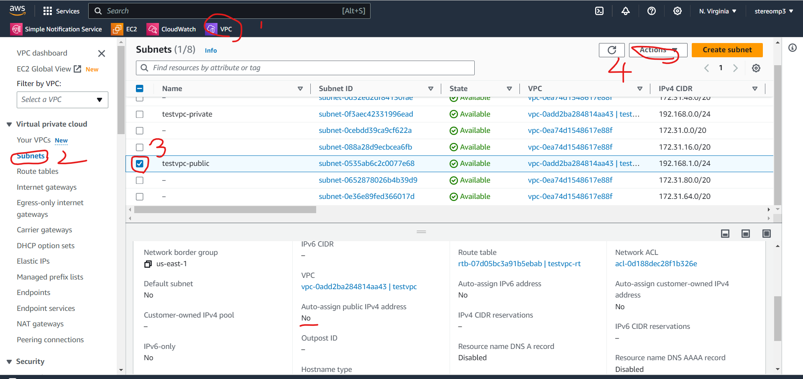

點 Edit subnet settings


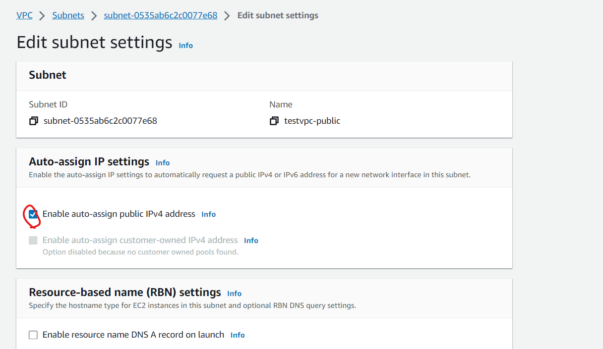

點了這格後，以後創建 EC2 instance 就會自動有 public IP address


創建一個 private VPC的 EC2 instance

使用instance>Launch Instance建立一台EC2虛擬機，取名為db-testvpc-private；軟體映像檔(AMI)選擇Amazon Linux；硬體(Instance type)選擇t2.micro；雲端連線(key pair)選擇之前的testkey；編輯網路設定(Network setting)，VPC選擇testvpc，Subnet選擇testvpc-private，Create security group，輸入名稱(sg_testvpc_private_ssh_mysql)和輸入規則 (記得加入MYSQL，MYSQL/Aurora，port 3306)，最後其他都預設。

在虛擬機中開新終端，傳送檔案，把 key 傳到 www 的虛擬機上，讓他可以連線到 DB

```sh
scp -i /home/user/testkey.pem testkey.pem ec2-user@44.200.55.107:/home/ec2-user/
```


先利用虛擬機連線到雲端 EC2

```sh
ssh -i /home/user/testkey.pem ec2-user@44.200.55.107
```

 利用public連線到private裡面

```sh
ssh -i /home/ec2-user/testkey.pem ec2-user@192.168.0.109  # private IP
```


再創一個虛擬機連到 public

```sh
ssh -i /home/user/testkey.pem ec2-user@44.200.55.107
```


因為private EC2 虛擬機沒有對外的通道，所以需要建立 NAT Gateway(建立在 testvpc-public裡面)，連到 IGW，並創建路由表

```sh
route -n  # 查看路由表，也可以使用 ip route show
ping 8.8.8.8  # 無法連線
```

`0.0.0.0` 是內定路由，Gateway `192.168.1.1` 連線到內網，所以 ping 不出去，無法連上網路

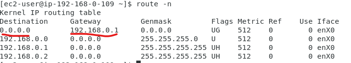


# NAT_GateWay

創建 NAT GateWay

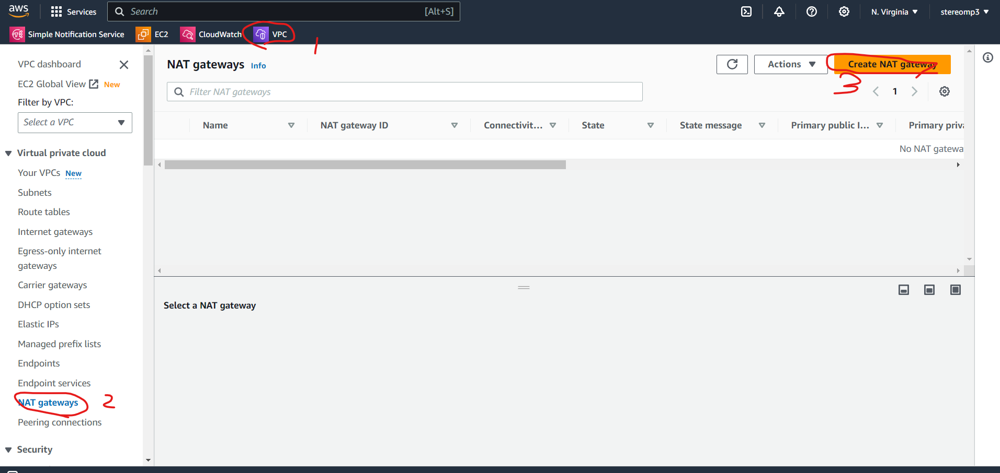

這個功能會花一點點錢

名稱為 natgw-testvpc，**Subnet選擇testvpc-public**，Conectivity type選擇Public

按下Allowcate Elastic IP(主要花錢的地方)，之後就可以創建NAT GateWay

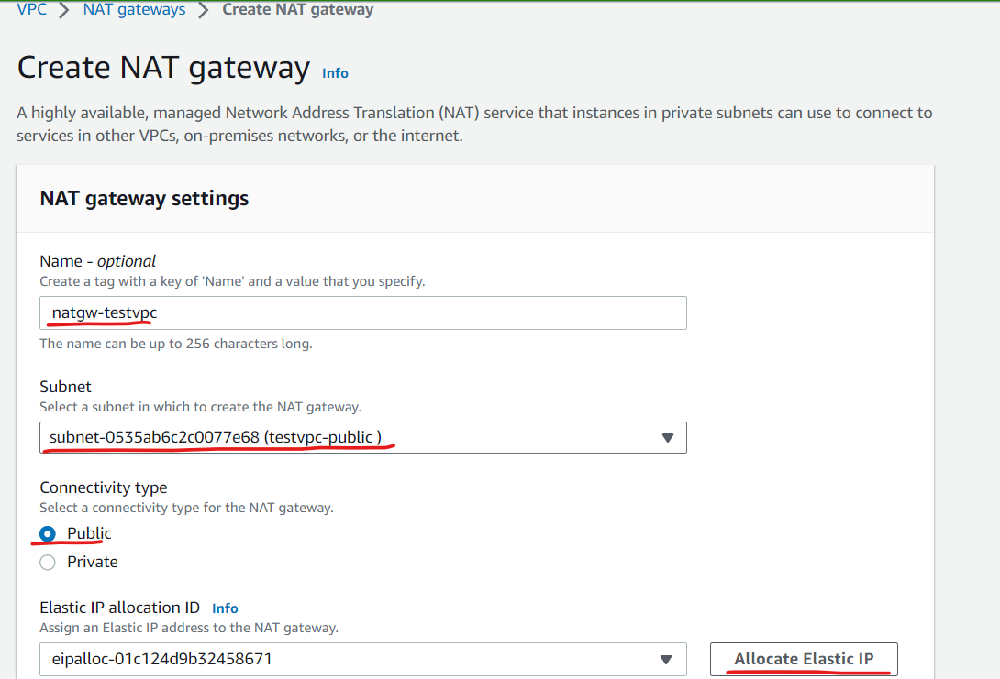


Nat GateWay創建完後，要讓Private知道，所以要去創立內定路由表

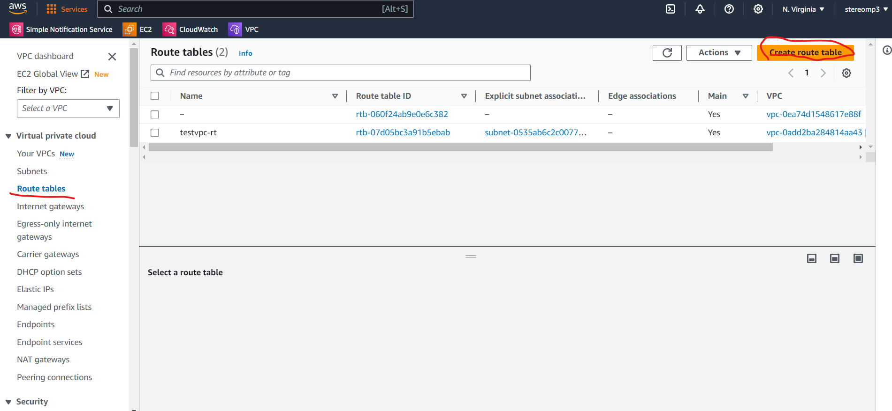

名稱為 rt-testvpc-private，VPC選擇testvpc，之後就直接創建

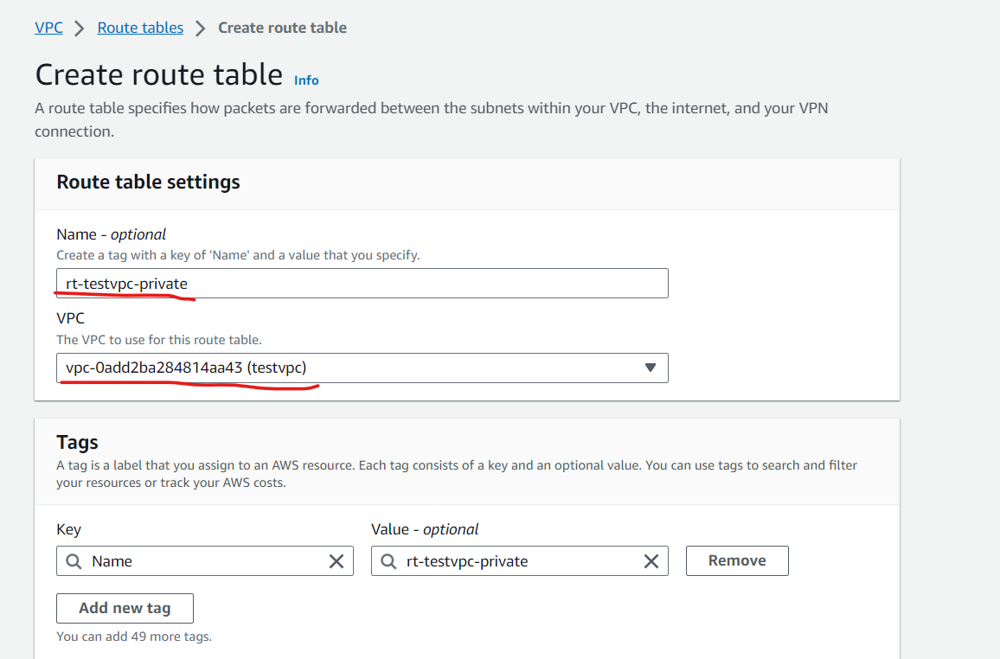


編輯剛剛建立的路由表(Edit route)

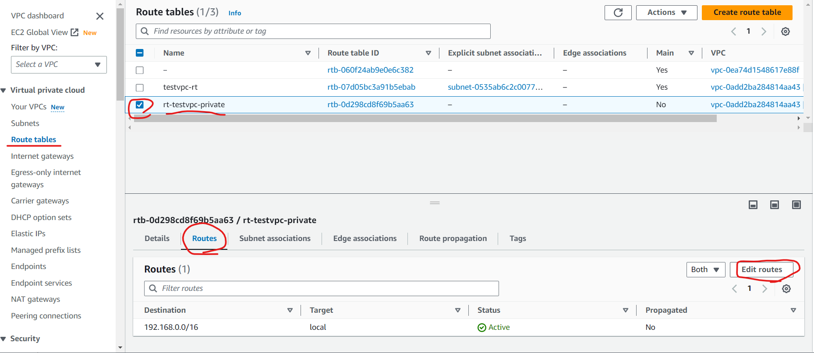


加入內定路由(Destination `0.0.0.0/0`，Target NAT Gateway；選擇剛剛創建的natgw-testvpc)，然後儲存設定

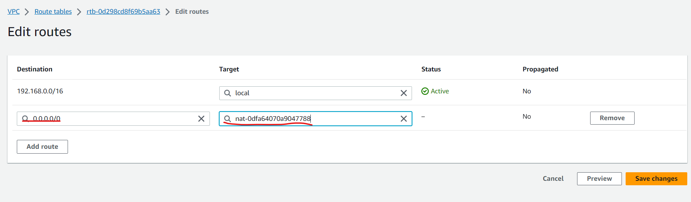


接下來要做 Subnet association，讓網路設定套用到 private network。(Explicit subnet associations 代表指派的網路)

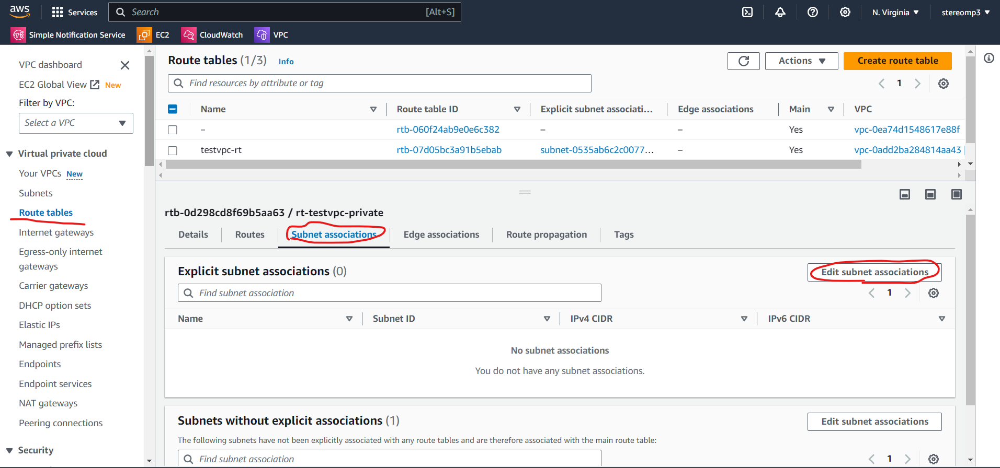

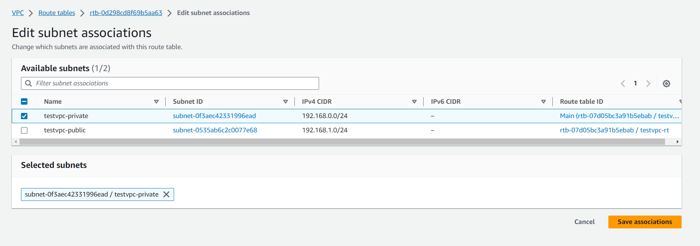


現在看private虛擬機，就會發現多了，並可以進行連線

```
route -n
ping 8.8.8.8  # 可以連線
```

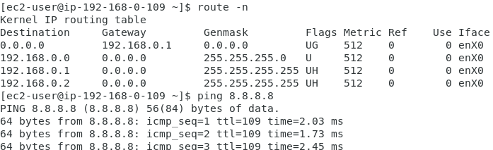


這樣內網就可以存取外網，但是外面不能連線到private


對 testvpc-private 進行資料庫更新，可以參考下列網站: [Install MariaDB](https://linux.how2shout.com/installing-mariadb-on-amazon-linux-2023/)

```sh
sudo dnf update  # 跟 yum 很像，一樣可以安裝套件
sudo dnf install mariadb105-server
sudo systemctl start mariadb
sudo systemctl enable mariadb
sudo systemctl status mariadb
# 一開始輸入root密碼可以按下enter跳過，後面有新設定root密碼(centos)，除了設定root外，其他選項Disallow root選n，其他都Enter跳過
sudo mysql_secure_installation  # 安全性設定

mysql -u root -p  # 登入 mariadb
```

裝完資料庫之後 NAT_GateWay 就可以關了


關閉NAT getway，要先去route那邊的 rt-testvpc-private 裡面的 Subnet association的連結取消掉，再到VPC/NAT getway選擇然後 delete就OK了


資料庫登入後，新建新使用者

```sh
# account: user, password user，user可以從任何地方登入(user@'%')
CREATE USER user@'%' IDENTIFIED BY 'user';   # 密碼是 users

# 授予 user 所有的權力
GRANT ALL PRIVILEGES ON * . * TO 'user'@'%';

# 更新權限
FLUSH PRIVILEGES;
```


使用public連線到private

```sh
sudo yum install mariadb105
mysql -u user -p -h 192.168.0.109  # private IP
```

