上次建立 public 和 private EC2 在 testvpc 網路環境裡面，利用 internet gateway(igw) 讓 public 可以連線到網路上，為了讓 private 可以暫時連線到網路，所以設定了一個 Nat gateway，讓 private 可以連線到 igw。


# AWS_LAMP

這禮拜建立網站，並利用網站連線到資料庫，使用的架構是 LAMP (Linux Apache MySQL PHP)


傳輸檔案到public 上

```
scp -i /home/user/testkey.pem testkey.pem ec2-user@3.235.49.24:/home/ec2-user/
```


連線到 public

```
ssh -i /home/user/testkey.pem ec2-user@3.235.49.24
```

public 連線到 private

```
ssh -i /home/ec2-user/testkey.pem ec2-user@192.168.0.109
```


接下來可以建立資料庫，並架設網站連接到資料庫

參考網址: https://github.com/stereomp3/note/blob/main/linux/111semester01/13-.md

> 建立資料庫

```sql
/* 顯示目前有的資料庫 */
show databases;   
/* 創建資料庫 */
create database testdb;   
/*  使用資料庫 */
use testdb;  
/* 創建資料表 */
create table addrbook(name varchar(50) not null, phone char(10));
/* 加入資料 */
insert into addrbook(name, phone) values ("tom", "0912123456");
insert into addrbook(name, phone) values ("mary", "0912123567");
/* 選擇資料 */
select name,phone from addrbook;
/* */
update addrbook set phone="0987465123" 
```

連線到db

```
mysql -u user -p -h 192.168.0.109
```


> 建立 php 網站

```sh
sudo passwd root  # 設定 root 密碼
sudo yum install httpd -y
# 安裝 php
sudo yum install php8.1 php8.1-fpm.x86_64 php8.1-mysqlnd.x86_64 -y
vim /var/www/html/test.php
```


測試 php

```php
<?php phpinfo() ?>
```


```
vim /var/www/html/db.php
```

連接資料庫

```php
<?php
$servername="192.168.0.109";
$username="user";    
$password="user";
$dbname="testdb";

$conn = new mysqli($servername, $username, $password, $dbname);

if($conn->connect_error){
    die("connection failed: " . $conn->connect_error);
}
else{
    echo "connect OK!" . "<br>";
}

$sql="select name,phone from addrbook";
$result=$conn->query($sql);

if($result->num_rows>0){
    while($row=$result->fetch_assoc()){  # 一次讀取一行
        echo "name: " . $row["name"] . "\tphone: " . $row["phone"] . "<br>";
    }
} else {
    echo "0 record";
}
?>
```


```sh
systemctl restart httpd
```


# Elastic_Load_Balancer

當用戶很多時，可以使用附載均衡器，讓多個伺服器分散流量

再建立一個 public 2 的 EC2 ，讓多個 EC2 可以分擔網頁，我們會使用現在做的 public 的 image


```
public 192.168.0.0/24 AZ-1a
private 192.168.1.0/24 AZ-1b
public02 192.168.2.0/24 AZ-1c

testvpc 192.168.0.0/16
igw 需要修改 routing table，才能把public02 加入到公有網域
```


創建新的Subnet

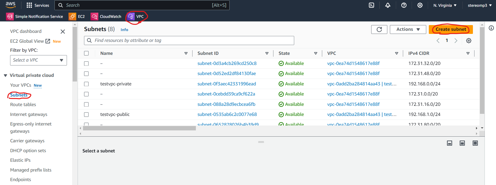


選擇 testVPC，下面名稱取為 testvpc-public2，subnet選1c， ip配置為 192.168.2.0/24

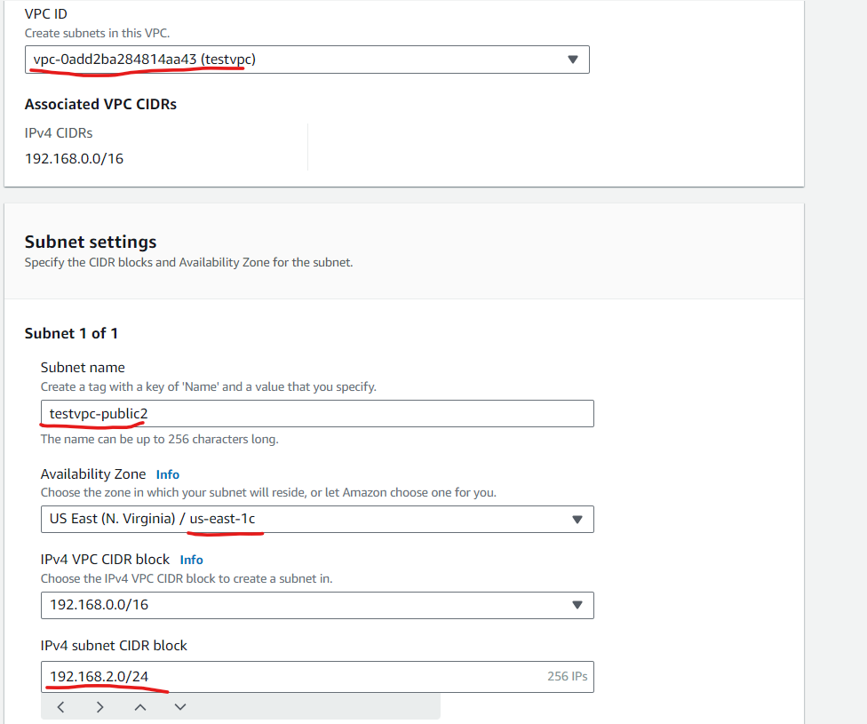

修改 subnet Auto-assign IP address 為 yes

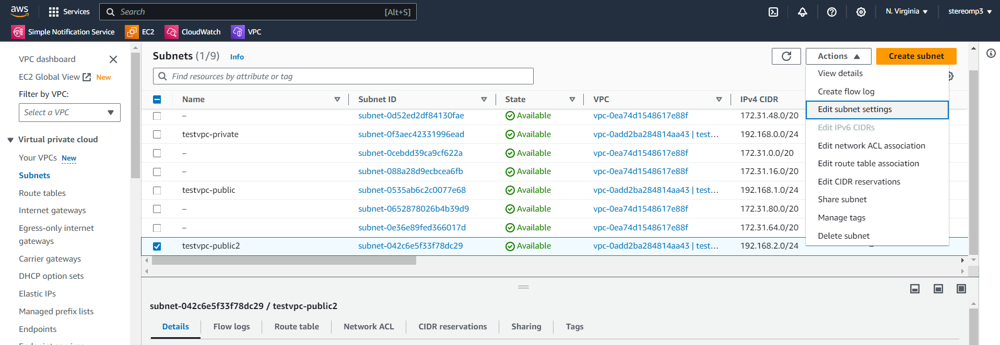

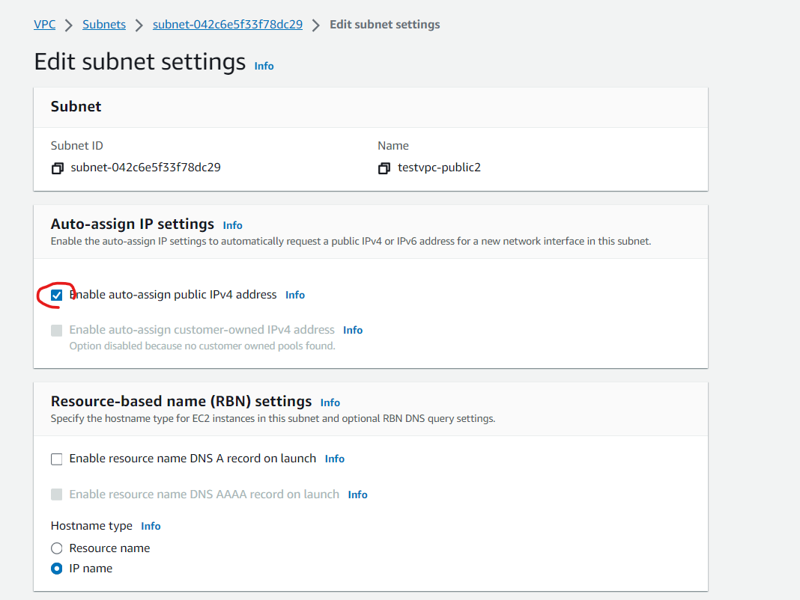


設定路由表，讓 public02 指定到 igw，編輯 subnet association

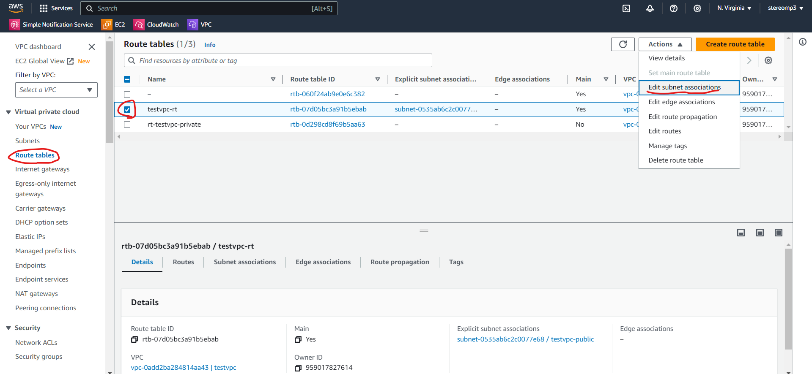

把 public02 打勾並儲存

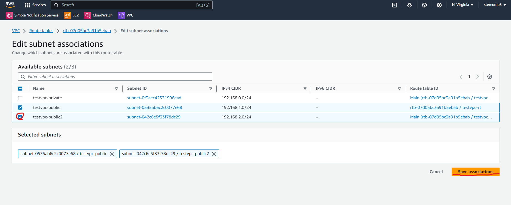


在內網(192.168.0.0/16)，就直接傳送，在外網(0.0.0.0/0；全部位置)，就透過 igw 傳輸(這邊對應到 subnet association)

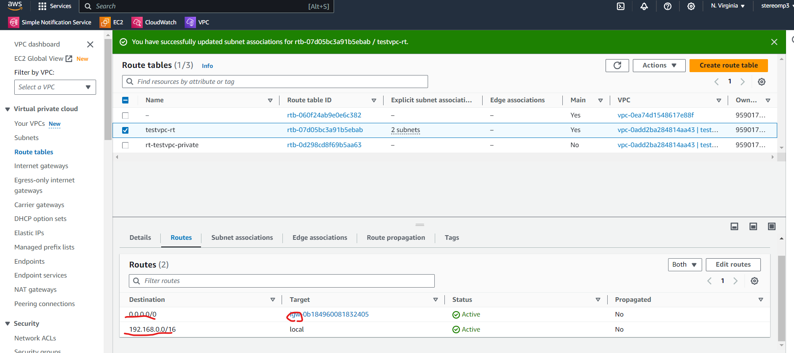

先關閉目前在跑的 public 虛擬機，要對他做鏡像(這個功能會花到一點錢)

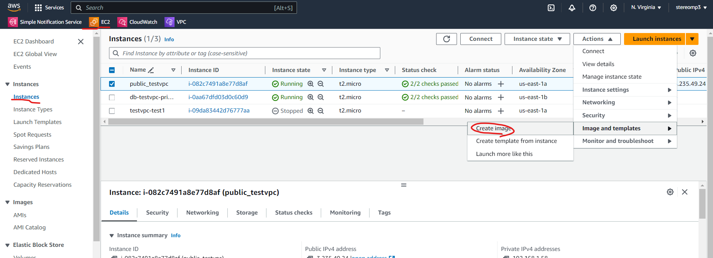


給他一個名稱: www-php，然後就可以創建鏡像了

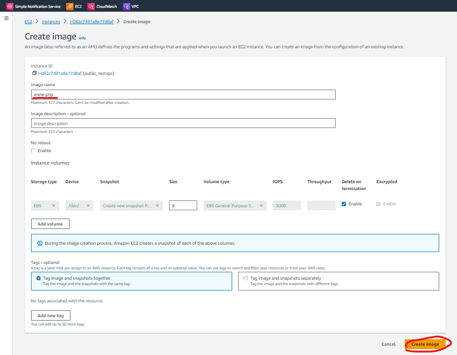


可以在 Image/AMIs 裡面看到創建出來的鏡像檔案，可以使用 Launch instance from AMI

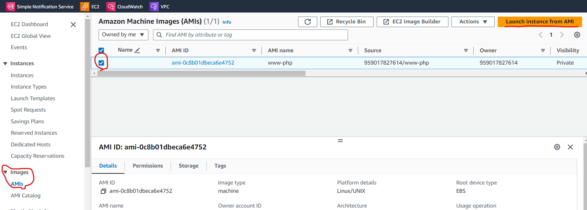

創建就跟直接從instance>Launch Instance建立一台EC2虛擬機差不多


取名為www2-public2-testvpc；軟體映像檔已經設定好了；硬體(Instance type)選擇t2.micro；雲端連線(key pair)選擇上禮拜的testkey；編輯網路設定(Network setting)，VPC選擇testvpc，Subnet選擇testvpc-public2，把Auto-assign public IP 變成Enable，選擇有http和ssh連線的security group，最後把Advanced details最後的user data 放入腳本內容(創建網頁，存在首頁)，讓開機就可以啟動下面的指令

```sh
#!/bin/bash
yum update -y
yum install -y httpd.x86_64
systemctl start httpd.service
systemctl enable httpd.service
echo “Hello World from $(hostname -f)” > /var/www/html/index.html
```


最後記得要把 AMIs 刪掉，不然會扣錢

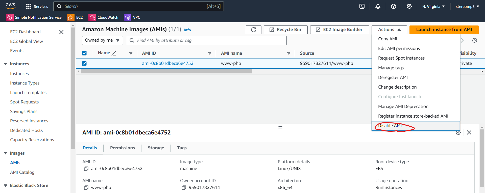
