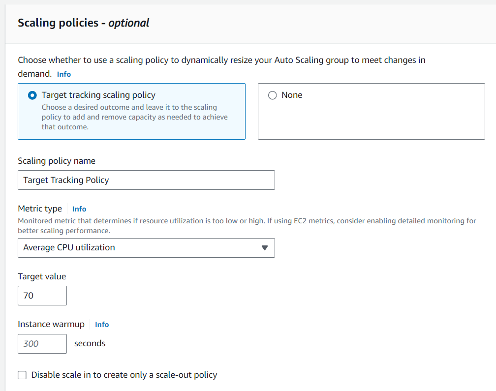
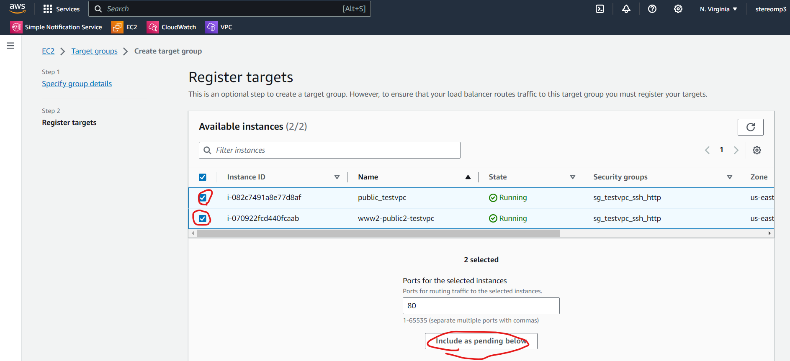
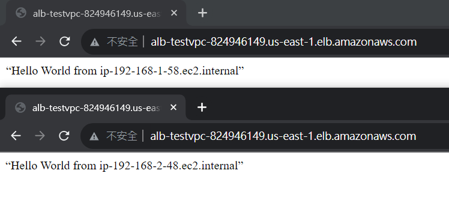

# ASG

Auto Scaling Group(ASG): 自動擴增或是縮減伺服器，可以把沒有用到的機器刪除，如果太多人存取服務，就增加伺服器，讓伺服器不會太卡

客戶多的時候可以採用兩種策略

1. Vertical: 增加原本機器的效能
2. Horizontal: 增加多一點伺服器


我們會使用 ASG 讓伺服器的 EC2 維持固定的數量 (min:2, max:4)

架構圖


## 簡單的ASG

> 實驗1: 簡單的 ASG

先創建一個 ASG


> create template

建立一個啟動模板，告訴 ASG 需要使用的資源


點下以後，會很像是 之前的 EC2 Launch Instance

軟體映像檔(AMI)選擇Amazon Linux(如果有自己設定的 AMI 也可以選，只不過存自己的 AMI 需要付費)；硬體(Instance type)選擇t2.micro；雲端連線(key pair)選擇testkey；編輯網路設定(Network setting)，VPC選擇test-vpc，Subnet不用動(Don't include in launch template)，把Auto-assign public IP 變成Enable，選擇適合的Security group，如果沒有適合的就創建一個有 SSH和HTTP並在testvpc下的SG；Storage使用預設，最後把Advanced details最後的user data 放入腳本內容(創建網頁，存在首頁)，讓開機就可以啟動下面的指令

```sh
#!/bin/bash
yum update -y
yum install -y httpd.x86_64
systemctl start httpd.service
systemctl enable httpd.service
echo “Hello World from $(hostname -f)” > /var/www/html/index.html
```


我們回到創建ASG的地方，把 template放進去


> setting network

網路要放在 public 和 public2


> setting configuration

後面都不用動，在Configure group size and scaling policies，最小值設定2，最大值設定4，重要的機器擴充設定


後面一直按下 Next，最後按下 Create Auto Scaling Group，ASG就會啟動了


點擊創建好的 ASG 看他的 Activity，就會看到他啟動狀況


看到 EC2 的 Instance，就會發現有兩台機器啟動了


> testing

可以試著把一台 EC2 Instance terminate，過一陣子後，就會發現 ASG 自動補上另外一台 EC2


## 根據使用效能調整虛擬機數量的ASG

> 實驗2: 根據使用效能調整虛擬機數量的 ASG

在開始之前，先把前面的 asg-testcvpc 刪掉

> create template

設定前面都更上面實驗1一模一樣，在創建ASG的地方名稱設定為: asg-testvpc-cpu-stress，並選擇剛剛做的 template


> setting scaling policies

Health check grace period，這是設定監控時間，要高附載一段時間，才會採取增加 EC2 的量

在Configure group size and scaling policies一樣，最小值設定2，最大值設定4

Scaling police 選擇 Target tracking scaling policy，選擇監控 CPU，Target value設定70，後面都按 next，就可以啟動了




> testing

CPU 通常是 5 分鐘監控一次，如果要使用 1 分鐘監控一次的，需要付費


打開機器終端，並下指令，讓虛擬機附載量暴增

```
sudo passwd root # centos
su
sudo yum install stress -y
sudo stress --cpu 4
```


可以到  ASG 那邊查看機器附載量


持續一段時間後，就會從 Activity 中看到，ASG 自動創建一台機器


做好之後，asg-testvpc-cpu-stress 就可以刪掉了

# ELB

Elastic Load Balance(ELB): 利用ELB，把連線進來的客戶端，放到不同的伺服器上。

接續上禮拜 [Elastic_Load_Balancer](./06#ELB) 的內容


## TG

建立Target Group


> setting name and vpc

給名字 tg-testvpc，網路選擇 testvpc，使用 HTTP1，Health check 可以改，但是我們使用預設值


> Register targets

勾選建立好的兩台機器，然後按下 Inclue as pending below



在 Review Target 會看到包含的機器


## ALB

創建附載均衡器


有 Application Load Balancer、Network  Load Balancer、Gateway  Load Balancer比較常用的是 Application Load Balancer 也是我們這禮拜使用的


> setting name and network

名稱叫做 alb-testvpc，有連網，使用IPV4


> setting vpc and subnet

Network 選擇 testvpc，網路選擇 public(1a) 和 public2(1c)


> setting security group

security group 選擇 http 和 ssh 並在 testvpc 下的設定連結，開放 80 port，如果有客戶端連接，就forward到伺服器，也是附載均衡器最基本的功能


ALB 到目前為止就算是創建好了 !

 

> testing

有一個 DNS name，可以測試自己的網址能不能做附載均衡，這個名字很長，所以通常會使用自己的DNS，不過需要的錢比較多 (DNS 30+AWS 30)





最後把 Target group 與 Load Balance 刪除，Templates 還會用到，可以不用刪掉
