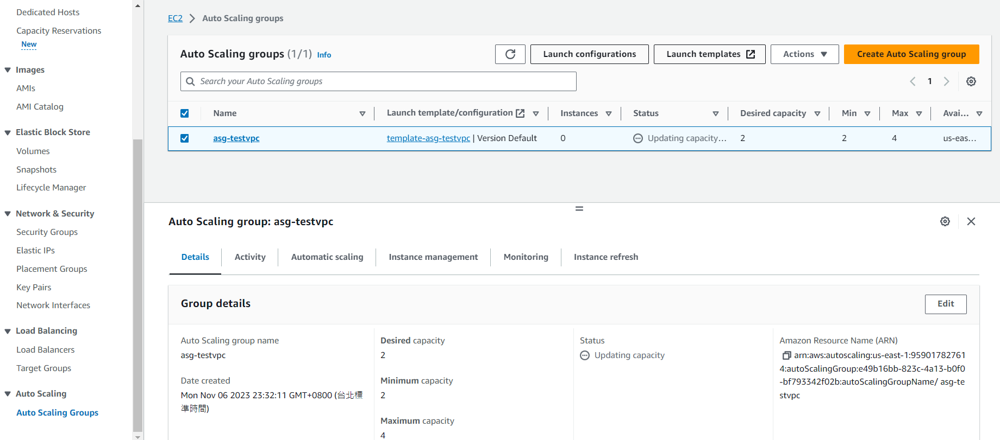

# 商業型網頁雲端架構

下方是架構圖，以下會對裡面的名詞做簡單的介紹

* RDS: 不用自己手動配置的服務資料庫(Relational database service；server less 服務很多，這是其中一個)，不用管他底層運作，只需要知道如何使用。，在[第 10 周](10.md#RDS)實作
* 可以建立兩個 target group，讓 ELB 根據不同瀏覽器切換 target group
* elastic cache 可以存快取，把距離最近的快取抓回來，讓速度變快，主要用在邊緣服務(edge computing)
* cloudfront: 外部接 https(提供 HTTPS 服務)，在內部 (AWS) 使用 http，這個會需要申請 DNS。在[第 15 周](15.md#CloudFront)實作


服務方法有兩種

1. 直接對分，有四台就每一台被分到的機率為 25 %
2. 根據 HTTP 標頭判別瀏覽器，根據不同瀏覽器分到不同 target group
3. 根據 GET 請求 (key=value)，分配到不同的 target group，像是`https://www.google.com.tw/?hl=zh_TW`，裡面有 `?hl=zh_TW`，就會分到專們為中文服務的 target group

今天會開四台，兩台開在 A 區(target group1和target group2各一台)，兩台開在 C 區(target group1和target group2各一台)，ALB 代表應用層的 load balancer


# ALB

* [ALB weight](ALB_weight): 根據權重分配到各個 EC2 的機率
* [ALB HTTP Header](#ALB_HTTP_Header): 可以針對不同瀏覽器進入不同的 EC2，或是根據 GET 請求到不同的 EC2
* [ALB page forbidden](#ALB_page_forbidden): 根據路徑名稱拒絕使用者訪問


先完成以下步驟

> create 4 EC2

下面快速使用文字描述上禮拜做的內容:

建立第一台EC2機器

使用instance>Launch Instance建立一台EC2虛擬機，取名為www-1a-tg1；軟體映像檔(AMI)選擇Amazon Linux；硬體(Instance type)選擇t2.micro；雲端連線(key pair)選擇上禮拜的testkey；編輯網路設定(Network setting)，VPC選擇testvpc，Subnet選擇testvpc-public，選擇有HTTP和SSH的security group，最後把Advanced details最後的user data 放入腳本內容(下面的文字)，讓開機就可以啟動下面的指令

```sh
#!/bin/bash

########################################
##### USE THIS WITH AMAZON LINUX 2 #####
########################################

# get admin privileges
sudo su

# install httpd (Linux 2 version)
yum update -y
yum install -y httpd.x86_64
systemctl start httpd.service
systemctl enable httpd.service
echo "Hello World from $(hostname -f) TG1 1a" > /var/www/html/index.html
```


建立第二台EC2機器

使用instance>Launch Instance建立一台EC2虛擬機，取名為www-1c-tg1；後面基本上與第一台一樣，不過要更改user data裡面的`echo "Hello World from $(hostname -f) TG1 1a" > /var/www/html/index.html`變成`echo "Hello World from $(hostname -f) TG1 1c" > /var/www/html/index.html`


建立第三台EC2機器

使用instance>Launch Instance建立一台EC2虛擬機，取名為www-1a-tg2；後面基本上與第一台一樣，不過要更改user data裡面的`echo "Hello World from $(hostname -f) TG1 1a" > /var/www/html/index.html`變成`echo "Hello World from $(hostname -f) TG2 1a" > /var/www/html/index.html`


建立第四台EC2機器

使用instance>Launch Instance建立一台EC2虛擬機，取名為www-1c-tg2；後面基本上與第一台一樣，不過要更改user data裡面的`echo "Hello World from $(hostname -f) TG1 1a" > /var/www/html/index.html`變成`echo "Hello World from $(hostname -f) TG2 1c" > /var/www/html/index.html`


> 成果


> create 2 target group

接下來的做法跟上禮拜一模一樣，建立 target group

先建立第一個 target group

選擇 instance，給名字 tg1-testvpc，使用 HTTP、IPV4，網路選擇 testvpc並使用 HTTP1，沒提到的使用預設；接下來選擇 www-1a-tg1 與 www-1c-tg1 並點下 include as pending below，最後 create target group


建立第二個 target group

選擇 instance，給名字 tg2-testvpc，使用 HTTP、IPV4，網路選擇 testvpc並使用 HTTP1，沒提到的使用預設；接下來選擇 www-1a-tg2 與 www-1c-tg2 並點下 include as pending below，最後 create target group


> associate with load balancer

進行 associate，選擇 tg1-testvpc，到 Load balancer 那邊點選 associate with new load balancer


連結 tg1 

設定名稱 ALB-testvpc，其他預設，記得在 Network mapping 那邊選擇 testvpc，並在 1a 和 1c 那裏打勾，Security Group 一樣選有 HTTP 和 SSH 的， Listeners and routing 在 Default action 那裏選擇 tg1-testvpc

> 成果


## ALB_weight

選擇 Load Balancers，修改下面的 Listener and Rule


編輯內容


> add target group

把 tg2 加入到 LB 裡面


> setting weight

weight (網頁會跳到那個頁面的機率) 可以根據自身需求調整


當一台主機掛掉，LB 就不會把資源分配給他們

> 成果


## ALB_HTTP_Header

> 根據不同瀏覽器切換不同的 target group

現在我們再次把 tg2 從 LB 拿掉，現在要改加上 rule


給一個名稱: for_firefox，並按下 next


> Add condition

選擇 add condition


> set http header

並選擇 HTTP header，下面 HTTP header name 輸入 `User-Agent`，並在HTTP header value 中輸入 `*Firefox*` (*  代表比對任意字符)，confirm完畢直接按下 next


下方是不同瀏覽器可以查看標頭的地方

* Firefox HTTP head

  

* Google Chrome HTTP head

  

> add target group

看到 Actions，選擇 tg2-testvpc後再次按下 next


Priority 權重設定為 1 ，這個 rule 會先從上面匹配下來，不成立就會往下


最後 create 這個 rule


> Query string

再創立一個新的規則，這次使用 key value，名稱定為 key_value


並選擇 Query string，裡面填入 value (key) 與 100 (value)，讓當 value = 100 就會進入 tg2


一樣 Actions，選擇 tg2-testvpc後再次按下 next


> setting priority

Priority 權重設定為 2 (數字越大權重越後面)


然後創建規則

> 成果


## ALB_page_forbidden

page_forbidden

也可以使用 Path，可以設定只要路徑有包含 `/restricted/*`，就直接具連線

> add condition


> setting action

在 Action 設定禁止訪問


Priority 設定為 3 後，創建 rule

> 成果


# ALB&ASG

下面這個實驗會把上面所有 TG 和 LB 全刪掉

Target Group 可以和 Auto Scaling Group 結合在一起，讓機器可以自行調整附載量，然後在和附載均衡器綁在一起


創建 Auto Scaling Group，名稱: asg-testvpc，使用之前的模板，按下 next

Network 選擇 testvpc，記得要選 1a、1c，按下 next


選擇 Attach to a new load balancer (如果沒有附載均衡器就選這個，不然就選預設)，並選 Application Load Balancer(預設選項，這邊才有支援導向不同位置 HTTP HEAD)，給定附載均衡器名稱: alb-asg-testvpc，Load balancer scheme 選擇 internet-facing，因為沒有 target group，所以要創建一個，要取tg的名稱: tg-testvpc，後面全部預設，然後按下下一步


在Configure group size and scaling policies，最小值設定2，最大值設定4


ASG 後續詳細設定可以看 [上禮拜的筆記](./07#ASG)



打開 LB 就可以看到成功開啟伺服器
