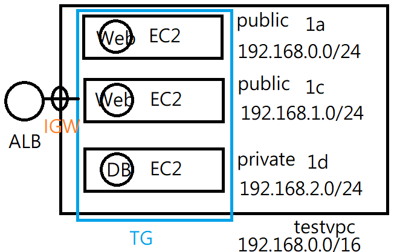

1. 完成前面的所有操作
2. 建立一個VPC，開出三個 subnet (兩個 public(網頁)，前面要使用 LB，一個 private(資料庫))


一開始地區在 N. Virginia，現在改成使用 Tokyo，到時候記得改回來

VPC(myVPC) 三個 subnet public(web)  public2(web) private(DB)

> 製作架構圖



## 建立網路環境

> 網路處裡

創建 VPC，名稱為 `myVPC`，IPV4的位置設定 `192.168.0.0/16`


創建第一個 Subnets，VPC 選擇 myVPC，Subnet settings 設定名稱(myvpc-public01)，AZ 設定 1a，IP 設定 `192.168.0.0/24`

創建第二個 Subnets，VPC 選擇 myVPC，Subnet settings 設定名稱(myvpc-public02)，AZ 設定 1c，IP 設定 `192.168.1.0/24`

創建第三個 Subnets，VPC 選擇 myVPC，Subnet settings 設定名稱(myvpc-private)，AZ 設定 1d，IP 設定 `192.168.2.0/24`


> 連線處裡

建立 IGW(internet gateways)，名稱叫做 myvpc-igw，直接創建，創好後，勾選 myvpc-igw，按下上面的 Attach to VPC，選擇 myVPC，讓網路可以連到外面


> 建立 router

選擇 Route table，把 myVPC 的 Route table 名稱做修改(myvpc-rt)，選擇 myvpc-rt，並點下 Routes，然後按下 Edite routes，按下 Add route，選擇IGW，並選剛剛的 myvpc-igw，前面要使用 0.0.0.0/0，讓大家都可以連線進來，回到外面選擇 myvpc-rt，並點下 Subnet association，點下 Edit subnet association (選擇第一個)，選擇兩個 public01 和 public02 的 subnet


## 建立虛擬機

> 創建虛擬機

建立第一台EC2機器

使用 instance>Launch Instance 建立一台 EC2 虛擬機，取名為 www-myvpc-public01；軟體映像檔(AMI)選擇Amazon Linux；硬體(Instance type)選擇t2.micro；雲端連線(key pair)新建立一個 w9key (虛擬機使用 WinSCP 連線把 key 給進去，然後 `chmod 400 w9key.pem`，就可以透過`ssh -i w9key.pem ec2-user@IP `進行連線)；編輯網路設定(Network setting)，VPC選擇myvpc，Subnet 選擇 myvpc-public01，把 Auto-assign public IP 變成 Enable，Create security group，輸入名稱(sg_myvpc_ssh_http)和輸入規則，最後把Advanced details 最後的 user data 放入腳本內容(創建網頁，存在首頁)，讓開機就可以啟動下面的指令

```sh
#!/bin/bash
yum update -y
yum install -y httpd.x86_64
systemctl start httpd.service
systemctl enable httpd.service
echo “Hello World from $(hostname -f) public01 1a” > /var/www/html/index.html
```


建立第二台EC2機器

使用 instance>Launch Instance 建立一台 EC2 虛擬機，取名為 www-myvpc-public02；軟體映像檔(AMI)選擇Amazon Linux；硬體(Instance type)選擇t2.micro；雲端連線(key pair)選擇 w9key；編輯網路設定(Network setting)，VPC選擇myvpc，Subnet 選擇 myvpc-public02，把 Auto-assign public IP 變成 Enable，Create security group，選擇 sg_myvpc_ssh_http，最後把Advanced details 最後的 user data 放入腳本內容(創建網頁，存在首頁)，讓開機就可以啟動下面的指令

```sh
#!/bin/bash
yum update -y
yum install -y httpd.x86_64
systemctl start httpd.service
systemctl enable httpd.service
echo “Hello World from $(hostname -f) public02 1c” > /var/www/html/index.html
```


建立第三台EC2機器

使用 instance>Launch Instance 建立一台 EC2 虛擬機，取名為 www-myvpc-private；軟體映像檔(AMI)選擇Amazon Linux；硬體(Instance type)選擇t2.micro；雲端連線(key pair)選擇 w9key；編輯網路設定(Network setting)，VPC選擇myvpc，Subnet 選擇 myvpc-public02，把 Auto-assign public IP 變成 Enable，Create security group，輸入名稱(sg_myvpc_ssh_mysql)和輸入規則(MYSQL/Aurora, port 3306)，創建虛擬機


在虛擬機中開新終端，傳送檔案，把 key 傳到 www 的虛擬機上，讓他可以連線到 DB

```sh
# give public01
scp -i /home/user/w9key.pem w9key.pem ec2-user@13.231.134.117:/home/ec2-user/
# give public02
scp -i /home/user/w9key.pem w9key.pem ec2-user@18.181.217.121:/home/ec2-user/
```


## private_setting

> 建立 NAT GateWay 讓 private 可以連上網路

創建 NAT GateWay，名稱為 natgw-myvpc，Subnet 選擇 myvpc-public01，Conectivity type 選擇 Public 按下Allowcate Elastic IP，就可以建立 NAT GateWay


> 建立 router

選擇 Route table，選擇 Create route table，名稱設為 myvpc-private-rt，VPC 選擇 myVPC，創建好後，點選 myvpc-private-rt，點選 Routes，按下 Edit routes，加入內定路由(Destination `0.0.0.0/0`，Target NAT Gateway；選擇剛剛創建的natgw-testvpc，然後儲存設定，回到外面選擇 myvpc-private-rt，並點下 Subnet association，點下 Edit subnet association (選擇第一個)，選擇兩個 private 的 subnet


> 加入資料庫

連線 private

```sh
ssh -i "/home/ec2-user/w9key.pem" ec2-user@192.168.2.84 
```


對 testvpc-private 進行資料庫更新，可以參考下列網站: [Install MariaDB](https://linux.how2shout.com/installing-mariadb-on-amazon-linux-2023/)

```sh
sudo dnf update  # 跟 yum 很像，一樣可以安裝套件
sudo dnf install mariadb105-server
sudo systemctl start mariadb
sudo systemctl enable mariadb
sudo systemctl status mariadb
# 一開始輸入root密碼可以按下enter跳過，後面有新設定root密碼(centos)，除了設定root外，其他選項Disallow root選n，其他都Enter跳過
sudo mysql_secure_installation  # 安全性設定

mysql -u root -p  # 登入 mariadb
```

裝完資料庫之後 NAT_GateWay 就可以關了

關閉NAT getway，要先去route那邊的 rt-testvpc-private 裡面的 Subnet association的連結取消掉，再到VPC/NAT getway選擇然後 delete就OK了


資料庫登入後，新建新使用者

```sh
# account: user, password user，user可以從任何地方登入(user@'%')
CREATE USER user@'%' IDENTIFIED BY 'user';   # 密碼是 users

# 授予 user 所有的權力
GRANT ALL PRIVILEGES ON * . * TO 'user'@'%';

# 更新權限
FLUSH PRIVILEGES;
```


使用 public 連線到 private 測試資料庫

```sh
sudo yum install mariadb105
mysql -u user -p -h 192.168.2.84   # private IP
```

建立資料庫

```sql
create database testdb;   
use testdb;  
create table addrbook(name varchar(50) not null, phone char(10));
insert into addrbook(name, phone) values ("tom", "0912123456");
insert into addrbook(name, phone) values ("mary", "0912123567");
```

連線到db


## public_setting

> 創建網頁

```sh
sudo passwd root  # 設定 root 密碼 centos
sudo yum install httpd -y
# 安裝 php
sudo yum install php8.1 php8.1-fpm.x86_64 php8.1-mysqlnd.x86_64 -y
vim /var/www/html/db.php
```

連接資料庫

```php
<?php
$servername="192.168.2.84";
$username="user";    
$password="user";
$dbname="testdb";

$conn = new mysqli($servername, $username, $password, $dbname);

if($conn->connect_error){
    die("connection failed: " . $conn->connect_error);
}
else{
    echo "connect OK!" . "<br>";
}

$sql="select name,phone from addrbook";
$result=$conn->query($sql);

if($result->num_rows>0){
    while($row=$result->fetch_assoc()){
        echo "name: " . $row["name"] . "\tphone: " . $row["phone"] . "<br>";
    }
} else {
    echo "0 record";
}
?>
```


```sh
systemctl restart httpd
```


## Load_Balancer

> TG

建立Target Group，給名字 tg-myvpc，網路選擇 myvpc，使用 HTTP1，勾選建立好的兩台機器(public01、public02)，然後按下 Inclue as pending below，就可以創建附載均衡器


> LB

創建附載均衡器，選擇 Application Load Balancer，名稱叫做 alb-myvpc，有連網，使用IPV4，Network 選擇 myvpc，網路選擇 public01(1a) 和 public02(1c)，security group 選擇 http 和 ssh 並在 testvpc 下的設定連結，開放 80 port
