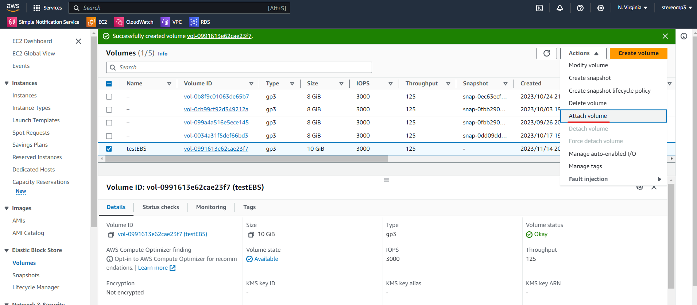

# RDS

RDS (relational database server)，這個就是屬於其中一個 server less service，提供 mySQL、mariadb、aurora

架資料庫要處理的東西很多，為了使用資料庫，讓他不出現 Bug，需要人力手動更新、維護。所以 AWS 提出 Server less service，不需要架設伺服器，直接使用就好


當關閉 RDS 的時候，Resource 左手邊的數值需要全部為 0，不然會被收錢


我們使用的都是免費的，使用付費的可以有很多備分，能不用在同一台機器讀取，效能高

> Create DB

選擇 Create DataBase


客製化的效能比其他的都好，但就是需要花錢，這邊我們使用 MariaDB


引擎使用預設值，Templates 選擇 Free tier，真的要使用就要選擇前面兩個內容


資料庫名稱叫做 testDB，帳號是 user 密碼 centosuser


> setting VPC

其他設定都預設除了 Connectivity 裡面的 VPC 設定為 testVPC， SG 選擇有 mysql 和 ssh 的，AZ 選擇 1b (private)


> login DB with EC2

可以使用之前的 public01 虛擬機來連線到 資料庫 (連線名稱在 Connectivity & security 裡面的 Endpoint & port)

```sh
mysql -u user -p -h testdb.cgg8s8sqawt4.us-east-1.rds.amazonaws.com 
```


[MYSQL 語法](https://github.com/stereomp3/note/blob/main/linux/111semester01/13-.md#mysql)

新增 table 讓網頁讀取，做的和之前差不多，但不用自己設定和維護

```sqlite
create database testdb;   
use testdb;  
create table addrbook(name varchar(50) not null, phone char(10));
insert into addrbook(name, phone) values ("tom", "0912123456");
insert into addrbook(name, phone) values ("mary", "0912123567");
```

> create website to connect DB

網頁 PHP

```sh
vim RDS.php
```

```php
<?php
$servername="testdb.cgg8s8sqawt4.us-east-1.rds.amazonaws.com";
$username="user";    
$password="centosuser";
$dbname="testdb";

$conn = new mysqli($servername, $username, $password, $dbname);

if($conn->connect_error){
    die("connection failed: " . $conn->connect_error);
}
else{
    echo "connect OK!" . "<br>";
}

$sql="select name,phone from addrbook";
$result=$conn->query($sql);

if($result->num_rows>0){
    while($row=$result->fetch_assoc()){
        echo "name: " . $row["name"] . "\tphone: " . $row["phone"] . "<br>";
    }
} else {
    echo "0 record";
}
?>
```


刪除資料庫

把打勾的地方全部拿掉


# EBS

Amazon Elastic Block Store，有點像是 USB

EC2 terminate 資料會全部不見，但 EBS 可以將資料保留，即使 terminate 資料也不會遺失，可以把舊的 EBS 掛載到新的 EC2 上，讓資料繼續運行


> setting volume and AZ

上面的硬體設備選擇預設值，Size 設定 10 GB，EBS 綁定 AZ，只有在那個區塊的 EC2 才能做使用 


創建好後，名稱設定為 testEBS


> Attach volume

新建立一個 EC2 或是使用之前的 public01 (AZ 需要在 1a)

選擇 EBS 裡面的 Attach volume



選擇正在運行的 public01 後直接 Attach volume


> use EC2 to View disk distribution

連線到 EC2 (public01)

```
sudo su
lsblk # 查看磁碟分布
file -s /dev/xvdf  # 顯示裝置類型 data 是儲存資料用的
```

成功會看到 xvdf 10 G 的 disk


```
sudo mkfs -t xfs /dev/xvdf # 格式化磁碟
sudo yum install xfsprogs
sudo mkdir /data
sudo mount /dev/xvdf /data # 將 disk 掛載到 data 資料夾
lsblk
cd /data
touch {1..10}.txt # 產生 10 個檔案
```

把虛擬機砍掉或是開另一台虛擬機讀取這個 EBS，就會發現資料還在


把 ESB 取消掛載

```
cd ..
umount ./data
lsblk
```


並到 ESB 那邊 Force detach Volumes


建立一台EC2機器

使用 instance>Launch Instance 建立一台 EC2 虛擬機，取名為 testESB；軟體映像檔(AMI)選擇Amazon Linux；硬體(Instance type)選擇t2.micro；雲端連線(key pair)新建立一個 testkey，編輯網路設定(Network setting)，VPC選擇testvpc，Subnet選擇testvpc-public(1a)，選擇有HTTP和SSH的security group，然後創建機器

不用再次格式化，資料會不見

```sh
sudo passwd root
su
sudo mkdir ./data
sudo mount /dev/xvdf ./data # 將 disk 掛載到 data 資料夾
ls ./data # 看到之前的資料
```


> detach volume

```
umount ./data
```

處理好後，就 detach volumes，然後再把 volumes(testEBS) 刪掉


Spot Requests，用比較少的錢(多人競標)，標到 EC2，但跟 EC2 不一樣的是，這個不一定能夠標成功

Dedicated Hosts，很貴的服務，在專屬的機器上跑虛擬機

Saving Plans，規劃未來要如何使用虛擬機，先大量採購，已獲得便宜的價格


# EIP 

Amazon Elastic IP

EC2 每次開跟關得到的 IP 會不一樣，EIP 可以固定 IP位置，attach 到 EC2 上，讓對外的 public IP 都一樣，需要商業使用就需要 EIP，這個 IP 可以遷移，對維護上很方便

EIP直接創建，就可以看到 IP 直接固定在 EIP 上


> Associate Elastic IP address

associate 到目標機器上


可以看到 public IP 改成 EIP 了


把 EIP 轉移到另外一台 server 上，先 Disassociate，再 associate 到目標機器上

最後記得要把 EIP 先 Disassociate，然後再 release EIP
