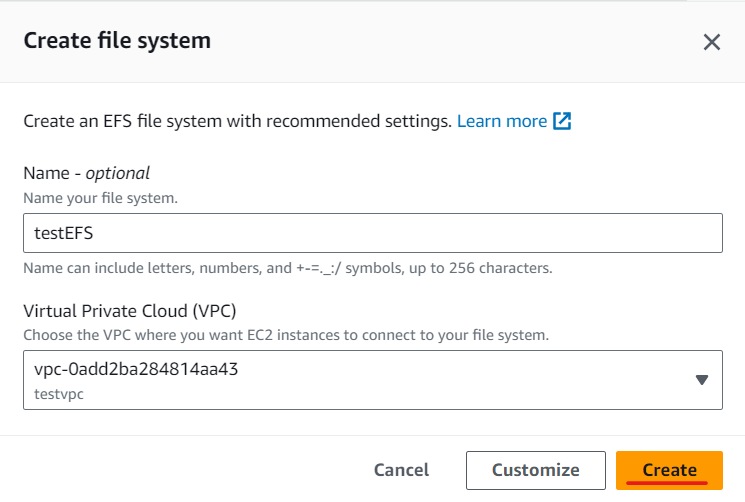
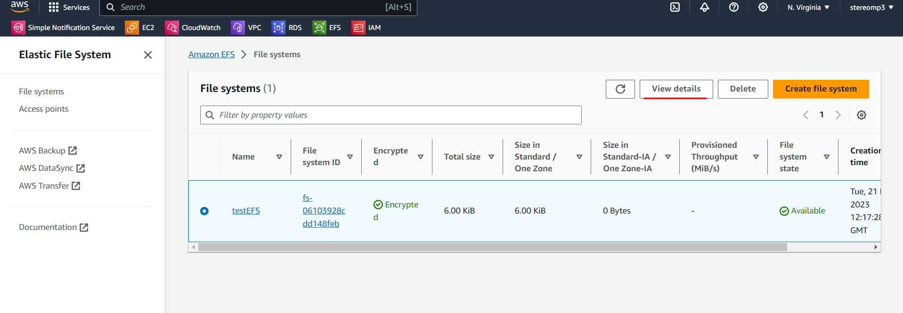

# EFS

Amazon Elastic File System

有多個 EC2 要共享資料，有點像是 Linux 的 NFS，寫入到一台 EC2 裡面後，另一台也會寫入


EFS 可以跨 AZ，EBS 只能在一個 AZ 上執行

> Enable VPC dns hostname

先到 VPC 裡面 Edit VPC settings，把 testVPC 的 DNS enable


> create File System

先創立一個 File System，取名為 testEFS，VPC 選 testVPC




> Add SG

把網路規則(SG)加入到 EFS


> create Access point

創建好了以後需要產生 Access point


選擇剛剛建立的 File system 並給定名稱 APmytestEFS，後面全部都先不填入


> create 2 EC2

創建好了以後，可以進去 Instance 創建兩個機器，一個放在 1a(test1a)，一個放在 1c(test1c)

test1a

使用instance>Launch Instance建立一台EC2虛擬機，取名為test1a；軟體映像檔(AMI)選擇Amazon Linux；硬體(Instance type)選擇t2.micro；雲端連線(key pair)選擇 testkey；編輯網路設定(Network setting)，VPC 選擇 testvpc，Subnet選擇testvpc-public(1a)，把Auto-assign public IP 變成Enable，Create security group，輸入名稱(sg_testvpc_ssh_http_nfs)和輸入規則，就可以創建了


test1c

使用instance>Launch Instance建立一台EC2虛擬機，取名為test1c；軟體映像檔(AMI)選擇Amazon Linux；硬體(Instance type)選擇t2.micro；雲端連線(key pair)選擇 testkey；編輯網路設定(Network setting)，VPC 選擇 testvpc，Subnet選擇testvpc-public2(1c)，把Auto-assign public IP 變成Enable，Create security group，輸入名稱(sg_testvpc_ssh_http_nfs)和輸入規則，就可以創建了


連線到 1a 和 1c

需要在 EC2 上裝 NFS 的客戶端

```
sudo yum -y install nfs-utils
sudo yum install -y amazon-efs-utils
```


建立要連結的資料夾

```
mkdir test-efs
```


在剛剛創建的 testEFS 裡面會有 domain name

```
sudo mount -t nfs -o nfsvers=4.1,rsize=1048576,wsize=1048576,hard,timeo=600,retrans=2,noresvport fs-06103928cdd148feb.efs.us-east-1.amazonaws.com:/   ~/test-efs
```

> EC2 Shared folder

最後就可以共享資料夾


# IAM

身分認證、身分管理系統

剛註冊時，會有很大的管理者權限，我們可以把權限分出去，讓不同使用者擁有不同的權限

## IAM觀念

可以建立一個 Global 的帳號，不會看 region，這個帳號就可以有不同的權限，可以分給不同人不同權限，讓每個人擁有自己該做的權限就好。(對應到 IAM 的 User 和 User groups)


針對不同使用者，可以用 json格事 描述 該使用者的權限，下面大概是說明使用版本(Version)、使用者可以得到 EC2 資源(只能看 Describe)，但不能進行新增刪除修改

privilege principle：只給那個使用者會用到的權限就好，其他權限不要給 (Zero trust)

> permission policy


IAM 權限可以繼承，也可以直接授予 (Inline)


下圖是比較完整的 Json 檔 說明，Sid 代表 ID；Effect 允不允許操作；principal 代表針對對象 (account, role)；Action 就是要做什麼，這邊允許存放東西與取東西的權利；Resource 代表物件放在哪裡。這邊代表針對 mybucket 可以讀取和存入


> user and role

剛剛都是站在使用者角度上看。某一個資源想要存另一個資源也需要額外處理，所以就多了一個權限設定：Role (資源權限)


> Management Console & CLI & SDK 

我們目前都是使用網頁模式(Management Console)針對 AWS 進行操作，但也可以使用命令列(CLI)存取或是使用程式碼設計(SDK)存取，這部分後續或提到，CLI 和 SDK 需要有 Access Key 和 Secret Access Key 才能存取，這個很重要，不能外洩給其他人


 Access Key 和 Secret Access Key 大概就是長下面這樣


下列是使用複製本地檔案到雲端上，或是把雲端資源抓下來，這是 CLI 的其中一種用法


SDK 可以整合到像是 JavaScript、Go...，可以對產品做二次包裝，讓管理跟維護更方便


## IAM實作


> create user 

先創建使用者 tom 並提供 AWS Management Console (不使用 SDK、CLI，使用網頁編輯)，選擇 I want to create an IAM user，並設定密碼 Centos12345#


> add permissions

在 Permissions policies 加入 AdministratorAccess (基本上給全部權限)


創造使用者，要記錄 Console sign-in URL: https://959017827614.signin.aws.amazon.com/console


所有資源都有一個獨一無二的識別碼 ARN


登出之後，輸入 Console sign-in URL(https://959017827614.signin.aws.amazon.com/console)，帳號輸入 tom、密碼輸入 Centos12345#


> view billing

登入後就會發現基本帳號功能才能使用，但是在 Billing 無法查看帳單


